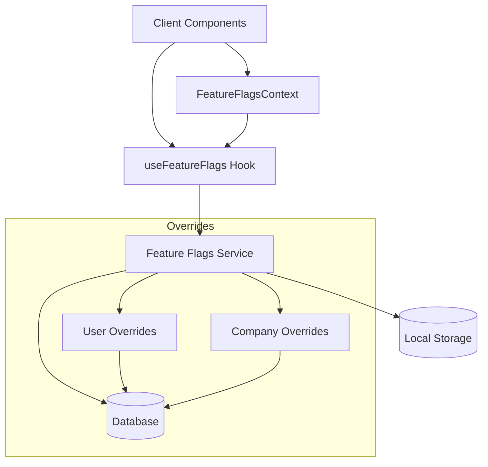

# Feature Flags Management: Technical Documentation

## Feature Flags Service: Consolidated Implementation

The Feature Flags Service provides a comprehensive solution for managing feature flags across the application. It implements a centralized approach with support for global settings, user-specific overrides, and company-specific overrides.

### Architecture



### Core Components

#### Service Registry Pattern

The Feature Flags Service is part of the application's service registry, providing a singleton implementation that can be accessed throughout the codebase:

```typescript
// Access via the registry
import { serviceRegistry } from '@/lib/services/registry';
const featureFlagsService = serviceRegistry.get('featureFlags');

// Direct access to the singleton
import { featureFlagsService } from '@/lib/services/feature-flags';
```

#### Type System

The service employs a comprehensive type system that ensures type safety for feature flags:

- `FeatureFlag`: Individual flag with enabled/visible status
- `FeatureFlags`: Map of all feature flags
- `FeatureFlagDefinition`: Metadata about each feature flag
- `FeatureFlagCategory`: Categorization of flags for organization

### Usage Examples

#### Basic Flag Access

```typescript
import { featureFlagsService } from '@/lib/services/feature-flags';

// Check if a feature is enabled
if (featureFlagsService.isEnabled('enhancedIdeaPlayground')) {
  // Use enhanced features
}

// Check if a feature should be visible
if (featureFlagsService.isVisible('adminPanel')) {
  // Show admin panel in navigation
}
```

#### Using the React Hook

```typescript
import { useFeatureFlags } from '@/lib/hooks/useFeatureFlags';

function MyComponent() {
  const { isEnabled, isVisible } = useFeatureFlags();
  
  return (
    <div>
      {isVisible('enhancedProfile') && (
        <Button disabled={!isEnabled('enhancedProfile')}>
          Enhanced Profile
        </Button>
      )}
    </div>
  );
}
```

#### Using the Context

```typescript
import { useFeatureFlagsContext } from '@/lib/contexts/FeatureFlagsContext';

function DeepComponent() {
  const { isEnabled } = useFeatureFlagsContext();
  
  return (
    <div>
      {isEnabled('experimentalFeature') && (
        <ExperimentalFeature />
      )}
    </div>
  );
}
```

#### Admin UI

```typescript
import { useFeatureFlags } from '@/lib/hooks/useFeatureFlags';

function AdminPanel() {
  const { 
    flags, 
    getGroupedDefinitions, 
    updateFeatureFlag,
    resetToDefaults
  } = useFeatureFlags();
  
  // Render UI for managing feature flags
}
```

### Override System

The Feature Flags Service supports a hierarchical override system:

1. **Global Flags**: Base settings that apply to everyone
2. **Company Overrides**: Override settings for specific companies
3. **User Overrides**: Override settings for specific users (highest priority)

```typescript
// Set company-specific overrides
featureFlagsService.saveCompanyOverride('company-123', {
  enhancedReporting: { enabled: true, visible: true }
});

// Set user-specific overrides
featureFlagsService.saveUserOverride('user-456', {
  betaFeatures: { enabled: true, visible: true }
});

// Clear all overrides and return to global settings
featureFlagsService.clearOverrides();
```

### Persistence

Feature flags are persisted in multiple layers:

1. **Database**: Primary storage for global flags and overrides
2. **Memory**: Runtime cache for performance
3. **LocalStorage**: Optional fallback for offline scenarios

### Integration with Other Services

#### Logging Integration

Feature flag operations are logged through the centralized logging service:

```typescript
// In the feature flags service
if (typeof loggingService?.logInfo === 'function') {
  loggingService.logInfo('Feature flags loaded from database', {
    flagCount: Object.keys(flags).length,
    source: 'feature-flags.service.ts'
  });
}
```

#### Analytics Integration

Feature flag usage can be tracked for analysis:

```typescript
// In a component
const { isEnabled, trackFeatureUsage } = useFeatureFlags();

const handleClick = () => {
  if (isEnabled('enhancedSearch')) {
    trackFeatureUsage('enhancedSearch');
    // Use the feature
  }
};
```

### Future Improvements

1. **A/B Testing**: Extend the override system to support experimental variations
2. **Gradual Rollout**: Add percentage-based rollout capability
3. **Time-based Activation**: Enable features based on schedule
4. **Dependency Management**: Handle feature dependencies and conflicts
5. **Remote Configuration**: Support for remote configuration services