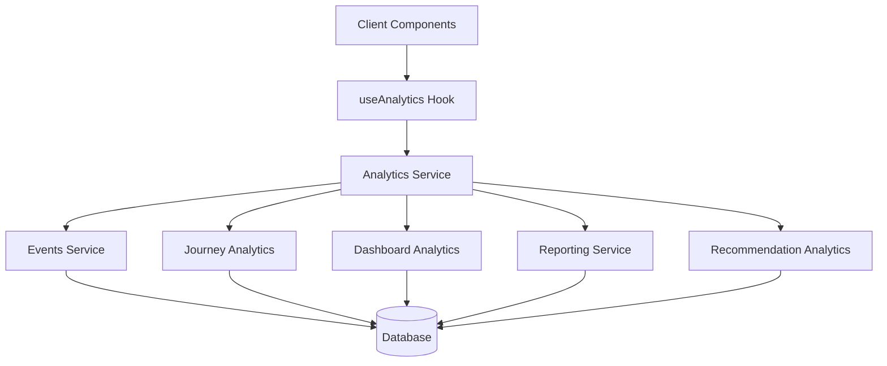
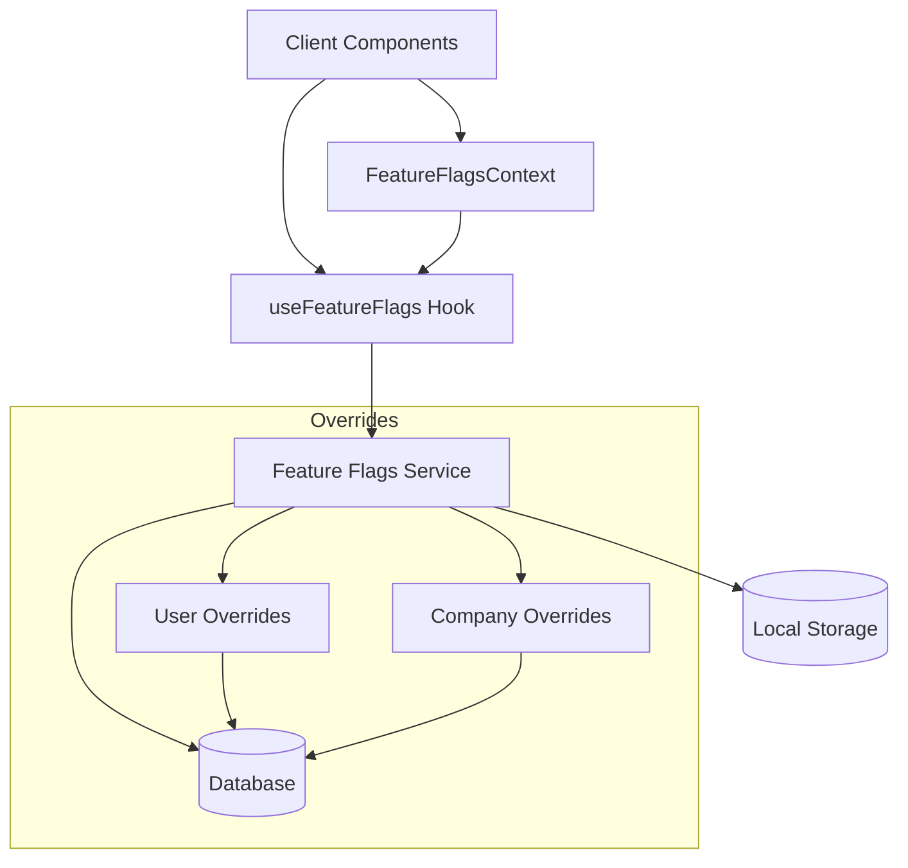
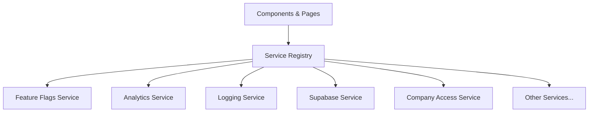
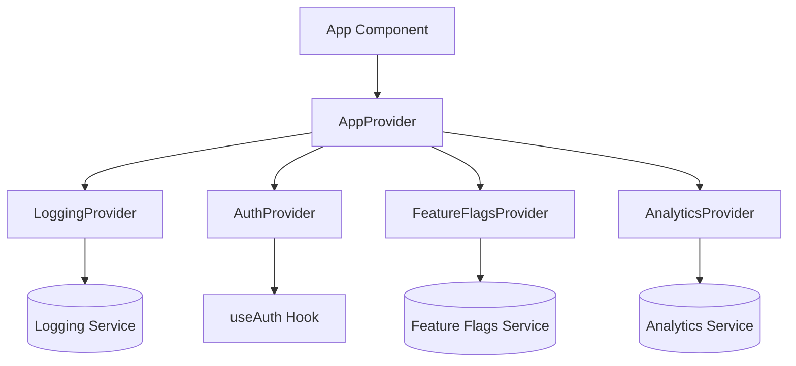
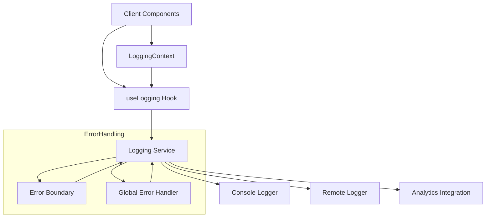
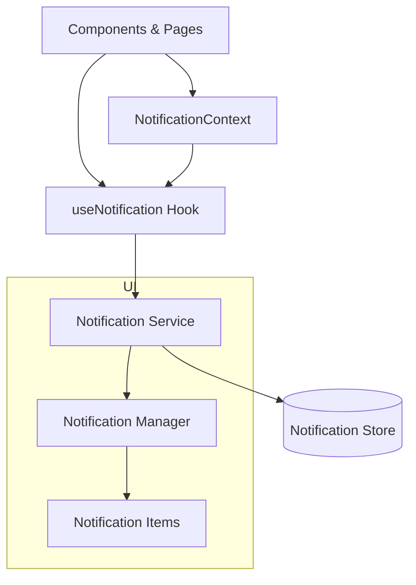
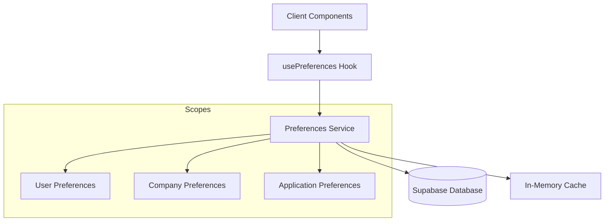

# Supporting Infrastructure: Detailed Technical Documentation

## 1. Analytics Service: Consolidated Implementation

The Analytics Service is a comprehensive solution that provides a unified API for all analytics operations across the application. It consolidates functionality from multiple analytics implementations into a cohesive service, making it easier to track, analyze, and retrieve data across various aspects of the application.

### Architecture



### Core Components

#### Service Registry Pattern

The Analytics Service uses a service registry pattern, providing a single entry point (`analyticsService`) that delegates to specialized services:

- **Events Service**: Handles basic event tracking and retrieval
- **Journey Analytics Service**: Specializes in journey-related metrics
- **Dashboard Analytics Service**: Manages dashboard configurations and displays
- **Reporting Service**: Handles data aggregation and reporting
- **Recommendation Analytics Service**: Provides analytics for recommendation systems

#### Type System

The Analytics Service employs a comprehensive type system that ensures type safety across the entire analytics pipeline. Key types include:

- `AnalyticsEvent`: Represents a tracked event
- `JourneyAnalytics`: Journey-specific analytics data
- `DashboardConfig`: Configuration for analytics dashboards
- `AggregationParams`/`AggregationResult`: Parameters and results for data aggregation

### Usage Examples

#### Basic Event Tracking

```typescript
import { analyticsService } from '@/lib/services/analytics';

// Track a simple event
analyticsService.trackEvent('button_clicked', userId, companyId, { buttonId: 'submit-form' });
```

#### Using the React Hook

```typescript
import { useAnalytics } from '@/lib/hooks/useAnalytics';

function MyComponent() {
  const { trackEvent, trackView, getProgressStats } = useAnalytics();
  
  useEffect(() => {
    // Automatically includes user and company context
    trackView('step', 'step-123');
  }, []);
  
  const handleButtonClick = () => {
    trackEvent('feature_used', { featureId: 'advanced-search' });
  };
  
  // Fetch analytics data
  useEffect(() => {
    getProgressStats().then(stats => {
      console.log('Journey progress:', stats);
    });
  }, []);
  
  return <button onClick={handleButtonClick}>Use Feature</button>;
}
```

#### Dashboard Analytics

```typescript
import { analyticsService } from '@/lib/services/analytics';

async function loadDashboard(userId: string) {
  // Load dashboard configuration
  const dashboardConfig = await analyticsService.getDashboardConfig(userId);
  if (!dashboardConfig) return null;
  
  // Get dashboard data based on configuration
  const dashboardData = await analyticsService.getDashboardAnalytics(
    dashboardConfig,
    companyId,
    { start: new Date('2023-01-01'), end: new Date() }
  );
  
  return dashboardData;
}
```

### Implementation Details

#### Error Handling

The Analytics Service includes comprehensive error handling that logs errors to the application's central logging system while providing graceful fallbacks to ensure analytics failures don't disrupt the user experience.

#### Performance Considerations

- Events are tracked asynchronously to avoid blocking the UI thread
- Complex analytics queries use database functions for performance
- Data aggregation leverages database capabilities where possible

### Future Improvements

1. **Real-time Analytics**: Integration with WebSockets for real-time analytics dashboards
2. **Analytics Queue**: Implement a client-side queue for offline analytics tracking
3. **Machine Learning Integration**: Infrastructure for predictive analytics based on collected data
4. **Extensible Metrics System**: Allow custom metrics definitions without code changes

## 2. Feature Flags Service: Consolidated Implementation

The Feature Flags Service provides a comprehensive solution for managing feature flags across the application. It implements a centralized approach with support for global settings, user-specific overrides, and company-specific overrides.

### Architecture



### Core Components

#### Service Registry Pattern

The Feature Flags Service is part of the application's service registry, providing a singleton implementation that can be accessed throughout the codebase:

```typescript
// Access via the registry
import { serviceRegistry } from '@/lib/services/registry';
const featureFlagsService = serviceRegistry.get('featureFlags');

// Direct access to the singleton
import { featureFlagsService } from '@/lib/services/feature-flags';
```

#### Type System

The Feature Flags Service employs a comprehensive type system:

- `FeatureFlag`: Individual flag with enabled/visible status
- `FeatureFlags`: Map of all feature flags
- `FeatureFlagDefinition`: Metadata about each feature flag
- `FeatureFlagCategory`: Categorization of flags for organization

### Usage Examples

#### Basic Flag Access

```typescript
import { featureFlagsService } from '@/lib/services/feature-flags';

// Check if a feature is enabled
if (featureFlagsService.isEnabled('enhancedIdeaPlayground')) {
  // Use enhanced features
}

// Check if a feature should be visible
if (featureFlagsService.isVisible('adminPanel')) {
  // Show admin panel in navigation
}
```

#### Using the React Hook

```typescript
import { useFeatureFlags } from '@/lib/hooks/useFeatureFlags';

function MyComponent() {
  const { isEnabled, isVisible } = useFeatureFlags();
  
  return (
    <div>
      {isVisible('enhancedProfile') && (
        <Button disabled={!isEnabled('enhancedProfile')}>
          Enhanced Profile
        </Button>
      )}
    </div>
  );
}
```

### Override System

The Feature Flags Service supports a hierarchical override system:

1. **Global Flags**: Base settings that apply to everyone
2. **Company Overrides**: Override settings for specific companies
3. **User Overrides**: Override settings for specific users (highest priority)

```typescript
// Set company-specific overrides
featureFlagsService.saveCompanyOverride('company-123', {
  enhancedReporting: { enabled: true, visible: true }
});

// Set user-specific overrides
featureFlagsService.saveUserOverride('user-456', {
  betaFeatures: { enabled: true, visible: true }
});
```

## 3. UI Component Library

Our UI Component Library provides a set of reusable, accessible, and customizable components that follow consistent patterns and styling.

### Component Categories

#### UI Components

Basic UI building blocks:

- `Button`: Versatile button with different variants, sizes, and states
- `Card`: Container component with header, content, and footer sections
- `Input`: Text input with error states and icons
- `FormField`: Form field with label and validation messages

#### Feedback Components

Components for providing feedback to users:

- `LoadingSpinner`: Loading indicator with various sizes and colors
- `Alert`: Feedback messages with different variants
- `EmptyState`: Placeholder for empty data states
- `ErrorDisplay`: Comprehensive error display with retry options

#### Layout Components

Components for creating consistent layouts:

- `Container`: Component for consistent padding and width constraints
- `Stack`: Flex-based component for vertical or horizontal layouts
- `Grid`: CSS Grid-based component for complex layouts

### Usage Examples

```tsx
// Import components
import { Card, CardHeader, CardContent, Button } from '@/components/ui';
import { ErrorDisplay, LoadingSpinner } from '@/components/feedback';
import { Container, Stack } from '@/components/layout';

// Use in component
function MyComponent() {
  const [isLoading, setIsLoading] = useState(true);
  const [error, setError] = useState('');
  
  if (isLoading) {
    return <LoadingSpinner size="lg" text="Loading..." centered />;
  }
  
  if (error) {
    return (
      <ErrorDisplay 
        title="Error" 
        message={error} 
        onRetry={() => fetchData()} 
      />
    );
  }
  
  return (
    <Container maxWidth="lg" padding>
      <Stack spacing="md" direction="column">
        <Card shadow="md" bordered>
          <CardHeader>
            <h2>My Card</h2>
          </CardHeader>
          <CardContent>
            <p>Content goes here</p>
            <Button variant="primary">Click me</Button>
          </CardContent>
        </Card>
      </Stack>
    </Container>
  );
}
```

## 4. Service Registry

Our Service Registry provides a centralized mechanism for accessing all services in the application. It prevents circular dependencies and ensures services are properly initialized.

### Architecture



### Core Concept

The Service Registry is a central hub that manages all service instances in the application. It ensures that services are properly initialized and provides a consistent way to access them.

### Usage

```typescript
import { serviceRegistry } from '@/lib/services/registry';

// Get a service by name
const loggingService = serviceRegistry.get('logging');

// Use typed helper functions
import { getAnalyticsService, getFeatureFlagsService } from '@/lib/services/registry';

const analytics = getAnalyticsService();
const featureFlags = getFeatureFlagsService();
```

## 5. React Hooks

We've created specialized React hooks that provide access to our services and state management in a component-friendly way:

- `useAuth`: Authentication and user profile management
- `useFeatureFlags`: Feature flag checking and management
- `useAnalytics`: Analytics tracking and reporting
- `useCompany`: Company data access and management

### Example: Auth Hook

```tsx
import { useAuth } from '@/lib/hooks/useAuth';

function ProfileComponent() {
  const { user, profile, isLoading, error, updateProfile } = useAuth();
  
  if (isLoading) {
    return <LoadingSpinner />;
  }
  
  if (error) {
    return <ErrorDisplay message={error} />;
  }
  
  return (
    <div>
      <h1>Welcome, {profile?.full_name || 'User'}</h1>
      <Button onClick={() => updateProfile(user.id, { full_name: 'New Name' })}>
        Update Name
      </Button>
    </div>
  );
}
```

## 6. Contexts and Providers

We've implemented a comprehensive context system that provides a type-safe way to access services throughout the application. This system includes providers for auth, feature flags, analytics, and logging.

### Architecture



### Key Components

#### AppProvider

The root provider that combines all contexts:

```tsx
<AppProvider captureErrors={true} displayErrors={true}>
  <Router>
    <YourApp />
  </Router>
</AppProvider>
```

#### Context-Specific Providers

Each service has its own provider:

- `AuthProvider`: Authentication state and methods
- `FeatureFlagsProvider`: Feature flag access
- `AnalyticsProvider`: Analytics tracking
- `LoggingProvider`: Logging and error capturing

### Protected Routes

We've created route components that enforce authentication and feature flag requirements:

```tsx
<ProtectedRoute requiredFeatureFlags={['adminPanel']}>
  <AdminPage />
</ProtectedRoute>

<FeatureRoute 
  featureFlag="enhancedIdeaPlayground" 
  fallback={<BasicPlayground />}
>
  <EnhancedPlayground />
</FeatureRoute>

<AnalyticsRoute pageName="dashboard">
  <DashboardPage />
</AnalyticsRoute>
```

### Error Boundaries

The `LoggingErrorBoundary` component integrates with our logging system to capture and report component errors:

```tsx
<LoggingErrorBoundary>
  <YourErrorProneComponent />
</LoggingErrorBoundary>
```

## Integration and Refactoring Examples

We've refactored key pages to showcase our infrastructure improvements:

1. **Dashboard Page**: Uses the service registry and UI components
2. **Profile Page**: Demonstrates form handling with our component library
3. **App Structure**: Shows how to use the context system with React Router

Before refactoring, pages had direct dependencies on multiple services and custom UI implementations. After refactoring, they use our consolidated infrastructure for a cleaner, more maintainable implementation.

## Integration Between Services

### Logging Integration

All services integrate with the application's logging system, providing detailed operational logs for debugging and audit purposes. Each service logs both informational events and errors with appropriate context.

### Feature Flags Integration

Services can be conditionally enabled or disabled based on feature flags, allowing for gradual rollout of new features or temporary disabling during maintenance:

```typescript
// In a service method
if (!featureFlagsService.isEnabled('analytics')) {
  return; // Skip analytics tracking when disabled
}
```

### Performance Monitoring

Service operations are monitored for performance, with logging of execution times and resource usage to ensure they don't impact application performance.

## 7. Logging Service: Centralized Error and Event Tracking

The Logging Service provides a unified system for tracking application events, errors, and performance metrics. It consolidates different logging approaches into a single, consistent API that can be used throughout the application.

### Architecture



### Core Components

#### Logging Levels

The Logging Service supports multiple logging levels:

- `debug`: Detailed information for debugging purposes
- `info`: General informational events
- `warn`: Warning conditions that don't prevent operation
- `error`: Error conditions that affect functionality
- `fatal`: Severe errors that prevent application operation

#### Structured Logging

All logs are structured with consistent metadata:

```typescript
interface LogEntry {
  level: LogLevel;
  message: string;
  timestamp: Date;
  context?: {
    userId?: string;
    companyId?: string;
    route?: string;
    component?: string;
    [key: string]: any;
  };
  error?: Error;
}
```

### Usage Examples

#### Basic Logging

```typescript
import { loggingService } from '@/lib/services/logging';

// Log an informational message
loggingService.info('User action completed', { action: 'profile_update' });

// Log an error
try {
  // Some operation
} catch (error) {
  loggingService.error('Failed to update profile', error, {
    userId,
    component: 'ProfileForm'
  });
}
```

#### Using the React Hook

```typescript
import { useLogging } from '@/lib/hooks/useLogging';

function MyComponent() {
  const { info, error, withErrorLogging } = useLogging();
  
  // Log with component context automatically included
  info('Component mounted');
  
  // Wrap a function with error logging
  const handleSubmit = withErrorLogging(async (data) => {
    // This function will have errors automatically logged
    await submitForm(data);
  }, 'Failed to submit form');
  
  return <form onSubmit={handleSubmit}>...</form>;
}
```

### Error Boundary Integration

The Logging Service integrates with React Error Boundaries to capture and log component errors:

```tsx
import { LoggingErrorBoundary } from '@/components/error';

function App() {
  return (
    <LoggingErrorBoundary fallback={<ErrorPage />}>
      <YourApplication />
    </LoggingErrorBoundary>
  );
}
```

### Performance Monitoring

The Logging Service includes performance monitoring capabilities:

```typescript
// Start timing an operation
const timerId = loggingService.startTimer('database_query');

// Perform the operation
const results = await database.query(...);

// End the timer and log the duration
loggingService.endTimer(timerId, 'Database query completed', {
  queryType: 'user_profile',
  resultCount: results.length
});
```

### Remote Logging

The Logging Service supports sending logs to remote services for aggregation and analysis:

```typescript
// Configure remote logging
loggingService.configureRemoteLogging({
  endpoint: 'https://logging.example.com/api/logs',
  batchSize: 10,
  flushInterval: 30000, // 30 seconds
  levels: ['error', 'fatal'] // Only send errors and fatal logs
});
```

## 8. Testing Infrastructure

### Unit Testing Components

We use React Testing Library and Jest for unit testing components:

```typescript
import { render, screen, fireEvent } from '@testing-library/react';
import { Button } from '@/components/ui';

describe('Button component', () => {
  test('renders with correct text', () => {
    render(<Button>Click me</Button>);
    expect(screen.getByText('Click me')).toBeInTheDocument();
  });

  test('calls onClick when clicked', () => {
    const handleClick = jest.fn();
    render(<Button onClick={handleClick}>Click me</Button>);
    fireEvent.click(screen.getByText('Click me'));
    expect(handleClick).toHaveBeenCalledTimes(1);
  });
});
```

### Integration Testing

For testing components that use our service infrastructure, we provide test providers with mock implementations:

```typescript
import { render } from '@testing-library/react';
import { TestAppProvider } from '@/testing/providers';
import ProfilePage from '@/pages/Profile';

test('ProfilePage displays user data', async () => {
  const mockUser = { id: 'user-123', name: 'Test User' };
  
  render(
    <TestAppProvider 
      authState={{ user: mockUser, isAuthenticated: true }}
      featureFlags={{ enhancedProfile: { enabled: true, visible: true }}}
    >
      <ProfilePage />
    </TestAppProvider>
  );
  
  // Test assertions here
});
```

### Mock Service Implementation

Our testing infrastructure includes mock implementations of all services:

```typescript
import { MockAnalyticsService } from '@/testing/mocks';

const mockAnalytics = new MockAnalyticsService();

// Use in tests
beforeEach(() => {
  mockAnalytics.reset();
  serviceRegistry.register('analytics', mockAnalytics);
});

test('tracks event on button click', () => {
  // Test component that tracks events
  expect(mockAnalytics.trackEvent).toHaveBeenCalledWith(
    'button_clicked',
    expect.any(Object)
  );
});
```

### E2E Testing

We use Cypress for end-to-end testing, with support for intercepting and mocking API calls:

```typescript
// cypress/integration/profile.spec.ts
describe('Profile Page', () => {
  beforeEach(() => {
    cy.intercept('GET', '/api/profile', { fixture: 'profile.json' }).as('getProfile');
    cy.login('test@example.com', 'password');
    cy.visit('/profile');
  });
  
  it('displays user profile information', () => {
    cy.wait('@getProfile');
    cy.contains('h1', 'Your Profile');
    cy.contains('Test User');
  });
  
  it('allows editing profile information', () => {
    cy.intercept('PUT', '/api/profile', { statusCode: 200 }).as('updateProfile');
    cy.get('[data-testid=edit-profile]').click();
    cy.get('input[name=fullName]').clear().type('New Name');
    cy.get('button[type=submit]').click();
    cy.wait('@updateProfile');
    cy.contains('Profile updated successfully');
  });
});
```

## 9. Next Steps and Future Improvements

### Short-Term Improvements

1. **Documentation Portal**: Create a comprehensive documentation portal for all infrastructure components
2. **Component Storybook**: Implement Storybook for UI component documentation and testing
3. **Performance Optimization**: Audit and optimize service performance, particularly for analytics tracking
4. **Unit Test Coverage**: Increase test coverage for critical infrastructure components
5. **Accessibility Audit**: Ensure all UI components meet WCAG accessibility standards

### Medium-Term Roadmap

1. **Microfrontend Architecture**: Prepare infrastructure for potential microfrontend architecture
2. **Event Bus Implementation**: Create a central event bus for cross-service communication
3. **API Layer Consolidation**: Unify API access patterns across services
4. **State Management Enhancements**: Implement optimized state management solutions built on our context system
5. **Machine Learning Service**: Create infrastructure for ML-powered features

### Long-Term Vision

1. **Component-Driven Design System**: Evolve the UI component library into a full design system
2. **Pluggable Architecture**: Make all services pluggable for easier customization
3. **Edge Computing Integration**: Support for edge deployment of critical functionality
4. **Serverless Integration**: Seamless integration with serverless functions for scalable operations
5. **Cross-Platform Support**: Extend infrastructure to support mobile and desktop applications

## 10. Notification Service: User Feedback System

The Notification Service provides a unified system for displaying temporary notifications to users. It manages the creation, display, and dismissal of notifications throughout the application.

### Architecture



### Core Components

#### Notification Types

The Notification Service supports multiple notification types:

- `info`: General informational messages
- `success`: Success confirmations
- `warning`: Warning messages requiring attention
- `error`: Error messages indicating problems

#### Notification Positions

Notifications can be displayed in various screen positions:

- `top-right` (default): Top right corner
- `top-left`: Top left corner
- `bottom-right`: Bottom right corner
- `bottom-left`: Bottom left corner
- `top-center`: Top center
- `bottom-center`: Bottom center

### Usage Examples

#### Basic Notification Display

```typescript
import { notificationService } from '@/lib/services/notification';

// Display a simple notification
notificationService.success('Profile saved successfully');

// Display notification with title and longer duration
notificationService.info('New message received', {
  title: 'Inbox Update',
  duration: 10000 // 10 seconds
});

// Display error notification with action
notificationService.error('Failed to save changes', {
  actionText: 'Retry',
  actionFn: () => saveChanges()
});
```

#### Using the React Hook

```typescript
import { useNotification } from '@/lib/hooks/useNotification';

function MyComponent() {
  const { success, error, dismiss } = useNotification();
  
  const handleSave = async () => {
    try {
      await saveData();
      success('Data saved successfully');
    } catch (err) {
      error('Failed to save data', {
        actionText: 'Retry',
        actionFn: handleSave
      });
    }
  };
  
  return <button onClick={handleSave}>Save</button>;
}
```

### UI Integration

To display notifications in your application, include the `NotificationManager` component in your app structure:

```tsx
import { NotificationManager } from '@/components/feedback';

function App() {
  return (
    <AppProvider>
      <NotificationManager />
      <YourAppContent />
    </AppProvider>
  );
}
```

### NotificationManager Component

The `NotificationManager` component automatically:

- Subscribes to the notification service
- Groups notifications by position
- Renders appropriate UI based on notification type
- Handles dismissal and automatic timeout
- Provides action buttons when specified

### Configuration

Default notification behavior can be configured globally:

```typescript
// Configure default notification options
notificationService.setDefaultOptions({
  duration: 8000, // 8 seconds for all notifications
  position: 'bottom-right',
  dismissible: true
});
```

## 11. Migration Tools: Transitioning to the New Infrastructure

To help teams transition their existing code to use our new infrastructure patterns, we've created migration tools that analyze code and suggest refactoring approaches.

### Refactor Service Access Tool

This tool analyzes code to identify direct service imports and suggests replacements with either the service registry pattern or appropriate hooks.

```bash
# Run the tool on a specific directory
node scripts/migration/refactor-service-access.js src/components

# Or run on the entire src directory
node scripts/migration/refactor-service-access.js
```

### Example Output

```
ud83dudd0d Analyzing src for service access patterns...

ud83dudcc1 src/components/UserProfile.tsx
   ud83dudd04 Line 3: import { authService } from '...' -> import { useAuth } from '../../lib/hooks/useAuth'
   ud83dudd04 Line 45: authService.getUserProfile() -> const { user, profile } = useAuth()

ud83dudcc1 src/utils/analytics-helpers.js
   ud83dudd04 Line 2: import { analyticsService } from '...' -> import { serviceRegistry } from '../../lib/services/registry'
   ud83dudd04 Line 8: analyticsService.trackEvent() -> serviceRegistry.get('analytics').trackEvent()

ud83dudcca Summary:
   ud83dudcc1 Total files analyzed: 148
   ud83dudd04 Files with suggested changes: 37

ud83dudcca Service Usage Patterns:
   authService:
     - Direct imports: 24
     - Registry access: 3
     - Hook usage: 12
   analyticsService:
     - Direct imports: 18
     - Registry access: 5
     - Hook usage: 8

ud83dudcdd Recommendations:
   1. Replace direct service imports with service registry or hooks pattern
   2. For React components, prefer hooks pattern when available
   3. For utility functions or non-React code, use service registry
   4. Run TypeScript checks after making changes to ensure type safety

u2728 Done!
```

### Migration Strategy

We recommend adopting the following migration strategy:

1. **Start with Leaf Components**: Begin with components that don't have many dependencies
2. **Migrate Services One by One**: Focus on migrating usage of one service at a time
3. **Add New Context Providers**: Update component trees with appropriate context providers
4. **Perform TypeScript Validation**: Ensure type safety after each migration step
5. **Write Integration Tests**: Verify functionality with integration tests

### Manual Migration Steps

1. **Identify Service Dependencies**: Use the refactor tool to identify dependencies
2. **Replace Direct Imports**: Replace direct service imports with hooks or registry
3. **Update Component Hierarchy**: Ensure all components have access to required contexts
4. **Validate Functionality**: Test the migrated components thoroughly
5. **Document Patterns**: Document the migration in MIGRATION.md for other developers

## 12. Preferences Service: User & Application Settings Management

The Preferences Service provides a unified system for storing and retrieving user, company, and application preferences across the application. It implements a flexible, scoped approach to managing configuration and settings.

### Architecture



### Core Concepts

#### Preference Scopes

The Preferences Service supports three different scopes:

- `user`: Preferences specific to a user (requires userId)
- `company`: Preferences specific to a company (requires companyId)
- `application`: Global application preferences

#### Preference Values

Preferences can store various types of data:

- Primitive values (string, number, boolean)
- Complex objects (serialized as JSON)
- Arrays and maps
- Null values

### Usage Examples

#### Direct Service Access

```typescript
import { preferencesService } from '@/lib/services/preferences';

// User preferences
async function saveUserTheme(userId, theme) {
  await preferencesService.setUserPreference('theme', theme, userId);
}

// Company preferences
async function getCompanySettings(companyId) {
  return preferencesService.getAllCompanyPreferences(companyId);
}

// Application preferences
async function setAppDefaults() {
  await preferencesService.setApplicationPreference('defaultLandingPage', 'dashboard');
}
```

#### Using the React Hook

```typescript
import { usePreferences } from '@/lib/hooks/usePreferences';

function ThemeToggle() {
  const { getUserPreference, setUserPreference } = usePreferences();
  
  // Get current theme with a default value
  const currentTheme = getUserPreference('theme', 'light');
  
  const toggleTheme = async () => {
    const newTheme = currentTheme === 'light' ? 'dark' : 'light';
    await setUserPreference('theme', newTheme);
  };
  
  return (
    <button onClick={toggleTheme}>
      Current theme: {currentTheme}
    </button>
  );
}
```

### Company Settings Example

```typescript
import { usePreferences } from '@/lib/hooks/usePreferences';

function CompanySettingsPanel() {
  const { getCompanyPreference, setCompanyPreference } = usePreferences();
  
  // Company notification settings with defaults
  const emailNotifications = getCompanyPreference('emailNotifications', true);
  const slackIntegration = getCompanyPreference('slackWebhookUrl', '');
  
  const saveSettings = async (settings) => {
    await setCompanyPreference('emailNotifications', settings.emailEnabled);
    await setCompanyPreference('slackWebhookUrl', settings.slackUrl);
  };
  
  return <SettingsForm initialValues={{ emailEnabled: emailNotifications, slackUrl: slackIntegration }} onSave={saveSettings} />;
}
```

### Advanced Features

#### Change Listeners

The Preferences Service supports subscribing to preference changes:

```typescript
// Subscribe to preference changes
const unsubscribe = preferencesService.addChangeListener((event) => {
  console.log(`Preference ${event.key} changed from ${event.oldValue} to ${event.newValue}`);
  
  // Handle specific preference changes
  if (event.key === 'theme' && event.scope === 'user') {
    updateUITheme(event.newValue);
  }
});

// Later, unsubscribe when no longer needed
unsubscribe();
```

#### Batch Operations

For setting multiple preferences at once:

```typescript
// Set multiple preferences in one operation
await preferencesService.setMultiple({
  'notificationsEnabled': true,
  'notificationSound': 'ping',
  'notificationVolume': 80
}, 'user', userId);
```

### Performance Considerations

- Preferences are cached in memory for fast access
- Bulk operations minimize database calls
- Changes are propagated reactively to all components
- Automatic persistence to the database

## 13. Infrastructure Integration Overview

The key components of our infrastructure work together to provide a seamless development experience. This section summarizes how the different parts integrate with each other.

```mermaid
flowchart TD
    subgraph Application
        Components[React Components]
        Contexts[Context Providers]
        Hooks[Custom Hooks]
        API[API Layer]      
    end
    
    subgraph Services
        SR[Service Registry]
        FF[Feature Flags]
        Log[Logging]
        Ana[Analytics]
        Notif[Notifications]
        Pref[Preferences]
        Auth[Authentication]
        CA[Company Access]
        SB[Supabase]
    end
    
    subgraph UI
        UI[UI Components]
        Feedback[Feedback Components]
        Layout[Layout Components]
    end
    
    Components --> Hooks
    Components --> UI
    Components --> Feedback
    Components --> Layout
    Hooks --> SR
    Contexts --> SR
    
    SR --> FF
    SR --> Log
    SR --> Ana
    SR --> Notif
    SR --> Pref
    SR --> Auth
    SR --> CA
    SR --> SB
    
    API --> SR
```

### Service Interaction Patterns

1. **Component to Service Flow**:
   - React components use custom hooks (e.g., `useAuth`, `useNotification`)
   - Hooks access services through the service registry
   - Services interact with external APIs or storage

2. **Cross-Service Dependencies**:
   - Logging service is used by all other services for error tracking
   - Authentication service provides user context to other services
   - Analytics service tracks events from user interactions

3. **State Management**:
   - Context providers maintain global state
   - Services may have internal state that persists beyond component lifecycle
   - Hooks provide reactive state to components

### Standard Usage Pattern

```typescript
import { useAuth } from '@/lib/hooks/useAuth';
import { useNotification } from '@/lib/hooks/useNotification';
import { useFeatureFlags } from '@/lib/hooks/useFeatureFlags';
import { Button } from '@/components/ui';
import { ErrorDisplay } from '@/components/feedback';

function MyComponent() {
  // Use infrastructure hooks
  const { user } = useAuth();
  const { success, error: notify } = useNotification();
  const { isEnabled } = useFeatureFlags();
  
  // Component implementation
  const handleAction = async () => {
    try {
      // Perform action
      success('Action completed successfully');
    } catch (err) {
      notify(`Action failed: ${err.message}`);
    }
  };
  
  return (
    <div>
      {/* Use UI components */}
      <Button 
        onClick={handleAction}
        disabled={!isEnabled('new-feature')}
      >
        Perform Action
      </Button>
    </div>
  );
}
```

### Extending the Infrastructure

To add new services to the infrastructure:

1. Create the service with a clear interface and implementation
2. Register it in the Service Registry
3. Create a hook that provides component-friendly access
4. Add context provider for global state if needed
5. Document the service in this documentation

This modular approach ensures the application can continue to evolve with new services added as needed.