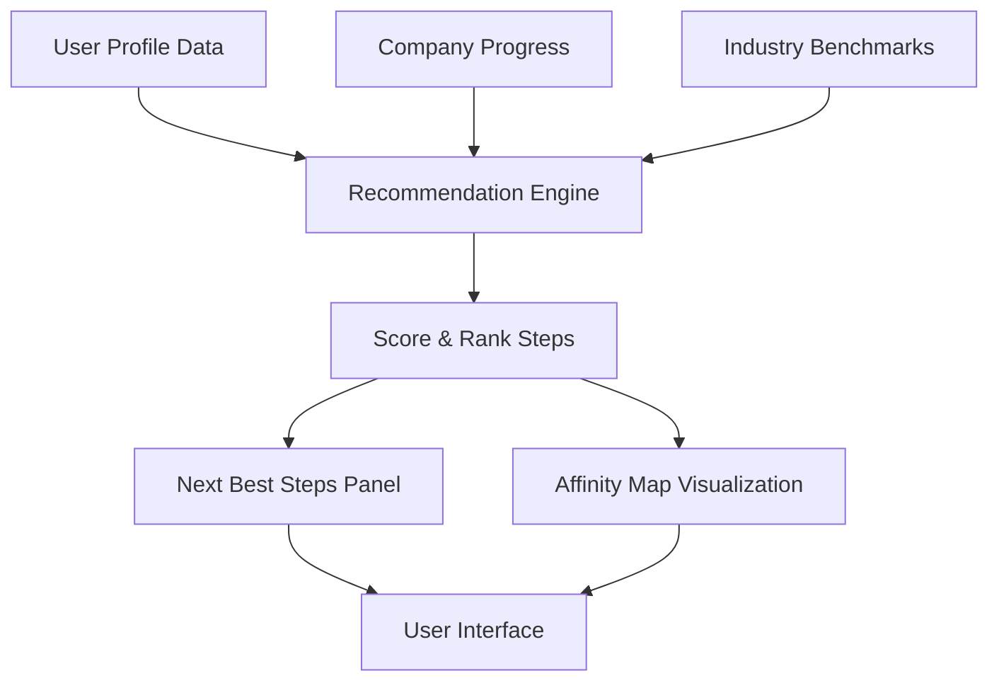

# Journey UI Sprint 3 - Design Mockups

This document provides visual mockups and design concepts for the key features planned for Sprint 3 of the Journey UI enhancement project.

## Intelligent Step Recommendations




### Key Components:

1. **Next Best Steps Panel**
   ```
   ┌─────────────────────────────────────┐
   │ RECOMMENDED NEXT STEPS              │
   ├─────────────────────────────────────┤
   │ ★ Create Financial Projections      │
   │   High impact · 65% of startups do  │
   │   this next in your industry        │
   │                                     │
   │ ★ Develop Customer Acquisition Plan │
   │   Builds on your recent progress    │
   │   Est. 3 hours to complete          │
   │                                     │
   │ ★ Refine Your MVP Scope             │
   │   90% complete prerequisite steps   │
   │   Recommended by advisor Sarah T.   │
   └─────────────────────────────────────┘
   ```

2. **Step Affinity Visualization**
   ```
   ┌─────────────────────────────────────┐
   │ STEP RELATIONSHIPS                   │
   │                                     │
   │      Market       ┌───────┐         │
   │      Research ────┤ Value │         │
   │        │          │ Prop  │         │
   │        │          └───────┘         │
   │        ▼             │              │
   │    ┌───────┐         │              │
   │    │Customer│        ▼              │
   │    │Segments├──► Financial          │
   │    └───────┘     Projections        │
   │                                     │
   └─────────────────────────────────────┘
   ```

## Enhanced Interaction Capabilities


### Draggable Step Cards:

```
┌─────────────────────────────────┐  ╔═══════════════════════════════╗
│ MARKET RESEARCH                 │  ║ CUSTOMER SEGMENTATION       ▼ ║
│ ●●●○○ Difficulty                │  ║ ●●●●○ Difficulty              ║
│ █████████░░ 90% Complete        │  ║ █████░░░░░ 50% Complete       ║
│ ⏱ Est: 4-6 hours                │  ║ ⏱ Est: 8-12 hours             ║
│                                 │  ║                               ║
│             [ More details ]    │  ║             [ More details ]  ║
└─────────────────────────────────┘  ╚═══════════════════════════════╝
                 │                                    ▲
                 │                                    │
                 │         ┌──────┐                   │
                 └─────────►MOVING◄───────────────────┘
                           └──────┘
```

### Keyboard Shortcuts Overlay:

```
┌─────────────────────────────────────────────┐
│ KEYBOARD SHORTCUTS                           │
├─────────────────────────────────────────────┤
│ Navigation:                                  │
│ ⇧+↑/↓   Navigate between steps               │
│ ⇧+→/←   Navigate between phases              │
│ Esc     Close current detail view            │
│                                              │
│ Actions:                                     │
│ ⌘+D     Mark step as complete                │
│ ⌘+N     Add note to current step             │
│ ⌘+S     Save current changes                 │
│ ⌘+Space Toggle step details                  │
│                                              │
│ Organization:                                │
│ ⌘+↑/↓   Move step up/down in sequence        │
│ ⌘+⇧+P   Pin step to dashboard                │
└─────────────────────────────────────────────┘
```

## Progress Analytics Dashboard


### Journey Progress Overview:

```
┌──────────────────────────────────────────────────────────────────┐
│ JOURNEY PROGRESS                                                  │
├──────────────────────────────────────────────────────────────────┤
│                                                                   │
│ ■ Ideation Phase     ■ Validation Phase     ■ Growth Phase       │
│                                                                   │
│ █████████████████████████████████░░░░░░░░░░░░░░░░░░░░░░░░░░░░░░░░ │
│ 0%                    50%                   100%                  │
│                                                                   │
│ Phase Breakdown                    Time Investment               │
│ ┌────────────────────┐            ┌────────────────────┐         │
│ │ Growth      ██ 15% │            │ Customer Dev  ███  │         │
│ │ Validation  ███ 30%│            │ Product       ████ │         │
│ │ Ideation    █████ 55%           │ Financial     ██   │         │
│ └────────────────────┘            └────────────────────┘         │
│                                                                   │
│ Recent Milestones                                                │
│ ✓ Completed Customer Validation                                  │
│ ✓ Finalized MVP Feature Set                                      │
│ ✓ Established Pricing Strategy                                   │
│                                                                   │
└──────────────────────────────────────────────────────────────────┘
```

### Step Completion Analysis:

```
┌──────────────────────────────────────────────────────────────┐
│ STEP COMPLETION ANALYTICS                                     │
├──────────────────────────────────────────────────────────────┤
│                                                               │
│ Average completion time by phase:                             │
│                                                               │
│ Ideation     ███████████████  14.5 days                       │
│ Validation   ██████████████████  18.2 days                    │
│ Growth       ████████  8.7 days                               │
│                                                               │
│ Your pace vs. industry average:                               │
│                                                               │
│ Your startup:     ███████████████                             │
│ Industry average: ██████████████████                          │
│                   0        10        20        30 days        │
│                                                               │
│ Bottleneck Detection:                                         │
│ ❗️ Financial Projections - Above avg time (overdue 5 days)   │
│ ❗️ Customer Acquisition - Stuck at 40% for 7 days            │
│                                                               │
└──────────────────────────────────────────────────────────────┘
```

## AI-Powered Step Assistant


### Contextual Assistant Interface:

```
┌───────────────────────────────────────────────────────────────┐
│ AI ASSISTANT - FINANCIAL PROJECTIONS STEP                      │
├───────────────────────────────────────────────────────────────┤
│                                                                │
│ 🤖 Looking at your current progress, you need help with        │
│    creating revenue projections for your SaaS business.        │
│                                                                │
│ 💬 What specific aspect of financial projections are you       │
│    struggling with?                                            │
│                                                                │
│    [ ] Customer acquisition costs                              │
│    [ ] Monthly recurring revenue modeling                      │
│    [ ] Churn rate forecasting                                  │
│    [ ] Cash flow projections                                   │
│    [ ] Custom: ______________________________                  │
│                                                                │
│ 📚 RELEVANT RESOURCES:                                         │
│                                                                │
│  • SaaS Financial Projection Template                          │
│  • Video: Realistic Revenue Forecasting (4 min)                │
│  • Example: Financial Model from Similar Company               │
│  • Expert Advice: Sarah T. on B2B SaaS Pricing                 │
│                                                                │
│ 🔄 SUGGESTED NEXT ACTIONS:                                     │
│                                                                │
│  1. Fill out the projection template with initial numbers      │
│  2. Schedule a review with a financial mentor                  │
│  3. Integrate projections with your pitch deck                 │
│                                                                │
└───────────────────────────────────────────────────────────────┘
```

## User Feedback & Continuous Improvement


### Inline Rating Component:

```
┌─────────────────────────────────────────────────────────────┐
│ STEP COMPLETE: MARKET RESEARCH                              │
├─────────────────────────────────────────────────────────────┤
│                                                              │
│ 🎉 Great job completing this step!                          │
│                                                              │
│ How helpful was this step in your startup journey?           │
│                                                              │
│ ○ Not helpful   ○ Somewhat   ● Very helpful   ○ Essential   │
│                                                              │
│ Was anything missing or could be improved?                   │
│ ┌──────────────────────────────────────────────────┐        │
│ │                                                   │        │
│ │ Could use more B2B specific resources...          │        │
│ │                                                   │        │
│ └──────────────────────────────────────────────────┘        │
│                                                              │
│              [ Submit Feedback ]  [ Skip ]                   │
└─────────────────────────────────────────────────────────────┘
```

### Community Insight Panel:

```
┌─────────────────────────────────────────────────────────────┐
│ COMMUNITY INSIGHTS: CUSTOMER SEGMENTATION                    │
├─────────────────────────────────────────────────────────────┤
│                                                              │
│ 👥 145 startups completed this step recently                │
│                                                              │
│ Top insights shared:                                         │
│                                                              │
│ • "Start with psychographics, not just demographics"         │
│   - Alex K., Healthcare SaaS founder                         │
│                                                              │
│ • "We realized our initial segment was too broad"            │
│   - Maria T., FinTech startup                               │
│                                                              │
│ • "Created persona boards that we reference daily"           │
│   - Jamal R., EdTech founder                                │
│                                                              │
│ Resources others found helpful:                              │
│                                                              │
│ • Customer Development Interviews (89% recommended)          │
│ • Jobs-To-Be-Done Framework (75% recommended)               │
│ • Segmentation Workshop Template (68% recommended)           │
│                                                              │
└─────────────────────────────────────────────────────────────┘
```

## Visual Theme & Design Language

The Sprint 3 enhancements will follow this visual design approach:

1. **Color Palette:**
   - Primary: #3366FF (Blue) - For primary actions and highlighted elements 
   - Secondary: #FF6B2B (Orange) - For calls to action and important notifications
   - Success: #2CC389 (Green) - For completion indicators and positive feedback
   - Warning: #FFB800 (Amber) - For attention-requiring elements
   - Neutral: #F4F7FA to #2B3647 (Grayscale range) - For background and text

2. **Typography:**
   - Headings: Inter (Bold) - Clean, modern sans-serif for headings
   - Body: Inter (Regular) - Consistent family for readable content
   - Monospace: Roboto Mono - For code snippets and technical content

3. **Component Design:**
   - Card-based layout with subtle shadows
   - 8px grid system for consistent spacing
   - Rounded corners (8px radius) for containers
   - Micro-interactions and subtle animations for state changes
   - Consistent iconography style throughout
  
4. **Accessibility Considerations:**
   - WCAG 2.1 AA compliant color contrast
   - Keyboard navigable interface with visible focus states
   - Screen reader optimized components with proper ARIA labels
   - Responsive design that works across device sizes
