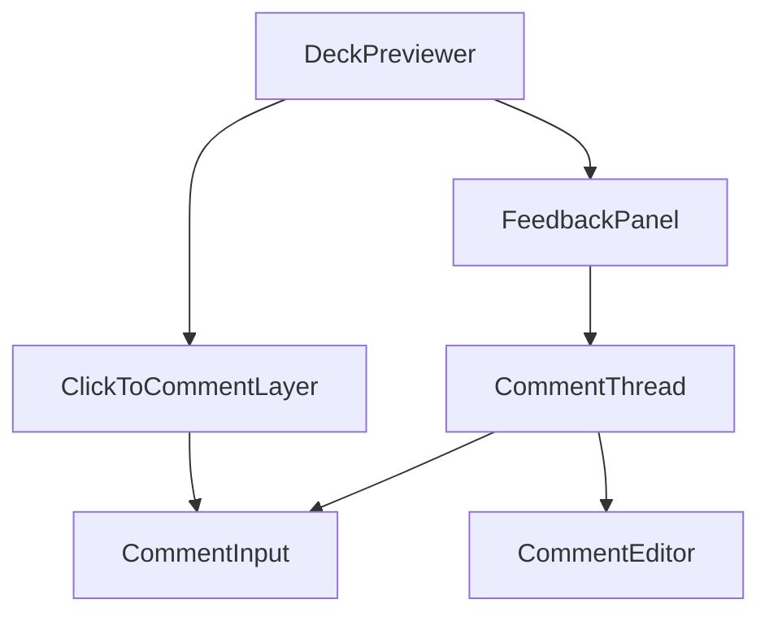

# Clickable Comments Implementation Plan

This document outlines the implementation plan for enhancing the deck builder's feedback system to support both deck-wide and slide-specific clickable comments.

## 1. Component Architecture

The following diagram illustrates the component structure for the feedback system:

- **DeckPreviewer**: The main component that hosts the feedback panel and the clickable comment layer.
- **FeedbackPanel**: Displays both deck-wide and slide-specific comments.
- **ClickToCommentLayer**: Captures user clicks on slides to create location-specific comments.
- **CommentThread**: Renders individual comments and their replies.
- **CommentInput**: Provides an input field for creating new comments.
- **CommentEditor**: Allows users to edit their existing comments.

## 2. Implementation Details

### Modify `FeedbackPanel.tsx`

The `FeedbackPanel.tsx` component will be updated to:
- Distinguish between deck-wide and slide-specific comments in its filtering logic.
- Add a toggle to allow users to switch between viewing all comments or only those for the currently selected slide.
- Update the UI to clearly indicate the current comment scope (deck-wide vs. slide-specific).

### Enhance `CommentInput.tsx`

The `CommentInput.tsx` component will be enhanced to:
- Dynamically change its placeholder text to guide the user based on whether they are adding a deck-wide or slide-specific comment.
- Add visual cues to differentiate between the two comment types.

### Update `CommentThread.tsx`

The `CommentThread.tsx` component will be updated to:
- Consistently display location information (slide ID and coordinates) for slide-specific comments.
- Ensure that the visual representation of comments clearly distinguishes between deck-wide and slide-specific feedback.

## 3. Data Flow

1.  A user clicks on a specific location on a slide.
2.  The `ClickToCommentLayer` captures the coordinates and prompts the user to enter a comment.
3.  The new comment is stored with the corresponding slide ID and coordinates.
4.  The `FeedbackPanel` displays the comment, filtered by the current context (either showing all comments or only those for the selected slide).
5.  The `CommentThread` renders the comment with its location details, making it clear that it is a slide-specific comment.
