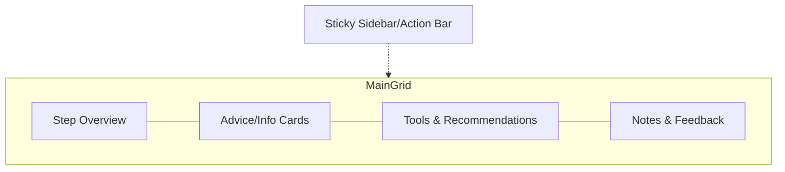

# Journey Step Page Implementation Documentation

## Overview
This document outlines the comprehensive plan for implementing a modern, dynamic, and context-aware journey step page. The page is designed to be visually appealing, responsive, and tailored to the company's current context and user interactions.

---

## Layout and Design Principles
- **Responsive Grid Layout**: Utilizes a full-width responsive grid (Tailwind CSS recommended) to ensure optimal use of screen real estate.
- **Main Content Area**: Occupies the majority of the viewport, displaying detailed step information, advice, tools, notes, and feedback.
- **Sticky Sidebar**: Provides quick access to key actions such as marking steps complete, skipping, focusing, tool selection, and expert assistance.
- **Modern Card Styling**: Cards feature rounded corners, subtle shadows, clear headers, and intuitive icons for enhanced readability and aesthetics.

---

## Dynamic and Contextual Content Rendering
- **Section Registry**: Maintains a registry of all possible sections (overview, description, guidance, tools, options, resources, checklists, tips, key considerations, milestones, skills, notes, feedback).
- **Conditional Rendering**: Sections are dynamically rendered based on data availability and relevance to the company's current phase, progress, and profile.
- **Dismissible Advice Cards**: Users can dismiss advice or sections, with the state persisted to ensure a personalized experience. Users can reset dismissed sections if needed.

---

## Actionable Sidebar
- **Sticky/Floating Sidebar**: Remains accessible as users scroll, providing persistent access to essential actions.
- **Key Actions**:
  - Mark Complete
  - Skip Step
  - Set as Focus Area
  - Track Manually
  - Tool Selection
  - Ask Expert / Ask Wheel (conditional)

---

## Tool Selection and Recommendations
- **Dedicated Tools Section**: Highlights recommended tools, with options to view all available tools or add custom tools.
- **Interactive Tool Actions**: Users can launch, compare, evaluate, or upload documents related to tools directly from the step page.

---

## Notes and Feedback Integration
- **Inline Editable Notes**: Supports autosave functionality and displays the last updated timestamp.
- **Feedback Section**: Allows users to submit ratings and comments, displaying aggregated feedback when available.

---

## Adaptive and Information-Rich Experience
- **Desktop View**: Multiple columns and expanded sections provide a dense, information-rich interface.
- **Mobile View**: Sections stack vertically for clarity and ease of use.
- **Adaptive Content**: Automatically adjusts layout to maintain visual balance, ensuring the page never appears collapsed or sparse.

---

## Personalization and Extensibility
- **Contextual Filtering**: Content visibility is tailored based on company context and user interactions.
- **Support for Custom Steps**: Gracefully handles user-added steps and custom fields, ensuring flexibility and extensibility.
- **Registry Pattern**: Facilitates easy addition and management of new section types.

---

## Implementation Flow
1. Fetch all relevant step and company context data.
2. Evaluate each section in the registry for data presence and relevance.
3. Render relevant sections as dismissible advice/info cards.
4. Provide persistent sidebar with key actions.
5. Ensure responsive and adaptive layout across devices.

---

## Visual Layout Diagram

---

This documentation serves as a reference for the implementation and future maintenance of the journey step page, ensuring alignment with design principles and functional requirements.
