# THE WHEEL: ADVANCED SIMULATION & FORECASTING

## Vision

The Advanced Simulation & Forecasting system transforms The Wheel from a static guidance platform into a dynamic prediction engine that enables founders to model complex business scenarios, quantify uncertainty, simulate potential outcomes, and make data-driven decisions based on sophisticated predictive analytics.

## Core Architecture

```mermaid
graph TD
    User[User] --> MSE[Model Selection Engine]
    MSE --> ML[Model Library]
    MSE --> SE[Simulation Engine]
    MSE --> VM[Visualization Module]
    MSE --> AM[Analytics Module]

    ML --> BusModels[Business Models]
    ML --> FinModels[Financial Models]
    ML --> MktModels[Market Models]
    ML --> OpModels[Operations Models]

    SE --> MonteCarlo[Monte Carlo Engine]
    SE --> SysDyn[System Dynamics Engine]
    SE --> AgentBased[Agent-Based Engine]
    SE --> Scenario[Scenario Engine]

    VM --> TimeVis[Time Series Visualization]
    VM --> DistVis[Distribution Charts]
    VM --> ScenVis[Scenario Comparison]
    VM --> SensVis[Sensitivity Analysis]

    AM --> Results[Results Analysis]
    AM --> Insights[Insight Generation]
    AM --> Recommend[Recommendation Engine]
    AM --> Benchmark[Benchmark Comparison]

    subgraph "Data Integration"
        CompData[Company Data]
        ExtData[External Data]
        HistData[Historical Data]
        BenchData[Benchmark Data]
    end

    CompData --> MSE
    ExtData --> MSE
    HistData --> MSE
    BenchData --> MSE
```



## Core Components

### 1. Model Library

The Model Library provides specialized models for different business domains, enabling comprehensive simulation across all aspects of a startup.

#### Key Features

- **Business Models**: Revenue, growth, adoption, and market penetration
- **Financial Models**: Cash flow, fundraising, unit economics, and valuation
- **Market Models**: Competition, customer behavior, and market conditions
- **Operations Models**: Resources, processes, scaling, and capacity

#### Technical Components

```typescript
interface SimulationModel<T extends ModelInputs, U extends ModelOutputs> {
  // Core simulation methods
  simulate(inputs: T, options?: SimulationOptions): Promise<SimulationResult<U>>;
  validateInputs(inputs: T): ValidationResult;
  generateDefaultInputs(context: CompanyContext): T;
  
  // Model metadata and capabilities
  getName(): string;
  getDescription(): string;
  getCategory(): ModelCategory;
  getRequiredInputs(): ModelInputDefinition[];
  getOutputDefinitions(): ModelOutputDefinition[];
  
  // Model configuration
  configure(configuration: ModelConfiguration): void;
  getConfiguration(): ModelConfiguration;
  
  // Uncertainty handling
  defineDistribution(paramName: string, distribution: ProbabilityDistribution): void;
  getParameterDistributions(): Record<string, ProbabilityDistribution>;
}

// Business models
class RevenueModel implements SimulationModel<RevenueInputs, RevenueOutputs> {
  // Implementation details for revenue projections
}

class MarketAdoptionModel implements SimulationModel<AdoptionInputs, AdoptionOutputs> {
  // Implementation details for market adoption curves
}

// Financial models
class CashFlowModel implements SimulationModel<CashFlowInputs, CashFlowOutputs> {
  // Implementation details for cash flow projections
}

class FundraisingModel implements SimulationModel<FundraisingInputs, FundraisingOutputs> {
  // Implementation details for fundraising scenarios
}

// Market models
class CompetitiveModel implements SimulationModel<CompetitiveInputs, CompetitiveOutputs> {
  // Implementation details for competitive analysis
}

class MarketSizingModel implements SimulationModel<MarketInputs, MarketOutputs> {
  // Implementation details for market sizing
}

// Operations models
class ResourceAllocationModel implements SimulationModel<ResourceInputs, ResourceOutputs> {
  // Implementation details for resource allocation
}

class ScalingModel implements SimulationModel<ScalingInputs, ScalingOutputs> {
  // Implementation details for scaling scenarios
}
```

### 2. Simulation Engine

The Simulation Engine executes the models with varying techniques to handle different types of uncertainty and complexity.

#### Key Features

- **Monte Carlo Engine**: Handles parameter uncertainty through repeated sampling
- **System Dynamics Engine**: Models complex feedback loops and system behavior
- **Agent-Based Engine**: Simulates interactions between autonomous entities
- **Scenario Engine**: Manages structured what-if scenarios

#### Technical Components

```typescript
class MonteCarloEngine {
  // Core Monte Carlo methods
  async runSimulation<T, U>(
    model: SimulationModel<T, U>,
    inputs: T,
    options: MonteCarloOptions
  ): Promise<MonteCarloResult<U>> {
    const results: SimulationResult<U>[] = [];
    const iterations = options.iterations || 1000;
    
    for (let i = 0; i < iterations; i++) {
      const sampledInputs = this.sampleInputs(model, inputs);
      const result = await model.simulate(sampledInputs);
      results.push(result);
    }
    
    return this.analyzeMCResults(results, options);
  }
  
  // Input sampling methods
  private sampleInputs<T>(model: SimulationModel<T, any>, baseInputs: T): T {
    const distributions = model.getParameterDistributions();
    const sampledInputs = { ...baseInputs };
    
    for (const [param, distribution] of Object.entries(distributions)) {
      if (param in sampledInputs) {
        sampledInputs[param] = this.sampleFromDistribution(distribution);
      }
    }
    
    return sampledInputs;
  }
  
  private sampleFromDistribution(distribution: ProbabilityDistribution): number {
    // Implementation for different distribution types
    switch (distribution.type) {
      case 'normal':
        return this.sampleNormal(distribution.mean, distribution.stdDev);
      case 'uniform':
        return this.sampleUniform(distribution.min, distribution.max);
      case 'triangular':
        return this.sampleTriangular(distribution.min, distribution.mode, distribution.max);
      case 'lognormal':
        return this.sampleLognormal(distribution.mu, distribution.sigma);
      case 'discrete':
        return this.sampleDiscrete(distribution.values, distribution.probabilities);
      default:
        throw new Error(`Unsupported distribution type: ${distribution.type}`);
    }
  }
  
  // Result analysis methods
  private analyzeMCResults<U>(
    results: SimulationResult<U>[],
    options: MonteCarloOptions
  ): MonteCarloResult<U> {
    return {
      percentiles: this.calculatePercentiles(results, options.percentiles),
      mean: this.calculateMean(results),
      median: this.calculateMedian(results),
      standardDeviation: this.calculateStdDev(results),
      rawResults: options.includeRawResults ? results : undefined,
      convergenceAnalysis: options.performConvergence ? this.analyzeConvergence(results) : undefined
    };
  }
}

class SystemDynamicsEngine {
  // System dynamics modeling methods
  async runSimulation<T, U>(
    model: SystemDynamicsModel<T, U>,
    inputs: T,
    options: SystemDynamicsOptions
  ): Promise<SystemDynamicsResult<U>> {
    // Implementation for system dynamics simulation
    const timeSteps = options.timeSteps || 60; // Monthly for 5 years default
    const timeStep = options.timeStepSize || 1;
    const stocks = this.initializeStocks(model, inputs);
    const results: SystemDynamicsTimeStep<U>[] = [];
    
    for (let t = 0; t < timeSteps; t++) {
      const flows = this.calculateFlows(model, stocks, t * timeStep);
      this.updateStocks(stocks, flows, timeStep);
      const output = this.generateOutput<U>(model, stocks, t * timeStep);
      
      results.push({
        time: t * timeStep,
        values: output,
        stocks: { ...stocks },
        flows: { ...flows }
      });
    }
    
    return {
      timeSteps: results,
      feedbackAnalysis: options.analyzeFeedback ? this.analyzeFeedbackLoops(results) : undefined,
      stabilityAnalysis: options.analyzeStability ? this.analyzeSystemStability(results) : undefined
    };
  }
}

class ScenarioEngine {
  // Scenario management methods
  async runScenarios<T, U>(
    model: SimulationModel<T, U>,
    baselineInputs: T,
    scenarios: Scenario<T>[],
    options: ScenarioOptions
  ): Promise<ScenarioComparisonResult<U>> {
    const baselineResult = await model.simulate(baselineInputs);
    const scenarioResults: ScenarioResult<U>[] = [];
    
    for (const scenario of scenarios) {
      const scenarioInputs = this.applyScenarioToInputs(baselineInputs, scenario);
      const result = await model.simulate(scenarioInputs);
      
      scenarioResults.push({
        scenarioName: scenario.name,
        scenarioDescription: scenario.description,
        scenarioTags: scenario.tags,
        inputs: scenarioInputs,
        results: result,
        delta: this.calculateDelta(baselineResult, result)
      });
    }
    
    return {
      baseline: {
        inputs: baselineInputs,
        results: baselineResult
      },
      scenarios: scenarioResults,
      comparison: this.compareScenarios(baselineResult, scenarioResults, options)
    };
  }
  
  private applyScenarioToInputs<T>(baseInputs: T, scenario: Scenario<T>): T {
    const result = { ...baseInputs };
    
    for (const [key, change] of Object.entries(scenario.changes)) {
      if (key in result) {
        if (typeof change === 'function') {
          result[key] = change(result[key]);
        } else {
          result[key] = change;
        }
      }
    }
    
    return result;
  }
}
```

### 3. Visualization Module

The Visualization Module renders simulation results in interactive, intuitive formats that help founders understand complex data patterns and relationships.

#### Key Features

- **Time Series Visualization**: Shows projections over time with confidence intervals
- **Distribution Charts**: Displays probability distributions and outcome frequencies
- **Scenario Comparison**: Side-by-side view of different scenarios and their impacts
- **Sensitivity Analysis**: Visualization of input parameter impact on outcomes

#### Technical Components

```typescript
class VisualizationModule {
  // Time series visualization
  createTimeSeriesChart<T>(
    data: TimeSeriesData<T>,
    options: TimeSeriesOptions
  ): TimeSeriesChart {
    // Implementation to render time series with options for:
    // - Line/area charts for projections
    // - Confidence intervals from percentiles
    // - Multiple scenario overlay
    // - Event markers for key milestones
    // - Annotation capabilities
    return this.timeSeriesRenderer.render(data, options);
  }
  
  // Distribution visualization
  createDistributionChart<T>(
    data: DistributionData<T>,
    options: DistributionOptions
  ): DistributionChart {
    // Implementation to render distributions with options for:
    // - Histogram of outcomes
    // - Probability density function (PDF)
    // - Cumulative distribution function (CDF)
    // - Box plots
    // - Violin plots
    return this.distributionRenderer.render(data, options);
  }
  
  // Scenario comparison
  createScenarioComparisonChart<T>(
    data: ScenarioComparisonData<T>,
    options: ScenarioComparisonOptions
  ): ScenarioComparisonChart {
    // Implementation to render scenario comparisons with options for:
    // - Side-by-side bar charts
    // - Tornado diagrams
    // - Radar/spider charts for multi-dimensional comparison
    // - Heatmaps for parameter impact
    return this.scenarioRenderer.render(data, options);
  }
  
  // Sensitivity analysis
  createSensitivityChart(
    data: SensitivityData,
    options: SensitivityOptions
  ): SensitivityChart {
    // Implementation to render sensitivity analysis with options for:
    // - Tornado diagrams
    // - Correlation plots
    // - Scatter plots with trendlines
    // - Surface plots for bivariate sensitivity
    return this.sensitivityRenderer.render(data, options);
  }
  
  // Interactive dashboard
  createSimulationDashboard<T>(
    simulationResult: SimulationResult<T>,
    options: DashboardOptions
  ): SimulationDashboard {
    // Implementation to create a comprehensive dashboard with multiple charts
    // and interactive elements that allow exploring the simulation results
    return this.dashboardBuilder.build(simulationResult, options);
  }
}
```

### 4. Analytics Module

The Analytics Module extracts actionable insights from simulation results, enabling founders to interpret complex data and make informed decisions.

#### Key Features

- **Results Analysis**: Statistical examination of simulation outcomes
- **Insight Generation**: AI-driven extraction of key findings and patterns
- **Recommendation Engine**: Suggested actions based on simulation results
- **Benchmark Comparison**: Analysis against industry benchmarks and historical data

#### Technical Components

```typescript
class AnalyticsModule {
  // Results analysis
  analyzeResults<T>(
    simulationResult: SimulationResult<T>,
    options: AnalysisOptions
  ): ResultsAnalysis {
    // Statistical analysis implementation
    const statistics = this.statisticalAnalyzer.analyze(simulationResult);
    const outliers = this.outlierDetector.detect(simulationResult, options);
    const trends = this.trendAnalyzer.identify(simulationResult);
    
    return {
      statistics,
      outliers,
      trends,
      riskAssessment: this.riskAnalyzer.assess(simulationResult, options)
    };
  }
  
  // Insight generation
  generateInsights<T>(
    resultsAnalysis: ResultsAnalysis,
    context: CompanyContext,
    options: InsightOptions
  ): SimulationInsights {
    // AI-driven insight extraction implementation
    return this.insightGenerator.generate(resultsAnalysis, context, options);
  }
  
  // Recommendation engine
  generateRecommendations(
    insights: SimulationInsights,
    context: CompanyContext,
    options: RecommendationOptions
  ): ActionRecommendations {
    // Recommendation generation implementation
    return this.recommendationEngine.recommend(insights, context, options);
  }
  
  // Benchmark comparison
  compareToBenchmarks<T>(
    simulationResult: SimulationResult<T>,
    benchmarks: BenchmarkData[],
    options: BenchmarkOptions
  ): BenchmarkComparison {
    // Benchmark comparison implementation
    return this.benchmarkAnalyzer.compare(simulationResult, benchmarks, options);
  }
}

interface StatisticalAnalyzer {
  analyze<T>(simulationResult: SimulationResult<T>): StatisticalAnalysis;
}

interface OutlierDetector {
  detect<T>(simulationResult: SimulationResult<T>, options?: OutlierOptions): Outlier[];
}

interface TrendAnalyzer {
  identify<T>(simulationResult: SimulationResult<T>): Trend[];
}

interface RiskAnalyzer {
  assess<T>(simulationResult: SimulationResult<T>, options?: RiskOptions): RiskAssessment;
}

interface InsightGenerator {
  generate(
    analysis: ResultsAnalysis,
    context: CompanyContext,
    options?: InsightOptions
  ): SimulationInsights;
}

interface RecommendationEngine {
  recommend(
    insights: SimulationInsights,
    context: CompanyContext,
    options?: RecommendationOptions
  ): ActionRecommendations;
}

interface BenchmarkAnalyzer {
  compare<T>(
    simulationResult: SimulationResult<T>,
    benchmarks: BenchmarkData[],
    options?: BenchmarkOptions
  ): BenchmarkComparison;
}
```

## Domain-Specific Models

### Financial Simulation Models

#### Cash Flow Projection

- **Time-series forecasting of cash inflows and outflows**
- **Runway calculation with uncertainty quantification**
- **Fundraising timing optimization**
- **Sensitivity analysis for key financial drivers**
- **Scenario modeling for different growth paths**

#### Fundraising Strategy

- **Funding round sizing and valuation modeling**
- **Dilution projection over multiple rounds**
- **Cap table simulation with various investment structures**
- **Option pool planning and employee equity modeling**
- **Exit scenario financial outcomes**

#### Unit Economics

- **Customer acquisition cost (CAC) modeling**
- **Lifetime value (LTV) projection with sensitivity analysis**
- **Contribution margin analysis by product/service**
- **Payback period calculation with uncertainty**
- **Pricing strategy optimization**

### Market Simulation Models

#### Market Adoption

- **Technology adoption curve modeling**
- **Penetration rate forecasting with competitive effects**
- **Regional market expansion simulation**
- **Virality and network effect modeling**
- **Churn and retention impact assessment**

#### Competitive Analysis

- **Competitor response simulation**
- **Market share projection with competitive dynamics**
- **Price competition and elasticity modeling**
- **Feature differentiation impact assessment**
- **Mergers and acquisitions scenario planning**

#### Channel Strategy

- **Multi-channel optimization modeling**
- **Sales cycle and conversion funnel simulation**
- **Partner and reseller network growth projection**
- **Channel conflict and cannibalization analysis**
- **Marketing mix modeling and attribution**

### Operational Simulation Models

#### Team Scaling

- **Headcount planning with skill mix optimization**
- **Hiring funnel and time-to-hire modeling**
- **Employee productivity ramp-up simulation**
- **Organizational structure scenario planning**
- **Remote vs. on-site workforce efficiency models**

#### Resource Allocation

- **Budget optimization across departments**
- **Project prioritization and portfolio management**
- **Infrastructure scaling with demand forecasting**
- **Cost structure analysis and optimization**
- **Research and development investment modeling**

#### Go-to-Market Execution

- **Launch strategy simulation with variable timing**
- **Geographical expansion sequencing optimization**
- **Product roadmap impact assessment**
- **Marketing campaign effectiveness projection**
- **Sales territory planning and optimization**

## Implementation Roadmap

### Phase 1: Foundation (Months 1-3)

- Design core simulation data models and interfaces
- Implement basic Monte Carlo engine for single-variable uncertainty
- Build financial projection models (cash flow, runway)
- Create fundamental visualization components

### Phase 2: Expansion (Months 4-6)

- Develop market and operational models
- Implement system dynamics engine for feedback loops
- Build scenario management and comparison tools
- Create advanced visualization components

### Phase 3: Intelligence (Months 7-9)

- Implement agent-based simulation for complex interactions
- Build result analysis framework and insight generation
- Develop recommendation engine
- Create benchmark comparison system

### Phase 4: Integration (Months 10-12)

- Integrate with Progress Tracker for context-aware simulations
- Connect with Knowledge Hub for industry benchmarks
- Link with AI Agent Ecosystem for specialized domain expertise
- Build comprehensive simulation dashboard with interactive controls

## Technical Considerations

### Integration with Progress Tracker

- Simulation scenarios can be generated from progress milestones
- Progress data provides context for realistic parameter ranges
- Simulation outcomes can influence task prioritization and milestone adjustment
- Historical progress data calibrates model accuracy

### Data Sources and Integration

- Internal company data (financial, operational, customer)
- External market data (industry reports, competitive intelligence)
- Benchmark data (industry averages, comparable companies)
- Economic indicators and macroeconomic factors

### Model Validation and Calibration

- Backtesting against historical company data
- Comparison with benchmark company trajectories
- Continuous model refinement based on actual outcomes
- Confidence scoring for model predictions

## Future Extensions

### Automated Decision Optimization

Future versions will enable optimization algorithms to automatically discover optimal strategies:

- Multi-objective optimization for complex tradeoffs
- Genetic algorithms for strategy evolution
- Reinforcement learning for adaptive strategy development
- Bayesian optimization for efficient parameter tuning

### Real-time Data Integration

Simulations will become increasingly dynamic with real-time data feeds:

- Live market data integration
- Real-time financial transaction processing
- Customer behavior signals
- Competitive activity monitoring
- Economic indicator tracking

## Value Proposition

The Advanced Simulation & Forecasting system transforms The Wheel from a guidance platform into a powerful decision support system that:

1. **Quantifies uncertainty** through sophisticated probabilistic modeling
2. **Tests strategies virtually** before committing real resources
3. **Identifies hidden risks and opportunities** through complex scenario analysis
4. **Optimizes resource allocation** across multiple competing priorities
5. **Provides data-driven confidence** in critical business decisions
