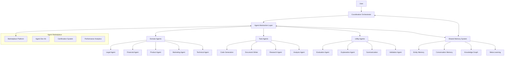

# THE WHEEL: AI AGENT ECOSYSTEM

## Vision

The AI Agent Ecosystem transforms The Wheel from a platform with a single generalized AI assistant into a collaborative team of specialized AI agents that work together to provide domain-specific expertise, coordinate across different areas, and continuously improve through shared learning.

## Core Architecture



## Core Components

### 1. Agent Abstraction Layer

The Agent Abstraction Layer provides a unified interface for all agents in the ecosystem, enabling seamless integration with the platform.

#### Key Features

- **Standardized Interface**: Common API for agent interactions regardless of underlying models or capabilities
- **Model Integration Framework**: Support for multiple LLMs and specialized models
- **Domain Specialization Architecture**: Structure for creating domain-specific agents
- **Evaluation and Benchmarking**: Quantitative measurement of agent performance

#### Technical Components

```typescript
interface AgentInterface {
  // Core interaction methods
  async processMessage(message: AgentMessage): Promise<AgentResponse>;
  async generateResponse(context: AgentContext): Promise<AgentContent>;
  
  // Agent metadata and capabilities
  getCapabilities(): AgentCapability[];
  getDomain(): AgentDomain;
  getRequirements(): AgentRequirements;
  
  // State and context management
  updateContext(context: Partial<AgentContext>): void;
  getState(): AgentState;
  
  // Performance and improvement
  recordFeedback(feedback: AgentFeedback): void;
  improveFromFeedback(feedbackHistory: AgentFeedback[]): Promise<void>;
}

interface ModelAdapterInterface {
  // LLM-specific implementations
  async generateCompletion(prompt: string, params: ModelParams): Promise<string>;
  async generateEmbedding(text: string): Promise<number[]>;
  async streamCompletion(prompt: string, params: ModelParams): AsyncGenerator<string>;
  
  // Model metadata
  getModelInfo(): ModelInfo;
  getModelCapabilities(): ModelCapability[];
  getTokenUsage(text: string): number;
}

interface DomainSpecialization {
  domain: AgentDomain;
  knowledgeBase: KnowledgeBase;
  domainTerminology: Record<string, string>;
  domainRules: DomainRule[];
  domainTemplates: Record<string, string>;
  domainExamples: Example[];
  benchmarkScenarios: BenchmarkScenario[];
}
```

### 2. Coordination Orchestrator

The Coordination Orchestrator manages the interactions between agents, routing requests, selecting appropriate agents, and maintaining context coherence.

#### Key Features

- **Intent-Based Routing**: Directs user requests to the most appropriate agent(s)
- **Agent Selection Algorithm**: Dynamically selects optimal agents based on context and requirements
- **Team Formation**: Assembles teams of agents for complex multi-domain tasks
- **Context Transition Management**: Ensures smooth handoffs between agents

#### Technical Components

```typescript
class CoordinationOrchestrator {
  // Core orchestration methods
  async orchestrateRequest(userRequest: UserRequest): Promise<Response> {
    const intent = await this.intentRecognition.analyze(userRequest);
    const selectedAgents = this.agentSelector.selectAgents(intent, userRequest.context);
    
    if (selectedAgents.length === 1) {
      return this.processSingleAgentRequest(selectedAgents[0], userRequest);
    } else {
      return this.processMultiAgentRequest(selectedAgents, userRequest);
    }
  }
  
  // Agent selection and routing
  private async processSingleAgentRequest(
    agent: AgentInterface, 
    request: UserRequest
  ): Promise<Response> {
    const enrichedContext = await this.contextManager.enrichContext(
      request.context, 
      agent.getDomain()
    );
    const response = await agent.processMessage({
      content: request.content,
      context: enrichedContext
    });
    return this.responseProcessor.processResponse(response);
  }
  
  private async processMultiAgentRequest(
    agents: AgentInterface[], 
    request: UserRequest
  ): Promise<Response> {
    const team = this.teamManager.formTeam(agents, request.intent);
    const collaborationPlan = await this.collaborationPlanner.createPlan(team, request);
    return this.executeCollaborationPlan(collaborationPlan);
  }
  
  // Context management
  async transitionContext(
    fromAgent: AgentInterface,
    toAgent: AgentInterface,
    context: AgentContext
  ): Promise<AgentContext> {
    return this.contextTransitioner.transition(fromAgent, toAgent, context);
  }
}

interface IntentRecognition {
  analyze(request: UserRequest): Promise<Intent>;
  getConfidenceScore(intent: Intent): number;
  getPossibleIntents(request: UserRequest): Intent[];
}

class AgentSelector {
  selectAgents(intent: Intent, context: RequestContext): AgentInterface[] {
    const domainScore = this.calculateDomainRelevance(intent);
    const expertiseScore = this.calculateExpertiseMatch(intent, context);
    const pastPerformanceScore = this.calculatePastPerformance(intent);
    
    return this.rankAndSelectAgents(
      domainScore,
      expertiseScore,
      pastPerformanceScore
    );
  }
}
```

### 3. Shared Memory System

The Shared Memory System enables agents to access shared knowledge, learn from each other's interactions, and build a collective understanding.

#### Key Features

- **Entity Memory**: Persistent storage of entities and their relationships
- **Conversation History**: Contextualized record of past interactions
- **Knowledge Graph Connections**: Structured representation of domain knowledge
- **Cross-Agent Learning**: Mechanisms for sharing insights between agents

#### Technical Components

```typescript
class SharedMemorySystem {
  // Entity management
  async storeEntity(entity: Entity, metadata: EntityMetadata): Promise<string> {
    return this.entityMemory.store(entity, metadata);
  }
  
  async retrieveEntity(entityId: string): Promise<Entity> {
    return this.entityMemory.retrieve(entityId);
  }
  
  async updateEntity(entityId: string, updates: Partial<Entity>): Promise<Entity> {
    return this.entityMemory.update(entityId, updates);
  }
  
  // Conversation management
  async storeConversation(
    conversation: Conversation, 
    metadata: ConversationMetadata
  ): Promise<string> {
    return this.conversationMemory.store(conversation, metadata);
  }
  
  async retrieveRelevantConversations(
    query: string, 
    context: QueryContext
  ): Promise<Conversation[]> {
    return this.conversationMemory.retrieveRelevant(query, context);
  }
  
  // Knowledge graph operations
  async addKnowledgeNode(node: KnowledgeNode): Promise<string> {
    return this.knowledgeGraph.addNode(node);
  }
  
  async addRelationship(
    sourceNodeId: string,
    targetNodeId: string, 
    relationship: Relationship
  ): Promise<string> {
    return this.knowledgeGraph.addRelationship(sourceNodeId, targetNodeId, relationship);
  }
  
  async queryKnowledgeGraph(query: GraphQuery): Promise<QueryResult> {
    return this.knowledgeGraph.query(query);
  }
  
  // Cross-agent learning
  async shareInsight(insight: AgentInsight): Promise<void> {
    return this.metaLearning.recordInsight(insight);
  }
  
  async retrieveRelevantInsights(context: QueryContext): Promise<AgentInsight[]> {
    return this.metaLearning.retrieveInsights(context);
  }
}

interface EntityMemory {
  store(entity: Entity, metadata: EntityMetadata): Promise<string>;
  retrieve(entityId: string): Promise<Entity>;
  update(entityId: string, updates: Partial<Entity>): Promise<Entity>;
  search(query: string, filters?: EntityFilter): Promise<Entity[]>;
  getRelatedEntities(entityId: string, relationship?: string): Promise<Entity[]>;
}

interface ConversationMemory {
  store(conversation: Conversation, metadata: ConversationMetadata): Promise<string>;
  retrieveById(conversationId: string): Promise<Conversation>;
  retrieveRelevant(query: string, context: QueryContext): Promise<Conversation[]>;
  updateWithFeedback(conversationId: string, feedback: Feedback): Promise<void>;
  getStatistics(filters?: StatisticsFilter): Promise<ConversationStatistics>;
}
```

### 4. Agent Marketplace

The Agent Marketplace enables third-party developers to build and deploy specialized agents that extend the capabilities of The Wheel.

#### Key Features

- **Agent Registration and Discovery**: Mechanism for adding and finding agents
- **Developer Tools and SDK**: Resources for building compatible agents
- **Certification and Quality Assurance**: Standards for agent reliability
- **Analytics and Performance Monitoring**: Tracking of agent effectiveness

#### Technical Components

```typescript
class AgentMarketplace {
  // Agent discovery
  async listAgents(filters?: AgentFilter): Promise<AgentListing[]> {
    return this.registry.listAgents(filters);
  }
  
  async searchAgents(query: string, filters?: AgentFilter): Promise<AgentListing[]> {
    return this.registry.searchAgents(query, filters);
  }
  
  async getAgentDetails(agentId: string): Promise<AgentDetails> {
    return this.registry.getAgentDetails(agentId);
  }
  
  // Agent installation
  async installAgent(agentId: string, options?: InstallOptions): Promise<InstallResult> {
    const agentDetails = await this.registry.getAgentDetails(agentId);
    const validationResult = await this.validator.validateAgent(agentDetails);
    
    if (validationResult.isValid) {
      return this.installer.installAgent(agentDetails, options);
    } else {
      throw new Error(`Agent validation failed: ${validationResult.errors.join(', ')}`);
    }
  }
  
  // Developer operations
  async registerAgent(agentPackage: AgentPackage, developerInfo: DeveloperInfo): Promise<string> {
    const validationResult = await this.validator.validateAgentPackage(agentPackage);
    
    if (validationResult.isValid) {
      return this.registry.registerAgent(agentPackage, developerInfo);
    } else {
      throw new Error(`Agent package validation failed: ${validationResult.errors.join(', ')}`);
    }
  }
  
  async updateAgent(agentId: string, updates: AgentUpdates): Promise<UpdateResult> {
    const validationResult = await this.validator.validateAgentUpdates(agentId, updates);
    
    if (validationResult.isValid) {
      return this.registry.updateAgent(agentId, updates);
    } else {
      throw new Error(`Agent update validation failed: ${validationResult.errors.join(', ')}`);
    }
  }
  
  // Analytics
  async getAgentPerformance(agentId: string, timeRange?: TimeRange): Promise<PerformanceMetrics> {
    return this.analytics.getAgentPerformance(agentId, timeRange);
  }
  
  async getMarketplaceAnalytics(filters?: AnalyticsFilter): Promise<MarketplaceAnalytics> {
    return this.analytics.getMarketplaceAnalytics(filters);
  }
}

interface AgentDevelopmentKit {
  getAgentTemplate(agentType: AgentType): AgentTemplate;
  validateAgentPackage(agentPackage: AgentPackage): ValidationResult;
  testAgentPackage(agentPackage: AgentPackage): TestResult;
  packageAgent(sourceDir: string, options?: PackageOptions): AgentPackage;
  generateDocumentation(agentPackage: AgentPackage): Documentation;
}
```

## Agent Types

### Domain Agents

Domain Agents provide specialized expertise in specific business or technical domains.

#### Legal Agent

- **Legal document analysis and generation**
- **Compliance checking and guidance**
- **Contract review and annotation**
- **IP strategy and protection**
- **Entity formation guidance**

#### Financial Agent

- **Financial modeling and projections**
- **Cash flow analysis and optimization**
- **Fundraising strategy and documentation**
- **Valuation methodology**
- **Cap table management**

#### Product Agent

- **Product strategy development**
- **Feature prioritization frameworks**
- **User experience guidance**
- **Product roadmap planning**
- **Competitive analysis**

#### Marketing Agent

- **Marketing strategy formulation**
- **Customer acquisition modeling**
- **Channel effectiveness analysis**
- **Brand positioning guidance**
- **Content strategy development**

#### Technical Agent

- **Architecture recommendation**
- **Technology stack evaluation**
- **Technical debt assessment**
- **Scaling strategy guidance**
- **Security best practices**

### Task Agents

Task Agents excel at specific functional activities regardless of domain.

#### Code Generation Agent

- **Language-specific code writing**
- **Refactoring and optimization**
- **Test case generation**
- **API integration**
- **Developer documentation**

#### Document Writer Agent

- **Template-based document generation**
- **Content structuring and organization**
- **Style consistency enforcement**
- **Citation and reference management**
- **Multi-format export**

#### Research Agent

- **Information gathering and synthesis**
- **Competitive intelligence collection**
- **Data analysis and interpretation**
- **Trend identification**
- **Source verification**

#### Analysis Agent

- **Data pattern recognition**
- **Statistical analysis and inference**
- **Decision frameworks application**
- **Scenario evaluation**
- **Risk assessment**

### Utility Agents

Utility Agents provide support functions to enhance the effectiveness of other agents.

#### Evaluation Agent

- **Agent response quality assessment**
- **Factual accuracy verification**
- **Logical consistency checking**
- **Benchmark performance tracking**
- **Improvement recommendation**

#### Explanation Agent

- **Complex concept simplification**
- **Visual representation generation**
- **Analogy and metaphor creation**
- **Step-by-step breakdowns**
- **Audience-appropriate communication**

#### Summarization Agent

- **Content distillation and key point extraction**
- **Variable-length summaries**
- **Multi-document synthesis**
- **Topic identification and categorization**
- **Executive summary creation**

#### Validation Agent

- **Input data verification**
- **Constraint satisfaction checking**
- **Edge case identification**
- **Requirement fulfillment assessment**
- **Consistency enforcement**

## Implementation Roadmap

### Phase 1: Foundation (Months 1-3)

- Design agent interface specifications
- Implement basic routing system
- Build shared memory architecture
- Create agent registry foundation

### Phase 2: Initial Agents (Months 4-6)

- Develop first domain-specific agents (Legal, Finance)
- Implement context transition management
- Build cross-agent learning mechanisms
- Create developer tools and SDK

### Phase 3: Marketplace (Months 7-9)

- Implement team formation algorithms
- Build certification system
- Develop analytics dashboard
- Create agent marketplace interface

### Phase 4: Advanced Capabilities (Months 10-12)

- Integrate with all platform components
- Implement advanced coordination patterns
- Build comprehensive agent ecosystem dashboard
- Create onboarding for agent marketplace

## Technical Considerations

### Integration with Progress Tracker

- Agents access milestone and task data to provide context-relevant guidance
- Progress events can trigger specific agent activations
- Agent insights can influence task generation and prioritization

### Security and Privacy Framework

- Fine-grained permissions control what data each agent can access
- Encrypted data channels between agents and storage
- Audit logging of all agent actions and data access
- User-controlled privacy settings per agent

### Evaluation and Quality Assurance

- Continuous performance monitoring against benchmarks
- User feedback collection and integration
- Automated regression testing for agent updates
- Cross-checking between agents for factual consistency

## Future Extensions

### Autonomous Agent Actions

Future versions will enable agents to take limited autonomous actions within specific constraints:

- Calendar scheduling and management
- Document filing and organization
- Basic external API interactions
- Automated follow-ups and reminders
- Simple workflow automation

### Personalized Agent Adaptations

Agents will learn and adapt to user-specific preferences and patterns:

- Communication style matching
- Prioritization alignment with user values
- Domain terminology adaptation
- Working pattern synchronization
- Decision framework personalization

## Value Proposition

The AI Agent Ecosystem transforms The Wheel from a static platform into a living, evolving system that:

1. **Provides deeper expertise** through specialization across domains and functions
2. **Creates emergent intelligence** through agent collaboration and shared memory
3. **Extends capabilities endlessly** through the marketplace model
4. **Builds a data moat** with each interaction improving the entire system
5. **Delivers personalized guidance** by understanding each founder's unique context
