# THE WHEEL: COMMUNITY INFRASTRUCTURE

## Vision

The Community Infrastructure transforms The Wheel from an isolated productivity tool into a purposeful, structured network where founders can connect with peers, advisors, and experts for contextual support, knowledge sharing, and collaborative problem-solving throughout their startup journey.

## Core Architecture

```mermaid
graph TD
    User[User] --> CIF[Community Infrastructure Framework]
    CIF --> GM[Group Management]
    CIF --> CM[Content Management]
    CIF --> IM[Interaction Management]
    CIF --> AM[Analytics Management]
    
    GM --> MS[Membership System]
    GM --> GT[Group Types & Taxonomy]
    GM --> PS[Permission System]
    GM --> DM[Discovery Mechanism]
    
    CM --> CC[Content Creation]
    CM --> CMod[Content Moderation]
    CM --> CD[Content Distribution]
    CM --> CO[Content Organization]
    
    IM --> DT[Discussion Threads]
    IM --> ES[Event System]
    IM --> NS[Notification System]
    IM --> DMS[Direct Messaging]
    
    AM --> EM[Engagement Metrics]
    AM --> CA[Content Analytics]
    AM --> MA[Member Analytics]
    AM --> VM[Value Metrics]
    
    subgraph "Community Structures"
        Stage[Stage-Based Groups]
        Domain[Domain Groups]
        Sector[Sector Groups]
        Cohort[Learning Cohorts]
        AMAs[Knowledge Sharing & AMAs]
        Benchmarking[Peer Benchmarking]
        Health[Founder Health]
    end
    
    CIF --> Stage
    CIF --> Domain
    CIF --> Sector
    CIF --> Cohort
    CIF --> AMAs
    CIF --> Benchmarking
    CIF --> Health
```



## Core Components

### 1. Group Management System

The Group Management System enables the organization of community members into purposeful structures that facilitate targeted interactions and knowledge sharing.

#### Key Features

- **Membership Management**: Controls for joining, leaving, and participation
- **Group Types & Taxonomy**: Structured classification of different community spaces
- **Permission System**: Granular access controls for different roles
- **Discovery Mechanism**: Smart matching of users to relevant groups

#### Technical Components

```typescript
interface GroupManagementSystem {
  // Group operations
  createGroup(group: GroupCreate, creator: User): Promise<Group>;
  updateGroup(groupId: string, updates: GroupUpdate): Promise<Group>;
  archiveGroup(groupId: string): Promise<void>;
  getGroup(groupId: string): Promise<Group>;
  getGroups(filters?: GroupFilter): Promise<Group[]>;
  
  // Membership operations
  addMember(groupId: string, userId: string, role?: GroupRole): Promise<Membership>;
  removeMember(groupId: string, userId: string): Promise<void>;
  updateMemberRole(groupId: string, userId: string, role: GroupRole): Promise<Membership>;
  getGroupMembers(groupId: string, filters?: MemberFilter): Promise<GroupMember[]>;
  getUserGroups(userId: string, filters?: GroupFilter): Promise<Group[]>;
  
  // Permission operations
  getPermissions(groupId: string, userId: string): Promise<Permission[]>;
  updatePermissions(groupId: string, role: GroupRole, permissions: Permission[]): Promise<void>;
  checkPermission(groupId: string, userId: string, permission: string): Promise<boolean>;
  
  // Group discovery
  recommendGroups(userId: string, options?: RecommendationOptions): Promise<GroupRecommendation[]>;
  searchGroups(query: string, filters?: GroupFilter): Promise<Group[]>;
  getRelatedGroups(groupId: string): Promise<Group[]>;
  getTrendingGroups(filters?: GroupFilter): Promise<TrendingGroup[]>;
}

interface MembershipSystem {
  // Membership operations
  createMembership(groupId: string, userId: string, role?: GroupRole): Promise<Membership>;
  updateMembership(membershipId: string, updates: MembershipUpdate): Promise<Membership>;
  terminateMembership(membershipId: string, reason?: string): Promise<void>;
  getMembership(membershipId: string): Promise<Membership>;
  
  // Application operations
  applyToGroup(groupId: string, userId: string, application?: GroupApplication): Promise<ApplicationResult>;
  reviewApplication(applicationId: string, decision: ApplicationDecision): Promise<ApplicationResult>;
  getApplications(groupId: string, status?: ApplicationStatus): Promise<GroupApplication[]>;
  
  // Invitation operations
  inviteToGroup(groupId: string, inviteeEmail: string, inviter: User, message?: string): Promise<Invitation>;
  acceptInvitation(invitationId: string, user: User): Promise<Membership>;
  rejectInvitation(invitationId: string, reason?: string): Promise<void>;
  getInvitations(filters?: InvitationFilter): Promise<Invitation[]>;
  
  // Membership analytics
  getMembershipStatistics(groupId: string): Promise<MembershipStatistics>;
  getMemberEngagement(groupId: string, userId: string): Promise<MemberEngagement>;
  getMembershipTrends(groupId: string, timeRange: TimeRange): Promise<MembershipTrend[]>;
}

interface GroupTaxonomy {
  // Taxonomy operations
  getGroupTypes(): Promise<GroupType[]>;
  getGroupType(typeId: string): Promise<GroupType>;
  createGroupType(groupType: GroupTypeCreate): Promise<GroupType>;
  updateGroupType(typeId: string, updates: GroupTypeUpdate): Promise<GroupType>;
  
  // Categorization
  categorizeGroup(groupId: string, typeId: string): Promise<void>;
  getGroupsByType(typeId: string, filters?: GroupFilter): Promise<Group[]>;
  
  // Hierarchy
  getGroupHierarchy(rootTypeId?: string): Promise<GroupTypeHierarchy>;
  addGroupTypeRelationship(parentTypeId: string, childTypeId: string): Promise<void>;
  
  // Metadata
  getGroupTypeMetadata(typeId: string): Promise<GroupTypeMetadata>;
  updateGroupTypeMetadata(typeId: string, updates: Partial<GroupTypeMetadata>): Promise<GroupTypeMetadata>;
}

interface DiscoveryEngine {
  // Recommendation operations
  recommendGroupsForUser(userId: string, options?: RecommendationOptions): Promise<GroupRecommendation[]>;
  recommendUsersForGroup(groupId: string, options?: RecommendationOptions): Promise<UserRecommendation[]>;
  recommendConnectionsInGroup(groupId: string, userId: string): Promise<ConnectionRecommendation[]>;
  
  // Matching algorithms
  matchByInterests(userId: string): Promise<GroupMatch[]>;
  matchByActivity(userId: string): Promise<GroupMatch[]>;
  matchByProfile(userId: string): Promise<GroupMatch[]>;
  matchByProgress(userId: string): Promise<GroupMatch[]>;
  
  // Discovery settings
  getUserDiscoveryPreferences(userId: string): Promise<DiscoveryPreferences>;
  updateUserDiscoveryPreferences(userId: string, preferences: Partial<DiscoveryPreferences>): Promise<DiscoveryPreferences>;
  
  // Analytics
  getDiscoveryEffectiveness(userId: string): Promise<DiscoveryEffectiveness>;
  getGroupDiscoverability(groupId: string): Promise<Discoverability>;
}
```

### 2. Content Management System

The Content Management System facilitates the creation, moderation, and organization of community-generated content to maintain quality and relevance.

#### Key Features

- **Content Creation**: Tools for posting different content types
- **Content Moderation**: Processes for maintaining quality and safety
- **Content Distribution**: Targeting content to the right audience
- **Content Organization**: Structuring and categorizing user content

#### Technical Components

```typescript
class CommunityContentSystem {
  // Content creation
  async createPost(
    post: PostCreate,
    author: User,
    target: ContentTarget
  ): Promise<Post> {
    const validatedPost = await this.contentValidator.validatePost(post);
    const enrichedPost = this.metadataService.enrichPost(validatedPost, author);
    const contentId = await this.contentRepository.createPost(enrichedPost, target);
    
    await this.tagService.applyTags(contentId, post.tags || []);
    await this.mentionService.processMentions(contentId, post.content);
    await this.distributionService.scheduleDistribution(contentId, target);
    
    return this.contentRepository.getPost(contentId);
  }
  
  async createComment(
    comment: CommentCreate,
    author: User,
    parentId: string
  ): Promise<Comment> {
    const validatedComment = await this.contentValidator.validateComment(comment);
    const enrichedComment = this.metadataService.enrichComment(validatedComment, author);
    const commentId = await this.contentRepository.createComment(enrichedComment, parentId);
    
    await this.mentionService.processMentions(commentId, comment.content);
    await this.notificationService.notifyCommentParticipants(parentId, commentId, author.id);
    
    return this.contentRepository.getComment(commentId);
  }
  
  // Content moderation
  async moderateContent(
    contentId: string,
    moderationAction: ModerationAction,
    moderator: User,
    reason?: string
  ): Promise<ModerationResult> {
    const content = await this.contentRepository.getContent(contentId);
    const moderationResult = await this.moderationService.takeAction(
      content,
      moderationAction,
      moderator,
      reason
    );
    
    if (moderationResult.actionTaken) {
      await this.notificationService.notifyModerationAction(
        contentId,
        content.authorId,
        moderationAction,
        reason
      );
      
      await this.analyticsService.trackModerationEvent(moderationResult);
    }
    
    return moderationResult;
  }
  
  async reportContent(
    contentId: string,
    reporter: User,
    reason: ReportReason,
    details?: string
  ): Promise<ReportResult> {
    const reportId = await this.moderationService.createReport(
      contentId,
      reporter.id,
      reason,
      details
    );
    
    await this.workflowService.triggerModerationWorkflow(reportId);
    
    return this.moderationService.getReport(reportId);
  }
  
  // Content retrieval
  async getFeed(
    user: User,
    feedOptions: FeedOptions
  ): Promise<ContentFeed> {
    const userContext = await this.contextService.getUserContext(user.id);
    const relevantGroups = await this.membershipService.getUserGroups(user.id);
    
    const feedContext: FeedContext = {
      userContext,
      groups: relevantGroups,
      preferences: await this.preferenceService.getUserPreferences(user.id),
      filters: feedOptions.filters || {},
      sort: feedOptions.sort || 'recent'
    };
    
    const feedItems = await this.feedService.generateFeed(feedContext, feedOptions);
    await this.analyticsService.trackFeedView(user.id, feedOptions, feedItems.map(i => i.id));
    
    return {
      items: feedItems,
      pagination: feedOptions.pagination,
      nextCursor: this.feedService.generateNextCursor(feedItems)
    };
  }
  
  // Content organization
  async categorizeContent(
    contentId: string,
    categoryIds: string[],
    categorizer: User
  ): Promise<ContentCategories> {
    const content = await this.contentRepository.getContent(contentId);
    
    // Check permission
    if (!await this.permissionService.canCategorize(content, categorizer)) {
      throw new PermissionError('User cannot categorize this content');
    }
    
    const categories = await this.taxonomyService.applyCategories(contentId, categoryIds);
    await this.analyticsService.trackCategorization(contentId, categories, categorizer.id);
    
    return categories;
  }
}

interface ContentModerationService {
  // Moderation operations
  createReport(contentId: string, reporterId: string, reason: ReportReason, details?: string): Promise<string>;
  getReport(reportId: string): Promise<Report>;
  getReports(filters?: ReportFilter): Promise<Report[]>;
  takeAction(content: Content, action: ModerationAction, moderator: User, reason?: string): Promise<ModerationResult>;
  
  // Automated moderation
  scanContent(content: Content): Promise<ModerationScan>;
  evaluateRisk(content: Content): Promise<RiskAssessment>;
  
  // Moderation settings
  getContentPolicies(): Promise<ContentPolicy[]>;
  updateContentPolicy(policyId: string, updates: Partial<ContentPolicy>): Promise<ContentPolicy>;
  
  // Moderation analytics
  getModerationStatistics(filters?: ModerationFilter): Promise<ModerationStatistics>;
  getModerationEffectiveness(): Promise<ModerationEffectiveness>;
}

interface ContentDistributionService {
  // Distribution operations
  scheduleDistribution(contentId: string, target: ContentTarget): Promise<DistributionPlan>;
  publishContent(contentId: string): Promise<PublishResult>;
  updateVisibility(contentId: string, visibility: ContentVisibility): Promise<void>;
  
  // Targeting
  getContentReach(contentId: string): Promise<ContentReach>;
  getTargetAudience(target: ContentTarget): Promise<AudienceSize>;
  optimizeDistributionTime(contentId: string, target: ContentTarget): Promise<OptimalTimeResult>;
  
  // Distribution analytics
  getContentPerformance(contentId: string): Promise<ContentPerformance>;
  getDistributionEffectiveness(filters?: DistributionFilter): Promise<DistributionEffectiveness>;
  getEngagementBreakdown(contentId: string): Promise<EngagementBreakdown>;
}

interface ContentOrganizationService {
  // Organization operations
  applyCategories(contentId: string, categoryIds: string[]): Promise<ContentCategories>;
  applyTags(contentId: string, tags: string[]): Promise<ContentTags>;
  createCollection(collection: CollectionCreate, creator: User): Promise<Collection>;
  addToCollection(collectionId: string, contentIds: string[]): Promise<Collection>;
  
  // Search and discovery
  searchContent(query: string, filters?: ContentFilter): Promise<SearchResult>;
  findRelatedContent(contentId: string, limit?: number): Promise<Content[]>;
  getTrendingContent(filters?: ContentFilter): Promise<TrendingContent[]>;
  
  // Organization analytics
  getCategoryEffectiveness(): Promise<CategoryEffectiveness>;
  getTagUsageStatistics(): Promise<TagStatistics>;
  getSearchAnalytics(timeRange: TimeRange): Promise<SearchAnalytics>;
}
```

### 3. Interaction Framework

The Interaction Framework enables meaningful communication and collaboration between community members through various channels and formats.

#### Key Features

- **Discussion Threads**: Structured conversations around topics
- **Event System**: Virtual and physical meeting coordination
- **Notification System**: Intelligent alerting for relevant activity
- **Direct Messaging**: Private communication between members

#### Technical Components

```typescript
interface InteractionFramework {
  // Discussion operations
  createThread(thread: ThreadCreate, creator: User): Promise<Thread>;
  replyToThread(threadId: string, reply: ReplyCreate, author: User): Promise<Reply>;
  updateThreadStatus(threadId: string, status: ThreadStatus): Promise<Thread>;
  pinThread(threadId: string, pinned: boolean): Promise<Thread>;
  
  // Event operations
  createEvent(event: EventCreate, organizer: User): Promise<Event>;
  updateEvent(eventId: string, updates: EventUpdate): Promise<Event>;
  registerForEvent(eventId: string, userId: string): Promise<EventRegistration>;
  cancelEvent(eventId: string, reason?: string): Promise<void>;
  
  // Notification operations
  sendNotification(notification: NotificationCreate, recipients: string[]): Promise<void>;
  markNotificationRead(notificationId: string, userId: string): Promise<void>;
  getUserNotifications(userId: string, filters?: NotificationFilter): Promise<Notification[]>;
  updateNotificationPreferences(userId: string, preferences: NotificationPreferences): Promise<void>;
  
  // Messaging operations
  sendDirectMessage(message: MessageCreate, sender: User, recipientId: string): Promise<Message>;
  getConversation(userIdA: string, userIdB: string, options?: ConversationOptions): Promise<Conversation>;
  getUserConversations(userId: string, options?: ConversationOptions): Promise<Conversation[]>;
  markConversationRead(conversationId: string, userId: string): Promise<void>;
}

class DiscussionSystem {
  // Thread operations
  async createThread(
    thread: ThreadCreate,
    creator: User,
    groupId: string
  ): Promise<Thread> {
    const validatedThread = await this.threadValidator.validate(thread);
    const enrichedThread = this.metadataService.enrichThread(validatedThread, creator);
    
    // Check permissions
    await this.permissionService.checkCanCreateThread(creator.id, groupId);
    
    const threadId = await this.threadRepository.create(enrichedThread, groupId);
    
    // Process tags, mentions, attachments
    await this.tagService.applyTags(threadId, thread.tags || []);
    await this.mentionService.processMentions(threadId, thread.content);
    
    if (thread.attachments && thread.attachments.length > 0) {
      await this.attachmentService.processAttachments(threadId, thread.attachments);
    }
    
    // Notify group members based on their preferences
    await this.notificationService.notifyNewThread(threadId, groupId, creator.id);
    
    // Analytics
    await this.analyticsService.trackThreadCreation(threadId, creator.id, groupId);
    
    return this.threadRepository.getThread(threadId);
  }
  
  async replyToThread(
    threadId: string,
    reply: ReplyCreate,
    author: User
  ): Promise<Reply> {
    const thread = await this.threadRepository.getThread(threadId);
    const validatedReply = await this.replyValidator.validate(reply);
    const enrichedReply = this.metadataService.enrichReply(validatedReply, author, thread);
    
    // Check permissions
    await this.permissionService.checkCanReplyToThread(author.id, threadId, thread.groupId);
    
    const replyId = await this.replyRepository.create(enrichedReply, threadId);
    
    // Process mentions, attachments
    await this.mentionService.processMentions(replyId, reply.content);
    
    if (reply.attachments && reply.attachments.length > 0) {
      await this.attachmentService.processAttachments(replyId, reply.attachments);
    }
    
    // Update thread stats
    await this.threadRepository.updateStats(threadId, {
      replyCount: { increment: 1 },
      lastActivityAt: new Date(),
      lastReplyId: replyId,
      lastReplyAuthorId: author.id
    });
    
    // Notify thread participants
    await this.notificationService.notifyThreadParticipants(threadId, replyId, author.id);
    
    // Analytics
    await this.analyticsService.trackReplyCreation(replyId, author.id, threadId);
    
    return this.replyRepository.getReply(replyId);
  }
}

interface EventSystem {
  // Event operations
  createEvent(event: EventCreate, organizer: User, groupId?: string): Promise<Event>;
  updateEvent(eventId: string, updates: EventUpdate): Promise<Event>;
  cancelEvent(eventId: string, reason?: string): Promise<Event>;
  getEvent(eventId: string): Promise<Event>;
  getEvents(filters?: EventFilter): Promise<Event[]>;
  
  // Registration operations
  registerForEvent(eventId: string, userId: string): Promise<EventRegistration>;
  cancelRegistration(eventId: string, userId: string, reason?: string): Promise<void>;
  getEventRegistrations(eventId: string, status?: RegistrationStatus): Promise<EventRegistration[]>;
  getUserEventRegistrations(userId: string, status?: RegistrationStatus): Promise<EventRegistration[]>;
  
  // Event logistics
  createEventSession(eventId: string, session: SessionCreate): Promise<EventSession>;
  generateEventMaterials(eventId: string): Promise<EventMaterials>;
  sendEventReminders(eventId: string, reminderType: ReminderType): Promise<ReminderResult>;
  
  // Event analytics
  getEventStatistics(eventId: string): Promise<EventStatistics>;
  getEventFeedback(eventId: string): Promise<EventFeedback[]>;
  getEventSeries(seriesId: string): Promise<Event[]>;
}

interface NotificationSystem {
  // Notification operations
  createNotification(notification: NotificationCreate): Promise<Notification>;
  sendNotification(notificationId: string, recipientIds: string[]): Promise<SendResult>;
  markAsRead(notificationId: string, userId: string): Promise<void>;
  markAllAsRead(userId: string, filter?: NotificationFilter): Promise<void>;
  
  // Retrieval
  getNotification(notificationId: string): Promise<Notification>;
  getUserNotifications(userId: string, filter?: NotificationFilter): Promise<Notification[]>;
  getUnreadCount(userId: string): Promise<number>;
  
  // Preferences
  getUserNotificationPreferences(userId: string): Promise<NotificationPreferences>;
  updateNotificationPreferences(userId: string, preferences: Partial<NotificationPreferences>): Promise<NotificationPreferences>;
  
  // Analytics
  getNotificationEffectiveness(): Promise<NotificationEffectiveness>;
  getUserEngagement(userId: string): Promise<NotificationEngagement>;
}

interface MessagingSystem {
  // Message operations
  sendMessage(message: MessageCreate, sender: User, recipientId: string): Promise<Message>;
  updateMessage(messageId: string, updates: MessageUpdate): Promise<Message>;
  deleteMessage(messageId: string): Promise<void>;
  getMessage(messageId: string): Promise<Message>;
  
  // Conversation operations
  getConversation(userIdA: string, userIdB: string, options?: ConversationOptions): Promise<Conversation>;
  getUserConversations(userId: string, options?: ConversationOptions): Promise<Conversation[]>;
  markConversationRead(conversationId: string, userId: string): Promise<void>;
  archiveConversation(conversationId: string, userId: string): Promise<void>;
  
  // Advanced features
  createGroupConversation(name: string, creatorId: string, participantIds: string[]): Promise<GroupConversation>;
  addToGroupConversation(conversationId: string, participantIds: string[]): Promise<GroupConversation>;
  removeFromGroupConversation(conversationId: string, participantId: string): Promise<void>;
  
  // Analytics
  getMessagingStatistics(userId: string): Promise<MessagingStatistics>;
  getConversationActivity(conversationId: string): Promise<ConversationActivity>;
}
```

### 4. Analytics Management

The Analytics Management system measures and analyzes community behavior to optimize engagement, identify valuable interactions, and demonstrate tangible value to users.

#### Key Features

- **Engagement Metrics**: Tracking participation and activity
- **Content Analytics**: Measuring the impact of shared knowledge
- **Member Analytics**: Understanding user behavior patterns
- **Value Metrics**: Quantifying the benefits of community participation

#### Technical Components

```typescript
interface CommunityAnalyticsSystem {
  // Engagement analytics
  trackEngagementEvent(event: EngagementEvent): Promise<void>;
  getEngagementMetrics(filters?: EngagementFilter): Promise<EngagementMetrics>;
  getUserEngagement(userId: string, timeRange?: TimeRange): Promise<UserEngagement>;
  getGroupEngagement(groupId: string, timeRange?: TimeRange): Promise<GroupEngagement>;
  
  // Content analytics
  getContentPerformance(contentId: string): Promise<ContentPerformance>;
  getTopPerformingContent(filters?: ContentFilter): Promise<PerformingContent[]>;
  getContentTypeEffectiveness(timeRange?: TimeRange): Promise<ContentTypeEffectiveness>;
  getContentTrends(timeRange?: TimeRange): Promise<ContentTrend[]>;
  
  // Member analytics
  getMemberActivityProfile(userId: string): Promise<ActivityProfile>;
  getInfluentialMembers(filters?: MemberFilter): Promise<InfluentialMember[]>;
  getMemberRetentionCohorts(): Promise<RetentionCohort[]>;
  getMemberGrowthTrends(timeRange?: TimeRange): Promise<MemberGrowthTrend[]>;
  
  // Value analytics
  getValueMetrics(filters?: ValueFilter): Promise<ValueMetrics>;
  getUserValueReceived(userId: string, timeRange?: TimeRange): Promise<UserValue>;
  getGroupValueGenerated(groupId: string, timeRange?: TimeRange): Promise<GroupValue>;
  getValueExchangeNetwork(): Promise<ValueNetwork>;
}

class EngagementMetricsService {
  // Event tracking
  async trackEngagementEvent(
    event: EngagementEvent
  ): Promise<void> {
    const enrichedEvent = this.eventEnricher.enrich(event);
    await this.eventRepository.store(enrichedEvent);
    
    // Process real-time metrics
    await this.realTimeProcessor.process(enrichedEvent);
    
    // Update aggregates
    await this.aggregateUpdater.updateAggregates(enrichedEvent);
    
    // Trigger dependent systems if necessary
    if (this.shouldTriggerDependentSystems(enrichedEvent)) {
      await this.systemTrigger.triggerSystems(enrichedEvent);
    }
  }
  
  // Metric retrieval
  async getEngagementMetrics(
    filters?: EngagementFilter
  ): Promise<EngagementMetrics> {
    const timeRange = filters?.timeRange || { start: new Date(Date.now() - 30 * 24 * 60 * 60 * 1000), end: new Date() };
    const segments = filters?.segments || ['day'];
    const metrics = filters?.metrics || ['activeUsers', 'interactions', 'contentCreated', 'responseRate'];
    
    const results = await this.metricRepository.getMetrics(metrics, timeRange, segments);
    const comparisons = await this.getComparisons(metrics, timeRange, filters?.compareWith);
    
    return {
      metrics: results,
      comparisons,
      totals: this.calculateTotals(results)
    };
  }
  
  // User engagement
  async getUserEngagement(
    userId: string,
    timeRange?: TimeRange
  ): Promise<UserEngagement> {
    const actualTimeRange = timeRange || { start: new Date(Date.now() - 90 * 24 * 60 * 60 * 1000), end: new Date() };
    
    const activities = await this.activityRepository.getUserActivities(userId, actualTimeRange);
    const metrics = await this.calculateUserMetrics(userId, activities);
    const benchmarks = await this.benchmarkService.getUserBenchmarks(userId, metrics);
    
    return {
      activities,
      metrics,
      benchmarks,
      insights: await this.insightGenerator.generateUserInsights(userId, metrics, benchmarks)
    };
  }
}

interface ContentAnalyticsService {
  // Performance metrics
  getContentPerformance(contentId: string): Promise<ContentPerformance>;
  getContentTypePerformance(contentType: string, filters?: ContentFilter): Promise<ContentTypePerformance>;
  getAuthorPerformance(authorId: string, filters?: ContentFilter): Promise<AuthorPerformance>;
  
  // Trend analysis
  getContentTrends(timeRange?: TimeRange, granularity?: TimeGranularity): Promise<ContentTrend[]>;
  getTopicTrends(timeRange?: TimeRange): Promise<TopicTrend[]>;
  getEmergingTopics(): Promise<EmergingTopic[]>;
  
  // Distribution analysis
  getContentReach(contentId: string): Promise<ContentReach>;
  getContentDistribution(filters?: ContentFilter): Promise<ContentDistribution>;
  getContentPropagation(contentId: string): Promise<ContentPropagation>;
  
  // Impact analysis
  getContentImpact(contentId: string): Promise<ContentImpact>;
  getInfluentialContent(filters?: ContentFilter): Promise<InfluentialContent[]>;
  getContentValueGeneration(contentId: string): Promise<ContentValue>;
}

interface MemberAnalyticsService {
  // Activity metrics
  getMemberActivity(userId: string, timeRange?: TimeRange): Promise<MemberActivity>;
  getMemberActivityDistribution(userId: string): Promise<ActivityDistribution>;
  getActivityHeatmap(userId: string, timeRange?: TimeRange): Promise<ActivityHeatmap>;
  
  // Network metrics
  getMemberInfluence(userId: string): Promise<MemberInfluence>;
  getMemberNetwork(userId: string, depth?: number): Promise<MemberNetwork>;
  getMemberCluster(userId: string): Promise<MemberCluster>;
  
  // Contribution metrics
  getMemberContributions(userId: string, timeRange?: TimeRange): Promise<MemberContributions>;
  getMemberImpact(userId: string): Promise<MemberImpact>;
  getMemberExpertise(userId: string): Promise<ExpertiseAreas[]>;
  
  // Segment analysis
  getMemberSegmentation(): Promise<MemberSegment[]>;
  getMemberJourneyAnalysis(): Promise<MemberJourney[]>;
  getMemberRetentionAnalysis(): Promise<RetentionAnalysis>;
}

interface ValueAnalyticsService {
  // Value tracking
  trackValueEvent(event: ValueEvent): Promise<void>;
  getValueMetrics(filters?: ValueFilter): Promise<ValueMetrics>;
  
  // User value
  getUserValueReceived(userId: string, timeRange?: TimeRange): Promise<UserValueReceived>;
  getUserValueContributed(userId: string, timeRange?: TimeRange): Promise<UserValueContributed>;
  getUserValueRatio(userId: string): Promise<ValueRatio>;
  
  // Group value
  getGroupValueGeneration(groupId: string, timeRange?: TimeRange): Promise<GroupValueGeneration>;
  getGroupValueEfficiency(groupId: string): Promise<ValueEfficiency>;
  getGroupValueDistribution(groupId: string): Promise<ValueDistribution>;
  
  // Platform value
  getValueCategories(): Promise<ValueCategory[]>;
  getValueExchangeNetwork(): Promise<ValueNetwork>;
  getPlatformValueSummary(timeRange?: TimeRange): Promise<PlatformValue>;
}
```

## Community Structures

### Stage-Based Groups

- **Pre-seed Stage Community**: Ideation and validation focus
- **Seed Stage Community**: MVP and initial traction
- **Series A Stage Community**: Growth and scaling challenges
- **Series B+ Stage Community**: Organizational and expansion issues
- **Exit Planning Community**: Acquisition and IPO preparation

### Domain Groups

- **Technical Founders**: Technology and infrastructure challenges
- **Business Founders**: Strategy and business model focus
- **Creative Founders**: Design and brand-centric discussions
- **Sales Founders**: Go-to-market and revenue generation
- **Product Founders**: Product development and user experience

### Sector Groups

- **SaaS Community**: Software-as-a-service specific challenges
- **Hardware Community**: Physical product
