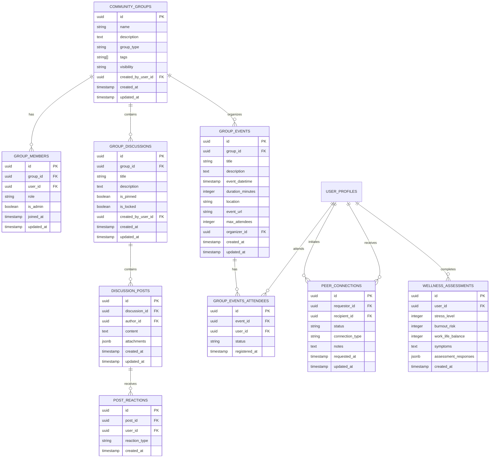

# THE WHEEL: DATA MODEL DOCUMENTATION

## Overview

This document details the comprehensive data model for The Wheel platform, including entity relationships, attribute definitions, and database schema specifications. The data model is designed to support all seven core pillars of the platform while ensuring scalability, security, and performance.

---

## Entity Relationship Diagrams

### Core Identity and Authentication Model


### Progress Tracking Model


### Knowledge Hub Model


### AI Cofounder Model


### Tech Hub Model


### Community Model



### Marketplace Model

```mermaid
erDiagram
    SERVICE_PROVIDERS ||--o{ PROVIDER_SERVICES : offers
    SERVICE_PROVIDERS ||--o{ PROVIDER_RATINGS : receives
    USER_PROFILES ||--o{ PROVIDER_RATINGS : gives
    USER_PROFILES ||--o{ SERVICE_REQUESTS : creates
    SERVICE_REQUESTS ||--o{ SERVICE_PROPOSALS : receives
    SERVICE_PROVIDERS ||--o{ SERVICE_PROPOSALS : submits
    SERVICE_PROPOSALS ||--||o ENGAGEMENTS : leads_to
    ENGAGEMENTS ||--o{ ENGAGEMENT_MILESTONES : has
    ENGAGEMENTS ||--o{ ENGAGEMENT_PAYMENTS : includes
    PLATFORM_PARTNERS ||--o{ PARTNER_OFFERS : provides
    USER_PROFILES ||--o{ PARTNER_ACTIVATIONS : uses
    
    SERVICE_PROVIDERS {
        uuid id PK
        uuid user_id FK
        string business_name
        text description
        string[] service_categories
        string logo_url
        jsonb contact_info
        boolean is_verified
        timestamp created_at
        timestamp updated_at
    }
    
    PROVIDER_SERVICES {
        uuid id PK
        uuid provider_id FK
        string name
        text description
        string category
        integer base_price
        string price_unit
        jsonb service_details
        timestamp created_at
        timestamp updated_at
    }
    
    PROVIDER_RATINGS {
        uuid id PK
        uuid provider_id FK
        uuid user_id FK
        integer rating
        text review
        string engagement_type
        timestamp created_at
        timestamp updated_at
    }
    
    SERVICE_REQUESTS {
        uuid id PK
        uuid user_id FK
        string title
        text description
        string[] service_categories
        integer budget_min
        integer budget_max
        timestamp deadline
        string status
        timestamp created_at
        timestamp updated_at
    }
    
    SERVICE_PROPOSALS {
        uuid id PK
        uuid request_id FK
        uuid provider_id FK
        integer price
        text proposal_content
        integer estimated_duration_days
        string status
        timestamp created_at
        timestamp updated_at
    }
    
    ENGAGEMENTS {
        uuid id PK
        uuid proposal_id FK
        uuid client_id FK
        uuid provider_id FK
        string title
        text description
        string status
        timestamp start_date
        timestamp end_date
        integer total_amount
        timestamp created_at
        timestamp updated_at
    }
    
    ENGAGEMENT_MILESTONES {
        uuid id PK
        uuid engagement_id FK
        string title
        text description
        integer percentage
        integer amount
        string status
        timestamp due_date
        timestamp completed_date
        timestamp created_at
        timestamp updated_at
    }
    
    ENGAGEMENT_PAYMENTS {
        uuid id PK
        uuid engagement_id FK
        uuid milestone_id FK
        integer amount
        string status
        string payment_processor_id
        timestamp paid_at
        timestamp created_at
        timestamp updated_at
    }
    
    PLATFORM_PARTNERS {
        uuid id PK
        string name
        text description
        string logo_url
        string partner_type
        jsonb integration_details
        boolean is_active
        timestamp created_at
        timestamp updated_at
    }
    
    PARTNER_OFFERS {
        uuid id PK
        uuid partner_id FK
        string name
        text description
        string benefit_summary
        string redemption_url
        string promo_code
        timestamp valid_from
        timestamp valid_until
        timestamp created_at
        timestamp updated_at
    }
    
    PARTNER_ACTIVATIONS {
        uuid id PK
        uuid user_id FK
        uuid offer_id FK
        string status
        timestamp activated_at
        jsonb activation_details
        timestamp created_at
        timestamp updated_at
    }
```

### Cross-System Models


---

## Data Dictionary

### Identity and Mode System

#### AUTH_USERS
| Column | Type | Description | Constraints |
|--------|------|-------------|-------------|
| id | UUID | Unique identifier | PK |
| email | STRING | User's email address | UNIQUE, NOT NULL |
| encrypted_password | STRING | Encrypted password hash | NOT NULL |
| created_at | TIMESTAMP | Creation timestamp | NOT NULL |
| last_sign_in | TIMESTAMP | Last sign in timestamp | |

#### USER_PROFILES
| Column | Type | Description | Constraints |
|--------|------|-------------|-------------|
| id | UUID | Unique identifier | PK |
| user_id | UUID | Reference to auth.users | FK, NOT NULL |
| name | STRING | User's full name | NOT NULL |
| bio | STRING | User's biography | |
| avatar_url | STRING | URL to avatar image | |
| contact_info | JSONB | Contact information | |
| default_mode | STRING | Default user mode | NOT NULL |
| onboarding_completed | BOOLEAN | Whether onboarding is complete | NOT NULL, DEFAULT false |
| created_at | TIMESTAMP | Creation timestamp | NOT NULL |
| updated_at | TIMESTAMP | Last update timestamp | NOT NULL |

#### USER_MODES
| Column | Type | Description | Constraints |
|--------|------|-------------|-------------|
| id | UUID | Unique identifier | PK |
| user_id | UUID | Reference to auth.users | FK, NOT NULL |
| mode | STRING | Mode identifier | NOT NULL |
| display_name | STRING | Custom display name | NOT NULL |
| icon | STRING | Mode icon | NOT NULL |
| primary_color | STRING | Primary color for UI | NOT NULL |
| is_active | BOOLEAN | Whether mode is currently active | DEFAULT false |
| created_at | TIMESTAMP | Creation timestamp | NOT NULL |
| updated_at | TIMESTAMP | Last update timestamp | NOT NULL |

#### MODE_PREFERENCES
| Column | Type | Description | Constraints |
|--------|------|-------------|-------------|
| id | UUID | Unique identifier | PK |
| user_mode_id | UUID | Reference to user_modes | FK, NOT NULL |
| preferences | JSONB | Mode-specific preferences | NOT NULL, DEFAULT '{}' |
| created_at | TIMESTAMP | Creation timestamp | NOT NULL |
| updated_at | TIMESTAMP | Last update timestamp | NOT NULL |

#### MODE_CONTEXT
| Column | Type | Description | Constraints |
|--------|------|-------------|-------------|
| id | UUID | Unique identifier | PK |
| user_mode_id | UUID | Reference to user_modes | FK, NOT NULL |
| recent_activity | JSONB | Recent activity in this mode | NOT NULL, DEFAULT '[]' |
| pinned_items | JSONB | Pinned items for this mode | NOT NULL, DEFAULT '[]' |
| last_viewed_entities | JSONB | Last viewed entities | NOT NULL, DEFAULT '[]' |
| created_at | TIMESTAMP | Creation timestamp | NOT NULL |
| updated_at | TIMESTAMP | Last update timestamp | NOT NULL |

#### COMPANIES
| Column | Type | Description | Constraints |
|--------|------|-------------|-------------|
| id | UUID | Unique identifier | PK |
| name | STRING | Company name | NOT NULL |
| logo_url | STRING | URL to logo image | |
| industry | STRING | Industry category | |
| stage | STRING | Company stage | |
| team_size | INTEGER | Team size | |
| founded_date | TIMESTAMP | Company founding date | |
| created_by_user_id | UUID | Reference to auth.users | FK, NOT NULL |
| created_at | TIMESTAMP | Creation timestamp | NOT NULL |
| updated_at | TIMESTAMP | Last update timestamp | NOT NULL |

#### COMPANY_MEMBERS
| Column | Type | Description | Constraints |
|--------|------|-------------|-------------|
| id | UUID | Unique identifier | PK |
| company_id | UUID | Reference to companies | FK, NOT NULL |
| user_id | UUID | Reference to auth.users | FK, NOT NULL |
| role | STRING | Member role | NOT NULL |
| permissions | JSONB | Specific permissions | DEFAULT '{}' |
| is_admin | BOOLEAN | Whether member is admin | DEFAULT false |
| joined_at | TIMESTAMP | Join timestamp | NOT NULL |
| updated_at | TIMESTAMP | Last update timestamp | NOT NULL |

### Progress Tracking System

#### DOMAIN_STAGES
| Column | Type | Description | Constraints |
|--------|------|-------------|-------------|
| id | UUID | Unique identifier | PK |
| domain | ENUM | Progress domain | NOT NULL |
| name | STRING | Stage name | NOT NULL |
| description | TEXT | Stage description | |
| order_index | INTEGER | Display order | NOT NULL |
| required_completion_percentage | INTEGER | Required % to advance | NOT NULL, DEFAULT 80 |
| created_at | TIMESTAMP | Creation timestamp | NOT NULL |
| updated_at | TIMESTAMP | Last update timestamp | NOT NULL |

#### MILESTONES
| Column | Type | Description | Constraints |
|--------|------|-------------|-------------|
| id | UUID | Unique identifier | PK |
| domain_stage_id | UUID | Reference to domain_stages | FK, NOT NULL |
| name | STRING | Milestone name | NOT NULL |
| description | TEXT | Milestone description | |
| is_completed | BOOLEAN | Completion status | DEFAULT false |
| completion_percentage | INTEGER | Completion percentage | DEFAULT 0 |
| estimated_time_hours | INTEGER | Estimated hours | |
| created_at | TIMESTAMP | Creation timestamp | NOT NULL |
| updated_at | TIMESTAMP | Last update timestamp | NOT NULL |

#### TASKS
| Column | Type | Description | Constraints |
|--------|------|-------------|-------------|
| id | UUID | Unique identifier | PK |
| milestone_id | UUID | Reference to milestones | FK, NOT NULL |
| user_id | UUID | Reference to auth.users | FK, NOT NULL |
| title | STRING | Task title | NOT NULL |
| description | TEXT | Task description | |
| priority | STRING | Priority level | DEFAULT 'medium' |
| is_completed | BOOLEAN | Completion status | DEFAULT false |
| due_date | TIMESTAMP | Due date | |
| assignee_id | UUID | Reference to auth.users | FK |
| is_ai_generated | BOOLEAN | Generated by AI | DEFAULT false |
| completed_at | TIMESTAMP | Completion timestamp | |
| created_at | TIMESTAMP | Creation timestamp | NOT NULL |
| updated_at | TIMESTAMP | Last update timestamp | NOT NULL |

### Knowledge Hub System

#### KNOWLEDGE_RESOURCES
| Column | Type | Description | Constraints |
|--------|------|-------------|-------------|
| id | UUID | Unique identifier | PK |
| title | STRING | Resource title | NOT NULL |
| description | TEXT | Resource description | |
| domain | ENUM | Knowledge domain | NOT NULL |
| type | ENUM | Resource type | NOT NULL |
| content_url | STRING | URL to content | |
| content | JSONB | Resource content | |
| tags | STRING[] | Resource tags | |
| stage_relevance | STRING[] | Relevant company stages | |
| is_premium | BOOLEAN | Whether premium content | DEFAULT false |
| author_id | UUID | Reference to auth.users | FK |
| is_verified | BOOLEAN | Whether verified | DEFAULT false |
| view_count | INTEGER | View counter | DEFAULT 0 |
| created_at | TIMESTAMP | Creation timestamp | NOT NULL |
| updated_at | TIMESTAMP | Last update timestamp | NOT NULL |

#### TEMPLATES
| Column | Type | Description | Constraints |
|--------|------|-------------|-------------|
| id | UUID | Unique identifier | PK |
| resource_id | UUID | Reference to knowledge_resources | FK, NOT NULL |
| template_schema | JSONB | Template form schema | NOT NULL |
| default_values | JSONB | Default field values | |
| version | STRING | Template version | |
| created_at | TIMESTAMP | Creation timestamp | NOT NULL |

### AI Cofounder System

#### STANDUPS
| Column | Type | Description | Constraints |
|--------|------|-------------|-------------|
| id | UUID | Unique identifier | PK |
| user_id | UUID | Reference to auth.users | FK, NOT NULL |
| standup_date | TIMESTAMP | Standup date | NOT NULL |
| is_completed | BOOLEAN | Completion status | DEFAULT false |
| status | STRING | Processing status | |
| created_at | TIMESTAMP | Creation timestamp | NOT NULL |
| updated_at | TIMESTAMP | Last update timestamp | NOT NULL |

#### STANDUP_ANSWERS
| Column | Type | Description | Constraints |
|--------|------|-------------|-------------|
| id | UUID | Unique identifier | PK |
| standup_id | UUID | Reference to standups | FK, NOT NULL |
| question_key | STRING | Question identifier | NOT NULL |
| answer_text | TEXT | Answer content | NOT NULL |
| created_at | TIMESTAMP | Creation timestamp | NOT NULL |

#### AI_CONVERSATIONS
| Column | Type | Description | Constraints |
|--------|------|-------------|-------------|
| id | UUID | Unique identifier | PK |
| user_id | UUID | Reference to auth.users | FK, NOT NULL |
| conversation_type | STRING | Type of conversation | NOT NULL |
| title | STRING | Conversation title | |
| created_at | TIMESTAMP | Creation timestamp | NOT NULL |
| updated_at | TIMESTAMP | Last update timestamp | NOT NULL |
| last_message_at | TIMESTAMP | Last message timestamp | NOT NULL |

#### CONVERSATION_MESSAGES
| Column | Type | Description | Constraints |
|--------|------|-------------|-------------|
| id | UUID | Unique identifier | PK |
| conversation_id | UUID | Reference to ai_conversations | FK, NOT NULL |
| role | STRING | Message sender role | NOT NULL |
| content | TEXT | Message content | NOT NULL |
| metadata | JSONB | Additional metadata | DEFAULT '{}' |
| created_at | TIMESTAMP | Creation timestamp | NOT NULL |

### System-Wide Components

#### SYSTEM_LOGS
| Column | Type | Description | Constraints |
|--------|------|-------------|-------------|
| id | UUID | Unique identifier | PK |
| user_id | UUID | Reference to auth.users | FK |
| log_type | STRING | Log category | NOT NULL |
| action | STRING | Action performed | NOT NULL |
| details | JSONB | Detailed log data | |
| metadata | JSONB | Additional metadata | DEFAULT '{}' |
| created_at | TIMESTAMP | Creation timestamp | NOT NULL |

#### NOTIFICATIONS
| Column | Type | Description | Constraints |
|--------|------|-------------|-------------|
| id | UUID | Unique identifier | PK |
| user_id | UUID | Reference to auth.users | FK, NOT NULL |
| notification_type | STRING | Type of notification | NOT NULL |
| title | STRING | Notification title | NOT NULL |
| content | TEXT | Notification content | NOT NULL |
| additional_data | JSONB | Additional data | DEFAULT '{}' |
| source_type | STRING | Source entity type | |
| source_id | UUID | Source entity ID | |
| is_read | BOOLEAN | Read status | DEFAULT false |
| read_at | TIMESTAMP | When read | |
| created_at | TIMESTAMP | Creation timestamp | NOT NULL |

#### FEATURE_FLAGS
| Column | Type | Description | Constraints |
|--------|------|-------------|-------------|
| id | UUID | Unique identifier | PK |
| flag_key | STRING | Feature flag key | NOT NULL, UNIQUE |
| is_enabled | BOOLEAN | Whether enabled by default | DEFAULT false |
| conditions | JSONB | Conditional activation rules | DEFAULT '{}' |
| description | TEXT | Flag description | |
| created_at | TIMESTAMP | Creation timestamp | NOT NULL |
| updated_at | TIMESTAMP | Last update timestamp | NOT NULL |

---

## Database Design Considerations

### Indexing Strategy

1. **Primary Keys**: All tables have UUID primary keys to ensure uniqueness across environments

2. **Foreign Keys**: All relationships are enforced with foreign key constraints with appropriate cascading rules

3. **Performance Indexes**:
   - Multi-column indexes on frequently queried combinations
   - Text search indexes on searchable content fields
   - Expression indexes for complex query patterns

4. **Query Patterns**:
   - Domain-specific indexes for specialized query patterns
   - Partial indexes for filtered queries
   - Covering indexes for high-volume read operations

### Security Design

1. **Row Level Security**:
   - All tables implement RLS policies
   - Mode-based access control for cross-role data
   - Company-scoped permissions for team data
