# THE WHEEL: DYNAMIC PROGRESS TRACKER

## Vision

Transform The Wheel from a static task management system into an intelligent, context-aware progress tracking platform that adapts to the nonlinear nature of startup journeys, tracking multiple concurrent paths across product, fundraising, team, legal, growth, and operations—intelligently surfacing relevant tasks, resources, and strategic suggestions based on real-time progress and milestones.

## Core Components

### Multi-Dimensional Progress Tracking Architecture

```mermaid
graph TD
    PT[Progress Tracker] --> PD[Progress Dimensions]
    PT --> MS[Milestone System]
    PT --> TS[Task System]
    PT --> RS[Recommendation System]
    
    PD --> ProdD[Product Dimension]
    PD --> FundD[Fundraising Dimension]
    PD --> TeamD[Team Dimension]
    PD --> LegalD[Legal Dimension]
    PD --> GrowthD[Growth Dimension]
    PD --> OpsD[Operations Dimension]
    
    MS --> MilestoneDef[Milestone Definition]
    MS --> MilestoneDep[Milestone Dependencies]
    MS --> MilestoneState[Milestone State Management]
    MS --> MilestoneCtx[Contextual Relevance]
    
    TS --> TaskGen[Task Generation]
    TS --> TaskPri[Task Prioritization]
    TS --> TaskDep[Task Dependencies]
    TS --> TaskAuto[Task Automation]
    
    RS --> ResTrigger[Trigger System]
    RS --> ResContext[Context Management]
    RS --> ResContent[Content Selection]
    RS --> ResFeedback[Feedback Loop]
```



### Progress Dimensions

1. **Product Dimension**
   * **Ideation Stage**
     - Problem definition tracking
     - Solution exploration progress
     - MVP requirements gathering
     - User persona development
     - Initial validation activities

   * **MVP Development Stage**
     - Feature prioritization tracking
     - Technical architecture progress
     - Development milestone tracking
     - Quality assurance activities
     - User feedback integration

   * **Scale & Growth Stage**
     - Feature expansion tracking
     - Performance optimization progress
     - Technical debt management
     - Scalability improvements
     - Integration expansion tracking

2. **Fundraising Dimension**
   * **Pre-Seed Activities**
     - Pitch deck development
     - Angel investor outreach
     - Financial model creation
     - Friends & family round management
     - Accelerator/incubator applications

   * **Seed Round Activities**
     - Investor target list development
     - Meeting tracking and outcomes
     - Due diligence management
     - Term sheet negotiation
     - Post-investment relationship building

   * **Series A Preparation**
     - Growth metric tracking
     - Data room preparation
     - Advanced financial modeling
     - Strategic investor targeting
     - Follow-on investment discussions

3. **Team Dimension**
   * **Founding Team**
     - Founder agreement tracking
     - Equity allocation progress
     - Role & responsibility definition
     - Team communication systems
     - Founding team skills gap analysis

   * **Early Hiring**
     - Hiring pipeline management
     - Interview process development
     - Onboarding system creation
     - Contractor relationship management
     - Culture development activities

   * **Organization Building**
     - Department structure planning
     - Management layer development
     - Performance review implementation
     - HR policy establishment
     - Remote/hybrid work infrastructure

4. **Legal Dimension**
   * **Entity Formation**
     - Entity type selection progress
     - Incorporation document tracking
     - Initial compliance checklist
     - Banking setup progress
     - Founder IP assignment tracking

   * **IP Protection**
     - Trademark application progress
     - Patent strategy development
     - Copyright registration tracking
     - Open source compliance management
     - IP audit completion

   * **Contracts & Agreements**
     - Customer contract development
     - Vendor agreement management
     - Employment contract creation
     - NDA tracking and management
     - Terms of service development

5. **Growth Dimension**
   * **Early Traction**
     - Early adopter acquisition tracking
     - Initial marketing activities
     - Product usage analysis setup
     - Feedback collection mechanisms
     - Conversion funnel development

   * **Marketing & Sales Development**
     - Marketing channel effectiveness
     - Content strategy implementation
     - Sales process development
     - CRM implementation and usage
     - Customer segment expansion

   * **Scale Operations**
     - Growth team building
     - Automated marketing systems
     - Customer acquisition cost tracking
     - Retention and engagement metrics
     - Referral system development

6. **Operations Dimension**
   * **Basic Infrastructure**
     - Tool stack implementation
     - Process documentation progress
     - Financial tracking setup
     - Communication systems establishment
     - Decision-making framework development

   * **Financial Operations**
     - Bookkeeping system development
     - Expense management implementation
     - Revenue recognition process
     - Cash flow monitoring setup
     - Budget creation and tracking

   * **Advanced Operations**
     - Operational efficiency metrics
     - Process automation progress
     - Compliance system development
     - Risk management framework
     - Data security implementation

### Milestone System

1. **Milestone Definition Framework**
   * Dimension-specific milestone templates
   * Custom milestone creation
   * Milestone completion criteria
   * Flexibility for startup-specific adaptations
   * Industry-specific milestone variations

2. **Milestone Dependencies Management**
   * Cross-dimensional dependencies
   * Prerequisite milestone tracking
   * Blocking relationship visualization
   * Parallel progress path mapping
   * Critical path identification

3. **Milestone State Management**
   * Progress percentage tracking
   * Evidence collection for completion
   * Revision and adjustment capabilities
   * State change notifications
   * Historical state tracking

4. **Contextual Relevance Engine**
   * Company stage relevance scoring
   * Business model relevance filtering
   * Industry-specific prioritization
   * Founder background adaptation
   * Goal alignment assessment

### Task System

1. **Intelligent Task Generation**
   * Milestone-driven tasks
   * AI-suggested task creation
   * Task template library
   * Industry-specific task recommendations
   * Gap analysis-based suggestions

2. **Dynamic Task Prioritization**
   * Multi-factor prioritization algorithm
   * Deadline sensitivity adjustment
   * Resource availability integration
   * Impact assessment weighting
   * Team capacity awareness

3. **Task Dependency Network**
   * Task sequencing visualization
   * Blocker and dependency management
   * Critical path highlighting
   * Parallel task identification
   * Resource allocation optimization

4. **Task Automation Framework**
   * Integration with external tools
   * Automated task creation triggers
   * Completion verification automation
   * Recurring task management
   * Template-based task generation

### Recommendation System

1. **Contextual Trigger Mechanism**
   * Progress-based triggers
   * Timeline-based triggers
   * Problem detection triggers
   * Opportunity identification triggers
   * External event response triggers

2. **Context-Aware Content Selection**
   * Resource relevance scoring
   * Content freshness assessment
   * Startup stage appropriateness
   * Previous engagement analysis
   * Knowledge gap identification

3. **Recommendation Categories**
   * Knowledge resource recommendations
   * Expert connection suggestions
   * Tool and service recommendations
   * Strategy adjustment proposals
   * Learning opportunity identification

4. **Feedback and Learning Loop**
   * Recommendation effectiveness tracking
   * User engagement measurement
   * Explicit feedback collection
   * A/B testing for recommendation approaches
   * Continuous algorithm improvement

## Technical Implementation

### Progress Tracker Core

```typescript
// Progress Dimension Interface
interface ProgressDimension {
  id: string;
  name: string;
  description: string;
  stages: Stage[];
  
  // Core methods
  getCurrentStage(): Stage;
  getCompletionPercentage(): number;
  getActiveMilestones(): Milestone[];
  getPendingMilestones(): Milestone[];
  getCompletedMilestones(): Milestone[];
}

// Stage Definition
interface Stage {
  id: string;
  name: string;
  description: string;
  milestones: Milestone[];
  completionCriteria: CompletionCriteria;
  
  // Stage methods
  isActive(): boolean;
  isCompleted(): boolean;
  getNextMilestones(): Milestone[];
  getCompletionPercentage(): number;
}

// Milestone System
interface Milestone {
  id: string;
  name: string;
  description: string;
  completionCriteria: CompletionCriteria[];
  dependencies: MilestoneDependency[];
  state: MilestoneState;
  relevanceScore: number;
  tasks: Task[];
  
  // Milestone methods
  updateState(newState: MilestoneState): void;
  addEvidence(evidence: MilestoneEvidence): void;
  calculateRelevance(companyContext: CompanyContext): number;
  generateTasks(): Task[];
}

// Task System
interface Task {
  id: string;
  title: string;
  description: string;
  state: TaskState;
  priority: number;
  dueDate?: Date;
  assignee?: User;
  dependencies: TaskDependency[];
  estimatedEffort: EffortEstimate;
  
  // Task methods
  updateState(newState: TaskState): void;
  calculatePriority(context: TaskContext): number;
  isBlocked(): boolean;
  getBlockers(): Task[];
}
```

### Recommendation Engine

```typescript
// Recommendation Engine
class RecommendationEngine {
  // Trigger management
  registerTrigger(trigger: RecommendationTrigger): void;
  evaluateTriggers(context: CompanyContext): RecommendationTrigger[];
  
  // Recommendation generation
  generateRecommendations(
    context: CompanyContext, 
    triggers: RecommendationTrigger[]
  ): Recommendation[];
  
  // Feedback handling
  recordRecommendationEngagement(
    recommendationId: string, 
    engagementType: EngagementType
  ): void;
  recordExplicitFeedback(
    recommendationId: string, 
    feedback: RecommendationFeedback
  ): void;
  
  // Learning system
  updateRecommendationModels(): Promise<void>;
  runRecommendationExperiments(): Promise<ExperimentResults>;
}

// Context-Aware Content Selector
class ContextAwareContentSelector {
  // Content selection
  selectKnowledgeResources(
    context: CompanyContext, 
    trigger: RecommendationTrigger
  ): KnowledgeResource[];
  
  selectExpertConnections(
    context: CompanyContext, 
    trigger: RecommendationTrigger
  ): ExpertConnection[];
  
  selectToolsAndServices(
    context: CompanyContext, 
    trigger: RecommendationTrigger
  ): ToolOrServiceRecommendation[];
  
  selectStrategyAdjustments(
    context: CompanyContext, 
    trigger: RecommendationTrigger
  ): StrategyAdjustment[];
  
  // Relevance scoring
  scoreResourceRelevance(
    resource: RecommendableResource, 
    context: CompanyContext
  ): number;
  
  // Content filtering
  filterByStageAppropriateness(
    resources: RecommendableResource[], 
    stage: CompanyStage
  ): RecommendableResource[];
  
  filterByPreviousEngagement(
    resources: RecommendableResource[], 
    engagementHistory: EngagementHistory
  ): RecommendableResource[];
}
```

### Progress Analytics System

```typescript
// Progress Analytics Service
class ProgressAnalyticsService {
  // Trend analysis
  analyzeProgressTrend(
    dimensionId: string, 
    timeRange: TimeRange
  ): ProgressTrendAnalysis;
  
  identifyBottlenecks(): BottleneckAnalysis[];
  
  detectAnomalies(): AnomalyDetection[];
  
  // Comparative analysis
  compareToSimilarCompanies(
    dimensions?: string[]
  ): ComparisonAnalysis;
  
  compareToProjectedTimeline(
    dimensions?: string[]
  ): TimelineComparisonAnalysis;
  
  // Forecasting
  forecastCompletion(
    milestoneId: string
  ): CompletionForecast;
  
  predictUpcomingChallenges(): ChallengePreduction[];
  
  // Visualization data prep
  generateDimensionDashboardData(
    dimensionId: string
  ): DashboardData;
  
  generateCompanyProgressSnapshot(): ProgressSnapshot;
  
  generateMilestoneNetworkVisualization(): NetworkVisualizationData;
}
```

### User Interface Components

```typescript
// Progress Dashboard View
class ProgressDashboardView extends Component {
  constructor(
    private progressService: ProgressService,
    private analyticsService: ProgressAnalyticsService
  ) {
    super();
  }
  
  render() {
    // Render multi-dimensional progress overview
    // Implementation details...
  }
  
  handleDimensionSelect(dimensionId: string) {
    // Update view to show selected dimension details
    // Implementation details...
  }
  
  handleTimeRangeChange(timeRange: TimeRange) {
    // Update analytics with new time range
    // Implementation details...
  }
}

// Milestone Navigator
class MilestoneNavigatorView extends Component {
  constructor(
    private milestoneService: MilestoneService,
    private onMilestoneSelect: (milestoneId: string) => void
  ) {
    super();
  }
  
  render() {
    // Render interactive milestone navigation interface
    // Implementation details...
  }
  
  handleStageChange(stageId: string) {
    // Update milestone list for selected stage
    // Implementation details...
  }
  
  handleMilestoneSelect(milestoneId: string) {
    // Notify parent component of milestone selection
    this.onMilestoneSelect(milestoneId);
  }
  
  handleFilterChange(filters: MilestoneFilter[]) {
    // Apply filters to milestone list
    // Implementation details...
  }
}

// Task Management Board
class TaskManagementBoardView extends Component {
  constructor(
    private taskService: TaskService,
    private userService: UserService
  ) {
    super();
  }
  
  render() {
    // Render kanban-style task management board
    // Implementation details...
  }
  
  handleTaskStateChange(taskId: string, newState: TaskState) {
    // Update task state and refresh view
    // Implementation details...
  }
  
  handleTaskAssign(taskId: string, userId: string) {
    // Assign task to user and update
    // Implementation details...
  }
  
  handlePriorityChange(taskId: string, newPriority: number) {
    // Update task priority
    // Implementation details...
  }
}

// Recommendation Feed
class RecommendationFeedView extends Component {
  constructor(
    private recommendationService: RecommendationService,
    private userPreferences: UserPreferences
  ) {
    super();
  }
  
  render() {
    // Render personalized recommendation feed
    // Implementation details...
  }
  
  handleRecommendationAction(
    recommendationId: string, 
    action: RecommendationAction
  ) {
    // Process user action on recommendation
    // Implementation details...
  }
  
  handleFeedbackSubmit(
    recommendationId: string, 
    feedback: RecommendationFeedback
  ) {
    // Submit user feedback and update recommendation system
    // Implementation details...
  }
  
  handleSettingsChange(newSettings: RecommendationSettings) {
    // Update user recommendation preferences
    // Implementation details...
  }
}
```

## Implementation Roadmap

### Phase 1: Foundation (Months 1-3)
- Build core progress dimension framework
- Implement basic milestone tracking system
- Develop fundamental task management capabilities
- Create progress visualization dashboard
- Build company context management system

### Phase 2: Intelligence Layer (Months 4-6)
- Implement milestone dependency tracking
- Develop smart task generation system
- Build recommendation trigger framework
- Create initial content selection algorithms
- Develop feedback collection mechanisms

### Phase 3: Analytics & Insights (Months 7-9)
- Implement comparative analytics features
- Build progress forecasting capabilities
- Develop bottleneck detection systems
- Create anomaly detection algorithms
- Build strategy recommendation engine

### Phase 4: Advanced Features (Months 10-12)
- Implement AI-driven task optimization
- Build advanced visualization capabilities
- Develop milestone network analysis
- Create cross-dimension impact assessment
- Implement adaptive learning mechanisms

## User Experience Flow

1. **Onboarding & Setup**
   * User selects relevant progress dimensions
   * Platform suggests appropriate milestones based on company stage
   * User customizes milestones and dependencies
   * Initial progress assessment establishes baseline

2. **Daily Engagement**
   * User views personalized dashboard highlighting priority areas
   * Task management interface shows prioritized activities
   * Recommendation feed provides contextual suggestions
   * Quick progress updates can be submitted

3. **Weekly Review**
   * Comprehensive progress review across all dimensions
   * Bottleneck and challenge identification
   * Strategic recommendations based on progress patterns
   * Team alignment on upcoming priorities

4. **Monthly Planning**
   * Progress trend analysis and forecasting
   * Milestone adjustment and reprioritization
   * Resource allocation optimization
   * Strategic direction adjustments

5. **Quarterly Strategy**
   *
