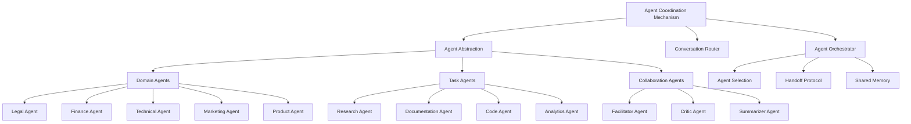
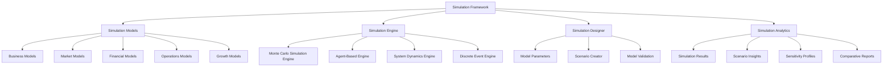

# THE WHEEL: FUTURE FEATURES BLUEPRINT

## Overview

This document presents a detailed blueprint for advanced feature sets that will position The Wheel as a forward-looking platform with unique capabilities beyond current startup support tools. These features are designed to leverage emerging technologies while maintaining integration with the core platform architecture.

---

## 1. AI Agent Ecosystem

### Vision
Transform The Wheel from a platform with a single AI Cofounder into a dynamic ecosystem of specialized AI agents that collaborate, providing domain-specific expertise across the entire startup journey.

### Core Components

#### Agent Framework Architecture



#### Agent Types

1. **Domain Agents**
   * **Legal Agent**
     - Entity formation guidance
     - Contract review and generation
     - IP protection strategies
     - Regulatory compliance assessment
     - Terms of service and privacy policy creation

   * **Finance Agent**
     - Financial modeling and forecasting
     - Cap table management
     - Funding strategy recommendations
     - Expense optimization
     - Investor pitch deck review
     - Valuation scenarios

   * **Technical Agent**
     - Architecture design guidance
     - Technology stack recommendations
     - Technical debt assessment
     - Scaling strategy
     - Infrastructure optimization
     - Security review

   * **Marketing Agent**
     - Market analysis
     - Customer persona development
     - Marketing campaign design
     - Content strategy
     - SEO and growth optimization
     - Brand positioning

   * **Product Agent**
     - Product roadmap development
     - Feature prioritization
     - User experience optimization
     - Product market fit analysis
     - Prototype feedback
     - User story refinement

2. **Task Agents**
   * **Research Agent**
     - Market research automation
     - Competitive analysis
     - Industry trend identification
     - Academic paper summarization
     - Data visualization

   * **Documentation Agent**
     - Technical documentation
     - Process documentation
     - Knowledge base creation
     - Style consistency enforcement
     - API documentation

   * **Code Agent**
     - Code generation 
     - Code review
     - Refactoring suggestions
     - Testing strategy
     - Architecture patterns

   * **Analytics Agent**
     - Data analysis
     - KPI tracking
     - Insight generation
     - Anomaly detection
     - Report creation

3. **Collaboration Agents**
   * **Facilitator Agent**
     - Meeting coordination
     - Discussion moderation
     - Action item tracking
     - Decision documentation
     - Conflict resolution

   * **Critic Agent**
     - Devil's advocate perspectives
     - Risk identification
     - Assumption challenging
     - Logical fallacy detection
     - Alternative viewpoint presentation

   * **Summarizer Agent**
     - Meeting summarization
     - Document distillation
     - Key takeaway extraction
     - Progress reporting
     - Knowledge consolidation

#### Agent Coordination Mechanism

1. **Agent Selection and Routing**
   * Natural language intent classification
   * Domain detection
   * Task complexity assessment
   * User preference modeling
   * Expert agent identification

2. **Multi-Agent Conversation System**
   * Dynamic conversation graphs
   * Turn-taking protocols
   * Interruption handling
   * Context preservation
   * Topic transition management

3. **Shared Memory and Knowledge Base**
   * Cross-agent memory access
   * Semantic knowledge representation
   * Temporal context tracking
   * Information relevance scoring
   * Priority-based recall

4. **Meta-Agent (Orchestrator)**
   * Agent selection optimization
   * Team composition for complex tasks
   * Workflow management
   * Resource allocation
   * Performance monitoring

#### Agent Marketplace

1. **Third-Party Agent Integration**
   * Agent API standards
   * Authentication and authorization
   * Rate limiting and quotas
   * Billing and revenue sharing
   * Agent discovery protocol

2. **Agent Development Kit (ADK)**
   * Agent template library
   * Testing and validation suite
   * Performance benchmarking
   * Conversation simulation
   * Integration testing tools

3. **Certification Program**
   * Agent quality metrics
   * Security assessment
   * Performance evaluation
   * Ethical review
   * Version compatibility validation

4. **Agent Analytics Dashboard**
   * Usage statistics
   * Performance metrics
   * User satisfaction scores
   * Error rate tracking
   * Improvement suggestions

### Technical Implementation

#### Agent Architecture

```typescript
// Agent Interface Definition
interface Agent {
  id: string;
  name: string;
  description: string;
  capabilities: Capability[];
  domain: Domain;
  skillLevel: number;  // 0-100
  
  // Core methods
  processMessage(message: Message, context: ConversationContext): Promise<AgentResponse>;
  evaluateRelevance(query: string, context: ConversationContext): Promise<number>; // 0-1
  getKnowledgeCutoff(): Date;
  getSupportedModels(): ModelCapability[];
}

// Agent Registry Service
class AgentRegistry {
  registerAgent(agent: Agent): Promise<void>;
  findAgentsByDomain(domain: Domain): Promise<Agent[]>;
  findAgentsByCapability(capability: Capability): Promise<Agent[]>;
  findOptimalAgentForTask(task: Task, context: ConversationContext): Promise<Agent>;
  getAgentById(id: string): Promise<Agent>;
}

// Agent Orchestrator
class AgentOrchestrator {
  private agents: Map<string, Agent>;
  private conversationService: ConversationService;
  private memoryService: SharedMemoryService;
  
  constructor(
    private agentRegistry: AgentRegistry,
    private routingStrategies: RoutingStrategy[]
  ) {}
  
  async routeQuery(query: Query, context: ConversationContext): Promise<Agent> {
    // Apply routing strategies to find the best agent
    // Return the selected agent
  }
  
  async createAgentTeam(task: ComplexTask): Promise<AgentTeam> {
    // Analyze task and form a team of complementary agents
    // Build team structure with roles
    // Set up communication channels
    // Return configured team
  }
  
  async handleAgentHandoff(
    fromAgent: Agent, 
    toAgent: Agent, 
    context: ConversationContext
  ): Promise<HandoffResult> {
    // Manage context transition between agents
    // Ensure smooth conversation handover
    // Update conversation history and memory
  }
}
```

#### Memory and Context Management

```typescript
// Core Memory Service
class SharedMemoryService {
  // Document memory
  storeDocumentReference(documentId: string, metadata: DocumentMetadata): Promise<void>;
  retrieveRelevantDocuments(query: string, limit: number): Promise<Document[]>;
  
  // Conversation memory
  storeConversationMemory(memory: ConversationMemory): Promise<void>;
  retrieveRelevantMemories(context: ConversationContext, limit: number): Promise<ConversationMemory[]>;
  
  // Entity memory
  storeEntityReference(entity: Entity, context: EntityContext): Promise<void>;
  retrieveEntitiesByType(entityType: EntityType, limit: number): Promise<Entity[]>;
  retrieveRelevantEntities(query: string, limit: number): Promise<Entity[]>;
  
  // Cross-reference capabilities
  findRelatedEntities(entityId: string, depth: number): Promise<EntityRelationship[]>;
  buildKnowledgeGraph(entities: Entity[]): Promise<KnowledgeGraph>;
}

// Context Management
class ConversationContextManager {
  createContext(): ConversationContext;
  updateContext(context: ConversationContext, update: ContextUpdate): ConversationContext;
  mergeContexts(contextA: ConversationContext, contextB: ConversationContext): ConversationContext;
  getActiveEntities(context: ConversationContext): Entity[];
  getRecentMessages(context: ConversationContext, count: number): Message[];
}
```

### Implementation Roadmap

#### Phase 1: Core Framework (Months 1-3)
- Implement agent abstraction layer
- Build basic routing system
- Develop AI Cofounder 2.0 with modular capabilities
- Create shared memory architecture
- Build conversation context management

#### Phase 2: Specialized Agents (Months 4-6)
- Develop Legal, Finance, and Technical agents
- Implement domain-specific knowledge bases
- Build agent-specific UI components
- Create agent coordination mechanisms
- Implement basic multi-agent dialogues

#### Phase 3: Agent Marketplace (Months 7-9)
- Design marketplace infrastructure
- Build agent developer tools
- Implement agent certification system
- Create third-party integration APIs
- Develop billing and monetization systems

#### Phase 4: Advanced Collaboration (Months 10-12)
- Implement agent teams capability
- Build cross-agent learning mechanisms
- Develop agent performance analytics
- Create agent improvement pipelines
- Build advanced agent selection algorithms

---

## 5. Advanced Simulation & Forecasting

### Vision

Transform The Wheel from a tracking and guidance platform into a powerful predictive engine that leverages simulation, forecasting, and modeling to help founders make data-driven decisions, anticipate market changes, and visualize multiple future scenarios for their startup.

### Core Components

#### Simulation Framework Architecture



#### Simulation Model Types

1. **Business Models**
   * **Revenue Forecasting**
     - Subscription growth simulation
     - Pricing strategy optimization
     - Revenue mix modeling
     - Seasonality effects
     - Churn impact analysis

   * **Growth Modeling**
     - Customer acquisition simulation
     - Viral coefficient modeling
     - CAC recovery simulation
     - Growth channels attribution
     - Retention curve simulation

   * **Market Adoption**
     - Technology adoption curves
     - Market penetration modeling
     - Competitor response simulation
     - Product-market fit prediction
     - Feature impact analysis

2. **Financial Models**
   * **Cash Flow Simulation**
     - Runway analysis
     - Burn rate scenarios
     - Revenue timing effects
     - Expense fluctuation impacts
     - Working capital requirements

   * **Funding Strategy**
     - Funding round timing optimization
     - Valuation scenario planning
     - Dilution impact simulation
     - Investor negotiation scenario testing
     - Exit value distribution modeling

   * **Unit Economics**
     - LTV optimization modeling
     - Cost structure simulation
     - Margin sensitivity analysis
     - Pricing strategy modeling
     - Operational efficiency simulation

3. **Market Models**
   * **Competitive Landscape**
     - Market share evolution
     - Competitive response simulation
     - Pricing pressure models
     - Feature advantage analysis
     - Marketing effectiveness simulation

   * **Customer Behavior**
     - Segmentation evolution
     - Preference shifting
     - Decision-making simulation
     - Conversion funnel optimization
     - Behavioral economics effects

   * **Market Conditions**
     - Economic cycle impacts
     - Regulatory change effects
     - Industry disruption scenarios
     - Supply chain simulation
     - Market saturation modeling

#### Simulation Techniques

1. **Monte Carlo Methods**
   * Probabilistic outcome distribution
   * Risk quantification
   * Uncertainty modeling
   * Statistical confidence ranges
   * Extreme scenario identification

2. **Agent-Based Modeling**
   * Customer behavior simulation
   * Market participant interactions
   * Emergent pattern identification
   * Network effect modeling
   * Complex system dynamics

3. **System Dynamics**
   * Feedback loop modeling
   * Time-delay effects
   * Resource accumulation and depletion
   * Non-linear relationship modeling
   * System stability analysis

4. **Scenario Planning**
   * Alternative future visualization
   * Decision point identification
   * Contingency planning
   * Opportunity quantification
   * Strategic option valuation

### Technical Implementation

#### Simulation Engine Architecture

```typescript
// Core Simulation Manager
class SimulationManager {
  // Model management
  registerModel(model: SimulationModel): void;
  getAvailableModels(): SimulationModelInfo[];
  createModelInstance(modelId: string, parameters: ModelParameters): SimulationModelInstance;
  
  // Simulation execution
  runSimulation(modelInstance: SimulationModelInstance, options: SimulationOptions): Promise<SimulationRun>;
  runBatchSimulations(configurations: BatchConfiguration): Promise<BatchResults>;
  cancelSimulation(runId: string): void;
  
  // Results management
  getSimulationResults(runId: string): SimulationResults;
  compareResults(runIds: string[]): ComparisonResults;
  exportResults(runId: string, format: ExportFormat): Promise<ExportedData>;
}

// Simulation Model Interface
interface SimulationModel {
  id: string;
  name: string;
  description: string;
  category: ModelCategory;
  parameterDefinitions: ParameterDefinition[];
  outputDefinitions: OutputDefinition[];
  
  initialize(parameters: ModelParameters): void;
  step(currentState: SimulationState): SimulationState;
  validateParameters(parameters: ModelParameters): ValidationResult;
  getDefaultParameters(): ModelParameters;
}

// Monte Carlo Engine
class MonteCarloEngine {
  // Configuration
  setIterations(count: number): void;
  setRandomSeed(seed: number | null): void;
  registerDistributions(distributions: ProbabilityDistribution[]): void;
  
  // Execution
  runSimulation(model: SimulationModel, parameters: ModelParameters): Promise<MonteCarloResults>;
  generateSensitivityAnalysis(model: SimulationModel, targetParam: string, range: Range): Promise<SensitivityAnalysis>;
  
  // Analysis
  calculateConfidenceIntervals(results: MonteCarloResults, confidence: number): ConfidenceIntervals;
  findCriticalValues(results: MonteCarloResults, threshold: number): CriticalValues;
  generateDistributionChart(results: MonteCarloResults, output: string): ChartData;
}

// Scenario Manager
class ScenarioManager {
  // Scenario creation
  createScenario(name: string, description: string): Scenario;
  defineScenarioParameters(scenarioId: string, parameters: ModelParameters): void;
  cloneScenario(sourceId: string, newName: string): Scenario;
  
  // Scenario management
  getScenarios(): Scenario[];
  getScenarioById(id: string): Scenario;
  compareScenarios(scenarioIds: string[], outputKeys: string[]): ScenarioComparison;
  
  // Scenario organization
  createScenarioGroup(name: string): ScenarioGroup;
  addScenarioToGroup(scenarioId: string, groupId: string): void;
  getScenarioGroups(): ScenarioGroup[];
}

// Visualization Service
class SimulationVisualizationService {
  // Chart generation
  generateTimeSeriesChart(results: SimulationResults, outputKeys: string[]): TimeSeriesChart;
  generateDistributionChart(results: MonteCarloResults, outputKey: string): DistributionChart;
  generateSensitivityChart(analysis: SensitivityAnalysis): SensitivityChart;
  generateScatterPlot(results: SimulationResults, xKey: string, yKey: string): ScatterPlot;
  
  // Interactive visualization
  createInteractiveSimulation(modelId: string, parameterControls: ParameterControl[]): InteractiveSimulation;
  createDecisionTree(decisionPoints: DecisionPoint[]): DecisionTreeVisualization;
  createParameterExplorer(model: SimulationModel, parameterRanges: ParameterRange[]): ParameterExplorer;
  
  // Export options
  exportChartAsImage(chart: Chart, format: ImageFormat): Promise<Blob>;
  exportVisualizationAsInteractive(visualization: Visualization): Promise<InteractiveExport>;
  generateReport(visualizations: Visualization[], template: ReportTemplate): Promise<Report>;
}
```

#### Distribution and Probability Models

```typescript
// Probability Distribution Types
interface ProbabilityDistribution {
  type: DistributionType;
  sample(): number;
  pdf(x: number): number; // Probability density function
  cdf(x: number): number; // Cumulative distribution function
  getParameters(): DistributionParameters;
}

// Normal Distribution
class NormalDistribution implements ProbabilityDistribution {
  constructor(private mean: number, private stdDev: number) {}
  
  type = DistributionType.Normal;
  
  sample(): number {
    // Box-Muller transform to generate normally distributed random numbers
    // Implementation details...
  }
  
  pdf(x: number): number {
    // Calculate normal probability density function
    // Implementation details...
  }
  
  cdf(x: number): number {
    // Calculate normal cumulative distribution function
    // Implementation details...
  }
  
  getParameters(): DistributionParameters {
    return { mean: this.mean, stdDev: this.stdDev };
  }
}

// Triangle Distribution
class TriangleDistribution implements ProbabilityDistribution {
  constructor(private min: number, private mode: number, private max: number) {}
  
  type = DistributionType.Triangle;
  
  sample(): number {
    // Generate sample from triangle distribution
    // Implementation details...
  }
  
  pdf(x: number): number {
    // Calculate triangle probability density function
    // Implementation details...
  }
  
  cdf(x: number): number {
    // Calculate triangle cumulative distribution function
    // Implementation details...
  }
  
  getParameters(): DistributionParameters {
    return { min: this.min, mode: this.mode, max: this.max };
  }
}

// PERT Distribution (often used in project management)
class PERTDistribution implements ProbabilityDistribution {
  constructor(private min: number, private mode: number, private max: number) {}
  
  type = DistributionType.PERT;
  
  sample(): number {
    // Generate sample from PERT distribution
    // Implementation details...
  }
  
  pdf(x: number): number {
    // Calculate PERT probability density function
    // Implementation details...
  }
  
  cdf(x: number): number {
    // Calculate PERT cumulative distribution function
    // Implementation details...
  }
  
  getParameters(): DistributionParameters {
    return { min: this.min, mode: this.mode, max: this.max };
  }
}
```

#### Model Factory System

```typescript
// Model Factory Registry
class ModelFactoryRegistry {
  private factories: Map<string, ModelFactory> = new Map();
  
  registerFactory(category: ModelCategory, factory: ModelFactory): void {
    this.factories.set(category, factory);
  }
  
  getFactory(category: ModelCategory): ModelFactory {
    return this.factories.get(category);
  }
  
  getSupportedCategories(): ModelCategory[] {
    return Array.from(this.factories.keys());
  }
}

// Business Model Factory
class BusinessModelFactory implements ModelFactory {
  createRevenueModel(options: RevenueModelOptions): SimulationModel {
    // Create subscription growth, pricing optimization, revenue mix, etc.
    // Implementation details...
  }
  
  createGrowthModel(options: GrowthModelOptions): SimulationModel {
    // Create customer acquisition, viral growth, retention, etc.
    // Implementation details...
  }
  
  createAdoptionModel(options: AdoptionModelOptions): SimulationModel {
    // Create technology adoption, market penetration, etc.
    // Implementation details...
  }
  
  getAvailableModels(): ModelDescription[] {
    return [
      { id: 'subscription-growth', name: 'Subscription Growth Model', category: 'business' },
      { id: 'customer-acquisition', name: 'Customer Acquisition Model', category: 'business' },
      // ... more model descriptions
    ];
  }
}

// Financial Model Factory
class FinancialModelFactory implements ModelFactory {
  createCashFlowModel(options: CashFlowModelOptions): SimulationModel {
    // Create runway analysis, burn rate scenarios, etc.
    // Implementation details...
  }
  
  createFundingModel(options: FundingModelOptions): SimulationModel {
    // Create funding round timing, valuation scenarios, etc.
    // Implementation details...
  }
  
  createUnitEconomicsModel(options: UnitEconomicsOptions): SimulationModel {
    // Create LTV optimization, cost structure, margin analysis, etc.
    // Implementation details...
  }
  
  getAvailableModels(): ModelDescription[] {
    return [
      { id: 'runway-analysis', name: 'Runway Analysis Model', category: 'financial' },
      { id: 'funding-strategy', name: 'Funding Strategy Model', category: 'financial' },
      // ... more model descriptions
    ];
  }
}
```

#### User Interface Components

```typescript
// Model Selection Widget
class ModelSelectionWidget extends Component {
  constructor(
    private modelRegistry: ModelFactoryRegistry,
    private onModelSelect: (modelId: string) => void
  ) {
    super();
  }
  
  render() {
    // Render categorized model selection interface
    // Implementation details...
  }
  
  handleCategoryChange(category: ModelCategory) {
    // Update available models based on selected category
    // Implementation details...
  }
  
  handleModelSelect(modelId: string) {
    // Notify parent component of selection
    this.onModelSelect(modelId);
  }
}

// Parameter Configuration Panel
class ParameterConfigurationPanel extends Component {
  constructor(
    private model: SimulationModel,
    private onParametersChanged: (parameters: ModelParameters) => void
  ) {
    super();
  }
  
  render() {
    // Render input controls for each parameter
    // Implementation details...
  }
  
  handleParameterChange(paramName: string, value: any) {
    // Update parameters and validate
    // Implementation details...
  }
  
  handleDistributionTypeChange(paramName: string, distType: DistributionType) {
    // Update parameter to use probabilistic input
    // Implementation details...
  }
  
  handleSave() {
    // Validate all parameters and notify parent
    // Implementation details...
  }
}

// Simulation Results Dashboard
class SimulationResultsDashboard extends Component {
  constructor(private results: SimulationResults) {
    super();
  }
  
  render() {
    // Render visualization dashboard with multiple views
    // Implementation details...
  }
  
  handleTabChange(tabName: string) {
    // Switch between different result views
    // Implementation details...
  }
  
  handleExport(format: ExportFormat) {
    // Export results in selected format
    // Implementation details...
  }
  
  handleSaveScenario() {
    // Save current results as named scenario
    // Implementation details...
  }
}
```

### Implementation Roadmap

#### Phase 1: Core Framework (Months 1-3)
- Implement simulation engine architecture
- Build basic model interfaces
- Develop probability distribution system
- Create model registry and factory system
- Implement simple business and financial models

#### Phase 2: Visualization and UI (Months 4-6)
- Build simulation results dashboard
- Develop chart and graph visualizations
- Create parameter configuration interface
- Implement scenario comparison tools
- Build interactive simulation controls

#### Phase 3: Advanced Models (Months 7-9)
- Develop Monte Carlo simulation engine
- Build agent-based modeling system
- Implement system dynamics engine
- Create market and competition models
- Develop advanced financial simulations

#### Phase 4: Integration and Insights (Months 10-12)
- Integrate with AI Cofounder for automated insights
- Build recommendation engine based on simulation results
- Implement template library for common scenarios
- Create decision support framework
- Develop benchmark database for industry comparisons

### User Experience Flow

1. **Model Selection**
   * User selects simulation domain (business, financial, market)
   * Platform suggests relevant models based on startup stage and goals
   * User chooses specific model or template

2. **Parameter Configuration**
   * User enters known values for parameters
   * Platform suggests reasonable values for unknown parameters
   * User can choose probability distributions for uncertain parameters

3. **Simulation Execution**
   * Platform runs simulation with specified settings
   * Progress indicators show status during complex simulations
   * User can abort long-running simulations

4. **Results Exploration**
   * Interactive dashboards present simulation results
   * Visualizations show distributions, sensitivities, and trends
   * User can explore different aspects of results

5. **Scenario Management**
   * User saves interesting scenarios for future reference
   * Platform enables comparison between multiple scenarios
   * User can share scenarios with team members

6. **Decision Support**
   * Platform highlights key insights from simulations
   * AI Cofounder suggests strategic actions based on results
   * Decision points are mapped to concrete next steps
