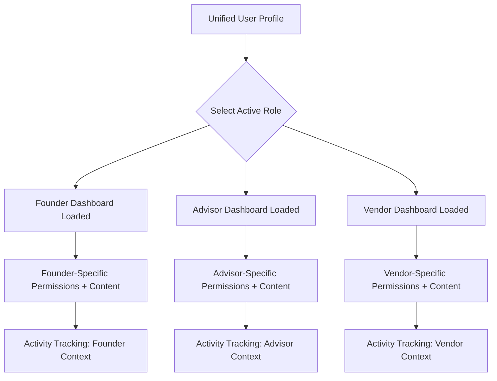

# THE WHEEL: COMPREHENSIVE FOUNDER OPERATING SYSTEM

## Implementation Guide & Technical Specification

*Version 1.0 | April 2025*

---

## Table of Contents

1. [Executive Summary](#executive-summary)
2. [System Architecture](#system-architecture)
3. [Core System Pillars Implementation](#core-system-pillars-implementation)
   - [Identity and Mode System](#1-identity-and-mode-system)
   - [Dynamic Progress Tracker](#2-dynamic-progress-tracker)
   - [Knowledge Hubs](#3-knowledge-hubs)
   - [AI Cofounder](#4-ai-cofounder)
   - [Tech Hub](#5-tech-hub)
   - [Community Infrastructure](#6-community-infrastructure)
   - [Marketplace and Partner Ecosystem](#7-marketplace-and-partner-ecosystem)
4. [Database Schema Evolution](#database-schema-evolution)
5. [User Stories & Acceptance Criteria](#user-stories--acceptance-criteria)
6. [Integration with Existing Codebase](#integration-with-existing-codebase)
7. [Migration Strategy](#migration-strategy)
8. [Technical Implementation Roadmap](#technical-implementation-roadmap)
9. [Testing Strategy](#testing-strategy)
10. [Deployment & DevOps](#deployment--devops)
11. [Security & Compliance](#security--compliance)
12. [Performance Considerations](#performance-considerations)
13. [Appendices](#appendices)

---

## Executive Summary

The Wheel represents a paradigm shift in startup support systems—evolving from an AI-assisted idea generation platform (Wheel99) into a comprehensive operating system for founders. This document provides a detailed technical implementation guide for transforming the existing Wheel99 codebase into The Wheel, a cohesive ecosystem that consolidates the fragmented tools, resources, and communities that founders currently cobble together.

This implementation guide is designed for technical teams familiar with the existing Wheel99 codebase and architecture. It provides detailed specifications, code examples, database schema changes, and integration points to guide the development process.

---

## System Architecture

### Overall Platform Architecture

```mermaid
graph TD
  A[Frontend (React + TypeScript + Vercel)] -->|Authenticate| B(Supabase Auth - JWT)
  B --> C(API Gateway + Edge Functions)
  C --> D(Database (PostgreSQL + RLS))
  C --> E(Storage (Supabase Secure Storage))
  C --> F(AI Layer - OpenAI GPT-4o, Hugging Face)
  F --> G1[AI Cofounder Services]
  F --> G2[Risk Scoring + Task Prioritization]
  D --> H(Community Platform - Supabase Realtime)
  D --> I(Marketplace Engine - Vendors/Advisors DB)
  I --> J(Stripe Connect Payments)
  H --> K(Community Discussion Channels)
  I --> L(Vendor Matching & Review System)
  C --> M(Integration Layer - HubSpot, Salesforce, Notion, GitHub)
  M --> N(External CRM, Finance, DevTools)
  C --> O(Monitoring & Observability - DataDog, Sentry)
  O --> P(Alerts, Error Tracking)
  C --> Q(Infrastructure as Code - Terraform)
```

### Key Technical Components

1. **Frontend Layer**:
   * React + TypeScript structured as a modular application
   * Vercel for static site hosting with API routes
   * Tailwind CSS for styling with custom component system
   * Zustand for state management with persisted stores

2. **Authentication & Authorization**:
   * Supabase Auth with JWT tokens
   * Role-based access control
   * Mode-based permissions
   * Social provider integration

3. **Backend Services**:
   * API Gateway with Edge Functions
   * Database (PostgreSQL with row-level security)
   * Storage (Supabase secure object storage)
   * Realtime API for collaborative features

4. **AI Layer**:
   * OpenAI GPT-4o for primary intelligence
   * Hugging Face models for specialized functions
   * AI Cofounder Services for strategic assistance
   * Risk scoring and task prioritization engines

5. **Community Platform**:
   * Discussion channels using Supabase Realtime
   * Asynchronous messaging infrastructure
   * Notification system with prioritization
   * Resource sharing and rating mechanisms

6. **Marketplace Engine**:
   * Vendor/Advisor database with verification
   * Matching algorithms for service recommendations
   * Stripe Connect for payment processing
   * Review and rating system

7. **Integration Layer**:
   * CRM connections (HubSpot, Salesforce)
   * Document systems (Notion, Google Docs)
   * Development tools (GitHub, GitLab)
   * Project management (Jira, Asana)

8. **Monitoring & Observability**:
   * DataDog for system monitoring
   * Sentry for error tracking
   * Custom analytics for user behavior
   * Performance monitoring

9. **Infrastructure as Code**:
   * Terraform for resource provisioning
   * CI/CD pipelines for deployment
   * Environment management

### Data Flow Architecture

```mermaid
graph LR
  A[User Authentication] --> B[Mode Selection (Founder/Advisor/Vendor)]
  B --> C[Personalized Dashboard Loaded]
  C --> D1[Daily Standup Input]
  D1 --> E1[AI Standup Analyzer]
  E1 --> F1[Progress Tracker Updates]
  F1 --> G1[Knowledge Hub Surfacing]

  C --> D2[Community Participation]
  D2 --> E2[Community Database]
  E2 --> F2[AI Moderation Engine]

  F1 --> H1[Marketplace Task Matching]
  H1 --> I1[Vendor/Advisor Engagement]
  I1 --> J1[Review and Feedback System]

  C --> D3[Integration Layer]
  D3 --> E3[CRM/Finance/DevTools Sync]
```

### Identity & Role Switching Flow



---

## Core System Pillars Implementation

### 1. Identity and Mode System

#### Overview
The Identity and Mode System enables seamless transitions between different professional contexts while maintaining a single user identity. Unlike traditional role-based systems that require separate accounts, The Wheel allows users to switch between modes (founder, advisor, investor, etc.) while preserving context and relationships.

#### Technical Implementation

1. **Database Schema Extensions**

```sql
-- Add to supabase/migrations/...._mode_system.sql
CREATE TABLE IF NOT EXISTS user_modes (
  id UUID PRIMARY KEY DEFAULT uuid_generate_v4(),
  user_id UUID REFERENCES auth.users(id) ON DELETE CASCADE,
  mode VARCHAR NOT NULL,
  display_name VARCHAR NOT NULL,
  icon VARCHAR NOT NULL,
  primary_color VARCHAR NOT NULL,
  is_active BOOLEAN DEFAULT false,
  created_at TIMESTAMP WITH TIME ZONE DEFAULT now(),
  updated_at TIMESTAMP WITH TIME ZONE DEFAULT now(),
  UNIQUE(user_id, mode)
);

CREATE TABLE IF NOT EXISTS mode_preferences (
  id UUID PRIMARY KEY DEFAULT uuid_generate_v4(),
  user_mode_id UUID REFERENCES user_modes(id) ON DELETE CASCADE,
  preferences JSONB NOT NULL DEFAULT '{}',
  created_at TIMESTAMP WITH TIME ZONE DEFAULT now(),
  updated_at TIMESTAMP WITH TIME ZONE DEFAULT now()
);

CREATE TABLE IF NOT EXISTS mode_context (
  id UUID PRIMARY KEY DEFAULT uuid_generate_v4(),
  user_mode_id UUID REFERENCES user_modes(id) ON DELETE CASCADE,
  recent_activity JSONB NOT NULL DEFAULT '[]',
  pinned_items JSONB NOT NULL DEFAULT '[]',
  last_viewed_entities JSONB NOT NULL DEFAULT '[]',
  created_at TIMESTAMP WITH TIME ZONE DEFAULT now(),
  updated_at TIMESTAMP WITH TIME ZONE DEFAULT now()
);
```

2. **TypeScript Types**

```typescript
// src/lib/types/mode.types.ts
export enum UserMode {
  FOUNDER = 'founder',
  ADVISOR = 'advisor',
  INVESTOR = 'investor',
  SERVICE_PROVIDER = 'service_provider',
}

export interface ModeSettings {
  mode: UserMode;
  displayName: string;
  icon: string;
  primaryColor: string;
  activeFeatures: string[];
  preferences: Record<string, any>;
}

export interface ModeContext {
  recentActivity: ActivityRecord[];
  pinnedItems: PinnedItem[];
  lastViewedEntities: EntityReference[];
}
```

3. **Mode Management Service**

```typescript
// src/lib/services/mode-manager.service.ts
export class ModeManagerService {
  constructor(
    private authService: AuthService,
    private profileService: ProfileService,
    private store: Store,
    private loggingService: LoggingService
  ) {}

  async switchMode(mode: UserMode): Promise<ModeSettings> {
    // Save current mode context
    const currentMode = this.store.getState().currentMode;
    if (currentMode) {
      await this.saveCurrentModeContext(currentMode);
    }
    
    // Load new mode settings
    const modeSettings = await this.profileService.getModeSettings(mode);
    
    // Load context for new mode
    const modeContext = await this.loadModeContext(mode);
    
    // Update store with new mode and context
    this.store.setState({
      currentMode: mode,
      modeSettings,
      modeContext
    });
    
    // Log mode switch
    this.loggingService.logModeSwitch(currentMode, mode);
    
    return modeSettings;
  }
  
  private async saveCurrentModeContext(mode: UserMode): Promise<void> {
    const context: ModeContext = {
      recentActivity: this.store.getState().recentActivity,
      pinnedItems: this.store.getState().pinnedItems,
      lastViewedEntities: this.store.getState().lastViewedEntities,
    };
    
    await this.profileService.saveModeContext(mode, context);
  }
  
  private async loadModeContext(mode: UserMode): Promise<ModeContext> {
    return await this.profileService.getModeContext(mode);
  }
}
```

4. **React Components**

```typescript
// src/components/mode/ModeSwitcher.tsx
export const ModeSwitcher: React.FC = () => {
  const { currentMode, modeSettings, switchMode } = useContext(ModeContext);
  const [availableModes, setAvailableModes] = useState<ModeSettings[]>([]);
  
  useEffect(() => {
    const loadAvailableModes = async () => {
      const modes = await profileService.getAvailableModes();
      setAvailableModes(modes);
    };
    
    loadAvailableModes();
  }, []);
  
  return (
    <div className="mode-switcher">
      <div className="current-mode" style={{ backgroundColor: modeSettings.primaryColor }}>
        <Icon name={modeSettings.icon} />
        <span>{modeSettings.displayName}</span>
      </div>
      
      <div className="mode-options">
        {availableModes.map(mode => (
          <div 
            key={mode.mode} 
            className="mode-option" 
            onClick={() => switchMode(mode.mode)}
          >
            <Icon name={mode.icon} />
            <span>{mode.displayName}</span>
          </div>
        ))}
      </div>
    </div>
  );
};
```

5. **Integration Points**

Integration with the existing `multi-persona-profile.service.ts`:

```typescript
// src/lib/services/multi-persona-profile.service.ts
export class MultiPersonaProfileService {
  // ... existing code ...
  
  // Add new methods to support Mode system
  async getModeSettings(mode: UserMode): Promise<ModeSettings> {
    const { data, error } = await this.supabase
      .from('user_modes')
      .select('*')
      .eq('user_id', this.authService.getCurrentUserId())
      .eq('mode', mode)
      .single();
      
    if (error) throw error;
    
    return {
      mode: data.mode,
      displayName: data.display_name,
      icon: data.icon,
      primaryColor: data.primary_color,
      activeFeatures: data.active_features || [],
      preferences: (await this.getModePreferences(data.id)).preferences
    };
  }
  
  async getModePreferences(userModeId: string): Promise<{ preferences: Record<string, any> }> {
    const { data, error } = await this.supabase
      .from('mode_preferences')
      .select('preferences')
      .eq('user_mode_id', userModeId)
      .single();
      
    if (error) throw error;
    return data;
  }
  
  async saveModeContext(mode: UserMode, context: ModeContext): Promise<void> {
    // Get the user_mode_id for this mode
    const { data: userMode } = await this.supabase
      .from('user_modes')
      .select('id')
      .eq('user_id', this.authService.getCurrentUserId())
      .eq('mode', mode)
      .single();
    
    // Check if context entry exists
    const { data: existingContext } = await this.supabase
      .from('mode_context')
      .select('id')
      .eq('user_mode_id', userMode.id)
      .single();
    
    if (existingContext) {
      // Update existing context
      const { error } = await this.supabase
        .from('mode_context')
        .update({
          recent_activity: context.recentActivity,
          pinned_items: context.pinnedItems,
          last_viewed_entities: context.lastViewedEntities,
          updated_at: new Date()
        })
        .eq('id', existingContext.id);
        
      if (error) throw error;
    } else {
      // Create new context entry
      const { error } = await this.supabase
        .from('mode_context')
        .insert({
          user_mode_id: userMode.id,
          recent_activity: context.recentActivity,
          pinned_items: context.pinnedItems,
          last_viewed_entities: context.lastViewedEntities
        });
        
      if (error) throw error;
    }
  }
}
```

### 2. Dynamic Progress Tracker

#### Overview
The Dynamic Progress Tracker monitors multiple concurrent paths in the founder journey, intelligently surfacing relevant tasks and resources based on current progress and milestones. It tracks progress across various domains like product, fundraising, team, legal, etc.

#### Technical Implementation

1. **Database Schema Extensions**

```sql
-- Add to supabase/migrations/...._progress_tracker.sql
CREATE TYPE progress_domain AS ENUM ('product', 'fundraising', 'team', 'legal', 'growth', 'operations');

CREATE TABLE IF NOT EXISTS domain_stages (
  id UUID PRIMARY KEY DEFAULT uuid_generate_v4(),
  domain progress_domain NOT NULL,
  name VARCHAR NOT NULL,
  description TEXT,
  order_index INTEGER NOT NULL,
  required_completion_percentage INTEGER NOT NULL DEFAULT 80,
  created_at TIMESTAMP WITH TIME ZONE DEFAULT now(),
  updated_at TIMESTAMP WITH TIME ZONE DEFAULT now()
);

CREATE TABLE IF NOT EXISTS milestones (
  id UUID PRIMARY KEY DEFAULT uuid_generate_v4(),
  domain_stage_id UUID REFERENCES domain_stages(id) ON DELETE CASCADE,
  name VARCHAR NOT NULL,
  description TEXT,
  is_completed BOOLEAN DEFAULT false,
  completion_percentage INTEGER DEFAULT 0,
  estimated_time_hours INTEGER,
  created_at TIMESTAMP WITH TIME ZONE DEFAULT now(),
  updated_at TIMESTAMP WITH TIME ZONE DEFAULT now()
);

CREATE TABLE IF NOT EXISTS tasks (
  id UUID PRIMARY KEY DEFAULT uuid_generate_v4(),
  milestone_id UUID REFERENCES milestones(id) ON DELETE CASCADE,
  user_id UUID REFERENCES auth.users(id) ON DELETE CASCADE,
  title VARCHAR NOT NULL,
  description TEXT,
  priority VARCHAR DEFAULT 'medium',
  is_completed BOOLEAN DEFAULT false,
  due_date TIMESTAMP WITH TIME ZONE,
  assignee_id UUID REFERENCES auth.users(id),
  is_ai_generated BOOLEAN DEFAULT false,
  completed_at TIMESTAMP WITH TIME ZONE,
  created_at TIMESTAMP WITH TIME ZONE DEFAULT now(),
  updated_at TIMESTAMP WITH TIME ZONE DEFAULT now()
);

CREATE TABLE IF NOT EXISTS task_dependencies (
  id UUID PRIMARY KEY DEFAULT uuid_generate_v4(),
  task_id UUID REFERENCES tasks(id) ON DELETE CASCADE,
  depends_on_task_id UUID REFERENCES tasks(id) ON DELETE CASCADE,
  created_at TIMESTAMP WITH TIME ZONE DEFAULT now(),
  UNIQUE (task_id, depends_on_task_id)
);

CREATE TABLE IF NOT EXISTS domain_progress (
  id UUID PRIMARY KEY DEFAULT uuid_generate_v4(),
  user_id UUID REFERENCES auth.users(id) ON DELETE CASCADE,
  domain progress_domain NOT NULL,
  current_stage_id UUID REFERENCES domain_stages(id),
  completion_percentage INTEGER DEFAULT 0,
  created_at TIMESTAMP WITH TIME ZONE DEFAULT now(),
  updated_at TIMESTAMP WITH TIME ZONE DEFAULT now(),
  UNIQUE (user_id, domain)
);

CREATE TABLE IF NOT EXISTS milestone_history (
  id UUID PRIMARY KEY DEFAULT uuid_generate_v4(),
  domain_progress_id UUID REFERENCES domain_progress(id) ON DELETE CASCADE,
  milestone_id UUID REFERENCES milestones(id) ON DELETE CASCADE,
  completed_at TIMESTAMP WITH TIME ZONE DEFAULT now()
);
```

2. **TypeScript Types**

```typescript
// src/lib/types/progress-tracker.types.ts
export enum ProgressDomain {
  PRODUCT = 'product',
  FUNDRAISING = 'fundraising',
  TEAM = 'team',
  LEGAL = 'legal',
  GROWTH = 'growth',
  OPERATIONS = 'operations',
}

export interface DomainStage {
  id: string;
  domain: ProgressDomain;
  name: string;
  description: string;
  orderIndex: number;
  requiredCompletionPercentage: number;
  milestones: Milestone[];
}

export interface Milestone {
  id: string;
  name: string;
  description: string;
  isCompleted: boolean;
  tasks: Task[];
  estimatedTimeHours: number;
  completionPercentage: number;
}

export interface Task {
  id: string;
  title: string;
  description: string;
  isCompleted: boolean;
  priority: 'low' | 'medium' | 'high';
  dueDate?: Date;
  assigneeId?: string;
  dependencies: string[]; // IDs of tasks that must be completed first
  isAiGenerated: boolean;
}

export interface DomainProgress {
  domain: ProgressDomain;
  currentStageId: string;
  completionPercentage: number;
  milestoneHistory: {
    milestoneId: string;
    completedAt: Date;
  }[];
}
```

3. **Progress Tracker Service**

```typescript
// src/lib/services/progress-tracker.service.ts
export class ProgressTrackerService {
  constructor(
    private supabase: SupabaseClient,
    private authService: AuthService,
    private aiService: AIService,
    private loggingService: LoggingService
  ) {}

  async getDomainProgress(domain: ProgressDomain): Promise<DomainProgress> {
    const { data, error } = await this.supabase
      .from('domain_progress')
      .select('*')
      .eq('user_id', this.authService.getCurrentUserId())
      .eq('domain', domain)
      .single();
      
    if (error) throw error;
    return data;
  }
  
  async getAllDomainProgress(): Promise<Record<ProgressDomain, DomainProgress>> {
    const { data, error } = await this.supabase
      .from('domain_progress')
      .select('*')
      .eq('user_id', this.authService.getCurrentUserId());
      
    if (error) throw error;
    
    // Convert array to record keyed by domain
    return data.reduce((acc, progress) => {
      acc[progress.domain] = progress;
      return acc;
    }, {} as Record<ProgressDomain, DomainProgress>);
  }
  
  async getCurrentStage(domain: ProgressDomain): Promise<DomainStage> {
    const progress = await this.getDomainProgress(domain);
    
    const { data, error } = await this.supabase
      .from('domain_stages')
      .select('*')
      .eq('id', progress.currentStageId)
      .single();
      
    if (error) throw error;
    return data;
  }
  
  async completeTask(taskId: string): Promise<void> {
    // Mark task as completed
    const { error: taskError } = await this.supabase
      .from('tasks')
      .update({ is_completed: true, completed_at: new Date() })
      .eq('id', taskId);
      
    if (taskError) throw taskError;
    
    // Recalculate milestone completion
    const { data: task } = await this.supabase
      .from('tasks')
      .select('milestone_id')
      .eq('id', taskId)
      .single();
      
    await this.recalculateMilestoneCompletion(task.milestone_id);
    
    // Log task completion
    this.loggingService.logTaskCompletion(taskId);
  }
  
  async recalculateMilestoneCompletion(milestoneId: string): Promise<void> {
    // Get all tasks for this milestone
    const { data: tasks } = await this.supabase
      .from('tasks')
      .select('*')
      .eq('milestone_id', milestoneId);
      
    // Calculate completion percentage
    const totalTasks = tasks.length;
    const completedTasks = tasks.filter(task => task.is_completed).length;
    const completionPercentage = totalTasks > 0 ? (completedTasks / totalTasks) * 100 : 0;
    
    // Update milestone completion
    const { error } = await this.supabase
      .from('milestones')
      .update({ 
        completion_percentage: completionPercentage,
        is_completed: completionPercentage >= 100
      })
      .eq('id', milestoneId);
      
    if (error) throw error;
    
    // Get milestone's domain stage to recalculate stage progression
    const { data: milestone } = await this.supabase
      .from('milestones')
      .select('domain_stage_id, is_completed')
      .eq('id', milestoneId)
      .single();
    
    if (milestone.is_completed) {
      await this.checkStageProgression(milestone.domain_stage_id);
    }
  }
  
  async checkStageProgression(stageId: string): Promise<void> {
    // Implementation details for stage progression logic
    // [full implementation would include checking if enough milestones are completed
    // to advance to the next stage, and updating domain progress]
  }

  async generateRecommendedTasks(stageId: string): Promise<void> {
    // Implementation details for AI-generated task recommendations
    // [full implementation would use AI to generate recommended tasks for a stage]
  }
}
```

4. **React Components**

```typescript
// src/components/progress-tracker/MultiDomainProgressView.tsx
export const MultiDomainProgressView: React.FC = () => {
  const [allProgress, setAllProgress] = useState<Record<ProgressDomain, DomainProgress>>();
  const [currentStages, setCurrentStages] = useState<Record<ProgressDomain, DomainStage>>();
  const [selectedDomain, setSelectedDomain] = useState<ProgressDomain | null>(null);
  const progressService = useProgressTrackerService();
  
  useEffect(() => {
    const loadProgress = async () => {
      const progress = await progressService.getAllDomainProgress();
      setAllProgress(progress);
      
      // Load current stages for each domain
      const stages: Record<ProgressDomain, DomainStage> = {} as any;
      for (const domain of Object.values(ProgressDomain)) {
        if (progress[domain]) {
          stages[domain] = await progressService.getCurrentStage(domain);
        }
      }
      setCurrentStages(stages);
    };
    
    loadProgress();
  }, []);
  
  return (
    <div className="multi-domain-progress">
      <h2 className="text-xl font-bold mb-4">Progress Tracker</h2>
      <div className="domain-cards">
        {currentStages && Object.values(ProgressDomain).map(domain => (
          <DomainProgressCard
            key={domain}
            domain={domain}
            progress={allProgress[domain]}
            currentStage={currentStages[domain]}
            onClick={() => setSelectedDomain(domain)}
          />
        ))}
      </div>
      
      {selectedDomain && currentStages && (
        <DomainDetail
          domain={selectedDomain}
          currentStage={currentStages[selectedDomain]}
          onBack={() => setSelectedDomain(null)}
        />
      )}
    </div>
  );
};
```

### 3. Knowledge Hubs

Knowledge Hubs provide structured, evolving resource centers covering critical startup domains.

#### Technical Implementation

1. **Database Schema**

```sql
-- Add to supabase/migrations/...._knowledge_hubs.sql
CREATE TYPE knowledge_domain AS ENUM ('legal', 'financial', 'gtm', 'team', 'operations', 'tech', 'growth');
CREATE TYPE resource_type AS ENUM ('document', 'template', 'video', 'article', 'tool', 'external_link');

CREATE TABLE IF NOT EXISTS knowledge_resources (
  id UUID PRIMARY KEY DEFAULT uuid_generate_v4(),
  title VARCHAR NOT NULL,
  description TEXT,
  domain knowledge_domain NOT NULL,
  type resource_type NOT NULL,
  content_url VARCHAR,
  content JSONB,
  tags TEXT[],
  stage_relevance VARCHAR[],
  is_premium BOOLEAN DEFAULT false,
  author_id UUID REFERENCES auth.users(id),
  is_verified BOOLEAN DEFAULT false,
  view_count INTEGER DEFAULT 0,
  created_at TIMESTAMP WITH TIME ZONE DEFAULT now(),
  updated_at TIMESTAMP WITH TIME ZONE DEFAULT now()
);

CREATE TABLE IF NOT EXISTS resource_ratings (
  id UUID PRIMARY KEY DEFAULT uuid_generate_v4(),
  resource_id UUID REFERENCES knowledge_resources(id) ON DELETE CASCADE,
  user_id UUID REFERENCES auth.users(id) ON DELETE CASCADE,
  rating INTEGER CHECK (rating >= 1 AND rating <= 5),
  comment TEXT,
  created_at TIMESTAMP WITH TIME ZONE DEFAULT now(),
  updated_at TIMESTAMP WITH TIME ZONE DEFAULT now(),
  UNIQUE (resource_id, user_id)
);

CREATE TABLE IF NOT EXISTS templates (
  id UUID PRIMARY KEY DEFAULT uuid_generate_v4(),
  resource_id UUID REFERENCES knowledge_resources(id) ON DELETE CASCADE,
  template_schema JSONB NOT NULL,
  default_values JSONB,
  version VARCHAR,
  created_at TIMESTAMP WITH TIME ZONE DEFAULT now()
);

CREATE TABLE IF NOT EXISTS user_resource_interactions (
  id UUID PRIMARY KEY DEFAULT uuid_generate_v4(),
  user_id UUID REFERENCES auth.users(id) ON DELETE CASCADE,
  resource_id UUID REFERENCES knowledge_resources(id) ON DELETE CASCADE,
  interaction_type VARCHAR NOT NULL,
  created_at TIMESTAMP WITH TIME ZONE DEFAULT now(),
  UNIQUE (user_id, resource_id, interaction_type)
);

CREATE TABLE IF NOT EXISTS user_documents (
  id UUID PRIMARY KEY DEFAULT uuid_generate_v4(),
  user_id UUID REFERENCES auth.users(id) ON DELETE CASCADE,
  title VARCHAR NOT NULL,
  template_id UUID REFERENCES templates(id),
  content JSONB NOT NULL,
  is_draft BOOLEAN DEFAULT true,
  created_at TIMESTAMP WITH TIME ZONE DEFAULT now(),
  updated_at TIMESTAMP WITH TIME ZONE DEFAULT now()
);
```

2. **TypeScript Types**

```typescript
// src/lib/types/knowledge-hub.types.ts
export enum KnowledgeDomain {
  LEGAL = 'legal',
  FINANCIAL = 'financial',
  GTM = 'gtm',
  TEAM = 'team',
  OPERATIONS = 'operations',
  TECH = 'tech',
  GROWTH = 'growth',
}

export enum ResourceType {
  DOCUMENT = 'document',
  TEMPLATE = 'template',
  VIDEO = 'video',
  ARTICLE = 'article',
  TOOL = 'tool',
  EXTERNAL_LINK = 'external_link',
}

export interface KnowledgeResource {
  id: string;
  title: string;
  description: string;
  domain: KnowledgeDomain;
  type: ResourceType;
  contentUrl?: string;
  content?: any;
  tags: string[];
  stageRelevance: string[];
  isPremium: boolean;
  authorId?: string;
  isVerified: boolean;
  viewCount: number;
  createdAt: Date;
  averageRating?: number;
}

export interface Template {
  id: string;
  resourceId: string;
  templateSchema: any;
  defaultValues?: any;
  version: string;
}

export interface UserDocument {
  id: string;
  title: string;
  templateId?: string;
  content: any;
  isDraft: boolean;
  createdAt: Date;
  updatedAt: Date;
}
```

3. **Knowledge Hub Service**

```typescript
// src/lib/services/knowledge-hub.service.ts
export class KnowledgeHubService {
  constructor(
    private supabase: SupabaseClient,
    private authService: AuthService,
    private loggingService: LoggingService
  ) {}

  async getResourcesByDomain(domain: KnowledgeDomain): Promise<KnowledgeResource[]> {
    const { data, error } = await this.supabase
      .from('knowledge_resources')
      .select('*, resource_ratings(*)')
      .eq('domain', domain);
      
    if (error) throw error;
    
    // Calculate average rating for each resource
    return data.map(resource => ({
      ...resource,
      averageRating: this.calculateAverageRating(resource.resource_ratings)
    }));
  }
  
  async getResourceById(id: string): Promise<KnowledgeResource> {
    // Increment view count in an atomic way
    await this.supabase.rpc('increment_resource_view_count', { resource_id: id });
    
    const { data, error } = await this.supabase
      .from('knowledge_resources')
      .select('*, resource_ratings(*)')
      .eq('id', id)
      .single();
      
    if (error) throw error;
    
    // Track user interaction
    await this.trackResourceInteraction(id, 'view');
    
    // Calculate average rating
