# THE WHEEL: IMPLEMENTATION ROADMAP

## Overview

This document outlines a comprehensive implementation roadmap for The Wheel platform, mapping out a strategic development sequence that builds towards the full vision while delivering incremental value. The roadmap is organized into four phases spanning 18 months, with each phase building upon the foundations of previous work while enabling increasingly advanced capabilities.

---

## Phase 1: Identity and Progress Tracking Foundation (Months 1-4)

### 1. Identity and Mode System

#### Technical Architecture

```mermaid
graph TD
    IMS[Identity & Mode System] --> IDM[Identity Data Model]
    IMS --> MCS[Mode Context Switching]
    IMS --> PMM[Permission Management]
    IMS --> PSS[Profile Storage System]
    
    IDM --> UserEntity[User Entity]
    IDM --> PersonaEntity[Persona Entity]
    IDM --> CompanyEntity[Company Entity]
    IDM --> RoleEntity[Role Definition]
    
    MCS --> StatePreservation[State Preservation]
    MCS --> ContextTransition[Context Transition]
    MCS --> ViewAdaptation[View Adaptation]
    MCS --> HistorySeparation[History Separation]
    
    PMM --> RoleBasedAccess[Role-Based Access Control]
    PMM --> CrossPersonaRules[Cross-Persona Rules]
    PMM --> DynamicPermissions[Dynamic Permissions]
    PMM --> SharingSettings[Sharing Settings]
    
    PSS --> ProfileDataSchema[Profile Data Schema]
    PSS --> SkillsManagement[Skills & Expertise]
    PSS --> PreferenceSettings[Preference Settings] 
    PSS --> ActivityTracking[Activity Tracking]
```

#### Key Components

1. **Multi-Persona User Model**
   * Core user identity with linked personas
   * Role-specific profile data
   * Cross-persona information sharing rules
   * Company/organization relationships

2. **Mode Switching Engine**
   * Context preservation between modes
   * State management for active persona
   * Intelligent default mode suggestion
   * History tracking per persona

3. **Dynamic Permission System**
   * Role-based access control framework
   * Context-sensitive permission rules
   * Cross-organizational permissions
   * Privacy controls and visibility settings

4. **Profile Management**
   * Expertise and skills tracking
   * Personal preferences system
   * Activity and engagement history
   * Profile completion tracking

#### Implementation Steps

1. **Month 1**
   * Design core data models for users, personas, roles
   * Implement basic authentication with persona selection
   * Create database schema for profile information
   * Build initial UI for mode switching

2. **Month 2**
   * Develop role-based permission system
   * Implement state preservation across mode switches
   * Create profile management interface
   * Build company/organization relationships

3. **Month 3**
   * Implement cross-persona information sharing rules
   * Build activity tracking system
   * Create expertise and skills framework
   * Develop privacy controls and visibility settings

4. **Month 4**
   * Integrate identity system with other platform components
   * Implement intelligent default mode suggestions
   * Build comprehensive profile completion system
   * Create analytics for mode usage and switching patterns

### 2. Dynamic Progress Tracker Core

#### Technical Architecture

```mermaid
graph TD
    DPT[Dynamic Progress Tracker] --> DM[Dimension Model]
    DPT --> MS[Milestone System]
    DPT --> TS[Task System]
    DPT --> VS[Visualization System]
    
    DM --> DimDef[Dimension Definition]
    DM --> StageDef[Stage Definition]
    DM --> ProgressCalc[Progress Calculation]
    DM --> DimDep[Dimension Dependencies]
    
    MS --> MilestoneDef[Milestone Definition]
    MS --> MilestoneDep[Milestone Dependencies]
    MS --> MilestoneState[Milestone State Management]
    MS --> CompletionCriteria[Completion Criteria]
    
    TS --> TaskGeneration[Task Generation]
    TS --> TaskPrioritization[Task Prioritization]
    TS --> TaskAssignment[Task Assignment]
    TS --> TaskTracking[Task Tracking]
    
    VS --> ProgressDashboard[Progress Dashboard]
    VS --> MilestoneVisualization[Milestone Visualization] 
    VS --> DependencyGraphs[Dependency Graphs]
    VS --> TimelineViews[Timeline Views]
```

#### Key Components

1. **Multi-Dimensional Progress Framework**
   * Core dimension models (product, fundraising, team, legal, etc.)
   * Stage definitions for each dimension
   * Cross-dimension dependencies
   * Progress calculation algorithms

2. **Milestone Management System**
   * Milestone definition and templates
   * Dependency tracking and management
   * State tracking and transitions
   * Completion criteria and evidence

3. **Task Management System**
   * Task generation from milestones
   * Dynamic prioritization engine
   * Assignment and ownership tracking
   * Completion verification

4. **Progress Visualization**
   * Multi-dimension progress dashboard
   * Milestone network visualization
   * Dependency graph rendering
   * Timeline and roadmap views

#### Implementation Steps

1. **Month 1**
   * Design core data models for dimensions and stages
   * Implement milestone definition system
   * Create task data structure and relationships
   * Build progress calculation framework

2. **Month 2**
   * Develop milestone dependency tracking
   * Implement task generation from milestones
   * Build basic progress dashboard
   * Create task management interface

3. **Month 3**
   * Implement cross-dimension dependency mapping
   * Build advanced visualization components
   * Create milestone completion verification
   * Develop task prioritization algorithms

4. **Month 4**
   * Integrate with identity and role system
   * Implement context-specific views based on roles
   * Build timeline and roadmap projections
   * Create dependency graph visualization

---

## Phase 2: Knowledge Integration and AI Foundations (Months 5-8)

### 3. Knowledge Hub Framework

#### Technical Architecture

```mermaid
graph TD
    KHF[Knowledge Hub Framework] --> KOA[Knowledge Organization Architecture]
    KHF --> CDM[Content Delivery Mechanism]
    KHF --> RRS[Resource Recommendation System]
    KHF --> CMS[Content Management System]
    
    KOA --> TopicTaxonomy[Topic Taxonomy]
    KOA --> ContentType[Content Type Classification]
    KOA --> TaggingSystem[Tagging System]
    KOA --> RelevanceMetrics[Relevance Metrics]
    
    CDM --> ContextAware[Context-Aware Delivery]
    CDM --> ProgressDriven[Progress Driven Triggers]
    CDM --> PersonalizedSequencing[Personalized Sequencing]
    CDM --> AccessControl[Access Control]
    
    RRS --> ContentRanking[Content Ranking Algorithm]
    RRS --> UserBehavior[User Behavior Analysis]
    RRS --> ProgressContext[Progress Context Integration]
    RRS --> FeedbackLoop[Feedback Loop]
    
    CMS --> ContentImport[Content Import]
    CMS --> VersionControl[Version Control]
    CMS --> MetadataManagement[Metadata Management]
    CMS --> QualityAssurance[Quality Assurance]
```

#### Key Components

1. **Knowledge Organization Framework**
   * Topic taxonomy and hierarchy
   * Content type classification system
   * Tagging and metadata schema
   * Cross-referencing system

2. **Context-Aware Content Delivery**
   * Progress-driven content triggers
   * Role-specific content visibility
   * Stage-appropriate content filtering
   * Personalized delivery sequencing

3. **Resource Recommendation Engine**
   * Content relevance scoring
   * User behavior analysis
   * Progress-context integration
   * Feedback collection and adaptation

4. **Content Management System**
   * Content creation and curation tools
   * Version control and updating
   * Metadata management
   * Quality and relevance scoring

#### Implementation Steps

1. **Month 5**
   * Design knowledge organization taxonomy
   * Implement content type classification
   * Build content storage and retrieval system
   * Create basic tagging and metadata system

2. **Month 6**
   * Develop context-aware delivery mechanism
   * Implement progress-driven content triggers
   * Build initial resource recommendation engine
   * Create content management interface

3. **Month 7**
   * Implement role-specific content visibility
   * Build personalized delivery sequencing
   * Develop user behavior tracking for recommendations
   * Create feedback collection system

4. **Month 8**
   * Integrate with progress tracker for context
   * Implement advanced recommendation algorithms
   * Build comprehensive content dashboard
   * Create analytics for content effectiveness

### 4. AI Cofounder 1.0

#### Technical Architecture

```mermaid
graph TD
    AI[AI Cofounder] --> CM[Context Management]
    AI --> NLP[Natural Language Processing]
    AI --> MG[Model Gateway]
    AI --> FE[Feature Engines]
    
    CM --> ConvoHistory[Conversation History]
    CM --> UserProfile[User Profile Integration]
    CM --> ProgressContext[Progress Context]
    CM --> CompanyContext[Company Context]
    
    NLP --> IntentRecognition[Intent Recognition]
    NLP --> EntityExtraction[Entity Extraction]
    NLP --> SentimentAnalysis[Sentiment Analysis]
    NLP --> TopicModeling[Topic Modeling]
    
    MG --> ModelSelection[Model Selection]
    MG --> PromptGeneration[Prompt Generation]
    MG --> ResponseProcessing[Response Processing]
    MG --> FeedbackCollection[Feedback Collection]
    
    FE --> StandupAnalysis[Standup Analysis]
    FE --> TaskSuggestion[Task Suggestion]
    FE --> DocCollaboration[Document Collaboration]
    FE --> SprintAssistant[Sprint Assistant]
```

#### Key Components

1. **Context Management System**
   * Conversation history tracking
   * User profile integration
   * Progress context awareness
   * Company context incorporation

2. **NLP Processing Pipeline**
   * Intent recognition and classification
   * Entity extraction and linking
   * Sentiment analysis
   * Topic modeling and classification

3. **Model Gateway**
   * Dynamic model selection
   * Prompt engineering and generation
   * Response processing and enhancement
   * Feedback collection and learning

4. **Feature-Specific Engines**
   * Standup analysis system
   * Task suggestion engine
   * Document collaboration tools
   * Sprint planning assistant

#### Implementation Steps

1. **Month 5**
   * Design AI conversation architecture
   * Implement context management system
   * Build model gateway infrastructure
   * Create basic intent recognition

2. **Month 6**
   * Develop standup analysis capabilities
   * Implement basic task suggestion
   * Build entity extraction and linking
   * Create feedback collection mechanism

3. **Month 7**
   * Implement document collaboration features
   * Build sprint planning assistance
   * Develop sentiment analysis capabilities
   * Create topic modeling system

4. **Month 8**
   * Integrate with progress tracker for context
   * Implement advanced prompt engineering
   * Build comprehensive AI dashboard
   * Create analytics for AI effectiveness

---

## Phase 3: Community and Expansion (Months 9-12)

### 5. Community Infrastructure

#### Technical Architecture

```mermaid
graph TD
    CI[Community Infrastructure] --> GM[Group Management]
    CI --> CM[Content Management]
    CI --> IM[Interaction Management]
    CI --> AM[Analytics Management]
    
    GM --> MembershipSys[Membership System]
    GM --> GroupTypes[Group Types & Taxonomy]
    GM --> PermissionSystem[Permission System]
    GM --> DiscoveryMech[Discovery Mechanism]
    
    CM --> ContentCreation[Content Creation]
    CM --> ContentModeration[Content Moderation]
    CM --> ContentDistribution[Content Distribution]
    CM --> ContentOrganization[Content Organization]
    
    IM --> DiscussionThreads[Discussion Threads]
    IM --> EventSystem[Event System]
    IM --> NotificationSystem[Notification System]
    IM --> DirectMessaging[Direct Messaging]
    
    AM --> EngagementMetrics[Engagement Metrics]
    AM --> ContentAnalytics[Content Analytics]
    AM --> MemberAnalytics[Member Analytics]
    AM --> ValueMetrics[Value Metrics]
```

#### Key Components

1. **Group Management System**
   * Membership management
   * Group types and taxonomy
   * Permission and access control
   * Discovery and recommendation

2. **Community Content System**
   * Content creation tools
   * Moderation workflow
   * Distribution and visibility
   * Organization and search

3. **Interaction Framework**
   * Discussion thread management
   * Event planning and coordination
   * Notification system
   * Direct messaging

4. **Community Analytics**
   * Engagement metrics
   * Content performance tracking
   * Member participation analytics
   * Value and impact measurement

#### Implementation Steps

1. **Month 9**
   * Design community data model
   * Implement group and membership system
   * Build content creation and organization
   * Create basic discussion functionality

2. **Month 10**
   * Develop moderation workflow
   * Implement notification system
   * Build direct messaging capabilities
   * Create event planning functionality

3. **Month 11**
   * Implement discovery recommendations
   * Build analytics dashboard
   * Develop engagement tracking
   * Create value metrics

4. **Month 12**
   * Integrate with knowledge hub for content
   * Implement advanced search and discovery
   * Build comprehensive community dashboard
   * Create onboarding flows for community

### 6. Tech Hub Beta

#### Technical Architecture

```mermaid
graph TD
    TH[Tech Hub] --> SSS[Stack Selection System]
    TH --> CSR[Code Starter Repository]
    TH --> CIS[Cloud Integration System]
    TH --> ITS[Infrastructure Template System]
    
    SSS --> RequirementAnalysis[Requirement Analysis]
    SSS --> StackComparison[Stack Comparison]
    SSS --> RecommendationEngine[Recommendation Engine]
    SSS --> TradeoffVisualization[Tradeoff Visualization]
    
    CSR --> TemplateManagement[Template Management]
    CSR --> CodeGeneration[Code Generation]
    CSR --> VersionControl[Version Control]
    CSR --> ProjectBootstrapping[Project Bootstrapping]
    
    CIS --> CloudProviderAPI[Cloud Provider API]
    CIS --> CredentialManagement[Credential Management]
    CIS --> ServiceProvisioning[Service Provisioning]
    CIS --> CreditAllocation[Credit Allocation]
    
    ITS --> IaCTemplates[IaC Templates]
    ITS --> DeploymentScripts[Deployment Scripts]
    ITS --> ConfigManagement[Configuration Management]
    ITS --> EnvironmentSetup[Environment Setup]
```

#### Key Components

1. **Stack Selection Guidance**
   * Requirements analysis framework
   * Technology stack comparison
   * Recommendation engine
   * Tradeoff visualization

2. **Code Starter Repository**
   * Template management
   * Code generation capabilities
   * Version control integration
   * Project bootstrapping tools

3. **Cloud Partnership Integration**
   * Cloud provider API integration
   * Credential management
   * Service provisioning
   * Credit allocation and tracking

4. **Infrastructure Templates**
   * Infrastructure-as-Code templates
   * Deployment scripts
   * Configuration management
   * Environment setup automation

#### Implementation Steps

1. **Month 9**
   * Design stack selection framework
   * Implement starter code repository structure
   * Build cloud provider API integrations
   * Create basic IaC templates

2. **Month 10**
   * Develop stack recommendation algorithms
   * Implement template management system
   * Build credential management
   * Create deployment script generation

3. **Month 11**
   * Implement tradeoff visualization
   * Build project bootstrapping tools
   * Develop service provisioning system
   * Create configuration management

4. **Month 12**
   * Integrate with AI for stack recommendations
   * Implement code generation capabilities
   * Build comprehensive tech dashboard
   * Create onboarding for tech hub

---

## Phase 4: Advanced Intelligence (Months 13-18)

### 7. AI Agent Ecosystem

#### Technical Architecture

```mermaid
graph TD
    AE[Agent Ecosystem] --> AA[Agent Abstraction]
    AE --> CO[Coordination Orchestrator]
    AE --> SM[Shared Memory]
    AE --> MP[Marketplace Platform]
    
    AA --> AgentInterface[Agent Interface]
    AA --> ModelIntegration[Model Integration]
    AA --> DomainSpecialization[Domain Specialization]
    AA --> EvaluationFramework[Evaluation Framework]
    
    CO --> IntentRouting[Intent Routing]
    CO --> AgentSelection[Agent Selection]
    CO --> TeamFormation[Team Formation]
    CO --> ContextTransition[Context Transition]
    
    SM --> EntityMemory[Entity Memory]
    SM --> ConversationMemory[Conversation Memory]
    SM --> KnowledgeConnections[Knowledge Connections]
    SM --> CrossAgentLearning[Cross-Agent Learning]
    
    MP --> AgentRegistry[Agent Registry]
    MP --> DeveloperTools[Developer Tools]
    MP --> CertificationSystem[Certification System]
    MP --> AnalyticsDashboard[Analytics Dashboard]
```

#### Key Components

1. **Agent Abstraction Layer**
   * Core agent interface
   * Model integration framework
   * Domain specialization architecture
   * Evaluation and benchmarking

2. **Coordination Orchestrator**
   * Intent-based routing
   * Agent selection algorithm
   * Team formation for complex tasks
   * Context transition management

3. **Shared Memory System**
   * Entity memory framework
   * Conversation history management
   * Knowledge graph connections
   * Cross-agent learning mechanisms

4. **Agent Marketplace**
   * Agent registration and discovery
   * Developer tools and SDK
   * Certification and quality assurance
   * Analytics and performance monitoring

#### Implementation Steps

1. **Month 13**
   * Design agent interface specification
   * Implement basic routing system
   * Build shared memory architecture
   * Create agent registry foundation

2. **Month 14-15**
   * Develop domain-specific agents (Legal, Finance)
   * Implement context transition management
   * Build cross-agent learning mechanisms
   * Create developer tools and SDK

3. **Month 16**
   * Implement team formation algorithms
   * Build certification system
   * Develop analytics dashboard
   * Create agent marketplace interface

4. **Month 17-18**
   * Integrate with all platform components
   * Implement advanced coordination patterns
   * Build comprehensive agent ecosystem dashboard
   * Create onboarding for agent marketplace

### 8. Simulation and Forecasting

#### Technical Architecture

```mermaid
graph TD
    SF[Simulation & Forecasting] --> SM[Simulation Models]
    SF --> SE[Simulation Engine]
    SF --> VM[Visualization Module]
    SF --> AM[Analytics Module]
    
    SM --> BusinessModels[Business Models]
    SM --> FinancialModels[Financial Models]
    SM --> MarketModels[Market Models]
    SM --> OperationsModels[Operations Models]
    
    SE --> MonteCarloEngine[Monte Carlo Engine]
    SE --> SystemDynamicsEngine[System Dynamics Engine]
    SE --> AgentBasedEngine[Agent-Based Engine]
    SE --> ScenarioEngine[Scenario Engine]
    
    VM --> TimeSeries[Time Series Visualization]
    VM --> DistributionCharts[Distribution Charts]
    VM --> ScenarioComparison[Scenario Comparison]
    VM --> SensitivityAnalysis[Sensitivity Analysis]
    
    AM --> ResultsAnalysis[Results Analysis]
    AM --> InsightGeneration[Insight Generation]
    AM --> RecommendationEngine[Recommendation Engine]
    AM --> BenchmarkComparison[Benchmark Comparison]
```

#### Key Components

1. **Simulation Model Library**
   * Business models (revenue, growth, market adoption)
   * Financial models (cash flow, funding, unit economics)
   * Market models (competition, behavior, conditions)
   * Operations models (resources, processes, scaling)

2. **Simulation Engine**
   * Monte Carlo simulation engine
   * System dynamics modeling
   * Agent-based simulation framework
   * Scenario planning and management

3. **Visualization Capabilities**
   * Time series projection visualization
   * Probability distribution charts
   * Scenario comparison views
   * Sensitivity analysis tools

4. **Analytics System**
   * Results analysis framework
   * Insight generation algorithms
   * Recommendation engine
   * Industry benchmark comparison

#### Implementation Steps

1. **Month 13**
   * Design core simulation framework
   * Implement basic financial models
   * Build Monte Carlo engine
   * Create fundamental visualization components

2. **Month 14-15**
   * Develop market and business models
   * Implement system dynamics engine
   * Build scenario management
   * Create advanced visualization tools

3. **Month 16**
   * Implement agent-based simulation
   * Build results analysis framework
   * Develop insight generation
   * Create recommendation engine

4. **Month 17-18**
   * Integrate with AI for intelligent suggestions
   * Implement benchmark comparison
   * Build comprehensive simulation dashboard
   * Create onboarding for simulation tools

---

## Technical Dependencies and Shared Architecture

### Data Architecture

```mermaid
graph TD
    DA[Data Architecture] --> CM[Core Models]
    DA --> DI[Data Integration]
    DA --> DS[Data Storage]
    DA --> DP[Data Processing]
    
    CM --> User[User & Identity]
    CM --> Progress[Progress Tracking]
    CM --> Knowledge[Knowledge Content]
    CM --> Activity[Activity & Analytics]
    
    DI --> API[API Gateway]
    DI --> ETL[ETL Processes]
    DI --> Webhooks[Webhooks]
    DI --> StreamProcessing[Stream Processing]
    
    DS --> Relational[Relational Storage]
    DS --> Document[Document Storage]
    DS --> TimeSeries[Time Series Data]
    DS --> Graph[Graph Database]
    
    DP --> BatchProcessing[Batch Processing]
    DP --> RealTime[Real-time Analysis]
    DP --> ML[Machine Learning Pipeline]
    DP --> Analytics[Analytics Processing]
```

### Authentication and Authorization

```mermaid
graph TD
    AA[Auth System] --> AM[Authentication Methods]
    AA --> ID[Identity Management]
    AA --> PF[Permission Framework]
    AA --> SI[Security Infrastructure]
    
    AM --> Email[Email & Password]
    AM --> SSO[Single Sign-On]
    AM --> OAuth[OAuth Providers]
    AM --> MFA[Multi-Factor Auth]
    
    ID --> UserProfiles[User Profiles]
    ID --> RoleSystem[Role System]
    ID --> PersonaManagement[Persona Management]
    ID --> SessionManagement[Session Management]
    
    PF --> RBAC[Role-Based Access]
    PF --> ABAC[Attribute-Based Access]
    PF --> ResourcePerms[Resource Permissions]
    PF --> PolicyEngine[Policy Engine]
    
    SI --> TokenManagement[Token Management]
    SI --> EncryptionSystem[Encryption]
    SI --> AuditLogging[Audit Logging]
    SI --> ThreatProtection[Threat Protection]
```

### Frontend Architecture

```mermaid
graph TD
    FA[Frontend Architecture] --> CF[Component Framework]
    FA --> SM[State Management]
    FA --> NS[Navigation System]
    FA --> TP[Theming Platform]
    
    CF --> AtomicDesign[Atomic Design]
    CF --> TemplateSystem[Template System]
    CF --> CompositionModel[Composition Model]
    CF --> Extensibility[Extensibility]
    
    SM --> GlobalState[Global State]
    SM --> LocalState[Component State]
    SM --> StateSync[State Synchronization]
    SM --> Persistence[State Persistence]
    
    NS --> Routing[Routing System]
    NS --> Transitions[Page Transitions]
    NS --> DeepLinking[Deep Linking]
    NS --> NavigationState[Navigation State]
    
    TP --> DesignTokens[Design Tokens]
    TP --> ThemeProvider[Theme Provider]
    TP --> ResponsiveSystem[Responsive System]
    TP --> AccessibilityLayer[Accessibility Layer]
```

### API Design

```mermaid
graph TD
    API[API Architecture] --> RS[REST Services]
    API --> GS[GraphQL Services]
    API --> WS[WebSocket Services]
    API --> ES[Event Streaming]
    
    RS --> RESTResources[Resource Design]
    RS --> RESTVersioning[API Versioning]
    RS --> RESTCaching[Caching Strategy]
    RS --> RESTDocs[REST Documentation]
    
    GS --> GraphSchema[Schema Design]
    GS --> Resolvers[Resolver System]
    GS --> GraphSubscriptions[Subscriptions]
    GS --> GraphDocs[GraphQL Documentation]
    
    WS --> RealTimeEvents[Real-time Events]
    WS --> ConnectionManagement[Connection Mgmt]
    WS --> PubSub[Pub/Sub System]
    WS --> PresenceTracking[Presence Tracking]
    
    ES --> EventDefinitions[Event Definitions]
    ES --> StreamProcessors[Stream Processors]
    ES --> ConsumerGroups[Consumer Groups]
    ES --> DeadLetterQueues[Dead Letter Queues]
```

## Early Win Priorities

### Month 1-2: Core Identity Experience

* Multi-persona user profiles
* Seamless mode switching UI
* Basic progress tracking dashboard
* Initial task management functionality

### Month 3-4: Progress Visualization

* Multi-dimensional progress charts
* Milestone dependency visualization
* Task prioritization intelligence
* Timeline projections

### Month 5-6: AI Assistance

* Daily standup analysis
* Smart task suggestions
* Basic document collaboration
* Context-aware knowledge recommendations

## Success Metrics

### User Engagement
* Active daily/weekly users
* Feature adoption rates
* Time spent on platform
* Return visit frequency

### Value Delivery
* Task completion rates
* Milestone achievement velocity
* Knowledge consumption metrics
* AI interaction effectiveness

### Platform Growth
* User growth rate
* Persona creation rate
* Content creation metrics
* Community participation

### Business Metrics
* User retention rate
* Feature-specific satisfaction scores
* Premium feature conversion
* Cost efficiency metrics
