# THE WHEEL: KNOWLEDGE HUB ARCHITECTURE

## Vision

The Knowledge Hub Architecture transforms The Wheel from a passive resource repository into an intelligent knowledge delivery system that provides structured, contextually relevant resources, templates, and guidance to founders exactly when and where they need it throughout their startup journey.

## Core Architecture

```mermaid
graph TD
    User[User] --> KHF[Knowledge Hub Framework]
    KHF --> KOA[Knowledge Organization Architecture]
    KHF --> CDM[Content Delivery Mechanism]
    KHF --> RRS[Resource Recommendation System]
    KHF --> CMS[Content Management System]
    
    KOA --> TT[Topic Taxonomy]
    KOA --> CC[Content Classification]
    KOA --> TS[Tagging System]
    KOA --> RM[Relevance Metrics]
    
    CDM --> CAD[Context-Aware Delivery]
    CDM --> PDT[Progress-Driven Triggers]
    CDM --> PS[Personalized Sequencing]
    CDM --> AC[Access Control]
    
    RRS --> CRA[Content Ranking Algorithm]
    RRS --> UBA[User Behavior Analysis]
    RRS --> PCI[Progress Context Integration]
    RRS --> FL[Feedback Loop]
    
    CMS --> CI[Content Import]
    CMS --> VC[Version Control]
    CMS --> MM[Metadata Management]
    CMS --> QA[Quality Assurance]
    
    subgraph "Domain Knowledge Hubs"
        Legal[Legal Hub]
        Financial[Financial Hub]
        GTM[Go-To-Market Hub]
        Team[Team & Hiring Hub]
        Operations[Operations Hub]
        Technical[Technical Hub]
        Growth[Growth Hub]
    end
    
    KHF --> Legal
    KHF --> Financial
    KHF --> GTM
    KHF --> Team
    KHF --> Operations
    KHF --> Technical
    KHF --> Growth
```



## Core Components

### 1. Knowledge Organization Architecture

The Knowledge Organization Architecture provides the structural foundation for organizing and categorizing all knowledge resources across domains.

#### Key Features

- **Topic Taxonomy**: Hierarchical organization of knowledge domains and subdomains
- **Content Classification**: Categorization system for different types of resources
- **Tagging System**: Flexible metadata tagging for multi-dimensional organization
- **Relevance Metrics**: Systems for measuring content appropriateness for different contexts

#### Technical Components

```typescript
interface KnowledgeTaxonomy {
  // Taxonomy management
  getDomains(): KnowledgeDomain[];
  getDomain(domainId: string): KnowledgeDomain;
  addDomain(domain: KnowledgeDomain): string;
  updateDomain(domainId: string, updates: Partial<KnowledgeDomain>): KnowledgeDomain;
  
  // Topic management
  getTopics(domainId?: string, filters?: TopicFilter): KnowledgeTopic[];
  getTopic(topicId: string): KnowledgeTopic;
  addTopic(topic: KnowledgeTopic, parentId?: string): string;
  updateTopic(topicId: string, updates: Partial<KnowledgeTopic>): KnowledgeTopic;
  
  // Hierarchy management
  getTopicHierarchy(rootId?: string): TopicHierarchy;
  moveTopicInHierarchy(topicId: string, newParentId?: string): void;
  getRelatedTopics(topicId: string, relationship?: string): KnowledgeTopic[];
  
  // Metadata
  getDomainMetadata(domainId: string): DomainMetadata;
  getTopicMetadata(topicId: string): TopicMetadata;
  updateMetadata(entityId: string, updates: Partial<EntityMetadata>): EntityMetadata;
}

interface ContentClassificationSystem {
  // Classification management
  getContentTypes(): ContentType[];
  getContentType(typeId: string): ContentType;
  addContentType(type: ContentType): string;
  updateContentType(typeId: string, updates: Partial<ContentType>): ContentType;
  
  // Classification rules
  getClassificationRules(): ClassificationRule[];
  addClassificationRule(rule: ClassificationRule): string;
  updateClassificationRule(ruleId: string, updates: Partial<ClassificationRule>): ClassificationRule;
  
  // Classification operations
  classifyContent(content: Content): ContentClassification;
  getContentTypeDistribution(filters?: ContentFilter): TypeDistribution;
  
  // Metadata
  getTypeMetadata(typeId: string): TypeMetadata;
  updateTypeMetadata(typeId: string, updates: Partial<TypeMetadata>): TypeMetadata;
}

interface TaggingSystem {
  // Tag management
  getTags(filters?: TagFilter): Tag[];
  getTag(tagId: string): Tag;
  addTag(tag: Tag): string;
  updateTag(tagId: string, updates: Partial<Tag>): Tag;
  
  // Tag operations
  tagContent(contentId: string, tagIds: string[]): void;
  removeTagsFromContent(contentId: string, tagIds: string[]): void;
  getContentByTag(tagId: string, filters?: ContentFilter): Content[];
  getTagsByContent(contentId: string): Tag[];
  
  // Tag relationships
  getRelatedTags(tagId: string): TagRelationship[];
  addTagRelationship(sourceTagId: string, targetTagId: string, relationship: string): string;
  
  // Tag analytics
  getTagUsageStatistics(filters?: TagFilter): TagUsageStatistics;
  getTagCooccurrenceMatrix(tagIds: string[]): CooccurrenceMatrix;
}

interface RelevanceMetricSystem {
  // Relevance definitions
  getRelevanceFactors(): RelevanceFactor[];
  getRelevanceFactor(factorId: string): RelevanceFactor;
  addRelevanceFactor(factor: RelevanceFactor): string;
  updateRelevanceFactor(factorId: string, updates: Partial<RelevanceFactor>): RelevanceFactor;
  
  // Scoring operations
  calculateContentRelevance(contentId: string, context: RelevanceContext): RelevanceScore;
  rankContentByRelevance(contentIds: string[], context: RelevanceContext): RankedContent[];
  
  // Context mapping
  mapContextToRelevanceFactors(context: UserContext): RelevanceContext;
  
  // Analytics
  getRelevanceDistribution(contentIds: string[], context: RelevanceContext): RelevanceDistribution;
  getFactorImportance(contentId: string, context: RelevanceContext): FactorImportance[];
}
```

### 2. Content Delivery Mechanism

The Content Delivery Mechanism ensures that the right knowledge resources reach users at the right time based on their context, progress, and needs.

#### Key Features

- **Context-Aware Delivery**: Presentation of resources based on user's current context
- **Progress-Driven Triggers**: Automatic surfacing of resources based on progress milestones
- **Personalized Sequencing**: Ordering of resources based on user's learning journey
- **Access Control**: Appropriate visibility rules for different resources and users

#### Technical Components

```typescript
class ContentDeliveryManager {
  // Core delivery methods
  async deliverContent(
    userContext: UserContext,
    deliveryOptions?: DeliveryOptions
  ): Promise<DeliveryResult> {
    const contentContext = await this.contextEvaluator.evaluateContext(userContext);
    const relevantContent = await this.contentSelector.selectContent(contentContext, deliveryOptions);
    const sequencedContent = this.contentSequencer.sequenceContent(relevantContent, contentContext);
    const accessFilteredContent = await this.accessController.filterContent(sequencedContent, userContext.user);
    
    return this.formatDelivery(accessFilteredContent, deliveryOptions?.format);
  }
  
  // Trigger-based delivery
  async processTrigger(
    trigger: DeliveryTrigger,
    userContext: UserContext
  ): Promise<DeliveryResult> {
    const triggerContext = await this.triggerEvaluator.evaluateTrigger(trigger, userContext);
    const contentContext = { ...await this.contextEvaluator.evaluateContext(userContext), ...triggerContext };
    const relevantContent = await this.contentSelector.selectContentForTrigger(trigger, contentContext);
    
    return this.deliverContentInternal(relevantContent, userContext, { triggerId: trigger.id });
  }
  
  // Periodic delivery
  async schedulePeriodicDelivery(
    userContext: UserContext,
    schedule: DeliverySchedule
  ): Promise<ScheduleResult> {
    const validatedSchedule = this.scheduleValidator.validate(schedule);
    const scheduleId = await this.scheduler.createSchedule(validatedSchedule, userContext);
    
    return {
      scheduleId,
      nextDelivery: this.scheduler.getNextDeliveryTime(scheduleId),
      schedule: validatedSchedule
    };
  }
  
  // Access control
  async updateAccessPolicy(
    contentId: string,
    accessPolicy: AccessPolicy
  ): Promise<void> {
    return this.accessController.updatePolicy(contentId, accessPolicy);
  }
  
  // Delivery analytics
  async getDeliveryAnalytics(
    filters: DeliveryAnalyticsFilter
  ): Promise<DeliveryAnalytics> {
    return this.analyticsEngine.getDeliveryAnalytics(filters);
  }
}

interface ContextEvaluator {
  evaluateContext(userContext: UserContext): Promise<ContentContext>;
  mergeContexts(contexts: ContentContext[]): ContentContext;
  extractContextualFactors(userContext: UserContext): ContextualFactor[];
}

interface ContentSelector {
  selectContent(context: ContentContext, options?: SelectionOptions): Promise<Content[]>;
  selectContentForTrigger(trigger: DeliveryTrigger, context: ContentContext): Promise<Content[]>;
  getRelevanceScore(contentId: string, context: ContentContext): Promise<number>;
}

interface ContentSequencer {
  sequenceContent(content: Content[], context: ContentContext): Content[];
  getOptimalLearningPath(contentIds: string[], learnerContext: LearnerContext): LearningPath;
  suggestNextContent(contentId: string, userContext: UserContext): Promise<Content[]>;
}

interface AccessController {
  filterContent(content: Content[], user: User): Promise<Content[]>;
  checkAccess(contentId: string, user: User): Promise<boolean>;
  updatePolicy(contentId: string, policy: AccessPolicy): Promise<void>;
  getEffectivePermissions(user: User, contentId: string): Promise<Permission[]>;
}
```

### 3. Resource Recommendation System

The Resource Recommendation System intelligently suggests relevant knowledge resources based on user behavior, progress context, and feedback patterns.

#### Key Features

- **Content Ranking Algorithm**: Sophisticated prioritization of resources
- **User Behavior Analysis**: Learning from patterns of user engagement
- **Progress Context Integration**: Connection to progress tracker milestones
- **Feedback Loop**: Continuous improvement based on user responses

#### Technical Components

```typescript
class RecommendationEngine {
  // Core recommendation methods
  async getRecommendations(
    userContext: UserContext,
    options?: RecommendationOptions
  ): Promise<Recommendation[]> {
    const userProfile = await this.profileManager.getEnrichedProfile(userContext.user.id);
    const progressContext = await this.progressIntegration.getProgressContext(userContext.user.id);
    const behaviorInsights = await this.behaviorAnalyzer.getInsights(userContext.user.id);
    
    const context: RecommendationContext = {
      userProfile,
      progressContext,
      behaviorInsights,
      currentContext: userContext.currentContext,
      timeContext: new Date()
    };
    
    const candidateContent = await this.contentPrefilter.getCandidates(context, options);
    const rankedContent = this.rankingAlgorithm.rankContent(candidateContent, context);
    const diversifiedContent = this.diversityManager.diversifyResults(rankedContent, context);
    
    return this.formatRecommendations(diversifiedContent, options);
  }
  
  // Feedback processing
  async processRecommendationFeedback(
    feedback: RecommendationFeedback
  ): Promise<void> {
    await this.feedbackProcessor.process(feedback);
    await this.modelUpdater.updateFromFeedback(feedback);
    
    if (feedback.explicit) {
      await this.userProfileUpdater.updatePreferences(feedback.userId, feedback);
    }
  }
  
  // Contextual recommendations
  async getContextualRecommendations(
    contextType: ContextType,
    contextId: string,
    userContext: UserContext,
    options?: RecommendationOptions
  ): Promise<Recommendation[]> {
    const contextualUserContext = {
      ...userContext,
      currentContext: {
        ...userContext.currentContext,
        contextType,
        contextId
      }
    };
    
    return this.getRecommendations(contextualUserContext, {
      ...options,
      contextualBoost: true
    });
  }
  
  // Collaborative recommendations
  async getCollaborativeRecommendations(
    userContext: UserContext,
    options?: CollaborativeOptions
  ): Promise<Recommendation[]> {
    const similarUsers = await this.similarityEngine.findSimilarUsers(userContext.user.id, options?.similarityThreshold);
    const collaborativeContext = await this.buildCollaborativeContext(userContext, similarUsers);
    
    return this.getRecommendations({
      ...userContext,
      collaborativeContext
    }, options);
  }
}

interface ContentRankingAlgorithm {
  rankContent(content: Content[], context: RecommendationContext): RankedContent[];
  getFeatureImportance(rankingResult: RankedContent[]): FeatureImportance[];
  tuneAlgorithm(parameters: AlgorithmParameters): void;
  getPerformanceMetrics(): AlgorithmPerformance;
}

interface UserBehaviorAnalyzer {
  getInsights(userId: string): Promise<BehaviorInsights>;
  trackEvent(event: UserEvent): Promise<void>;
  identifyPatterns(userId: string): Promise<BehaviorPattern[]>;
  predictInterests(userId: string): Promise<PredictedInterest[]>;
  getEngagementMetrics(userId: string): Promise<EngagementMetrics>;
}

interface ProgressContextIntegration {
  getProgressContext(userId: string): Promise<ProgressContext>;
  getMilestoneRecommendations(milestoneId: string): Promise<Content[]>;
  mapProgressToContentNeeds(progressContext: ProgressContext): ContentNeed[];
  getUpcomingChallenges(userId: string): Promise<Challenge[]>;
}

interface FeedbackProcessor {
  process(feedback: RecommendationFeedback): Promise<void>;
  getAggregatedFeedback(filters?: FeedbackFilter): Promise<AggregatedFeedback>;
  detectFeedbackPatterns(): Promise<FeedbackPattern[]>;
  getFeedbackEffectiveness(): Promise<FeedbackEffectiveness>;
}
```

### 4. Content Management System

The Content Management System enables the creation, curation, and maintenance of high-quality knowledge resources across all domains.

#### Key Features

- **Content Import**: Systems for bringing in resources from various sources
- **Version Control**: Management of content updates and historical versions
- **Metadata Management**: Comprehensive tagging and attribution systems
- **Quality Assurance**: Processes for ensuring content accuracy and relevance

#### Technical Components

```typescript
class ContentManagementSystem {
  // Content CRUD operations
  async createContent(
    content: ContentCreate,
    creator: User
  ): Promise<Content> {
    const validatedContent = await this.contentValidator.validate(content);
    const contentWithMetadata = this.metadataEnricher.enrich(validatedContent, creator);
    const contentId = await this.contentRepository.create(contentWithMetadata);
    
    await this.taxonomyManager.categorizeContent(contentId, contentWithMetadata.categories);
    await this.taggingSystem.tagContent(contentId, contentWithMetadata.tags);
    await this.versionControl.createInitialVersion(contentId, contentWithMetadata);
    
    return this.contentRepository.get(contentId);
  }
  
  async updateContent(
    contentId: string,
    updates: ContentUpdate,
    editor: User
  ): Promise<Content> {
    const currentContent = await this.contentRepository.get(contentId);
    const validatedUpdates = await this.contentValidator.validateUpdates(updates, currentContent);
    const updateWithMetadata = this.metadataEnricher.enrichUpdate(validatedUpdates, editor);
    
    await this.versionControl.createNewVersion(contentId, currentContent, updateWithMetadata);
    await this.contentRepository.update(contentId, updateWithMetadata);
    
    if (updates.categories) {
      await this.taxonomyManager.updateContentCategories(contentId, updates.categories);
    }
    
    if (updates.tags) {
      await this.taggingSystem.updateContentTags(contentId, updates.tags);
    }
    
    return this.contentRepository.get(contentId);
  }
  
  // Content import
  async importContent(
    source: ContentSource,
    importOptions: ImportOptions,
    importer: User
  ): Promise<ImportResult> {
    const importPlan = await this.importPlanner.createPlan(source, importOptions);
    const approvedPlan = await this.importPlan.approve(importPlan, importer);
    const importResult = await this.importExecutor.executeImport(approvedPlan, importer);
    
    await this.importAuditor.logImport(importResult, importer);
    
    return importResult;
  }
  
  // Version control
  async getContentHistory(
    contentId: string,
    historyOptions?: HistoryOptions
  ): Promise<ContentHistory> {
    return this.versionControl.getHistory(contentId, historyOptions);
  }
  
  async revertToVersion(
    contentId: string,
    versionId: string,
    reverter: User
  ): Promise<Content> {
    const versionContent = await this.versionControl.getVersion(contentId, versionId);
    const revertUpdate: ContentUpdate = {
      ...versionContent,
      revertedFromVersion: versionId,
      revertReason: 'User-initiated revert to previous version'
    };
    
    return this.updateContent(contentId, revertUpdate, reverter);
  }
  
  // Quality assurance
  async reviewContent(
    contentId: string,
    review: ContentReview,
    reviewer: User
  ): Promise<ReviewResult> {
    await this.reviewValidator.validateReview(review);
    const reviewId = await this.reviewRepository.createReview(contentId, review, reviewer);
    
    if (review.status === 'rejected' || review.status === 'changes_requested') {
      await this.contentRepository.updateStatus(contentId, 'needs_revision');
    } else if (review.status === 'approved') {
      await this.contentRepository.updateStatus(contentId, 'published');
    }
    
    await this.reviewNotifier.notifyReviewComplete(contentId, reviewId);
    
    return this.reviewRepository.getReview(reviewId);
  }
}

interface ContentImporter {
  createPlan(source: ContentSource, options: ImportOptions): Promise<ImportPlan>;
  executeImport(plan: ImportPlan, importer: User): Promise<ImportResult>;
  getAvailableSources(): ContentSource[];
  validateSource(source: ContentSource): Promise<SourceValidation>;
}

interface VersionControlSystem {
  createInitialVersion(contentId: string, content: Content): Promise<string>;
  createNewVersion(contentId: string, previousContent: Content, newContent: ContentUpdate): Promise<string>;
  getVersion(contentId: string, versionId: string): Promise<Content>;
  getHistory(contentId: string, options?: HistoryOptions): Promise<ContentHistory>;
  compareVersions(contentId: string, versionA: string, versionB: string): Promise<VersionComparison>;
}

interface MetadataManager {
  enrich(content: ContentCreate, creator: User): EnrichedContent;
  enrichUpdate(update: ContentUpdate, editor: User): EnrichedUpdate;
  extractMetadata(content: Content): ContentMetadata;
  updateMetadata(contentId: string, updates: Partial<ContentMetadata>): Promise<ContentMetadata>;
  searchByMetadata(query: MetadataQuery): Promise<Content[]>;
}

interface QualityAssuranceSystem {
  validateContent(content: ContentCreate): Promise<ValidationResult>;
  reviewContent(contentId: string, review: ContentReview): Promise<ReviewResult>;
  getContentQualityMetrics(contentId: string): Promise<QualityMetrics>;
  getQualityDashboard(filters?: QualityFilter): Promise<QualityDashboard>;
  createQualityImprovementPlan(contentId: string): Promise<ImprovementPlan>;
}
```

## Domain-Specific Knowledge Hubs

### Legal Hub

- **Entity Formation**: Options, processes, and requirements
- **IP Protection**: Patents, trademarks, copyrights, trade secrets
- **Contract Templates**: Customer, vendor, employment, NDA
- **Compliance Frameworks**: Industry and location-specific requirements
- **Fundraising Legal**: Term sheets, financing documents, due diligence

### Financial Hub

- **Financial Modeling**: Templates, forecasting, scenarios
- **Accounting Systems**: Setup guides, best practices, tools
- **Fundraising Mechanics**: Equity, debt, grants, crowdfunding
- **Tax Planning**: Entity structure, incentives, compliance
- **Cap Table Management**: Templates, scenarios, dilution modeling

### Go-To-Market Hub

- **Market Research**: Methodologies, tools, templates
- **Positioning Frameworks**: Value proposition, messaging, differentiation
- **Channel Strategies**: Direct, partner, marketplace approaches
- **Pricing Models**: Strategies, psychology, implementation
- **Launch Playbooks**: Planning, execution, measurement

### Team & Hiring Hub

- **Organizational Design**: Structures, roles, compensation
- **Recruiting Playbooks**: Sourcing, interviewing, evaluating
- **Culture Development**: Values, practices, implementation
- **Performance Management**: Frameworks, feedback systems, growth
- **Equity Compensation**: Models, vesting, communication

### Operations Hub

- **Process Design**: Methodology, documentation, optimization
- **Tool Selection**: Categories, options, implementation guides
- **Operational Metrics**: KPIs, dashboards, decision frameworks
- **Vendor Management**: Selection, negotiation, relationship management
- **Compliance Operations**: Checklists, processes, automation

### Technical Hub

- **Architecture Patterns**: Models, trade-offs, scaling considerations
- **Technology Selection**: Frameworks, languages, infrastructure
- **Development Processes**: Methodologies, practices, tools
- **Security Frameworks**: Requirements, implementation, verification
- **Technical Debt**: Recognition, measurement, management

### Growth Hub

- **Acquisition Channels**: Strategies, economics, optimization
- **Retention Mechanics**: Programs, measurement, improvement
- **Metrics Frameworks**: North stars, leading indicators, dashboards
- **Experimentation Systems**: Methodology, tools, analysis
- **Scaling Playbooks**: Stage-specific strategies and tactics

## Implementation Roadmap

### Phase 1: Foundation (Months 1-3)

- Design knowledge taxonomy and classification system
- Implement core content repository and metadata architecture
- Create basic content delivery mechanisms
- Populate initial legal and financial knowledge hubs

### Phase 2: Intelligence Layer (Months 4-6)

- Implement recommendation engine and content ranking
- Develop context-aware delivery triggers
- Build user behavior tracking and analysis
- Create version control and content history systems

### Phase 3: Domain Expansion (Months 7-9)

- Populate go-to-market and team knowledge hubs
- Implement quality assurance workflow and reviews
- Build collaborative filtering and similarity engines
- Create import system for external knowledge sources

### Phase 4: Advanced Capabilities (Months 10-12)

- Populate operations, technical, and growth hubs
- Implement personalized learning paths and sequencing
- Build feedback loops and continuous improvement systems
- Create analytics dashboards for knowledge effectiveness

## Technical Considerations

### Integration with Progress Tracker

- Knowledge resources are tagged with relevant progress milestones
- Progress events trigger contextually relevant knowledge delivery
- Knowledge consumption is tracked as evidence of milestone completion
- Knowledge gaps are identified based on progress patterns

### Integration with AI Agent Ecosystem

- Domain agents leverage knowledge hub content for recommendations
- Knowledge gaps identified by agents feed content creation priorities
- Agent interactions can generate new knowledge resources
- Knowledge validation can be performed by specialized agents

### Security and Compliance

- Content access controls based on user role and permissions
- Version history for auditing and compliance purposes
- Structured approval workflows for sensitive content
- Attribution tracking for legal and licensing requirements

## Future Extensions

### Collaborative Knowledge Creation

Future versions will enable collaborative content development:

- Community-contributed content with review workflows
- Expert verification and annotation systems
- Collaborative editing and improvement processes
- Reputation and contribution recognition systems

### Adaptive Learning Pathways

Knowledge delivery will become increasingly personalized:

- Skill and knowledge gap assessments
- Personalized learning sequences
- Mastery-based progression
- Spaced repetition for knowledge retention

## Value Proposition

The Knowledge Hub Architecture transforms The Wheel from a static resource library into a dynamic knowledge engine that:

1. **Delivers exactly what's needed** at the precise moment it's most valuable
2. **Builds a comprehensive knowledge graph** specific to each founder's journey
3. **Continuously improves** based on collective wisdom and individual feedback
4. **Adapts to learning styles** and information consumption preferences
5. **Connects theory to action** by integrating with progress tracking and execution
