# THE WHEEL: MARKETPLACE INTEGRATION

## Vision

The Marketplace Integration transforms The Wheel from a closed platform into an open ecosystem that facilitates value exchange between founders and a curated network of service providers, experts, and resources, creating a trusted environment for finding, evaluating, and engaging the right partners at the right time.

## Core Architecture

```mermaid
graph TD
    User[User] --> MIF[Marketplace Integration Framework]
    MIF --> LP[Listing Platform]
    MIF --> MM[Matching Mechanism]
    MIF --> TM[Transaction Management]
    MIF --> QA[Quality Assurance]
    
    LP --> LM[Listing Management]
    LP --> SD[Search & Discovery]
    LP --> CF[Content & Formatting]
    LP --> KI[Knowledge Integration]
    
    MM --> PM[Profile Matching]
    MM --> NM[Needs Matching]
    MM --> CM[Context Matching]
    MM --> RM[Reputation Matching]
    
    TM --> CD[Contract & Documents]
    TM --> PMt[Payment Management]
    TM --> DT[Delivery Tracking]
    TM --> DS[Dispute Settlement]
    
    QA --> VV[Verification & Vetting]
    QA --> FM[Feedback Management]
    QA --> OM[Outcome Measurement]
    QA --> CR[Compliance & Reporting]
    
    subgraph "Marketplace Participants"
        VP[Vendor Portal]
        AP[Advisor Portal]
        CP[Consultant Portal]
        IP[Investor Portal]
        MP[Mentor Portal]
    end
    
    MIF --> VP
    MIF --> AP
    MIF --> CP
    MIF --> IP
    MIF --> MP
```



## Core Components

### 1. Listing Platform

The Listing Platform enables the efficient creation, management, and discovery of marketplace offerings across various service categories.

#### Key Features

- **Listing Management**: Tools for creating and updating service listings
- **Search & Discovery**: Systems for finding relevant offerings
- **Content & Formatting**: Standardized presentation of marketplace offerings
- **Knowledge Integration**: Connection to knowledge resources and guidance

#### Technical Components

```typescript
interface ListingPlatform {
  // Listing operations
  createListing(listing: ListingCreate, creator: User): Promise<Listing>;
  updateListing(listingId: string, updates: ListingUpdate): Promise<Listing>;
  publishListing(listingId: string): Promise<Listing>;
  unpublishListing(listingId: string, reason?: string): Promise<Listing>;
  
  // Search operations
  searchListings(query: string, filters?: ListingFilter): Promise<SearchResult>;
  getRecommendedListings(userId: string, context?: UserContext): Promise<Listing[]>;
  getPopularListings(category?: string, limit?: number): Promise<Listing[]>;
  getRelatedListings(listingId: string, limit?: number): Promise<Listing[]>;
  
  // Category operations
  getCategories(): Promise<Category[]>;
  getCategoryTree(): Promise<CategoryTree>;
  getCategoryListings(categoryId: string, filters?: ListingFilter): Promise<Listing[]>;
  
  // Stats and analytics
  getListingStats(listingId: string): Promise<ListingStats>;
  getMarketplaceStats(filters?: StatsFilter): Promise<MarketplaceStats>;
  getUserListingActivity(userId: string): Promise<ListingActivity>;
}

class ListingManagementService {
  // Listing creation
  async createListing(
    listing: ListingCreate,
    creator: User
  ): Promise<Listing> {
    const validatedListing = await this.listingValidator.validate(listing);
    const enrichedListing = this.metadataService.enrichListing(validatedListing, creator);
    
    // Check if user is authorized to create this type of listing
    await this.permissionService.checkCanCreateListing(creator.id, listing.type);
    
    const listingId = await this.listingRepository.create(enrichedListing);
    
    // Process media, taxonomies, custom fields
    if (listing.media && listing.media.length > 0) {
      await this.mediaService.processMedia(listingId, listing.media);
    }
    
    await this.taxonomyService.applyTaxonomies(
      listingId, 
      {
        categories: listing.categories || [],
        tags: listing.tags || [],
        attributes: listing.attributes || {}
      }
    );
    
    if (listing.customFields) {
      await this.customFieldService.setCustomFields(listingId, listing.customFields);
    }
    
    // Schedule for review if required by listing type
    if (await this.moderationService.requiresReview(listing.type)) {
      await this.reviewService.scheduleReview(listingId);
    } else {
      // Auto-publish if review not needed
      await this.listingRepository.updateStatus(listingId, 'published');
    }
    
    // Analytics
    await this.analyticsService.trackListingCreation(listingId, creator.id);
    
    return this.listingRepository.getListing(listingId);
  }
  
  // Listing updates
  async updateListing(
    listingId: string,
    updates: ListingUpdate,
    updater: User
  ): Promise<Listing> {
    const listing = await this.listingRepository.getListing(listingId);
    
    // Check if user can update this listing
    await this.permissionService.checkCanUpdateListing(updater.id, listingId, listing);
    
    const validatedUpdates = await this.listingValidator.validateUpdates(updates, listing);
    const enrichedUpdates = this.metadataService.enrichListingUpdates(validatedUpdates, updater);
    
    // Create update record
    await this.updateHistoryService.recordUpdate(listingId, listing, enrichedUpdates, updater);
    
    // Process media updates if any
    if (updates.media) {
      await this.mediaService.updateMedia(listingId, updates.media);
    }
    
    // Process taxonomy updates if any
    if (updates.categories || updates.tags || updates.attributes) {
      await this.taxonomyService.updateTaxonomies(
        listingId,
        {
          categories: updates.categories,
          tags: updates.tags,
          attributes: updates.attributes
        }
      );
    }
    
    // Process custom field updates
    if (updates.customFields) {
      await this.customFieldService.updateCustomFields(listingId, updates.customFields);
    }
    
    // Apply the core updates
    const updatedListing = await this.listingRepository.update(listingId, enrichedUpdates);
    
    // Check if update requires new review
    if (await this.moderationService.requiresReviewAfterUpdate(listing, enrichedUpdates)) {
      await this.reviewService.scheduleReview(listingId);
      await this.listingRepository.updateStatus(listingId, 'pending_review');
    }
    
    // Analytics
    await this.analyticsService.trackListingUpdate(listingId, updater.id, Object.keys(updates));
    
    return updatedListing;
  }
}

interface SearchDiscoveryService {
  // Search operations
  searchListings(query: string, filters?: ListingFilter): Promise<SearchResult>;
  executeStructuredQuery(query: StructuredQuery): Promise<SearchResult>;
  getAutocompleteSuggestions(prefix: string, type?: SuggestionType): Promise<Suggestion[]>;
  
  // Discovery operations
  getRecommendedListings(userId: string, context?: UserContext): Promise<ListingRecommendation[]>;
  getPersonalizedFeed(userId: string, options?: FeedOptions): Promise<ListingFeed>;
  getMightLikeListings(userId: string, listingId: string): Promise<Listing[]>;
  
  // Browsing operations
  getCategoryListings(categoryId: string, filters?: ListingFilter): Promise<ListingResult>;
  getPopularListings(options?: PopularityOptions): Promise<ListingResult>;
  getNewListings(timeRange?: TimeRange): Promise<ListingResult>;
  
  // Analytics
  getSearchAnalytics(filters?: AnalyticsFilter): Promise<SearchAnalytics>;
  getPopularSearches(timeRange?: TimeRange): Promise<PopularSearch[]>;
  getUserSearchHistory(userId: string, limit?: number): Promise<SearchHistory>;
}

interface ContentFormattingService {
  // Template operations
  getListingTemplates(listingType: string): Promise<ListingTemplate[]>;
  getTemplateFields(templateId: string): Promise<TemplateField[]>;
  createCustomTemplate(template: TemplateCreate, creator: User): Promise<ListingTemplate>;
  
  // Formatting operations
  formatListing(listing: Listing, formatOptions?: FormatOptions): Promise<FormattedListing>;
  validateListingFormat(listing: Listing, templateId: string): Promise<ValidationResult>;
  getFormattingDefaults(listingType: string): Promise<FormatDefaults>;
  
  // Rendering operations
  renderListingPreview(listing: Listing, device?: DeviceType): Promise<RenderedPreview>;
  generateListingVariants(listing: Listing): Promise<ListingVariant[]>;
  getCustomRenderingRules(listingId: string): Promise<RenderingRule[]>;
  
  // Analytics
  getFormatEffectiveness(templateId: string): Promise<FormatEffectiveness>;
  getListingEngagement(listingId: string): Promise<EngagementMetrics>;
  getTemplateUsageStatistics(): Promise<TemplateStatistics>;
}

interface KnowledgeIntegrationService {
  // Knowledge connection
  getRelatedResources(listingId: string): Promise<KnowledgeResource[]>;
  getServiceGuidance(listingType: string): Promise<ServiceGuidance>;
  generateContextualTips(listing: Listing, userContext: UserContext): Promise<ContextualTip[]>;
  
  // Decision support
  getSelectionCriteria(serviceCategory: string): Promise<SelectionCriteria[]>;
  compareListings(listingIds: string[]): Promise<ListingComparison>;
  generateRosterRecommendation(needsProfile: NeedsProfile): Promise<RosterRecommendation>;
  
  // Usage guidance
  getUsageBestPractices(listingId: string): Promise<BestPractice[]>;
  getOutcomeImprovement(listingId: string, userContext: UserContext): Promise<ImprovementSuggestion[]>;
  getCommonPitfalls(listingType: string): Promise<Pitfall[]>;
  
  // Continuous learning
  recordUserLearning(userId: string, listingType: string, learning: LearningItem): Promise<void>;
  getSimilarExperiences(listingId: string): Promise<UserExperience[]>;
  getKnowledgeGaps(userId: string, listingType: string): Promise<KnowledgeGap[]>;
}
```

### 2. Matching Mechanism

The Matching Mechanism enables intelligent connections between user needs and marketplace offerings based on multiple dimensions of compatibility.

#### Key Features

- **Profile Matching**: Compatibility based on user and provider profiles
- **Needs Matching**: Alignment of user requirements with provider capabilities
- **Context Matching**: Consideration of user's current situation and progress
- **Reputation Matching**: Integration of reviews, ratings, and network effects

#### Technical Components

```typescript
interface MatchingMechanism {
  // Core matching
  findMatches(userId: string, criteria?: MatchingCriteria): Promise<Match[]>;
  scoreMatch(userId: string, listingId: string): Promise<MatchScore>;
  explainMatch(userId: string, listingId: string): Promise<MatchExplanation>;
  
  // Specialized matching
  findTeamMatches(teamNeeds: TeamNeeds): Promise<TeamMatch[]>;
  findComplementaryServices(listingId: string, userId: string): Promise<ComplementaryMatch[]>;
  findSequentialMatches(roadmap: UserRoadmap): Promise<SequentialMatches>;
  
  // Configuration
  getUserMatchingPreferences(userId: string): Promise<MatchingPreferences>;
  updateUserMatchingPreferences(userId: string, preferences: Partial<MatchingPreferences>): Promise<MatchingPreferences>;
  setImportanceWeights(weights: ImportanceWeights): Promise<void>;
  
  // Analytics
  getMatchingEffectiveness(userId: string): Promise<MatchingEffectiveness>;
  getMatchingInsights(filters?: MatchingFilter): Promise<MatchingInsight[]>;
  getUnmetNeeds(): Promise<UnmetNeed[]>;
}

class ProfileMatchingService {
  // Core profile matching
  async matchByProfile(
    userId: string,
    options?: ProfileMatchOptions
  ): Promise<ProfileMatch[]> {
    const userProfile = await this.profileService.getEnrichedProfile(userId);
    const listingCandidates = await this.getFilteredCandidates(options?.filters);
    
    // Build matching context
    const matchingContext: MatchingContext = {
      userProfile,
      userPreferences: await this.preferenceService.getUserPreferences(userId),
      userHistory: await this.historyService.getUserServiceHistory(userId),
      userFeedback: await this.feedbackService.getUserProvidedFeedback(userId),
      weights: options?.weights || await this.getDefaultWeights(userId)
    };
    
    // Calculate match scores for each candidate
    const scoredMatches: ScoredMatch[] = [];
    
    for (const candidate of listingCandidates) {
      const providerProfile = await this.profileService.getProviderProfile(candidate.providerId);
      
      const compatibility = await this.compatibilityEngine.calculateCompatibility(
        userProfile, 
        providerProfile,
        matchingContext
      );
      
      const affinityScore = await this.affinityCalculator.calculateAffinity(
        userProfile, 
        providerProfile
      );
      
      const historyBoost = await this.historyAnalyzer.getHistoricalBoost(
        userId, 
        candidate.providerId
      );
      
      const totalScore = this.scoreAggregator.computeOverallScore(
        compatibility,
        affinityScore,
        historyBoost,
        matchingContext.weights
      );
      
      scoredMatches.push({
        listing: candidate,
        score: totalScore,
        compatibility,
        affinity: affinityScore,
        historyFactor: historyBoost
      });
    }
    
    // Sort and process results
    const rankedMatches = this.rankingEngine.rankMatches(scoredMatches, options?.diversityParams);
    const explainedMatches = await this.explanationGenerator.generateExplanations(rankedMatches, matchingContext);
    
    // Track matching for analytics
    await this.analyticsService.trackProfileMatching(userId, explainedMatches);
    
    return explainedMatches;
  }
}

interface NeedsMatchingService {
  // Needs identification
  identifyNeeds(userId: string): Promise<UserNeeds>;
  analyzeFreeformNeeds(description: string): Promise<StructuredNeeds>;
  extractNeedsFromContext(userContext: UserContext): Promise<ContextualNeeds>;
  
  // Capability matching
  matchToCapabilities(needs: UserNeeds): Promise<CapabilityMatch[]>;
  rankProvidersByCapabilityFit(needs: UserNeeds, providers: Provider[]): Promise<RankedProvider[]>;
  getCapabilityGaps(needs: UserNeeds, providerId: string): Promise<CapabilityGap[]>;
  
  // Specialized needs
  matchForTeam(teamNeeds: TeamNeeds): Promise<TeamMatch[]>;
  matchForProject(projectNeeds: ProjectNeeds): Promise<ProjectMatch[]>;
  matchForTimeline(timeline: Timeline, needs: UserNeeds): Promise<TimelineMatch[]>;
  
  // Analytics
  getNeedsFulfillmentRate(providerId: string): Promise<FulfillmentRate>;
  getNeedsMatchingAccuracy(): Promise<MatchingAccuracy>;
  getCommonlyMatchedNeeds(): Promise<CommonNeed[]>;
}

interface ContextMatchingService {
  // Context awareness
  getActiveContext(userId: string): Promise<UserContext>;
  extractContextualFactors(userId: string): Promise<ContextualFactor[]>;
  evaluateContextRelevance(listingId: string, context: UserContext): Promise<RelevanceScore>;
  
  // Progress-driven matching
  matchByMilestone(milestoneId: string): Promise<MilestoneMatch[]>;
  getNextStepMatches(userId: string): Promise<NextStepMatch[]>;
  getRoadmapAlignedMatches(userId: string): Promise<RoadmapMatch[]>;
  
  // Stage matching
  matchByCompanyStage(stageId: string): Promise<StageMatch[]>;
  getStageCriticalServices(stageId: string): Promise<CriticalService[]>;
  getPeerServicePatterns(userId: string): Promise<ServicePattern[]>;
  
  // Analytics
  getContextMatchEffectiveness(): Promise<ContextEffectiveness>;
  getContextTransitionPatterns(): Promise<TransitionPattern[]>;
  getContextualEngagementStats(contextType: string): Promise<EngagementStats>;
}

interface ReputationMatchingService {
  // Reputation scoring
  getProviderReputationScore(providerId: string): Promise<ReputationScore>;
  calculateTrustIndex(providerId: string): Promise<TrustIndex>;
  getReputationTrends(providerId: string, timeRange?: TimeRange): Promise<ReputationTrend[]>;
  
  // Network-based matching
  matchByNetworkOverlap(userId: string, listingId: string): Promise<NetworkOverlap>;
  findHighlyRecommendedProviders(userId: string): Promise<RecommendedProvider[]>;
  getConnectionPathsToProvider(userId: string, providerId: string): Promise<ConnectionPath[]>;
  
  // Review analysis
  analyzeReviewSentiment(listingId: string): Promise<SentimentAnalysis>;
  extractReviewHighlights(listingId: string): Promise<ReviewHighlight[]>;
  identifyReviewPatterns(providerId: string): Promise<ReviewPattern[]>;
  
  // Analytics
  getReputationImpactOnConversion(): Promise<ReputationImpact>;
  getReputationDistribution(): Promise<ReputationDistribution>;
  getReputationInfluencers(): Promise<ReputationInfluencer[]>;
}
```

### 3. Transaction Management

The Transaction Management system facilitates the entire lifecycle of marketplace transactions, from contract creation through payment processing and delivery tracking.

#### Key Features

- **Contract & Document Management**: Tools for creating and managing service agreements
- **Payment Management**: Secure processing of financial transactions
- **Delivery Tracking**: Monitoring of service delivery milestones
- **Dispute Settlement**: Resolution processes for transaction issues

#### Technical Components

```typescript
interface TransactionManagementSystem {
  // Transaction operations
  createTransaction(transaction: TransactionCreate): Promise<Transaction>;
  updateTransaction(transactionId: string, updates: TransactionUpdate): Promise<Transaction>;
  getTransaction(transactionId: string): Promise<Transaction>;
  getTransactions(filters?: TransactionFilter): Promise<Transaction[]>;
  
  // Status operations
  updateTransactionStatus(transactionId: string, status: TransactionStatus, metadata?: any): Promise<Transaction>;
  getTransactionStatusHistory(transactionId: string): Promise<StatusHistory[]>;
  getTransactionStatusStats(filters?: StatusFilter): Promise<StatusStatistics>;
  
  // User-specific operations
  getUserTransactions(userId: string, role?: UserRole, filters?: TransactionFilter): Promise<Transaction[]>;
  getUserTransactionSummary(userId: string, role?: UserRole): Promise<TransactionSummary>;
  getActiveTransactions(userId: string, role?: UserRole): Promise<Transaction[]>;
  
  // Analytics
  getTransactionAnalytics(filters?: AnalyticsFilter): Promise<TransactionAnalytics>;
  getTransactionVolumeStats(timeRange?: TimeRange, groupBy?: GroupBy): Promise<VolumeStats>;
  getTransactionTrends(timeRange?: TimeRange): Promise<TransactionTrend[]>;
}

class ContractDocumentService {
  // Contract creation
  async createContract(
    transactionId: string,
    contractData: ContractData,
    creator: User
  ): Promise<Contract> {
    const transaction = await this.transactionRepository.getTransaction(transactionId);
    
    // Verify authorization
    await this.permissionService.checkCanCreateContract(creator.id, transactionId, transaction);
    
    // Generate contract from template if specified
    let contractContent: ContractContent;
    
    if (contractData.templateId) {
      contractContent = await this.templateService.generateFromTemplate(
        contractData.templateId,
        {
          transaction,
          buyer: await this.userService.getUser(transaction.buyerId),
          seller: await this.userService.getUser(transaction.sellerId),
          listing: await this.listingService.getListing(transaction.listingId),
          customData: contractData.customData || {}
        }
      );
    } else if (contractData.content) {
      contractContent = contractData.content;
    } else {
      throw new Error("Either templateId or content must be provided");
    }
    
    // Validate contract
    const validationResult = await this.contractValidator.validate(contractContent);
    
    if (!validationResult.isValid) {
      throw new ValidationError("Contract validation failed", validationResult.errors);
    }
    
    // Create contract record
    const contractId = await this.contractRepository.create({
      transactionId,
      content: contractContent,
      status: 'draft',
      createdBy: creator.id,
      createdAt: new Date(),
      metadata: contractData.metadata || {}
    });
    
    // Update transaction with contract reference
    await this.transactionRepository.update(transactionId, {
      contractId,
      status: 'contract_created'
    });
    
    // Notify parties
    await this.notificationService.notifyContractCreated(
      transactionId,
      contractId,
      transaction.buyerId,
      transaction.sellerId
    );
    
    // Analytics
    await this.analyticsService.trackContractCreation(contractId, creator.id, transactionId);
    
    return this.contractRepository.getContract(contractId);
  }
  
  // Contract signatures
  async signContract(
    contractId: string,
    signature: SignatureData,
    signer: User
  ): Promise<Contract> {
    const contract = await this.contractRepository.getContract(contractId);
    const transaction = await this.transactionRepository.getTransaction(contract.transactionId);
    
    // Verify signer is a party to this contract
    if (signer.id !== transaction.buyerId && signer.id !== transaction.sellerId) {
      throw new AuthorizationError("User is not authorized to sign this contract");
    }
    
    // Verify contract is in signable state
    if (contract.status !== 'draft' && contract.status !== 'pending_signatures') {
      throw new StateError(`Contract is not in signable state: ${contract.status}`);
    }
    
    // Process signature
    const signatureId = await this.signatureService.recordSignature(
      contractId,
      signer.id,
      signature
    );
    
    // Update signatures collection
    await this.contractRepository.addSignature(contractId, {
      signatureId,
      userId: signer.id,
      signedAt: new Date(),
      ipAddress: signature.ipAddress,
      userAgent: signature.userAgent
    });
    
    // Check if all required signatures are complete
    const allSigned = await this.signatureService.checkAllPartiesSigned(contractId);
    
    if (allSigned) {
      // Update contract to executed status
      await this.contractRepository.updateStatus(contractId, 'executed');
      
      // Update transaction status
      await this.transactionRepository.updateStatus(contract.transactionId, 'contract_executed');
      
      // Generate final contract document
      const finalDocument = await this.documentService.generateFinalContract(contractId);
      
      // Store final document
      await this.documentRepository.storeFinalContract(contractId, finalDocument);
      
      // Notify parties of execution
      await this.notificationService.notifyContractExecuted(
        contract.transactionId,
        contractId,
        transaction.buyerId,
        transaction.sellerId
      );
    } else {
      // Update contract to pending_signatures if it was in draft
      if (contract.status === 'draft') {
        await this.contractRepository.updateStatus(contractId, 'pending_signatures');
      }
      
      // Notify other party that their signature is needed
      const otherPartyId = signer.id === transaction.buyerId ? transaction.sellerId : transaction.buyerId;
      await this.notificationService.notifySignatureNeeded(contractId, otherPartyId);
    }
    
    // Analytics
    await this.analyticsService.trackContractSignature(contractId, signer.id);
    
    return this.contractRepository.getContract(contractId);
  }
}

interface PaymentManagementService {
  // Payment operations
  createPaymentIntent(transactionId: string, paymentDetails: PaymentDetails): Promise<PaymentIntent>;
  processPayment(paymentIntentId: string): Promise<PaymentResult>;
  refundPayment(paymentId: string, amount?: number, reason?: string): Promise<RefundResult>;
  getPaymentStatus(paymentId: string): Promise<PaymentStatus>;
  
  // Escrow operations
  createEscrow(transactionId: string, escrowDetails: EscrowDetails): Promise<Escrow>;
  releaseEscrow(escrowId: string, amount: number, reason?: string): Promise<EscrowRelease>;
  cancelEscrow(escrowId: string, reason: string): Promise<EscrowCancellation>;
  
  // Subscription operations
  createSubscription(userId: string, subscriptionDetails: SubscriptionDetails): Promise<Subscription>;
  updateSubscription(subscriptionId: string, updates: SubscriptionUpdate): Promise<Subscription>;
  cancelSubscription(subscriptionId: string, reason?: string): Promise<Subscription>;
  
  // Analytics
  getPaymentAnalytics(filters?: PaymentFilter): Promise<PaymentAnalytics>;
  getRevenueStats(timeRange?: TimeRange, groupBy?: GroupBy): Promise<RevenueStats>;
  getPaymentMethodDistribution(): Promise<PaymentMethodDistribution>;
}

interface DeliveryTrackingService {
  // Milestone operations
  createDeliveryMilestone(transactionId: string, milestone: MilestoneCreate): Promise<Milestone>;
  updateMilestoneStatus(milestoneId: string, status: MilestoneStatus, metadata?: any): Promise<Milestone>;
  getMilestones(transactionId: string): Promise<Milestone[]>;
  getMilestoneDetails(milestoneId: string): Promise<MilestoneDetails>;
  
  // Deliverable operations
  submitDeliverable(milestoneId: string, deliverable: DeliverableSubmission): Promise<Deliverable>;
  approveDeliverable(deliverableId: string, feedback?: FeedbackData): Promise<DeliverableApproval>;
  requestChanges(deliverableId: string, changeRequest: ChangeRequest): Promise<ChangeRequestResult>;
  
  // Tracking operations
  getDeliveryTimeline(transactionId: string): Promise<DeliveryTimeline>;
  trackProgressPercentage(transactionId: string): Promise<ProgressData>;
  getDeliveryStatus(transactionId: string): Promise<DeliveryStatus>;
  
  // Analytics
  getDeliveryPerformanceStats(providerId: string): Promise<DeliveryPerformance>;
  getDeliveryDelayAnalytics(): Promise<DelayAnalytics>;
  getMilestoneCompletionRates(): Promise<CompletionRates>;
}

interface DisputeSettlementService {
  // Dispute operations
  createDispute(transactionId: string, disputeData: DisputeCreate): Promise<Dispute>;
  updateDisputeStatus(disputeId: string, status: DisputeStatus, notes?: string): Promise<Dispute>;
  getDispute(disputeId: string): Promise<DisputeDetails>;
  getTransactionDisputes(transactionId: string): Promise<Dispute[]>;
  
  // Evidence operations
  submitEvidence(disputeId: string, evidence: EvidenceSubmission): Promise<Evidence>;
  getDisputeEvidence(disputeId: string): Promise<Evidence[]>;
  
  // Resolution operations
  proposeResolution(disputeId: string, resolution: ResolutionProposal): Promise<Resolution>;
  acceptResolution(resolutionId: string, acceptanceData?: AcceptanceData): Promise<Resolution>;
  rejectResolution(resolutionId: string, rejectionReason: string): Promise<Resolution>;
  
  // Analytics
  getDisputeResolutionStats(): Promise<ResolutionStats>;
  getDisputeFrequencyByCategory(): Promise<DisputeFrequency>;
  getDisputeCommonCauses(): Promise<DisputeCause[]>;
}
```

### 4. Quality Assurance System

The Quality Assurance System ensures the reliability, quality, and compliance of marketplace participants and transactions through verification, feedback, and ongoing monitoring.

#### Key Features

- **Verification & Vetting**: Processes for authenticating provider identities and credentials
- **Feedback Management**: Collection and analysis of user feedback
- **Outcome Measurement**: Tracking of transaction outcomes and quality
- **Compliance & Reporting**: Systems for ensuring adherence to policies and regulations

#### Technical Components

```typescript
interface QualityAssuranceSystem {
  // Verification operations
  verifyProvider(providerId: string, verificationData: VerificationData): Promise<VerificationResult>;
  checkVerificationStatus(providerId: string): Promise<VerificationStatus>;
  requestAdditionalVerification(providerId: string, requirements: VerificationRequirement[]): Promise<VerificationRequest>;
  
  // Feedback operations
  submitFeedback(transactionId: string, feedback: FeedbackSubmission): Promise<Feedback>;
  getFeedback(entityId: string, entityType?: EntityType): Promise<Feedback[]>;
  getFeedbackSummary(entityId: string, entityType?: EntityType): Promise<FeedbackSummary>;
  
  // Review operations
  submitReview(transactionId: string, review: ReviewSubmission): Promise<Review>;
  getReviews(entityId: string, entityType?: EntityType, filters?: ReviewFilter): Promise<Review[]>;
  getReviewSummary(entityId: string, entityType?: EntityType): Promise<ReviewSummary>;
  
  // Quality operations
  getQualityScore(providerId: string): Promise<QualityScore>;
  getQualityInsights(providerId: string): Promise<QualityInsight[]>;
  getQualityTrends(providerId: string, timeRange?: TimeRange): Promise<QualityTrend[]>;
}

class VerificationVettingService {
  // Verification process
  async verifyProvider(
    providerId: string,
    verificationData: VerificationData
  ): Promise<VerificationResult> {
    const provider = await this.providerRepository.getProvider(providerId);
    const currentVerification = await this.ver
