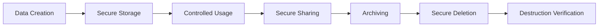
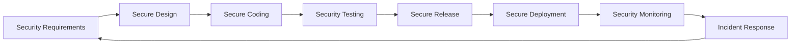
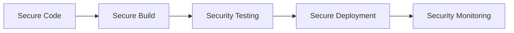
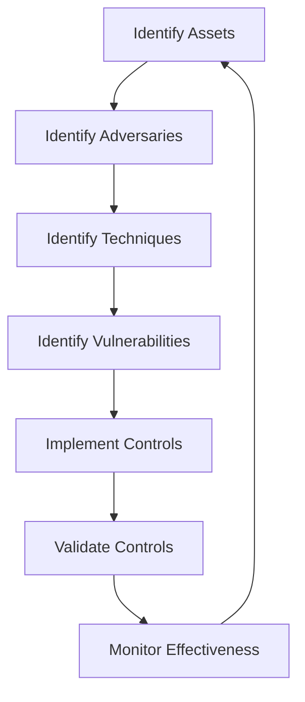

# THE WHEEL: SECURITY ARCHITECTURE

## Overview

This document outlines the comprehensive security architecture for The Wheel platform. Security is a foundational pillar of the platform, ensuring data protection, privacy, compliance, and trust for all users. The security architecture addresses authentication, authorization, data protection, network security, and compliance requirements.

---

## Security Principles

The Wheel's security architecture follows these core principles:

1. **Defense in Depth**: Multiple layers of security controls to protect against various attack vectors
2. **Least Privilege**: Users and systems have only the minimum permissions necessary
3. **Zero Trust**: Verification required for all users and systems, regardless of location
4. **Privacy by Design**: Privacy controls embedded in all aspects of the platform
5. **Secure by Default**: Security enabled out-of-the-box with secure default configurations
6. **Continuous Verification**: Ongoing testing, monitoring, and verification of security controls

---

## Authentication System

### Multi-factor Authentication (MFA)

- Email/password authentication with strong password policies
- Optional MFA via authenticator apps (TOTP)
- SMS verification as a fallback when enabled
- WebAuthn support for biometric and hardware security keys
- Social authentication with secure OAuth 2.0 integrations

### Session Management

- JWT-based authentication with proper signature validation
- Short-lived access tokens (15 minutes)
- Longer-lived refresh tokens (7 days) with secure rotation
- Secure cookie storage with HttpOnly and SameSite flags
- Automatic session termination after inactivity

### Account Security

- Secure account recovery workflows
- Rate limiting on authentication attempts
- Real-time notifications of suspicious login attempts
- Device management and active session visibility
- Progressive security measures based on risk assessment

---

## Authorization Framework

### Role-Based Access Control (RBAC)

- Platform-level roles (Admin, User, Guest)
- Company-level roles (Owner, Admin, Member)
- Mode-specific permissions (Founder, Advisor, Investor)
- Fine-grained permission inheritance hierarchy
- Attribute-based access control for complex scenarios

### Row-Level Security (RLS)

- Database-enforced security policies
- Multi-tenant data isolation
- Mode-aware data visibility rules
- History-based access for previous collaborations
- Time-bound access controls for temporary permissions

### API Security

- Consistent authorization checks across all endpoints
- Scoped API tokens with limited permissions
- CORS policies to prevent unauthorized cross-origin requests
- Content Security Policy implementation
- API rate limiting and abuse prevention

---

## Data Protection

### Data Classification

| Classification | Description | Examples | Controls |
|----------------|-------------|----------|----------|
| Public | Information intended for public consumption | Marketing materials, public documentation | Integrity checks |
| Internal | Information for authenticated users | Knowledge Hub resources, Community content | Authentication required |
| Confidential | Sensitive business information | Financial data, strategic plans | Role-based access, encryption |
| Restricted | Highly sensitive information | Payment details, authentication credentials | End-to-end encryption, strict access |

### Encryption Strategy

#### Data in Transit

- TLS 1.3 for all communications
- Strong cipher suites with Perfect Forward Secrecy
- HSTS implementation
- Certificate pinning for mobile applications
- Secure WebSocket connections for real-time features

#### Data at Rest

- Database column-level encryption for sensitive fields
- Transparent data encryption for database files
- Encryption key management through AWS KMS
- File storage encryption with unique keys per file
- Immutable audit logs for all encryption operations

#### End-to-End Encryption

- E2E encryption for message-based communications
- Client-side encryption for designated user documents
- Key management system for E2E encrypted content
- Secure key exchange protocols
- Support for user-managed encryption keys

### Secure Data Lifecycle



- Data minimization principles
- Automated data retention policies
- Secure data removal and destruction procedures
- Verified destruction of sensitive information
- Data lifecycle audit trails

---

## Application Security

### Secure Development Lifecycle



- Security requirements in all user stories
- Threat modeling during design phase
- Secure coding standards and reviews
- SAST and DAST automation
- Pre-release security validation
- Security monitoring in production
- Regular security assessments and penetration testing

### Common Vulnerability Protection

- Input validation and sanitization
- Output encoding to prevent XSS
- Parameterized queries to prevent SQL injection
- Protection against CSRF attacks
- Security headers implementation
- JSON schema validation
- File upload scanning and validation
- WebSocket security controls

### Dependency Security

- Automated dependency scanning
- Vulnerability monitoring and alerting
- Dependency update policies
- Software Bill of Materials (SBOM) generation
- License compliance verification
- Private package repository with security scanning
- Blocked vulnerable package versions

---

## Infrastructure Security

### Cloud Security

- AWS Well-Architected Framework implementation
- Infrastructure as Code with security validation
- Network segmentation and isolation
- Security groups with least privilege access
- VPC design with private subnets
- WAF implementation for edge protection
- DDoS protection with AWS Shield
- Scheduled security assessments

### Containerization Security

- Minimal container images based on distroless/alpine
- Image scanning in CI/CD pipeline
- Image signing and verification
- Runtime container security monitoring
- Kubernetes security policies
- Service mesh with mutual TLS
- Secrets management with AWS Secrets Manager
- Ephemeral container credentials

### CI/CD Security



- Secure pipeline configuration
- Infrastructure validation tests
- Automated security scanning
- Artifact signing and verification
- Deployment approval workflows
- Security gates at each stage
- Immutable deployments
- Infrastructure drift detection

---

## Monitoring and Incident Response

### Security Monitoring

- Centralized logging with encryption
- Real-time security event monitoring
- User behavior analytics
- Anomaly detection for unusual activities
- Automated threat intelligence integration
- Continuous compliance monitoring
- Periodic security reviews
- Monitoring of identity and access events

### Incident Response Plan

1. **Preparation**: Documentation, training, and tools in place
2. **Detection**: Identification of potential security incidents
3. **Analysis**: Investigation to determine scope and impact
4. **Containment**: Isolation of affected systems
5. **Eradication**: Removal of the threat
6. **Recovery**: Restoration of systems to normal operation
7. **Post-Incident**: Lessons learned and improvements

### Security Runbooks

- Account takeover response
- Data breach containment
- Malware/ransomware response
- Denial of service mitigation
- Unauthorized access handling
- Third-party breach response
- Physical security incident response
- Social engineering incident response

---

## Compliance Framework

### Regulatory Compliance

- GDPR compliance for EU users
- CCPA/CPRA compliance for California residents
- SOC 2 Type II certification
- PCI DSS compliance for payment processing
- HIPAA compliance for any health-related data
- Regional compliance requirements addressed
- Compliance documentation maintained
- Regular compliance audits

### Privacy Controls

- Privacy policy management
- Data processing agreements
- User consent management
- Right to access implementation
- Right to be forgotten workflows
- Data portability features
- Processing limitations enforcement
- Privacy impact assessments
- Data protection impact assessments

### Audit Capabilities

- Comprehensive audit logging
- Immutable audit trails
- User activity monitoring
- Administrative action logging
- Security event recording
- System change tracking
- Data access auditing
- Compliance monitoring logs

---

## Risk Management

### Risk Assessment

- Regular security risk assessments
- Vulnerability management program
- Third-party risk assessments
- Cloud security posture management
- Application risk monitoring
- Emerging threat intelligence
- Business impact analysis
- Risk treatment planning

### Threat Modeling



- STRIDE threat modeling
- Attack surface analysis
- Trust boundary identification
- Security control mapping
- Threat scenario development
- Risk scoring and prioritization
- Mitigation strategy development
- Continuous threat model updates

### Vendor Security

- Third-party security assessment process
- Vendor security questionnaires
- Service provider security requirements
- Cloud service provider security reviews
- Continuous vendor security monitoring
- Security incident response requirements
- Right to audit provisions
- Vendor access control and monitoring

---

## Security Testing

### Testing Methodology

- Regular penetration testing
- Automated vulnerability scanning
- Static application security testing (SAST)
- Dynamic application security testing (DAST)
- Interactive application security testing (IAST)
- API security testing
- Mobile application security testing
- Cloud configuration reviews

### Security Verification

- OWASP ASVS compliance
- Security requirement verification
- Control effectiveness testing
- Security regression testing
- Secure code review
- Architecture security review
- Threat model validation
- Compliance control testing

---

## User Privacy Controls

### Data Subject Rights

- Right to access personal data
- Right to rectification of inaccurate data
- Right to erasure ("right to be forgotten")
- Right to restrict processing
- Right to data portability
- Right to object to processing
- Rights related to automated decision making
- Withdrawal of consent mechanism

### Privacy Features

- Granular privacy settings
- Mode-specific privacy configurations
- Data sharing controls
- Activity and connection visibility settings
- Third-party integration permissions
- Location data controls
- Profile information visibility
- Communication preferences management

---

## Security Architecture Patterns

### Identity and Access Management

```
┌────────────────────────────────────────────────────┐
│                Identity Provider                    │
└───────────────────────┬────────────────────────────┘
                        │
                        ▼
┌────────────────────────────────────────────────────┐
│                Authentication Service               │
└───────────────────────┬────────────────────────────┘
                        │
                        ▼
┌────────────────────────────────────────────────────┐
│               Authorization Service                 │
└───────────────────────┬────────────────────────────┘
                        │
                        ▼
┌────────────────────────────────────────────────────┐
│            Permission Evaluation Engine             │
└────────────────────────────────────────────────────┘
```

### API Security Gateway

```
┌────────────────────────────────────────────────────┐
│                   Client Request                    │
└───────────────────────┬────────────────────────────┘
                        │
                        ▼
┌────────────────────────────────────────────────────┐
│               TLS Termination Layer                 │
└───────────────────────┬────────────────────────────┘
                        │
                        ▼
┌────────────────────────────────────────────────────┐
│              Authentication Check                   │
└───────────────────────┬────────────────────────────┘
                        │
                        ▼
┌────────────────────────────────────────────────────┐
│               Authorization Check                   │
└───────────────────────┬────────────────────────────┘
                        │
                        ▼
┌────────────────────────────────────────────────────┐
│                 Input Validation                    │
└───────────────────────┬────────────────────────────┘
                        │
                        ▼
┌────────────────────────────────────────────────────┐
│                 Rate Limiting                       │
└───────────────────────┬────────────────────────────┘
                        │
                        ▼
┌────────────────────────────────────────────────────┐
│                 API Routing                         │
└───────────────────────┬────────────────────────────┘
                        │
                        ▼
┌────────────────────────────────────────────────────┐
│               Microservice/API                      │
└────────────────────────────────────────────────────┘
```

### Data Encryption Architecture

```
┌─────────────────────────────────────────────────────┐
│                  Key Management System               │
└─────────┬───────────────────────────────┬───────────┘
          │                               │
          ▼                               ▼
┌─────────────────────┐       ┌─────────────────────────┐
│ Application Encrypt │       │   Database Encryption    │
└─────────┬───────────┘       └───────────┬─────────────┘
          │                               │
          ▼                               ▼
┌─────────────────────┐       ┌─────────────────────────┐
│   Encrypted Data    │       │    Encrypted Storage     │
└─────────────────────┘       └─────────────────────────┘
```

---

## Security Implementation Roadmap

### Phase 1: Foundation (Weeks 1-4)

1. **Authentication Infrastructure**
   * Implement core authentication system
   * Set up MFA capabilities
   * Establish session management
   * Configure secure password policies

2. **RBAC Implementation**
   * Design role hierarchy
   * Implement permission system
   * Create mode-specific security contexts
   * Develop row-level security policies

3. **Data Protection Essentials**
   * Implement TLS configurations
   * Set up database encryption
   * Establish secure key management
   * Configure secure data storage

### Phase 2: Enhancement (Weeks 5-10)

4. **Application Security**
   * Implement security scanning in CI/CD
   * Add security headers
   * Set up dependency scanning
   * Create input validation frameworks

5. **Monitoring and Logging**
   * Deploy centralized logging
   * Configure security monitoring
   * Implement audit trails
   * Set up alerting system

6. **Compliance Framework**
   * Document compliance requirements
   * Implement GDPR controls
   * Develop CCPA compliance features
   * Create compliance reporting

### Phase 3: Advanced (Weeks 11-16)

7. **Advanced Security Features**
   * Implement end-to-end encryption
   * Add intrusion detection
   * Deploy advanced threat protection
   * Enable user-managed encryption keys

8. **Security Automation**
   * Develop automated security testing
   * Implement continuous verification
   * Create security runbooks
   * Set up automated incident response

9. **Third-Party Security**
   * Develop vendor assessment process
   * Implement third-party monitoring
   * Create API security gateway
   * Enhance cloud security posture

---

## Security Responsibilities

### Development Team

- Secure coding practices
- Security testing in development
- Addressing security issues
- Security knowledge maintenance
- Collaboration with security team

### Security Team

- Security architecture design
- Security policy development
- Security monitoring and response
- Security assessment coordination
- Security awareness training

### Operations Team

- Secure infrastructure maintenance
- Patch management
- Security configuration management
- Backup and recovery
- Operational security monitoring

### Compliance Team

- Regulatory requirement tracking
- Compliance documentation
- Audit coordination
- Compliance reporting
- Privacy impact assessments

### All Team Members

- Security awareness
- Security policy adherence
- Incident reporting
- Security feedback
- Continuous security improvement

---

## Security Training and Awareness

### Security Training Program

- New employee security onboarding
- Annual security refresher training
- Role-specific security training
- Security certification support
- Secure development training
- Security tools training

### Security Awareness Activities

- Regular security newsletters
- Security awareness campaigns
- Phishing simulation exercises
- Security brown bag sessions
- Security champions program
- Security incident lessons learned
