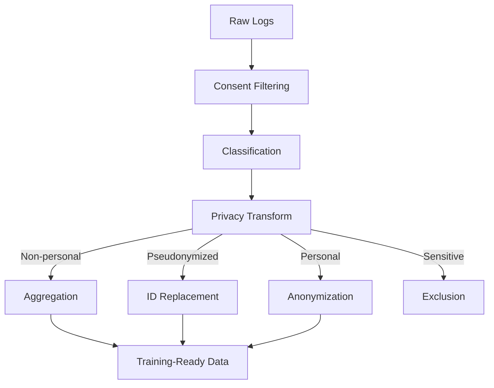
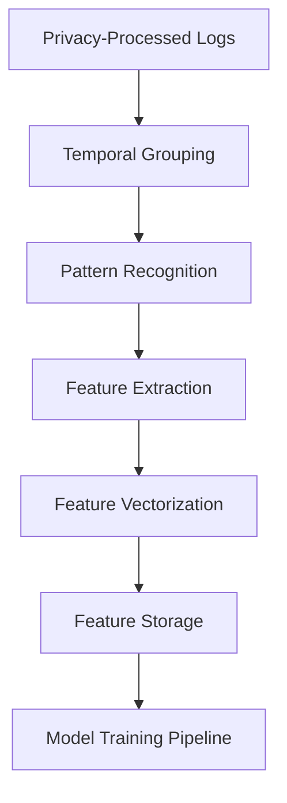
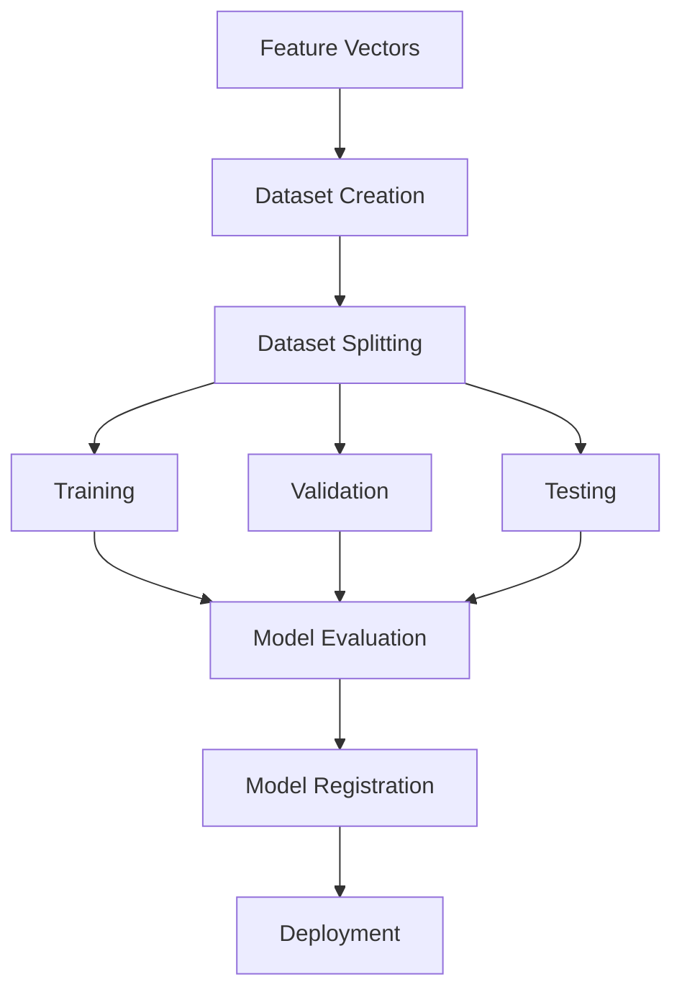

# Data Modeling: Comprehensive Logging System

## Overview

This document describes how logged data is processed, transformed, and used for model training while maintaining privacy. It outlines the data structures, processing pipelines, and modeling approaches utilized by the Comprehensive Logging System.

## Data Collection & Structure

### Data Categories

The system collects the following categories of data:

1. **User Interactions**: UI events, navigation patterns, feature usage
2. **Service Operations**: API calls, function execution, performance metrics
3. **AI Interactions**: Prompts, responses, feedback loops
4. **System Events**: Errors, warnings, diagnostics
5. **Business Events**: Task creation, idea generation, company activities

### Log Structure

Logs are stored with a consistent schema:

```typescript
interface LogEvent {
  id: string;
  user_id?: string;
  persona_id?: string;
  company_id?: string;
  event_type: string;
  event_source: string;
  component?: string;
  action: string;
  data: any; // JSONB in database
  metadata?: any; // JSONB in database
  data_classification: 'non_personal' | 'pseudonymized' | 'personal' | 'sensitive';
  retention_policy: 'transient' | 'short_term' | 'medium_term' | 'long_term';
  session_id?: string;
  client_info?: any;
  created_at: string;
}
```

### Data Relationships

The system maintains relationships between:

- Users and their actions
- Companies and their members
- Sessions and events
- Related actions within workflows

These relationships allow for contextual understanding of the data when used in model training.

## Data Processing Pipelines

### 1. Privacy Transformation Pipeline

Before data can be used for model training, it passes through privacy transformations:



#### Privacy Transformation Steps

1. **Consent Filtering**: Exclude data for users who haven't consented to relevant processing
2. **Classification**: Apply automatic classification to identify data sensitivity
3. **Privacy Transform**: Apply appropriate transformation based on classification level
4. **Aggregation/Anonymization**: Remove identifiers while preserving patterns

### 2. Feature Extraction Pipeline



#### Feature Extraction Steps

1. **Temporal Grouping**: Organize data by time windows (sessions, days, weeks)
2. **Pattern Recognition**: Identify recurring patterns and sequences
3. **Feature Extraction**: Transform raw data into meaningful features
4. **Vectorization**: Convert features to numerical representations for models

### 3. Model Training Pipeline



## Modeling Approaches

The system employs several modeling approaches depending on the use case:

### 1. Behavior Prediction Models

These models predict user behavior to enhance the application experience.

**Input Features**:
- Historical user actions
- Session context
- Feature engagement metrics
- Temporal patterns

**Model Types**:
- Sequence models (LSTM/GRU)
- Gradient boosting models
- Collaborative filtering

**Application**:
- Feature recommendation
- Usage pattern prediction
- Churn prediction
- Engagement optimization

### 2. Company Similarity Models

These models identify similarities between companies for cross-company insights.

**Input Features**:
- Company attributes (anonymized)
- Aggregate usage patterns
- Feature adoption timelines
- Growth metrics

**Model Types**:
- Clustering algorithms
- Similarity matrices
- Graph embedding models

**Application**:
- Benchmarking
- Best practice recommendations
- Industry trend analysis
- Growth pattern identification

### 3. Context Enhancement Models

These models build contextual understanding for improved personalization.

**Input Features**:
- User interaction history (pseudonymized)
- Content engagement metrics
- Session progression patterns
- Workflow completions

**Model Types**:
- Attention-based models
- Context-aware embeddings
- Temporal convolutional networks

**Application**:
- Content personalization
- Interface adaptation
- Contextual assistance
- Smart defaults

### 4. Resource Generation Models

These models create resources based on usage patterns.

**Input Features**:
- Successful workflow patterns
- Document templates and usage
- Common process sequences
- User feedback on resources

**Model Types**:
- Generative models
- Template-based generation
- Pattern recognition

**Application**:
- Template recommendation
- Process optimization
- Resource personalization
- Content generation

## Privacy-Preserving Machine Learning Techniques

The system implements several privacy-preserving techniques in its modeling:

### Differential Privacy

Applied to aggregate statistics to ensure individual users cannot be identified from results:

```typescript
function addDifferentialPrivacy(statistic: number, sensitivity: number, epsilon: number): number {
  // Add calibrated noise to protect privacy while maintaining statistical utility
  const scale = sensitivity / epsilon;
  const noise = laplacianNoise(scale);
  return statistic + noise;
}
```

### Federated Learning

Where appropriate, models are trained across distributed data without centralizing raw data:

1. Initial model is distributed to client instances
2. Local updates occur on client data
3. Model gradients (not data) are sent back to central system
4. Gradients are aggregated to improve the shared model

### K-Anonymity Enforcement

Ensures that any pattern in the data applies to at least k different users:

```typescript
function enforceKAnonymity(dataset: any[], k: number): any[] {
  // Group by quasi-identifiers
  const groups = groupByQuasiIdentifiers(dataset);
  
  // Filter out groups with fewer than k records
  return groups.filter(group => group.length >= k)
    .flatMap(group => group);
}
```

### Secure Multi-Party Computation

For sensitive operations across organizational boundaries:

1. Computation is split into multiple shares
2. Each party computes on encrypted shares
3. Results are combined without revealing inputs

## Model Evaluation & Improvement

### Metrics

Models are evaluated using:

1. **Performance Metrics**:
   - Accuracy, precision, recall for classification
   - RMSE, MAE for prediction
   - BLEU, ROUGE for generation

2. **Privacy Metrics**:
   - Privacy budget consumption
   - Membership inference resistance
   - Model inversion resistance

3. **Business Impact Metrics**:
   - User engagement lift
   - Task completion improvements
   - Resource utilization

### Feedback Loops

Models improve through several feedback mechanisms:

1. **Explicit Feedback**: User ratings and surveys
2. **Implicit Feedback**: Engagement with recommendations
3. **A/B Testing**: Controlled experiments
4. **Performance Monitoring**: Continuous evaluation

### Retraining Strategy

Models are retrained based on:

1. **Schedule-based**: Regular interval retraining
2. **Drift-based**: When input distribution changes
3. **Performance-based**: When metrics degrade
4. **Feature-based**: When new features are added

## Data Retention for Models

### Training Data Lifecycle

1. **Raw Data**: Retained according to classification-based retention policies
2. **Feature Vectors**: Retained with pseudonymized IDs
3. **Model Artifacts**: Retained for model lineage tracking
4. **Evaluation Results**: Retained for performance benchmarking

### Versioning

All data transformations and models are versioned to ensure:

1. Reproducibility of training
2. Audit trails for compliance
3. Rollback capabilities
4. Evolution tracking

## Integration with the Application

### Model Serving

Models are served through:

1. **Real-time API**: For interactive features
2. **Batch Processing**: For periodic insights
3. **Embedded Models**: For client-side predictions

### Feature Flagging

Model-driven features are controlled through feature flags:

1. **Gradual Rollout**: Staged enablement for users
2. **Fallback Mechanisms**: Safety nets for model failures
3. **A/B Testing**: Comparative analysis of model versions

## Monitoring & Observability

### Model Monitoring

Models are monitored for:

1. **Performance Drift**: Changes in accuracy or metrics
2. **Data Drift**: Changes in input distributions
3. **Prediction Monitoring**: Unusual patterns or outliers
4. **Resource Consumption**: CPU, memory, latency

### Alerts & Interventions

The system provides alerts for:

1. **Model Degradation**: Performance below thresholds
2. **Data Quality Issues**: Missing features or skewed distributions
3. **Privacy Concerns**: Potential exposure of sensitive patterns
4. **System Overloads**: High resource consumption

## Conclusion

The data modeling approach of the Comprehensive Logging System balances powerful insights with privacy protection. By carefully processing data through privacy-preserving pipelines before using it for model training, the system can deliver valuable features and insights without compromising user privacy.

For technical details on the implementation of these models, refer to the model specification documents in the developer documentation.
