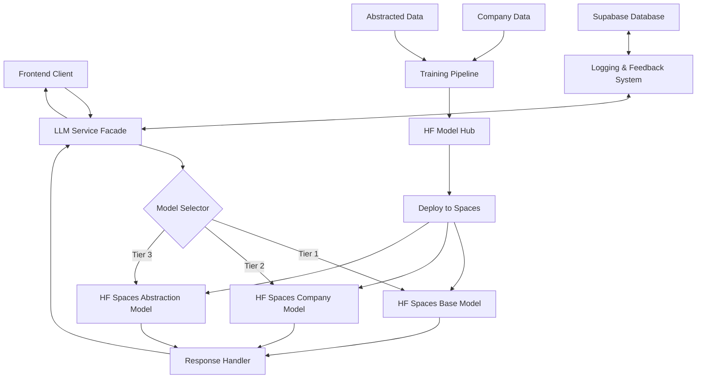
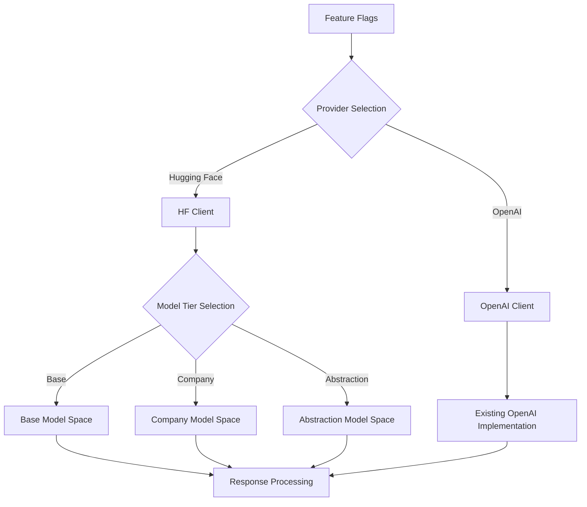

# Technical Architecture: Hugging Face Spaces Triple LLM

## High-Level Architecture



## Component Descriptions

### 1. LLM Service Facade

The LLM Service Facade serves as the primary entry point for all LLM-related operations. It coordinates requests between the client applications and the appropriate model tier based on the specific context and requirements of each request.

**Responsibilities:**
- Route requests to the appropriate model based on context
- Handle authentication and authorization
- Implement caching strategies
- Process and format responses
- Log requests and responses
- Implement fallback mechanisms for service disruptions

### 2. Model Selector

The Model Selector determines which tier of the LLM architecture should handle a specific request based on:

- Request context (company-specific, general knowledge, etc.)
- User permissions and settings
- Feature flags and system configuration
- Request priority and performance requirements

### 3. Hugging Face Spaces Endpoints

Three distinct Hugging Face Spaces will be created to handle the different tiers of the architecture:

1. **Base Model Space**: Serves as the foundation for general queries without specific company context
2. **Company Model Space**: Specialized for company-specific knowledge and queries
3. **Abstraction Model Space**: Handles pattern recognition and insights across similar businesses

Each Space exposes an API endpoint that can be called from our application.

### 4. Response Handler

Processes responses from the models, ensuring consistent formatting, error handling, and post-processing:

- Standardizes response formats
- Enriches responses with metadata
- Filters inappropriate content
- Handles errors and timeouts
- Implements retry logic when necessary

### 5. Training Pipeline

Responsible for preparing data, training models, and deploying them to Hugging Face Spaces:

- Data extraction and preprocessing
- Model selection and configuration
- Training and evaluation workflows
- Model versioning and deployment
- Performance monitoring and feedback loop

## Data Flow

### Request Flow

1. User interacts with the application, triggering an LLM request
2. Request is sent to the LLM Service Facade
3. Feature flags are checked to determine if Hugging Face Spaces should be used
4. If Hugging Face is enabled, the Model Selector determines which tier to use
5. Request is formatted and sent to the appropriate Hugging Face Space
6. Space processes the request and returns a response
7. Response is processed by the Response Handler
8. Processed response is returned to the user

### Feedback and Learning Flow

1. User interaction with LLM responses is logged
2. Feedback is stored in the database
3. Training pipeline extracts features from logs and feedback
4. New models are trained using company data and abstracted patterns
5. Trained models are pushed to Hugging Face Model Hub
6. Models are deployed to their respective Spaces
7. Future requests benefit from improved models

## Feature Flag System

The feature flag system allows for easy toggling between different LLM providers and model configurations:



## Database Schema Extensions

```sql
-- Add Hugging Face specific columns to model_registry
ALTER TABLE model_registry ADD COLUMN IF NOT EXISTS hf_space_url TEXT;
ALTER TABLE model_registry ADD COLUMN IF NOT EXISTS hf_model_id TEXT;
ALTER TABLE model_registry ADD COLUMN IF NOT EXISTS hf_space_id TEXT;

-- Add a new table for Space configurations
CREATE TABLE IF NOT EXISTS hf_spaces_config (
  id UUID PRIMARY KEY DEFAULT gen_random_uuid(),
  space_name TEXT NOT NULL,
  space_type TEXT NOT NULL, -- 'base', 'company', 'abstraction'
  api_endpoint TEXT NOT NULL,
  is_active BOOLEAN DEFAULT TRUE,
  model_version TEXT,
  created_at TIMESTAMP WITH TIME ZONE DEFAULT now(),
  updated_at TIMESTAMP WITH TIME ZONE DEFAULT now()
);

-- Table for tracking Space deployments
CREATE TABLE IF NOT EXISTS hf_deployments (
  id UUID PRIMARY KEY DEFAULT gen_random_uuid(),
  space_id UUID REFERENCES hf_spaces_config(id),
  model_id UUID REFERENCES model_registry(id),
  deployment_status TEXT NOT NULL,
  deployment_logs TEXT,
  created_at TIMESTAMP WITH TIME ZONE DEFAULT now(),
  updated_at TIMESTAMP WITH TIME ZONE DEFAULT now()
);
```

## Integration with Existing Systems

This implementation integrates with several existing systems:

1. **Feature Flags System**: Controls which LLM provider to use
2. **Logging Service**: Tracks LLM usage and performance metrics
3. **Model Training Service**: Facilitates training and deployment of new models
4. **Supabase Database**: Stores model metadata, configurations, and feedback

## Security Considerations

1. **API Key Management**: Hugging Face API keys must be securely stored in environment variables
2. **Request/Response Encryption**: All communication with Hugging Face Spaces is encrypted via HTTPS
3. **Access Control**: Spaces can be configured with private visibility to restrict access
4. **Data Privacy**: Ensure sensitive data is anonymized before being used for training
5. **Rate Limiting**: Implement rate limiting to prevent abuse and manage costs
