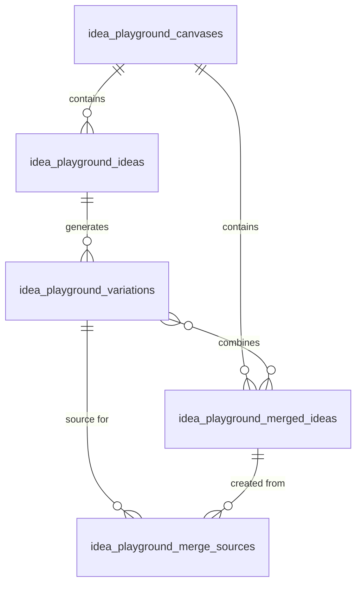
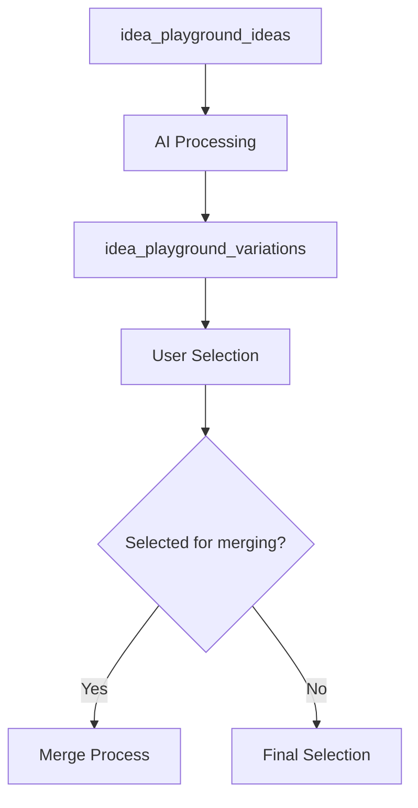
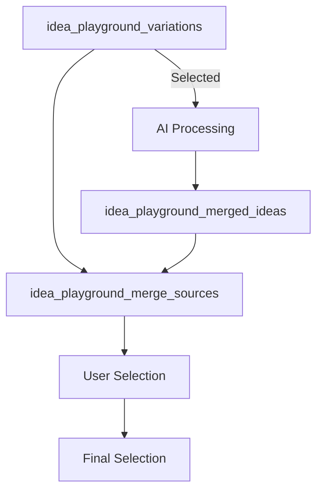

# Idea Playground Pathway 1: Data Modeling

This document details the database schema design for the Idea Playground Pathway 1 feature, including tables, relationships, and data flows.

## Database Schema

The Idea Playground Pathway 1 feature extends the existing database schema with three new tables:

### Tables

#### 1. idea_playground_variations

Stores variations of original ideas generated by the AI.

| Column | Type | Nullable | Default | Description |
|--------|------|----------|---------|-------------|
| id | UUID | No | uuid_generate_v4() | Primary key |
| parent_idea_id | UUID | No | | Foreign key to idea_playground_ideas |
| title | VARCHAR(255) | No | | Variation title |
| description | TEXT | Yes | | Detailed description |
| problem_statement | TEXT | Yes | | Problem addressed |
| solution_concept | TEXT | Yes | | Proposed solution |
| target_audience | TEXT | Yes | | Target market |
| unique_value | TEXT | Yes | | Value proposition |
| business_model | TEXT | Yes | | Business model |
| marketing_strategy | TEXT | Yes | | Marketing approach |
| revenue_model | TEXT | Yes | | Revenue generation |
| go_to_market | TEXT | Yes | | Go-to-market strategy |
| market_size | TEXT | Yes | | Market size estimate |
| strengths | TEXT[] | Yes | '{}' | Array of strengths |
| weaknesses | TEXT[] | Yes | '{}' | Array of weaknesses |
| opportunities | TEXT[] | Yes | '{}' | Array of opportunities |
| threats | TEXT[] | Yes | '{}' | Array of threats |
| is_selected | BOOLEAN | No | false | Selection status |
| is_merged | BOOLEAN | No | false | Merged status |
| created_at | TIMESTAMP WITH TIME ZONE | No | NOW() | Creation timestamp |
| updated_at | TIMESTAMP WITH TIME ZONE | No | NOW() | Update timestamp |

**Indexes:**
- Primary Key: id
- Foreign Key: parent_idea_id → idea_playground_ideas.id (with CASCADE deletion)
- Index on parent_idea_id for performance

#### 2. idea_playground_merged_ideas

Stores merged ideas generated from multiple variations.

| Column | Type | Nullable | Default | Description |
|--------|------|----------|---------|-------------|
| id | UUID | No | uuid_generate_v4() | Primary key |
| canvas_id | UUID | No | | Foreign key to idea_playground_canvases |
| title | VARCHAR(255) | No | | Merged idea title |
| description | TEXT | Yes | | Detailed description |
| problem_statement | TEXT | Yes | | Problem addressed |
| solution_concept | TEXT | Yes | | Proposed solution |
| target_audience | TEXT | Yes | | Target market |
| unique_value | TEXT | Yes | | Value proposition |
| business_model | TEXT | Yes | | Business model |
| marketing_strategy | TEXT | Yes | | Marketing approach |
| revenue_model | TEXT | Yes | | Revenue generation |
| go_to_market | TEXT | Yes | | Go-to-market strategy |
| market_size | TEXT | Yes | | Market size estimate |
| strengths | TEXT[] | Yes | '{}' | Array of strengths |
| weaknesses | TEXT[] | Yes | '{}' | Array of weaknesses |
| opportunities | TEXT[] | Yes | '{}' | Array of opportunities |
| threats | TEXT[] | Yes | '{}' | Array of threats |
| is_selected | BOOLEAN | No | false | Selection status |
| created_at | TIMESTAMP WITH TIME ZONE | No | NOW() | Creation timestamp |
| updated_at | TIMESTAMP WITH TIME ZONE | No | NOW() | Update timestamp |

**Indexes:**
- Primary Key: id
- Foreign Key: canvas_id → idea_playground_canvases.id (with CASCADE deletion)
- Index on canvas_id for performance

#### 3. idea_playground_merge_sources

Maps the relationship between merged ideas and their source variations.

| Column | Type | Nullable | Default | Description |
|--------|------|----------|---------|-------------|
| merged_idea_id | UUID | No | | Foreign key to idea_playground_merged_ideas |
| variation_id | UUID | No | | Foreign key to idea_playground_variations |
| created_at | TIMESTAMP WITH TIME ZONE | No | NOW() | Creation timestamp |

**Indexes:**
- Primary Key: (merged_idea_id, variation_id)
- Foreign Key: merged_idea_id → idea_playground_merged_ideas.id (with CASCADE deletion)
- Foreign Key: variation_id → idea_playground_variations.id (with CASCADE deletion)
- Index on merged_idea_id for performance
- Index on variation_id for performance

### Entity Relationship Diagram



## Database Triggers

### Timestamp Management

To automatically update the `updated_at` field when a record is modified, we implement the following triggers:

#### For idea_playground_variations:

```sql
CREATE OR REPLACE FUNCTION update_idea_variation_timestamp()
RETURNS TRIGGER AS $$
BEGIN
  NEW.updated_at = NOW();
  RETURN NEW;
END;
$$ LANGUAGE plpgsql;

CREATE TRIGGER update_idea_variation_timestamp
BEFORE UPDATE ON idea_playground_variations
FOR EACH ROW
EXECUTE FUNCTION update_idea_variation_timestamp();
```

#### For idea_playground_merged_ideas:

```sql
CREATE OR REPLACE FUNCTION update_merged_idea_timestamp()
RETURNS TRIGGER AS $$
BEGIN
  NEW.updated_at = NOW();
  RETURN NEW;
END;
$$ LANGUAGE plpgsql;

CREATE TRIGGER update_merged_idea_timestamp
BEFORE UPDATE ON idea_playground_merged_ideas
FOR EACH ROW
EXECUTE FUNCTION update_merged_idea_timestamp();
```

## Data Transformation Flows

### Idea to Variations Flow

1. Original idea is stored in `idea_playground_ideas`
2. AI generates variations based on original idea
3. Variations are stored in `idea_playground_variations` with reference to parent idea



### Variations to Merged Ideas Flow

1. Selected variations from `idea_playground_variations` are sent to AI
2. AI generates merged ideas combining elements from selected variations
3. Merged ideas are stored in `idea_playground_merged_ideas`
4. Relationships between variations and merged ideas are stored in `idea_playground_merge_sources`



## Query Patterns

### Common Queries

#### Get Variations for an Idea:

```sql
SELECT * FROM idea_playground_variations
WHERE parent_idea_id = :idea_id
ORDER BY created_at ASC;
```

#### Get Selected Variations:

```sql
SELECT * FROM idea_playground_variations
WHERE parent_idea_id = :idea_id AND is_selected = true
ORDER BY created_at ASC;
```

#### Get Merged Ideas for a Canvas:

```sql
SELECT * FROM idea_playground_merged_ideas
WHERE canvas_id = :canvas_id
ORDER BY created_at DESC;
```

#### Get Source Variations for a Merged Idea:

```sql
SELECT v.*
FROM idea_playground_variations v
JOIN idea_playground_merge_sources ms ON v.id = ms.variation_id
WHERE ms.merged_idea_id = :merged_idea_id;
```

## Performance Considerations

### Indexing Strategy

The schema includes indexes on all foreign key relationships and commonly queried fields to ensure optimal performance:

1. Primary key indexes on all tables
2. Foreign key indexes for quick relationship lookups
3. Composite indexes on join tables

### Query Optimization

For large datasets, consider:

1. Pagination for variation and merged idea lists
2. Lazy loading for full idea details
3. Caching frequently accessed variations

## Migration Strategy

The implementation will use a single migration script to create all new tables, triggers, and indexes. The migration script should be designed to be idempotent (safe to run multiple times).

### Migration Steps:

1. Create new tables if they don't exist
2. Create indexes on the new tables
3. Create triggers for timestamp management
4. Add any necessary constraints

## Data Security

Access to variations and merged ideas should follow the same security model as the original ideas:

1. Users can only access their own ideas and variations
2. Company members can access company-wide ideas and variations
3. All data is secured with row-level security policies

## Data Validation

The service layer should implement validation to ensure:

1. Variation titles are not empty
2. Parent idea references are valid
3. Merged idea references are valid
4. SWOT analysis arrays contain valid entries
