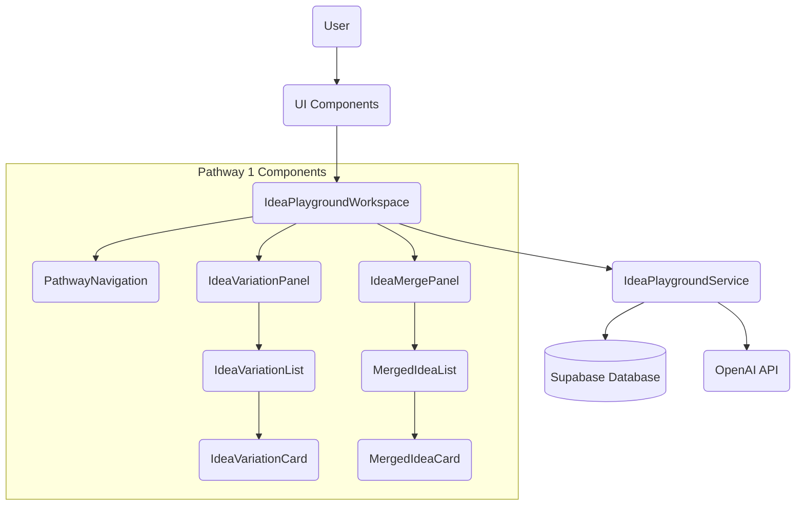
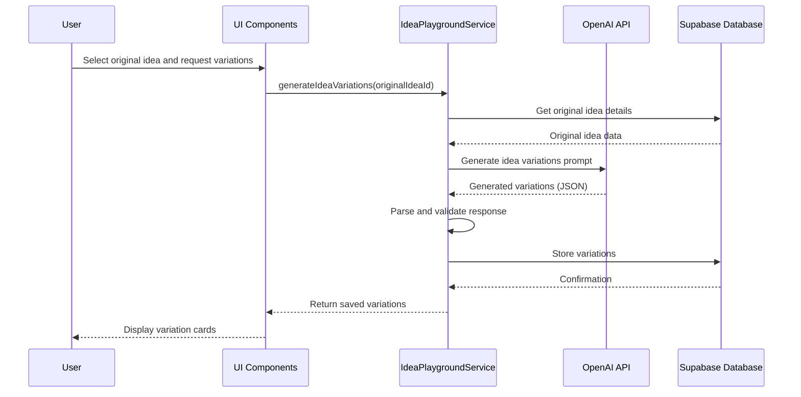
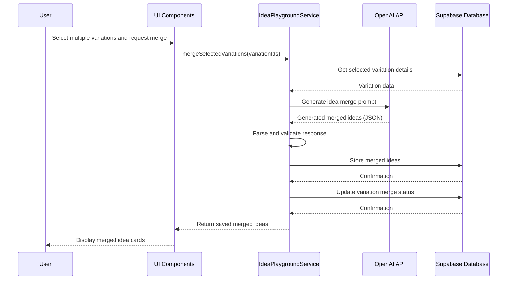
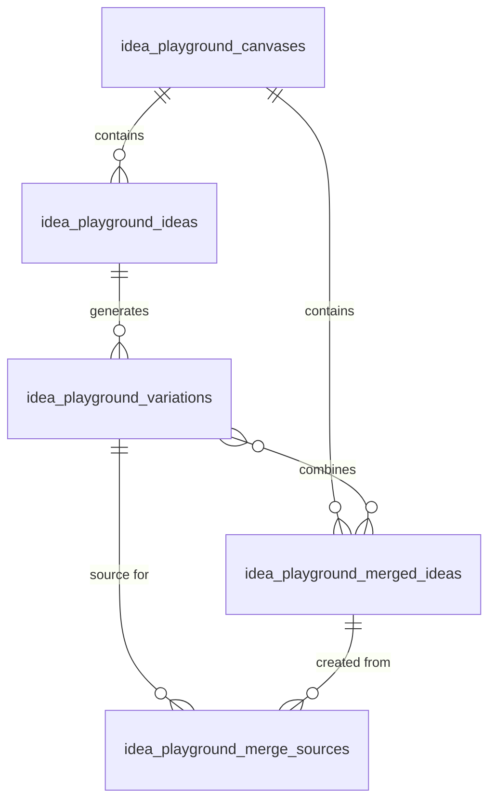

# Idea Playground Pathway 1: Technical Architecture

This document outlines the technical architecture for the Idea Playground Pathway 1 feature, including system components, data flow, database schema, and integration points.

## System Architecture Overview

The Idea Playground Pathway 1 feature extends the existing Idea Playground architecture with new components to support idea variation generation, selection, and merging.

## Component Descriptions

### UI Components

1. **IdeaPlaygroundWorkspace**
   - Main container component that orchestrates the pathway flow
   - Manages pathway state and navigation between steps
   - Coordinates communication between child components

2. **PathwayNavigation**
   - Displays the current step in the pathway
   - Provides controls for moving between steps
   - Includes back, next, and finish buttons

3. **IdeaVariationPanel**
   - Panel for displaying and managing idea variations
   - Includes controls for generating variations
   - Manages variation selection state

4. **IdeaVariationList**
   - Grid layout for displaying multiple idea variation cards
   - Handles layout and responsiveness

5. **IdeaVariationCard**
   - Card component for an individual idea variation
   - Displays idea summary with expandable details
   - Includes selection mechanism
   - Shows SWOT analysis

6. **IdeaMergePanel**
   - Panel for managing the merging of selected variations
   - Includes controls for generating merged ideas
   - Manages merged idea selection state

7. **MergedIdeaList**
   - Grid layout for displaying merged idea cards
   - Handles layout and responsiveness

8. **MergedIdeaCard**
   - Card component for a merged idea
   - Displays merged idea summary with expandable details
   - Includes selection mechanism
   - Shows relationship to source variations

### Service Components

1. **IdeaPlaygroundService**
   - Contains business logic for Idea Playground
   - New methods for variation generation and merging
   - Handles communication with the database and AI service

2. **OpenAI Integration**
   - Used through General LLM Service
   - Generates idea variations based on original idea
   - Generates merged ideas from selected variations

## Data Flow

### Idea Variation Generation Flow

### Idea Merging Flow

## Database Schema

The feature adds three new tables to the existing database schema:

### 1. idea_playground_variations

Stores idea variations generated from original ideas.

| Column | Type | Description |
|--------|------|-------------|
| id | UUID | Primary key |
| parent_idea_id | UUID | Foreign key to idea_playground_ideas |
| title | VARCHAR(255) | Variation title |
| description | TEXT | Detailed description |
| problem_statement | TEXT | Problem addressed |
| solution_concept | TEXT | Proposed solution |
| target_audience | TEXT | Target market |
| unique_value | TEXT | Value proposition |
| business_model | TEXT | Business model |
| marketing_strategy | TEXT | Marketing approach |
| revenue_model | TEXT | Revenue generation |
| go_to_market | TEXT | Go-to-market strategy |
| market_size | TEXT | Market size estimate |
| strengths | TEXT[] | Array of strengths |
| weaknesses | TEXT[] | Array of weaknesses |
| opportunities | TEXT[] | Array of opportunities |
| threats | TEXT[] | Array of threats |
| is_selected | BOOLEAN | Selection status |
| is_merged | BOOLEAN | Merged status |
| created_at | TIMESTAMP | Creation timestamp |
| updated_at | TIMESTAMP | Update timestamp |

### 2. idea_playground_merged_ideas

Stores merged ideas generated from multiple variations.

| Column | Type | Description |
|--------|------|-------------|
| id | UUID | Primary key |
| canvas_id | UUID | Foreign key to idea_playground_canvases |
| title | VARCHAR(255) | Merged idea title |
| description | TEXT | Detailed description |
| problem_statement | TEXT | Problem addressed |
| solution_concept | TEXT | Proposed solution |
| target_audience | TEXT | Target market |
| unique_value | TEXT | Value proposition |
| business_model | TEXT | Business model |
| marketing_strategy | TEXT | Marketing approach |
| revenue_model | TEXT | Revenue generation |
| go_to_market | TEXT | Go-to-market strategy |
| market_size | TEXT | Market size estimate |
| strengths | TEXT[] | Array of strengths |
| weaknesses | TEXT[] | Array of weaknesses |
| opportunities | TEXT[] | Array of opportunities |
| threats | TEXT[] | Array of threats |
| is_selected | BOOLEAN | Selection status |
| created_at | TIMESTAMP | Creation timestamp |
| updated_at | TIMESTAMP | Update timestamp |

### 3. idea_playground_merge_sources

Maps the relationship between merged ideas and their source variations.

| Column | Type | Description |
|--------|------|-------------|
| merged_idea_id | UUID | Foreign key to idea_playground_merged_ideas |
| variation_id | UUID | Foreign key to idea_playground_variations |
| created_at | TIMESTAMP | Creation timestamp |

## Entity Relationship Diagram

## Integration Points

### 1. OpenAI API Integration

- Uses the existing `generalLLMService` to communicate with the OpenAI API
- Requires two new prompt templates:
  - Idea variation generation prompt
  - Idea merging prompt
- Handles JSON response parsing and error handling

### 2. Supabase Database Integration

- Extends the existing database schema with three new tables
- Uses Supabase RPC functions for complex operations
- Requires database triggers for timestamp management

## State Management

The pathway requires tracking several state variables in the `IdeaPlaygroundWorkspace` component:

1. `currentStep`: Tracks the current step in the pathway (enum: 'initial_idea', 'variations', 'selection', 'merge', 'final_selection')
2. `selectedIdea`: The original idea selected for variation
3. `variations`: Array of generated variations
4. `selectedVariations`: Array of selected variation IDs
5. `mergedIdeas`: Array of generated merged ideas
6. `selectedMergedIdea`: ID of the selected final idea
7. `isLoading`: Loading state during AI operations

## Performance Considerations

1. **Lazy Loading**: Implementation should use lazy loading for idea details to improve initial load time
2. **Response Caching**: AI-generated variations should be cached to avoid unnecessary regeneration
3. **Optimistic Updates**: UI should implement optimistic updates for selection operations
4. **Pagination**: If the number of variations or merged ideas becomes large, implement pagination

## Security Considerations

1. **Permissions**: Access to idea variations and merged ideas should respect the same permission model as the original ideas
2. **Data Sanitization**: All user inputs should be sanitized before being included in AI prompts
3. **Rate Limiting**: Implement rate limiting for AI operations to prevent abuse

## Future Extensions

1. **Variation Templates**: Allow users to select from different variation strategies (disruptive, incremental, etc.)
2. **Custom SWOT**: Enable users to edit the SWOT analysis for variations
3. **Multiple Merges**: Support multiple rounds of merging for more refined ideas
4. **Comparison View**: Add a side-by-side comparison view for variations and merged ideas
