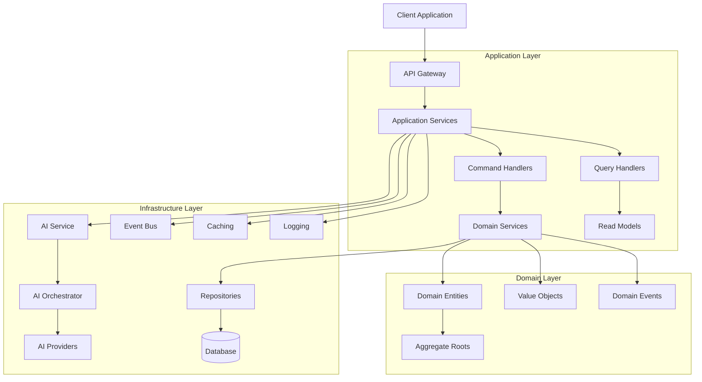
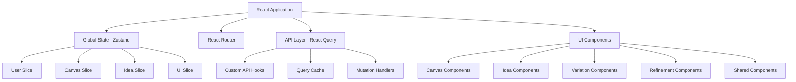
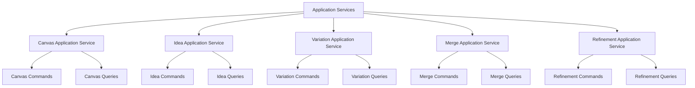
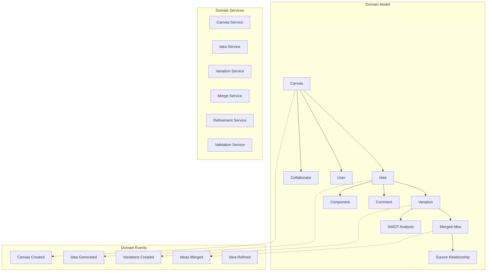
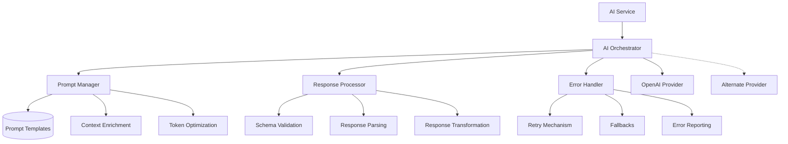
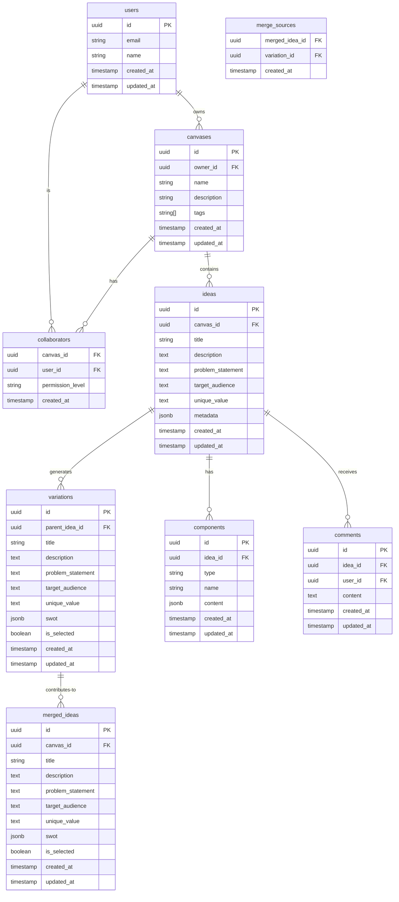
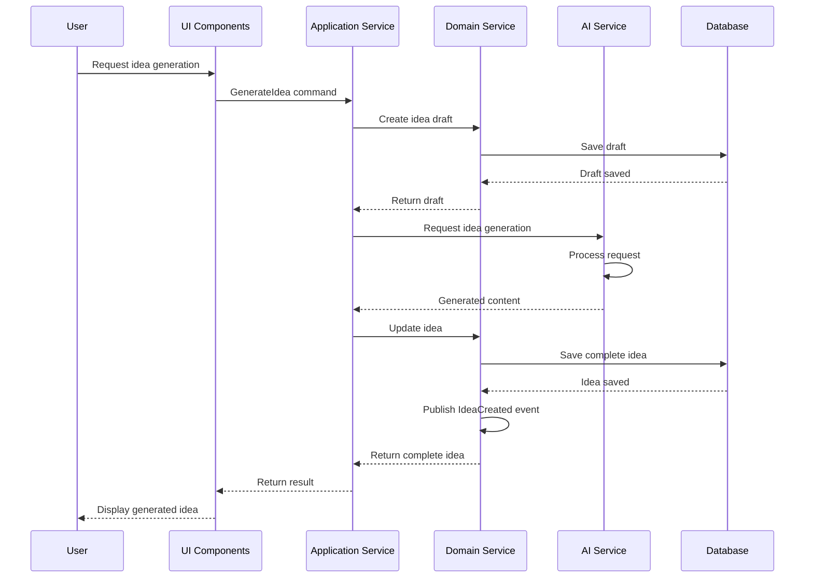
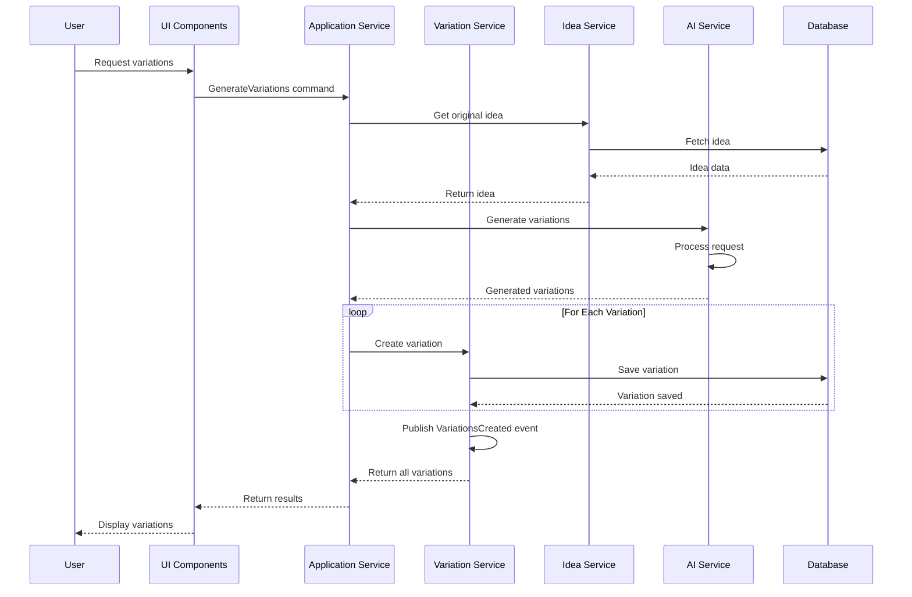

# Idea Playground Rebuild: Architecture

## System Architecture Overview

The Idea Playground rebuild adopts a comprehensive domain-driven architecture with clear separation of concerns, robust error handling, and optimal performance characteristics. The following diagram illustrates the high-level system architecture:

## Component Architecture

### Client Application

The client application is a React-based single-page application (SPA) with the following key architectural components:

1. **State Management**: Uses Zustand for global state management with slice pattern for modularity
2. **API Communication**: React Query for data fetching, caching, and synchronization
3. **UI Components**: Composite component pattern with composition for flexibility
4. **Routing**: React Router with typed routes for navigation and deep linking
5. **Error Boundary**: Hierarchical error boundaries for isolated error handling

### Application Layer

The application layer coordinates use cases by delegating to domain services:

1. **Command Handlers**: Process user actions that modify state
2. **Query Handlers**: Process read operations optimized for specific views
3. **Application Services**: Orchestrate use cases spanning multiple domain services
4. **DTOs**: Data Transfer Objects for API communication

### Domain Layer

The domain layer contains the business logic and domain rules:

1. **Aggregate Roots**: Canvas, Idea, Variation, MergedIdea (enforce invariants)
2. **Entities**: Objects with identity and lifecycle
3. **Value Objects**: Immutable objects without identity
4. **Domain Events**: Represent significant state changes in the domain
5. **Domain Services**: Implement domain logic that doesn't fit naturally in entities

### Infrastructure Layer

The infrastructure layer provides technical capabilities:

1. **Repositories**: Data access abstractions for domain objects
2. **AI Service**: API client and orchestration for AI operations
3. **Event Bus**: Publish-subscribe mechanism for domain events
4. **Caching**: Performance optimization for frequently accessed data
5. **Logging**: Comprehensive logging for monitoring and debugging

#### AI Service Architecture

The AI Service is a critical component with specialized architecture:

## Database Schema

## Integration Points

### 1. Authentication System

The Idea Playground integrates with the existing authentication system:

- JWT token-based authentication
- Role-based access control
- Session management

### 2. OpenAI Integration

Integration with OpenAI's API for AI-powered features:

- GPT-4 for idea generation and refinement
- Function calling for structured output
- Input validation and output parsing
- Context management for coherent AI operations

### 3. Event System

Event-based architecture for loose coupling:

- Domain events published through event bus
- Subscribers consume events for side effects
- Cross-domain communication via events

### 4. Logging System

Integration with the comprehensive logging system:

- Structured logging for all operations
- Error tracking and reporting
- Performance monitoring
- AI interaction logging

## Data Flow

### 1. Idea Generation Flow

### 2. Variation Generation Flow

## Performance Considerations

1. **Lazy Loading**: Components and data loaded on-demand
2. **Caching Strategy**:
   - Short-term cache for AI results
   - Long-term cache for reference data
   - Cache invalidation on updates
3. **Pagination**:
   - Client-side pagination for small datasets
   - Server-side pagination for large datasets
4. **Connection Pooling**:
   - Database connection pooling
   - API client pooling for external services

## Security Architecture

1. **Authentication**:
   - JWT-based authentication
   - Short-lived access tokens
   - Refresh token rotation

2. **Authorization**:
   - Role-based access control
   - Object-level permissions
   - Permission checks in application services

3. **Data Protection**:
   - Data encryption at rest
   - Secure API communication (HTTPS)
   - Input validation and output sanitization

4. **API Security**:
   - Rate limiting
   - Request validation
   - CSRF protection

## Error Handling Strategy

1. **Domain Errors**:
   - Rich domain error types
   - Error classification by severity
   - Error translation for UI

2. **Infrastructure Errors**:
   - Retry mechanisms for transient failures
   - Circuit breakers for external services
   - Fallback mechanisms for degraded operation

3. **UI Error Handling**:
   - Component-level error boundaries
   - Contextual error messages
   - Recovery options for users

## Monitoring and Observability

1. **Performance Metrics**:
   - Response times
   - Error rates
   - Resource utilization

2. **Business Metrics**:
   - User engagement
   - Feature usage
   - Conversion rates

3. **AI Operation Metrics**:
   - Token usage
   - Response quality
   - Error classification
