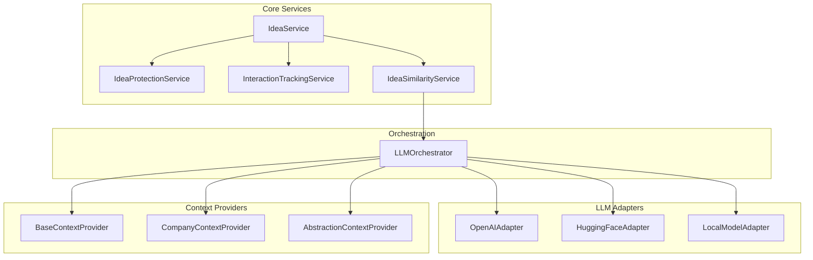

# Backend Services Implementation

This document provides implementation details for the backend services that power the Idea Playground system.

## Service Architecture

The backend services follow a modular architecture that makes it easy to swap components, add new features, and maintain the codebase. 



## Core Services

### 1. Idea Protection Service

The IdeaProtectionService is responsible for managing protection levels for ideas and controlling access based on these protection settings.

```typescript
// src/lib/services/idea-playground/idea-protection.service.ts
import { supabase } from '../../supabase';
import { IdeaProtectionLevel, IdeaProtectionSettings } from '../../types/idea-protection.types';
import { IdeaPlaygroundIdea } from '../../types/idea-playground.types';

export class IdeaProtectionService {
  /**
   * Set protection level for an idea
   */
  async setProtectionLevel(
    ideaId: string,
    protectionLevel: IdeaProtectionLevel,
    userId: string,
    options: Partial<IdeaProtectionSettings> = {}
  ): Promise<void> {
    try {
      // First check if protection settings already exist
      const { data: existingSettings } = await supabase
        .from('idea_protection_settings')
        .select('id')
        .eq('idea_id', ideaId)
        .single();
        
      const excludeFromTraining = 
        protectionLevel === IdeaProtectionLevel.PROTECTED || 
        protectionLevel === IdeaProtectionLevel.PROPRIETARY;
        
      const excludeFromSimilaritySearch = 
        protectionLevel === IdeaProtectionLevel.PROPRIETARY;
      
      // Default settings based on protection level
      const settings: Partial<IdeaProtectionSettings> = {
        ideaId,
        protectionLevel,
        ownerUserId: userId,
        excludeFromTraining,
        excludeFromSimilaritySearch,
        obfuscationLevel: protectionLevel === IdeaProtectionLevel.PROPRIETARY ? 'complete' : 'none',
        ...options
      };
      
      if (existingSettings) {
        // Update existing settings
        await supabase
          .from('idea_protection_settings')
          .update(settings)
          .eq('id', existingSettings.id);
      } else {
        // Create new settings
        await supabase
          .from('idea_protection_settings')
          .insert([settings]);
      }
      
      // Also update the idea table for quick access
      await supabase
        .from('ideas')
        .update({ 
          protection_level: protectionLevel,
          owner_user_id: userId
        })
        .eq('id', ideaId);
        
    } catch (error) {
      console.error('Error setting protection level:', error);
      throw error;
    }
  }
  
  /**
   * Mark an idea as implemented/proprietary
   */
  async markAsImplemented(
    ideaId: string, 
    userId: string,
    implementation: {
      companyName: string;
      implementationDate?: string;
      legalStatus?: 'pending' | 'patent-filed' | 'trademark-registered' | 'incorporated';
      teamAccess?: string[];
    }
  ): Promise<void> {
    try {
      await this.setProtectionLevel(
        ideaId,
        IdeaProtectionLevel.PROPRIETARY,
        userId,
        {
          companyName: implementation.companyName,
          implementationDate: implementation.implementationDate || new Date().toISOString(),
          legalStatus: implementation.legalStatus || 'pending',
          teamAccess: implementation.teamAccess || [],
          excludeFromTraining: true,
          excludeFromSimilaritySearch: true,
          obfuscationLevel: 'complete'
        }
      );
      
      // Log the implementation
      await supabase
        .from('idea_implementations')
        .insert([{
          idea_id: ideaId,
          user_id: userId,
          company_name: implementation.companyName,
          implemented_at: implementation.implementationDate || new Date().toISOString(),
          legal_status: implementation.legalStatus || 'pending'
        }]);
        
    } catch (error) {
      console.error('Error marking idea as implemented:', error);
      throw error;
    }
  }
  
  /**
   * Check if current user has access to an idea
   */
  async hasAccessToIdea(
    ideaId: string,
    userId: string,
    requiredAccess: 'view' | 'edit' | 'admin' = 'view'
  ): Promise<boolean> {
    try {
      // First get the protection settings
      const { data: protection } = await supabase
        .from('idea_protection_settings')
        .select('*')
        .eq('idea_id', ideaId)
        .single();
        
      // If no protection settings or public, anyone can view
      if (!protection || protection.protection_level === IdeaProtectionLevel.PUBLIC) {
        return requiredAccess === 'view';
      }
      
      // Owner has all access
      if (protection.owner_user_id === userId) {
        return true;
      }
      
      // Team access gives view and edit
      if (protection.team_access && protection.team_access.includes(userId)) {
        return requiredAccess !== 'admin';
      }
      
      // Viewer access only gives view
      if (protection.viewer_access && protection.viewer_access.includes(userId)) {
        return requiredAccess === 'view';
      }
      
      // No access
      return false;
    } catch (error) {
      console.error('Error checking idea access:', error);
      return false;
    }
  }
  
  /**
   * Filter ideas for training exclusion
   */
  async filterIdeasForTraining(ideas: IdeaPlaygroundIdea[]): Promise<IdeaPlaygroundIdea[]> {
    try {
      if (!ideas || ideas.length === 0) return [];
      
      // Get IDs of all ideas to check
      const ideaIds = ideas.map(idea => idea.id);
      
      // Find settings for all ideas
      const { data: protectionSettings } = await supabase
        .from('idea_protection_settings')
        .select('idea_id, exclude_from_training')
        .in('idea_id', ideaIds)
        .eq('exclude_from_training', true);
        
      if (!protectionSettings || protectionSettings.length === 0) {
        return ideas; // No exclusions
      }
      
      // Build a set of excluded idea IDs for fast lookup
      const excludedIdeaIds = new Set(
        protectionSettings.map(setting => setting.idea_id)
      );
      
      // Filter out excluded ideas
      return ideas.filter(idea => !excludedIdeaIds.has(idea.id));
    } catch (error) {
      console.error('Error filtering ideas for training:', error);
      // In case of error, be conservative and exclude all
      return [];
    }
  }
  
  /**
   * Get protection settings for an idea
   */
  async getProtectionSettings(ideaId: string): Promise<IdeaProtectionSettings | null> {
    try {
      const { data, error } = await supabase
        .from('idea_protection_settings')
        .select('*')
        .eq('idea_id', ideaId)
        .single();
        
      if (error) return null;
      return data;
    } catch (error) {
      console.error('Error getting protection settings:', error);
      return null;
    }
  }
}
```

### 2. Interaction Tracking Service

The InteractionTrackingService records all user interactions with ideas, creating a comprehensive feedback collection mechanism for AI model training.

```typescript
// src/lib/services/idea-playground/interaction-tracking.service.ts
import { supabase } from '../../supabase';
import { IdeaInteraction, IdeaInteractionType } from '../../types/idea-feedback.types';
import { IdeaPlaygroundIdea } from '../../types/idea-playground.types';

export class IdeaInteractionTrackingService {
  /**
   * Track an interaction with an idea
   */
  async trackInteraction(interaction: Omit<IdeaInteraction, 'id' | 'timestamp'>): Promise<string> {
    try {
      const timestamp = new Date().toISOString();
      
      const { data, error } = await supabase
        .from('idea_interactions')
        .insert([{
          ...interaction,
          timestamp
        }])
        .select('id');
        
      if (error) throw error;
      
      // Update idea training status based on interaction
      await this.updateIdeaTrainingStatusFromInteraction(
        interaction.ideaId,
        interaction.interactionType
      );
      
      return data?.[0]?.id;
    } catch (error) {
      console.error('Error tracking idea interaction:', error);
      throw error;
    }
  }
  
  /**
   * Track idea editing
   */
  async trackIdeaEdit(
    userId: string,
    previousVersion: IdeaPlaygroundIdea,
    newVersion: IdeaPlaygroundIdea
  ): Promise<string> {
    return this.trackInteraction({
      ideaId: previousVersion.id,
      userId,
      interactionType: IdeaInteractionType.EDITED,
      previousVersion,
      newVersion
    });
  }
  
  /**
   * Track idea merge
   */
  async trackIdeaMerge(
    userId: string,
    resultingIdeaId: string,
    mergedIdeaIds: string[]
  ): Promise<string> {
    return this.trackInteraction({
      ideaId: resultingIdeaId,
      userId,
      interactionType: IdeaInteractionType.MERGED,
      mergedWithIdeaIds: mergedIdeaIds
    });
  }
  
  /**
   * Track explicit rating
   */
  async trackRating(
    userId: string,
    ideaId: string,
    rating: number,
    comment?: string
  ): Promise<string> {
    // Determine rating type
    let interactionType: IdeaInteractionType;
    if (rating >= 4) {
      interactionType = IdeaInteractionType.POSITIVE_RATING;
    } else if (rating <= 2) {
      interactionType = IdeaInteractionType.NEGATIVE_RATING;
    } else {
      interactionType = IdeaInteractionType.NEUTRAL_RATING;
    }
    
    return this.trackInteraction({
      ideaId,
      userId,
      interactionType,
      ratingValue: rating,
      comment
    });
  }
  
  /**
   * Track idea dismissal
   */
  async trackDismissal(
    userId: string,
    ideaId: string,
    reason?: string
  ): Promise<string> {
    return this.trackInteraction({
      ideaId,
      userId,
      interactionType: IdeaInteractionType.DISMISSED,
      reason
    });
  }
  
  /**
   * Update idea training status based on interaction
   */
  private async updateIdeaTrainingStatusFromInteraction(
    ideaId: string,
    interactionType: IdeaInteractionType
  ): Promise<void> {
    try {
      let trainingStatus: string | null = null;
      
      // Map interaction types to training statuses
      switch (interactionType) {
        case IdeaInteractionType.POSITIVE_RATING:
        case IdeaInteractionType.SAVED:
        case IdeaInteractionType.IMPLEMENTED:
        case IdeaInteractionType.SHARED:
        case IdeaInteractionType.EXPORTED:
          trainingStatus = 'positive_example';
          break;
          
        case IdeaInteractionType.NEGATIVE_RATING:
        case IdeaInteractionType.DISMISSED:
        case IdeaInteractionType.LOW_ENGAGEMENT:
          trainingStatus = 'negative_example';
          break;
          
        case IdeaInteractionType.EDITED:
        case IdeaInteractionType.REFINED:
          trainingStatus = 'modified_example';
          break;
          
        case IdeaInteractionType.MERGED:
          trainingStatus = 'merged_example';
          break;
          
        // For neutral interactions, no change in training status
        default:
          return;
      }
      
      if (trainingStatus) {
        await supabase
          .from('ideas')
          .update({ training_status: trainingStatus })
          .eq('id', ideaId);
      }
    } catch (error) {
      console.error('Error updating idea training status:', error);
      // Non-critical error, just log it
    }
  }
  
  /**
   * Get all interactions for an idea
   */
  async getIdeaInteractions(ideaId: string): Promise<IdeaInteraction[]> {
    try {
      const { data, error } = await supabase
        .from('idea_interactions')
        .select('*')
        .eq('ideaId', ideaId)
        .order('timestamp', { ascending: true });
        
      if (error) throw error;
      
      return data || [];
    } catch (error) {
      console.error('Error getting idea interactions:', error);
      return [];
    }
  }
}
```

### 3. Idea Similarity Service

The IdeaSimilarityService handles generating embeddings for ideas and comparing them to prevent IP leakage and detect similarities between ideas.

```typescript
// src/lib/services/idea-playground/idea-similarity.service.ts
import { supabase } from '../../supabase';
import { IdeaPlaygroundIdea } from '../../types/idea-playground.types';
import { LLMOrchestrator } from './llm/orchestrator';

export class IdeaSimilarityService {
  private orchestrator: LLMOrchestrator;
  
  constructor(orchestrator: LLMOrchestrator) {
    this.orchestrator = orchestrator;
  }
  
  /**
   * Generate embeddings for an idea
   */
  async generateIdeaEmbedding(idea: IdeaPlaygroundIdea): Promise<number[]> {
    // Create a combined text representation of the idea
    const ideaText = `
      ${idea.title}
      ${idea.description}
      ${idea.problem_statement}
      ${idea.solution_concept}
      ${typeof idea.target_audience === 'string' ? idea.target_audience : idea.target_audience.join(', ')}
      ${idea.unique_value}
      ${idea.business_model}
    `;
    
    // Generate embeddings
    return await this.orchestrator.generateEmbedding(ideaText);
  }
  
  /**
   * Store embeddings for an idea
   */
  async storeIdeaEmbedding(ideaId: string, embedding: number[]): Promise<void> {
    try {
      await supabase
        .from('ideas')
        .update({ embedding })
        .eq('id', ideaId);
    } catch (error) {
      console.error('Error storing idea embedding:', error);
      throw error;
    }
  }
  
  /**
   * Check if a new idea is too similar to proprietary ideas
   */
  async checkForProprietarySimilarity(
    newIdea: IdeaPlaygroundIdea, 
    similarityThreshold: number = 0.85
  ): Promise<{ tooSimilar: boolean; similarityScore?: number; similarToIdeaId?: string }> {
    try {
      // Get embedding for the new idea
      const newIdeaEmbedding = await this.generateIdeaEmbedding(newIdea);
      
      // Get proprietary ideas
      const { data: proprietaryIdeas } = await supabase
        .from('ideas')
        .select('id, title, description, problem_statement, solution_concept, target_audience, unique_value, business_model, embedding')
        .eq('protection_level', 'proprietary')
        .not('embedding', 'is', null);
        
      if (!proprietaryIdeas || proprietaryIdeas.length === 0) {
        return { tooSimilar: false };
      }
      
      // Calculate similarity with each proprietary idea
      let highestSimilarity = 0;
      let mostSimilarIdeaId = '';
      
      for (const proprietaryIdea of proprietaryIdeas) {
        if (!proprietaryIdea.embedding) continue;
        
        // Calculate cosine similarity
        const similarity = this.calculateCosineSimilarity(
          newIdeaEmbedding,
          proprietaryIdea.embedding
        );
        
        if (similarity > highestSimilarity) {
          highestSimilarity = similarity;
          mostSimilarIdeaId = proprietaryIdea.id;
        }
      }
      
      // Check if similarity is above threshold
      if (highestSimilarity > similarityThreshold) {
        return {
          tooSimilar: true,
          similarityScore: highestSimilarity,
          similarToIdeaId: mostSimilarIdeaId
        };
      }
      
      return { tooSimilar: false };
    } catch (error) {
      console.error('Error checking proprietary similarity:', error);
      // In case of error, be conservative
      return { tooSimilar: true };
    }
  }
  
  /**
   * Calculate cosine similarity between two embedding vectors
   */
  private calculateCosineSimilarity(vecA: number[], vecB: number[]): number {
    if (vecA.length !== vecB.length) {
      throw new Error('Vectors must have the same length');
    }
    
    let dotProduct = 0;
    let normA = 0;
    let normB = 0;
    
    for (let i = 0; i < vecA.length; i++) {
      dotProduct += vecA[i] * vecB[i];
      normA += vecA[i] * vecA[i];
      normB += vecB[i] * vecB[i];
    }
    
    normA = Math.sqrt(normA);
    normB = Math.sqrt(normB);
    
    // Prevent division by zero
    if (normA === 0 || normB === 0) {
      return 0;
    }
    
    return dotProduct / (normA * normB);
  }
  
  /**
   * Find similar ideas for inspiration
   */
  async findSimilarIdeas(
    idea: IdeaPlaygroundIdea,
    limit: number = 5,
    excludeProprietaryIdeas: boolean = true
  ): Promise<{ id: string; title: string; similarity: number }[]> {
    try {
      // Generate embedding for the input idea
      const embedding = await this.generateIdeaEmbedding(idea);
      
      // Query the database for similar ideas
      // This uses a raw SQL query with the pgvector extension
      // The actual implementation would depend on how vector similarity is implemented in your Supabase instance
      
      let query = supabase
        .from('ideas')
        .select('id, title, embedding');
      
      if (excludeProprietaryIdeas) {
        query = query.neq('protection_level', 'proprietary');
      }
      
      query = query.not('embedding', 'is', null);
      
      const { data: potentialMatches, error } = await query;
      
      if (error || !potentialMatches) {
        console.error('Error finding similar ideas:', error);
        return [];
      }
      
      // Calculate similarities
      const similarIdeas = potentialMatches
        .map(match => ({
          id: match.id,
          title: match.title,
          similarity: this.calculateCosineSimilarity(embedding, match.embedding)
        }))
        .filter(match => match.id !== idea.id) // Exclude the original idea
        .sort((a, b) => b.similarity - a.similarity) // Sort by similarity (descending)
        .slice(0, limit); // Take only the top matches
      
      return similarIdeas;
    } catch (error) {
      console.error('Error finding similar ideas:', error);
      return [];
    }
  }
}
```

## LLM Adapter Framework

The LLM Adapter framework provides a flexible abstraction layer for different AI models, making it easy to switch between providers or use multiple models.

### Orchestrator

```typescript
// src/lib/services/idea-playground/llm/orchestrator.ts
import { OpenAIAdapter } from './adapters/openai.adapter';
import { HuggingFaceAdapter } from './adapters/huggingface.adapter';
import { LocalModelAdapter } from './adapters/local-model.adapter';
import { LLMAdapter } from './adapters/interface';
import { ContextManager } from './context/context-manager';
import { BaseContextProvider } from './context/base-context.provider';
import { CompanyContextProvider } from './context/company-context.provider';
import { AbstractionContextProvider } from './context/abstraction-context.provider';

export class LLMOrchestrator {
  private adapters: Record<string, LLMAdapter>;
  private contextManager: ContextManager;
  private activeAdapter: string;
  
  constructor() {
    // Initialize adapters
    this.adapters = {
      openai: new OpenAIAdapter(),
      huggingface: new HuggingFaceAdapter(),
      local: new LocalModelAdapter()
    };
    
    // Set default adapter
    this.activeAdapter = 'openai';
    
    // Initialize context providers
    this.contextManager = new ContextManager([
      new BaseContextProvider(),
      new CompanyContextProvider(),
      new AbstractionContextProvider()
    ]);
  }
  
  /**
   * Switch the active LLM adapter
   */
  setActiveAdapter(adapterId: string): void {
    if (!this.adapters[adapterId]) {
      throw new Error(`Adapter ${adapterId} not found`);
    }
    this.activeAdapter = adapterId;
  }
  
  /**
   * Get the active adapter
   */
  getActiveAdapter(): LLMAdapter {
    return this.adapters[this.activeAdapter];
  }
  
  /**
   * Generate idea using the active LLM adapter
   */
  async generateIdea(prompt: string, options?: any): Promise<any> {
    const adapter = this.getActiveAdapter();
    
    // Enhance prompt with context
    const enhancedPrompt = await this.contextManager.enhancePrompt(prompt);
    
    // Generate idea
    return adapter.generateText(enhancedPrompt, options);
  }
  
  /**
   * Generate embedding for text using the active LLM adapter
   */
  async generateEmbedding(text: string): Promise<number[]> {
    return this.getActiveAdapter().generateEmbedding(text);
  }
  
  /**
   * Generate variations of an idea
   */
  async generateIdeaVariations(originalIdea: any, count: number = 3): Promise<any[]> {
    const adapter = this.getActiveAdapter();
    return adapter.generateIdeaVariations(originalIdea, count);
  }
  
  /**
   * Refine an idea based on feedback
   */
  async refineIdea(idea: any, feedback: string): Promise<any> {
    const adapter = this.getActiveAdapter();
    return adapter.refineIdea(idea, feedback);
  }
}
```

### LLM Adapter Interface

```typescript
// src/lib/services/idea-playground/llm/adapters/interface.ts
export interface LLMAdapter {
  /**
   * Generate text from a prompt
   */
  generateText(prompt: string, options?: any): Promise<string>;
  
  /**
   * Generate embeddings for a text
   */
  generateEmbedding(text: string): Promise<number[]>;
  
  /**
   * Generate variations of an idea
   */
  generateIdeaVariations(originalIdea: any, count: number): Promise<any[]>;
  
  /**
   * Refine an idea based on feedback
   */
  refineIdea(idea: any, feedback: string): Promise<any>;
  
  /**
   * Check if the adapter is available
   */
  isAvailable(): Promise<boolean>;
}
```

### OpenAI Adapter Implementation

```typescript
// src/lib/services/idea-playground/llm/adapters/openai.adapter.ts
import { Configuration, OpenAIApi } from 'openai';
import { LLMAdapter } from './interface';

export class OpenAIAdapter implements LLMAdapter {
  private openai: OpenAIApi;
  private embeddingModel: string = 'text-embedding-ada-002';
  private textModel: string = 'gpt-4';
  
  constructor() {
    const configuration = new Configuration({
      apiKey: process.env.OPENAI_API_KEY
    });
    this.openai = new OpenAIApi(configuration);
  }
  
  async generateText(prompt: string, options: any = {}): Promise<string> {
    try {
      const response = await this.openai.createChatCompletion({
        model: options.model || this.textModel,
        messages: [{ role: 'user', content: prompt }],
        temperature: options.temperature ?? 0.7,
        max_tokens: options.maxTokens ?? 1000
      });
      
      return response.data.choices[0].message?.content || '';
    } catch (error) {
      console.error('OpenAI text generation error:', error);
      throw error;
    }
  }
  
  async generateEmbedding(text: string): Promise<number[]> {
    try {
      const response = await this.openai.createEmbedding({
        model: this.embeddingModel,
        input: text
      });
      
      return response.data.data[0].embedding;
    } catch (error) {
      console.error('OpenAI embedding generation error:', error);
      throw error;
    }
  }
  
  async generateIdeaVariations(originalIdea: any, count: number): Promise<any[]> {
    const prompt = `
      Generate ${count} variations of the following business idea:
      
      Title: ${originalIdea.title}
      Description: ${originalIdea.description}
      Problem Statement: ${originalIdea.problem_statement}
      
      Each variation should have a different angle, target market, or implementation approach.
      Provide the result as a JSON array of ideas, each with the following properties:
      title, description, problem_statement, solution_concept, target_audience, unique_value.
    `;
    
    try {
      const jsonResponse = await this.generateText(prompt, {
        temperature: 0.8
      });
      
      // Parse JSON response
      return JSON.parse(jsonResponse);
    } catch (error) {
      console.error('Error generating idea variations:', error);
      return [];
    }
  }
  
  async refineIdea(idea: any, feedback: string): Promise<any> {
    const prompt = `
      Refine the following business idea based on this feedback:
      
      ORIGINAL IDEA:
      Title: ${idea.title}
      Description: ${idea.description}
      Problem Statement: ${idea.problem_statement}
      Solution Concept: ${idea.solution_concept}
      Target Audience: ${typeof idea.target_audience === 'string' ? idea.target_audience : idea.target_audience.join(', ')}
      Unique Value: ${idea.unique_value}
      
      FEEDBACK:
      ${feedback}
      
      Provide the refined idea as a JSON object with the same properties as the original.
      Make sure to address all the feedback points.
    `;
    
    try {
      const jsonResponse = await this.generateText(prompt, {
        temperature: 0.5
      });
      
      // Parse JSON response
      return JSON.parse(jsonResponse);
    } catch (error) {
      console.error('Error refining idea:', error);
      return idea; // Return original idea on error
    }
  }
  
  async isAvailable(): Promise<boolean> {
    try {
      // Simple test call to check if API is available
      await this.openai.createEmbedding({
        model: this.embeddingModel,
        input: 'test'
      });
      return true;
    } catch (error) {
      console.error('OpenAI API is not available:', error);
      return false;
    }
  }
}
```

## Context Providers

The Context Provider framework enriches prompts with relevant information before they're sent to LLM adapters.

### Context Provider Interface

```typescript
// src/lib/services/idea-playground/llm/context/interface.ts
export interface ContextProvider {
  /**
   * Enhance a prompt with additional context
   */
  enhancePrompt(prompt: string): Promise<string>;
  
  /**
   * Get the name of the context provider
   */
  getName(): string;
  
  /**
   * Check if this context provider should be used for a given prompt
   */
  shouldEnhance(prompt: string): boolean;
}
```

### Context Manager

```typescript
// src/lib/services/idea-playground/llm/context/context-manager.ts
import { ContextProvider } from './interface';

export class ContextManager {
  private providers: ContextProvider[];
  
  constructor(providers: ContextProvider[] = []) {
    this.providers = providers;
  }
  
  /**
   * Add a context provider
   */
  addProvider(provider: ContextProvider): void {
    this.providers.push(provider);
  }
  
  /**
   * Remove a context provider by name
   */
  removeProvider(name: string): void {
    this.providers = this.providers.filter(p => p.getName() !== name);
  }
  
  /**
   * Enhance a prompt with all applicable context providers
   */
  async enhancePrompt(prompt: string): Promise<string> {
    let enhancedPrompt = prompt;
    
    for (const provider of this.providers) {
      if (provider.shouldEnhance(prompt)) {
        enhancedPrompt = await provider.enhancePrompt(enhancedPrompt);
      }
    }
    
    return enhancedPrompt;
  }
}
```

## Service Factory

The ServiceFactory provides a centralized way to access all the services needed for the Idea Playground functionality.

```typescript
// src/lib/services/idea-playground/index.ts
import {
