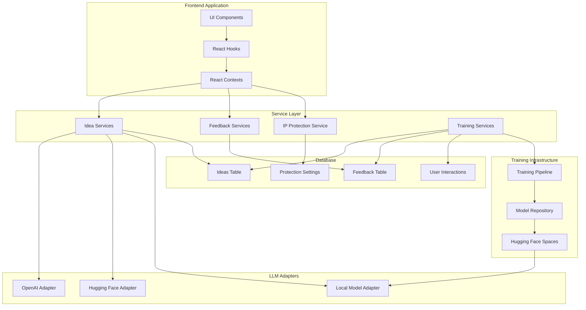

# Comprehensive Implementation Guide: AI-Powered Business Idea Generation with Continuous Learning and IP Protection

## Table of Contents
1. [System Overview](#1-system-overview)
2. [Database Schema Implementation](#2-database-schema-implementation)
3. [Backend Services Implementation](#3-backend-services-implementation)
4. [Frontend Components](#4-frontend-components)
5. [Hugging Face Setup](#5-hugging-face-setup)
6. [Training Pipeline Implementation](#6-training-pipeline-implementation)
7. [IP Protection Layer](#7-ip-protection-layer)
8. [Testing Framework](#8-testing-framework)
9. [Deployment Strategy](#9-deployment-strategy)
10. [Monitoring and Maintenance](#10-monitoring-and-maintenance)

---

## 1. System Overview

### 1.1 Architecture Diagram



### 1.2 High-Level System Components

1. **Idea Generation System**
   - Core idea generation capabilities
   - Modular architecture with swappable LLM adapters
   - Abstraction layers for different AI models

2. **Feedback Collection Framework**
   - Comprehensive tracking of all user interactions
   - Classification of feedback into multiple categories
   - Storage of metadata for training signal extraction

3. **IP Protection Layer**
   - Protection levels for different idea stages
   - Owner/team access controls
   - Training exclusion mechanisms
   - Similarity detection to prevent IP leakage

4. **Training Pipeline**
   - Data collection and preparation
   - Filtering and obfuscation of sensitive data
   - Training supervision with continuous learning
   - Model versioning and deployment

5. **Hugging Face Integration**
   - Model hosting and serving
   - Training infrastructure
   - Model registry and versioning

---

## 2. Database Schema Implementation

### 2.1 Supabase Migration Files

#### 2.1.1 Core Schema Modifications

Create the following migration file to add the necessary tables and relationships for capturing all types of feedback and IP protection:

```sql
-- supabase/migrations/20250318000000_idea_playground_extended.sql

-- First, ensure the UUID extension is available
CREATE EXTENSION IF NOT EXISTS "uuid-ossp";

-- Add new columns to the ideas table for training and protection
ALTER TABLE ideas ADD COLUMN IF NOT EXISTS training_status TEXT;
ALTER TABLE ideas ADD COLUMN IF NOT EXISTS protection_level TEXT DEFAULT 'public';
ALTER TABLE ideas ADD COLUMN IF NOT EXISTS owner_user_id UUID REFERENCES auth.users(id);
ALTER TABLE ideas ADD COLUMN IF NOT EXISTS last_trained_at TIMESTAMP WITH TIME ZONE;
ALTER TABLE ideas ADD COLUMN IF NOT EXISTS embedding VECTOR(1536); -- For similarity search

-- Create a comprehensive interaction tracking table
CREATE TABLE IF NOT EXISTS idea_interactions (
  id UUID PRIMARY KEY DEFAULT uuid_generate_v4(),
  idea_id UUID REFERENCES ideas(id) ON DELETE CASCADE,
  user_id UUID REFERENCES auth.users(id),
  interaction_type TEXT NOT NULL, -- 'positive_rating', 'negative_rating', 'saved', 'dismissed', 'edited', 'merged', etc.
  timestamp TIMESTAMP WITH TIME ZONE DEFAULT NOW(),
  
  -- For ratings
  rating_value INTEGER,
  
  -- For modifications
  previous_version JSONB,
  new_version JSONB,
  
  -- For merges
  merged_with_idea_ids UUID[],
  
  -- For dismissals or explicit feedback
  reason TEXT,
  comment TEXT
);

-- Add indexes for faster queries
CREATE INDEX IF NOT EXISTS idea_interactions_idea_id_idx ON idea_interactions(idea_id);
CREATE INDEX IF NOT EXISTS idea_interactions_user_id_idx ON idea_interactions(user_id);
CREATE INDEX IF NOT EXISTS idea_interactions_type_idx ON idea_interactions(interaction_type);

-- Protection settings table
CREATE TABLE IF NOT EXISTS idea_protection_settings (
  id UUID PRIMARY KEY DEFAULT uuid_generate_v4(),
  idea_id UUID REFERENCES ideas(id) ON DELETE CASCADE,
  protection_level TEXT NOT NULL DEFAULT 'public',
  updated_at TIMESTAMP WITH TIME ZONE DEFAULT NOW(),
  
  -- Proprietary metadata
  company_name TEXT,
  implementation_date TIMESTAMP WITH TIME ZONE,
  legal_status TEXT,
  
  -- Access controls
  owner_user_id UUID NOT NULL REFERENCES auth.users(id),
  team_access UUID[] DEFAULT '{}',
  viewer_access UUID[] DEFAULT '{}',
  
  -- Training controls
  exclude_from_training BOOLEAN DEFAULT FALSE,
  exclude_from_similarity_search BOOLEAN DEFAULT FALSE,
  obfuscation_level TEXT DEFAULT 'none',
  
  UNIQUE(idea_id)
);

-- Training data tracking table
CREATE TABLE IF NOT EXISTS training_sessions (
  id UUID PRIMARY KEY DEFAULT uuid_generate_v4(),
  started_at TIMESTAMP WITH TIME ZONE DEFAULT NOW(),
  completed_at TIMESTAMP WITH TIME ZONE,
  model_version TEXT,
  training_data_count INTEGER,
  validation_data_count INTEGER,
  metrics JSONB,
  status TEXT DEFAULT 'pending'
);

-- Ideas used in training
CREATE TABLE IF NOT EXISTS training_ideas (
  id UUID PRIMARY KEY DEFAULT uuid_generate_v4(),
  training_session_id UUID REFERENCES training_sessions(id) ON DELETE CASCADE,
  idea_id UUID REFERENCES ideas(id) ON DELETE CASCADE,
  included_as TEXT, -- 'positive', 'negative', 'modified', 'merged'
  obfuscated BOOLEAN DEFAULT FALSE
);

-- Create the implementation tracking table
CREATE TABLE IF NOT EXISTS idea_implementations (
  id UUID PRIMARY KEY DEFAULT uuid_generate_v4(),
  idea_id UUID REFERENCES ideas(id) ON DELETE CASCADE,
  user_id UUID REFERENCES auth.users(id),
  company_name TEXT NOT NULL,
  implemented_at TIMESTAMP WITH TIME ZONE DEFAULT NOW(),
  legal_status TEXT DEFAULT 'pending',
  
  -- Additional details
  implementation_details JSONB,
  business_model TEXT,
  market_segment TEXT,
  funding_status TEXT
);
```

#### 2.1.2 Row-Level Security Policies

Create another migration file to implement the necessary RLS policies:

```sql
-- supabase/migrations/20250318000100_idea_playground_security.sql

-- Enable Row Level Security on all tables
ALTER TABLE idea_interactions ENABLE ROW LEVEL SECURITY;
ALTER TABLE idea_protection_settings ENABLE ROW LEVEL SECURITY;
ALTER TABLE training_sessions ENABLE ROW LEVEL SECURITY;
ALTER TABLE training_ideas ENABLE ROW LEVEL SECURITY;
ALTER TABLE idea_implementations ENABLE ROW LEVEL SECURITY;

-- Idea Interactions - Basic policies
CREATE POLICY "Users can see their own interactions"
  ON idea_interactions
  FOR SELECT
  USING (auth.uid() = user_id);
  
CREATE POLICY "Users can create their own interactions"
  ON idea_interactions
  FOR INSERT
  WITH CHECK (auth.uid() = user_id);
  
CREATE POLICY "Users can update their own interactions"
  ON idea_interactions
  FOR UPDATE
  USING (auth.uid() = user_id);

-- Protection Settings - Access control
CREATE POLICY "Owners can view protection settings"
  ON idea_protection_settings
  FOR SELECT
  USING (auth.uid() = owner_user_id);
  
CREATE POLICY "Team members can view protection settings"
  ON idea_protection_settings
  FOR SELECT
  USING (auth.uid() = ANY(team_access));
  
CREATE POLICY "Owners can edit protection settings"
  ON idea_protection_settings
  FOR ALL
  USING (auth.uid() = owner_user_id);

-- Idea Implementations - IP protection
CREATE POLICY "Only owners can view implementations"
  ON idea_implementations
  FOR SELECT
  USING (auth.uid() = user_id);
  
CREATE POLICY "Only owners can create implementations"
  ON idea_implementations
  FOR INSERT
  WITH CHECK (auth.uid() = user_id);

-- Training data access - Admin only
CREATE POLICY "Only admins can view training sessions"
  ON training_sessions
  FOR SELECT
  USING (auth.uid() IN (SELECT user_id FROM user_roles WHERE role = 'admin'));
  
CREATE POLICY "Only admins can manage training sessions"
  ON training_sessions
  FOR ALL
  USING (auth.uid() IN (SELECT user_id FROM user_roles WHERE role = 'admin'));
```

### 2.2 TypeScript Type Definitions

Create type definitions for all the new database entities:

```typescript
// src/lib/types/idea-protection.types.ts
export enum IdeaProtectionLevel {
  PUBLIC = 'public',           // Default, can be shared and used for training
  PRIVATE = 'private',         // Only visible to creator, but can be used for anonymized training
  PROTECTED = 'protected',     // Private and excluded from training entirely
  PROPRIETARY = 'proprietary'  // Implemented as product/company with legal protection
}

export enum LegalStatus {
  PENDING = 'pending',
  PATENT_FILED = 'patent-filed',
  TRADEMARK_REGISTERED = 'trademark-registered',
  INCORPORATED = 'incorporated'
}

export interface IdeaProtectionSettings {
  id: string;
  ideaId: string;
  protectionLevel: IdeaProtectionLevel;
  updatedAt: string;
  
  // For proprietary ideas
  companyName?: string;
  implementationDate?: string;
  legalStatus?: LegalStatus;
  
  // Access controls
  ownerUserId: string;
  teamAccess?: string[];
  viewerAccess?: string[];
  
  // For training exclusion
  excludeFromTraining: boolean;
  excludeFromSimilaritySearch: boolean;
  obfuscationLevel: 'none' | 'basic' | 'complete';
}

export interface IdeaImplementation {
  id: string;
  ideaId: string;
  userId: string;
  companyName: string;
  implementedAt: string;
  legalStatus: LegalStatus;
  implementationDetails?: any;
  businessModel?: string;
  marketSegment?: string;
  fundingStatus?: string;
}
```

```typescript
// src/lib/types/idea-feedback.types.ts
export enum IdeaInteractionType {
  // Direct feedback
  POSITIVE_RATING = 'positive_rating',
  NEGATIVE_RATING = 'negative_rating',
  NEUTRAL_RATING = 'neutral_rating',
  
  // Actions
  SAVED = 'saved',
  DISMISSED = 'dismissed',
  
  // Modifications
  EDITED = 'edited',
  MERGED = 'merged',
  REFINED = 'refined',
  
  // Business actions
  IMPLEMENTED = 'implemented',
  SHARED = 'shared',
  EXPORTED = 'exported',
  
  // Engagement metrics
  VIEWED_DETAILS = 'viewed_details',
  HIGH_ENGAGEMENT = 'high_engagement',
  LOW_ENGAGEMENT = 'low_engagement'
}

export interface IdeaInteraction {
  id: string;
  ideaId: string;
  userId: string;
  interactionType: IdeaInteractionType;
  timestamp: string;
  
  // For ratings
  ratingValue?: number;
  
  // For modifications
  previousVersion?: any;
  newVersion?: any;
  
  // For merges
  mergedWithIdeaIds?: string[];
  
  // For dismissals or explicit feedback
  reason?: string;
  comment?: string;
}
```

```typescript
// src/lib/types/training.types.ts
export enum TrainingStatus {
  PENDING = 'pending',
  PROCESSING = 'processing',
  COMPLETED = 'completed',
  FAILED = 'failed'
}

export interface TrainingSession {
  id: string;
  startedAt: string;
  completedAt?: string;
  modelVersion: string;
  trainingDataCount: number;
  validationDataCount: number;
  metrics?: any;
  status: TrainingStatus;
}

export interface TrainingIdea {
  id: string;
  trainingSessionId: string;
  ideaId: string;
  includedAs: 'positive' | 'negative' | 'modified' | 'merged';
  obfuscated: boolean;
}
```

---

## 3. Backend Services Implementation

### 3.1 IP Protection Service

```typescript
// src/lib/services/idea-playground/idea-protection.service.ts
import { supabase } from '../../supabase';
import { IdeaProtectionLevel, IdeaProtectionSettings } from '../../types/idea-protection.types';
import { IdeaPlaygroundIdea } from '../../types/idea-playground.types';

export class IdeaProtectionService {
  /**
   * Set protection level for an idea
   */
  async setProtectionLevel(
    ideaId: string,
    protectionLevel: IdeaProtectionLevel,
    userId: string,
    options: Partial<IdeaProtectionSettings> = {}
  ): Promise<void> {
    try {
      // First check if protection settings already exist
      const { data: existingSettings } = await supabase
        .from('idea_protection_settings')
        .select('id')
        .eq('idea_id', ideaId)
        .single();
        
      const excludeFromTraining = 
        protectionLevel === IdeaProtectionLevel.PROTECTED || 
        protectionLevel === IdeaProtectionLevel.PROPRIETARY;
        
      const excludeFromSimilaritySearch = 
        protectionLevel === IdeaProtectionLevel.PROPRIETARY;
      
      // Default settings based on protection level
      const settings: Partial<IdeaProtectionSettings> = {
        ideaId,
        protectionLevel,
        ownerUserId: userId,
        excludeFromTraining,
        excludeFromSimilaritySearch,
        obfuscationLevel: protectionLevel === IdeaProtectionLevel.PROPRIETARY ? 'complete' : 'none',
        ...options
      };
      
      if (existingSettings) {
        // Update existing settings
        await supabase
          .from('idea_protection_settings')
          .update(settings)
          .eq('id', existingSettings.id);
      } else {
        // Create new settings
        await supabase
          .from('idea_protection_settings')
          .insert([settings]);
      }
      
      // Also update the idea table for quick access
      await supabase
        .from('ideas')
        .update({ 
          protection_level: protectionLevel,
          owner_user_id: userId
        })
        .eq('id', ideaId);
        
    } catch (error) {
      console.error('Error setting protection level:', error);
      throw error;
    }
  }
  
  /**
   * Mark an idea as implemented/proprietary
   */
  async markAsImplemented(
    ideaId: string, 
    userId: string,
    implementation: {
      companyName: string;
      implementationDate?: string;
      legalStatus?: 'pending' | 'patent-filed' | 'trademark-registered' | 'incorporated';
      teamAccess?: string[];
    }
  ): Promise<void> {
    try {
      await this.setProtectionLevel(
        ideaId,
        IdeaProtectionLevel.PROPRIETARY,
        userId,
        {
          companyName: implementation.companyName,
          implementationDate: implementation.implementationDate || new Date().toISOString(),
          legalStatus: implementation.legalStatus || 'pending',
          teamAccess: implementation.teamAccess || [],
          excludeFromTraining: true,
          excludeFromSimilaritySearch: true,
          obfuscationLevel: 'complete'
        }
      );
      
      // Log the implementation
      await supabase
        .from('idea_implementations')
        .insert([{
          idea_id: ideaId,
          user_id: userId,
          company_name: implementation.companyName,
          implemented_at: implementation.implementationDate || new Date().toISOString(),
          legal_status: implementation.legalStatus || 'pending'
        }]);
        
    } catch (error) {
      console.error('Error marking idea as implemented:', error);
      throw error;
    }
  }
  
  /**
   * Check if current user has access to an idea
   */
  async hasAccessToIdea(
    ideaId: string,
    userId: string,
    requiredAccess: 'view' | 'edit' | 'admin' = 'view'
  ): Promise<boolean> {
    try {
      // First get the protection settings
      const { data: protection } = await supabase
        .from('idea_protection_settings')
        .select('*')
        .eq('idea_id', ideaId)
        .single();
        
      // If no protection settings or public, anyone can view
      if (!protection || protection.protection_level === IdeaProtectionLevel.PUBLIC) {
        return requiredAccess === 'view';
      }
      
      // Owner has all access
      if (protection.owner_user_id === userId) {
        return true;
      }
      
      // Team access gives view and edit
      if (protection.team_access && protection.team_access.includes(userId)) {
        return requiredAccess !== 'admin';
      }
      
      // Viewer access only gives view
      if (protection.viewer_access && protection.viewer_access.includes(userId)) {
        return requiredAccess === 'view';
      }
      
      // No access
      return false;
    } catch (error) {
      console.error('Error checking idea access:', error);
      return false;
    }
  }
  
  /**
   * Filter ideas for training exclusion
   */
  async filterIdeasForTraining(ideas: IdeaPlaygroundIdea[]): Promise<IdeaPlaygroundIdea[]> {
    try {
      if (!ideas || ideas.length === 0) return [];
      
      // Get IDs of all ideas to check
      const ideaIds = ideas.map(idea => idea.id);
      
      // Find settings for all ideas
      const { data: protectionSettings } = await supabase
        .from('idea_protection_settings')
        .select('idea_id, exclude_from_training')
        .in('idea_id', ideaIds)
        .eq('exclude_from_training', true);
        
      if (!protectionSettings || protectionSettings.length === 0) {
        return ideas; // No exclusions
      }
      
      // Build a set of excluded idea IDs for fast lookup
      const excludedIdeaIds = new Set(
        protectionSettings.map(setting => setting.idea_id)
      );
      
      // Filter out excluded ideas
      return ideas.filter(idea => !excludedIdeaIds.has(idea.id));
    } catch (error) {
      console.error('Error filtering ideas for training:', error);
      // In case of error, be conservative and exclude all
      return [];
    }
  }
  
  /**
   * Get protection settings for an idea
   */
  async getProtectionSettings(ideaId: string): Promise<IdeaProtectionSettings | null> {
    try {
      const { data, error } = await supabase
        .from('idea_protection_settings')
        .select('*')
        .eq('idea_id', ideaId)
        .single();
        
      if (error) return null;
      return data;
    } catch (error) {
      console.error('Error getting protection settings:', error);
      return null;
    }
  }
}
```

### 3.2 Interaction Tracking Service

```typescript
// src/lib/services/idea-playground/interaction-tracking.service.ts
import { supabase } from '../../supabase';
import { IdeaInteraction, IdeaInteractionType } from '../../types/idea-feedback.types';
import { IdeaPlaygroundIdea } from '../../types/idea-playground.types';

export class IdeaInteractionTrackingService {
  /**
   * Track an interaction with an idea
   */
  async trackInteraction(interaction: Omit<IdeaInteraction, 'id' | 'timestamp'>): Promise<string> {
    try {
      const timestamp = new Date().toISOString();
      
      const { data, error } = await supabase
        .from('idea_interactions')
        .insert([{
          ...interaction,
          timestamp
        }])
        .select('id');
        
      if (error) throw error;
      
      // Update idea training status based on interaction
      await this.updateIdeaTrainingStatusFromInteraction(
        interaction.ideaId,
        interaction.interactionType
      );
      
      return data?.[0]?.id;
    } catch (error) {
      console.error('Error tracking idea interaction:', error);
      throw error;
    }
  }
  
  /**
   * Track idea editing
   */
  async trackIdeaEdit(
    userId: string,
    previousVersion: IdeaPlaygroundIdea,
    newVersion: IdeaPlaygroundIdea
  ): Promise<string> {
    return this.trackInteraction({
      ideaId: previousVersion.id,
      userId,
      interactionType: IdeaInteractionType.EDITED,
      previousVersion,
      newVersion
    });
  }
  
  /**
   * Track idea merge
   */
  async trackIdeaMerge(
    userId: string,
    resultingIdeaId: string,
    mergedIdeaIds: string[]
  ): Promise<string> {
    return this.trackInteraction({
      ideaId: resultingIdeaId,
      userId,
      interactionType: IdeaInteractionType.MERGED,
      mergedWithIdeaIds: mergedIdeaIds
    });
  }
  
  /**
   * Track explicit rating
   */
  async trackRating(
    userId: string,
    ideaId: string,
    rating: number,
    comment?: string
  ): Promise<string> {
    // Determine rating type
    let interactionType: IdeaInteractionType;
    if (rating >= 4) {
      interactionType = IdeaInteractionType.POSITIVE_RATING;
    } else if (rating <= 2) {
      interactionType = IdeaInteractionType.NEGATIVE_RATING;
    } else {
      interactionType = IdeaInteractionType.NEUTRAL_RATING;
    }
    
    return this.trackInteraction({
      ideaId,
      userId,
      interactionType,
      ratingValue: rating,
      comment
    });
  }
  
  /**
   * Track idea dismissal
   */
  async trackDismissal(
    userId: string,
    ideaId: string,
    reason?: string
  ): Promise<string> {
    return this.trackInteraction({
      ideaId,
      userId,
      interactionType: IdeaInteractionType.DISMISSED,
      reason
    });
  }
  
  /**
   * Update idea training status based on interaction
   */
  private async updateIdeaTrainingStatusFromInteraction(
    ideaId: string,
    interactionType: IdeaInteractionType
  ): Promise<void> {
    try {
      let trainingStatus: string | null = null;
      
      // Map interaction types to training statuses
      switch (interactionType) {
        case IdeaInteractionType.POSITIVE_RATING:
        case IdeaInteractionType.SAVED:
        case IdeaInteractionType.IMPLEMENTED:
        case IdeaInteractionType.SHARED:
        case IdeaInteractionType.EXPORTED:
          trainingStatus = 'positive_example';
          break;
          
        case IdeaInteractionType.NEGATIVE_RATING:
        case IdeaInteractionType.DISMISSED:
        case IdeaInteractionType.LOW_ENGAGEMENT:
          trainingStatus = 'negative_example';
          break;
          
        case IdeaInteractionType.EDITED:
        case IdeaInteractionType.REFINED:
          trainingStatus = 'modified_example';
          break;
          
        case IdeaInteractionType.MERGED:
          trainingStatus = 'merged_example';
          break;
          
        // For neutral interactions, no change in training status
        default:
          return;
      }
      
      if (trainingStatus) {
        await supabase
          .from('ideas')
          .update({ training_status: trainingStatus })
          .eq('id', ideaId);
      }
    } catch (error) {
      console.error('Error updating idea training status:', error);
      // Non-critical error, just log it
    }
  }
  
  /**
   * Get all interactions for an idea
   */
  async getIdeaInteractions(ideaId: string): Promise<IdeaInteraction[]> {
    try {
      const { data, error } = await supabase
        .from('idea_interactions')
        .select('*')
        .eq('ideaId', ideaId)
        .order('timestamp', { ascending: true });
        
      if (error) throw error;
      
      return data || [];
    } catch (error) {
      console.error('Error getting idea interactions:', error);
      return [];
    }
  }
}
```

### 3.3 Idea Similarity Service

```typescript
// src/lib/services/idea-playground/idea-similarity.service.ts
import { supabase } from '../../supabase';
import { IdeaPlaygroundIdea } from '../../types/idea-playground.types';
import { LLMOrchestrator } from './llm/orchestrator';

export class IdeaSimilarityService {
  private orchestrator: LLMOrchestrator;
  
  constructor(orchestrator: LLMOrchestrator) {
    this.orchestrator = orchestrator;
  }
  
  /**
   * Generate embeddings for an idea
   */
  async generateIdeaEmbedding(idea: IdeaPlaygroundIdea): Promise<number[]> {
    // Create a combined text representation of the idea
    const ideaText = `
      ${idea.title}
      ${idea.description}
      ${idea.problem_statement}
      ${idea.solution_concept}
      ${typeof idea.target_audience === 'string' ? idea.target_audience : idea.target_audience.join(', ')}
      ${idea.unique_value}
      ${idea.business_model}
    `;
    
    // Generate embeddings
    return await this.orchestrator.generateEmbedding(ideaText);
  }
  
  /**
   * Store embeddings for an idea
   */
  async storeIdeaEmbedding(ideaId: string, embedding: number[]): Promise<void> {
    try {
      await supabase
        .from('ideas')
        .update({ embedding })
        .eq('id', ideaId);
    } catch (error) {
      console.error('Error storing idea embedding:', error);
      throw error;
    }
  }
  
  /**
   * Check if a new idea is too similar to proprietary ideas
   */
  async checkForProprietarySimilarity(
    newIdea: IdeaPlaygroundIdea, 
    similarityThreshold: number = 0.85
  ): Promise<{ tooSimilar: boolean; similarityScore?: number; similarToIdeaId?: string }> {
    try {
      // Get embedding for the new idea
      const newIdeaEmbedding = await this.generateIdeaEmbedding(newIdea);
      
      // Get proprietary ideas
      const { data: proprietaryIdeas } = await supabase
        .from('ideas')
        .select('id, title, description, problem_statement, solution_concept, target_audience, unique_value, business_model, embedding')
        .eq('protection_level', 'proprietary')
        .not('embedding', 'is', null);
        
      if (!proprietaryIdeas || proprietaryIdeas.length === 0) {
        return { tooSimilar: false };
      }
      
      // Calculate similarity with each proprietary idea
      let highestSimilarity = 0;
      let mostSimilarIdeaId = '';
      
      for (const proprietaryIdea of proprietaryIdeas) {
        if (!proprietaryIdea.embedding) continue;
        
        // Calculate cosine similarity
        const similarity = this.calculateCosineSimilarity(
          newIdeaEmbedding,
          proprietaryIdea.embedding
        );
        
        if (similarity > highestSimilarity) {
          highestSimilarity = similarity;
          mostSimilarIdeaId = proprietaryIdea.id;
        }
      }
      
      // Check if similarity is above threshold
      if (highestSimilarity > similarityThreshold) {
        return {
          tooSimilar: true,
          similarityScore: highestSimilarity,
          similarToIdeaId: mostSimilarIdeaId
        };
      }
      
      return { tooSimilar: false };
    } catch (error) {
      console.error('Error checking proprietary similarity:', error);
      // In case of error, be conservative
      return { tooSimilar: true };
    }
  }
  
  /**
   * Calculate cosine similarity between two embedding vectors
   */
  private calculateCosineSimilarity(vecA: number[], vecB: number[]): number {
    if (vecA.length !== vecB.length) {
      throw new Error('Vectors must have the same length');
    }
    
    let dotProduct = 0;
    let normA = 0;
    let normB = 0;
    
    for (let i = 0; i < vecA.length; i++) {
      dotProduct += vecA[i] * vecB[i];
      normA += vecA[i] * vecA[i];
      normB += vecB[i] * vecB[i];
    }
    
    normA = Math.sqrt(normA);
    normB = Math.sqrt(normB);
    
    // Prevent division by zero
    if (normA === 0
