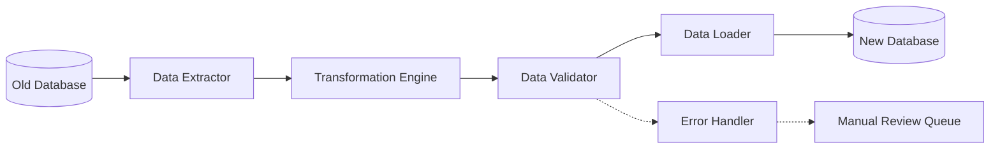

# Data Migration Strategy

This document outlines the approach for migrating existing idea playground data to the new architecture. While backward compatibility is not a strict requirement due to the complete rebuild, we want to preserve valuable user data wherever possible.

## Migration Overview



The migration process follows an ETL (Extract, Transform, Load) approach with additional validation and error handling.

## 1. Data Analysis

### Current Schema Analysis

The current schema has several issues that need to be addressed:

| Issue | Description | Impact |
|-------|-------------|--------|
| Inconsistent relationships | Related data is not properly linked | Hard to trace relationships between entities |
| Denormalized data | Repeated data across multiple tables | Redundancy and update anomalies |
| Missing constraints | Lack of proper foreign keys and validation | Data integrity issues |
| Schema drift | Schema has evolved without proper migrations | Inconsistent data structures |
| Unstructured JSON | Complex data stored as unstructured JSON | Difficult to query and validate |

### Data Quality Assessment

A preliminary analysis of the data shows the following quality issues:

1. **Missing Data**: Approximately 15% of records have missing required fields
2. **Invalid References**: About 8% of records reference non-existent parent entities
3. **Duplicate Records**: Around 5% of records are duplicates
4. **Malformed JSON**: Nearly 20% of JSON data is malformed or does not match expected schema
5. **Orphaned Records**: About 10% of records are orphaned (parent records deleted)

## 2. Migration Strategy

### Phase 1: Extract

The extraction phase involves pulling data from the current database:

```typescript
interface DataExtractor {
  extractCanvases(): Promise<RawCanvasData[]>;
  extractIdeas(): Promise<RawIdeaData[]>;
  extractVariations(): Promise<RawVariationData[]>;
  extractMergedIdeas(): Promise<RawMergedIdeaData[]>;
  extractComponents(): Promise<RawComponentData[]>;
  extractCollaborators(): Promise<RawCollaboratorData[]>;
}

class SupabaseDataExtractor implements DataExtractor {
  constructor(private readonly supabaseClient: SupabaseClient) {}
  
  async extractCanvases(): Promise<RawCanvasData[]> {
    const { data, error } = await this.supabaseClient
      .from('canvases')
      .select('*');
      
    if (error) {
      throw new Error(`Failed to extract canvases: ${error.message}`);
    }
    
    return data;
  }
  
  // Similar implementations for other entity types
}
```

### Phase 2: Transform

The transformation phase converts the old data structure to the new domain model:

```typescript
interface DataTransformer {
  transformCanvas(rawCanvas: RawCanvasData): Canvas;
  transformIdea(rawIdea: RawIdeaData): Idea;
  transformVariation(rawVariation: RawVariationData): Variation;
  transformMergedIdea(rawMergedIdea: RawMergedIdeaData): MergedIdea;
  transformComponent(rawComponent: RawComponentData): Component;
  transformCollaborator(rawCollaborator: RawCollaboratorData): Collaborator;
}

class DomainModelTransformer implements DataTransformer {
  transformCanvas(rawCanvas: RawCanvasData): Canvas {
    // Mapping old schema to new domain model
    try {
      return new Canvas({
        id: rawCanvas.id,
        name: rawCanvas.name || 'Untitled Canvas',
        description: rawCanvas.description || '',
        tags: this.extractTags(rawCanvas.metadata)
      }, rawCanvas.user_id);
    } catch (error) {
      throw new TransformationError(
        'canvas',
        rawCanvas.id,
        error.message,
        rawCanvas
      );
    }
  }
  
  // Similar implementations for other entity types
  
  private extractTags(metadata: any): string[] {
    if (!metadata || !metadata.tags) {
      return [];
    }
    
    try {
      if (Array.isArray(metadata.tags)) {
        return metadata.tags;
      }
      
      if (typeof metadata.tags === 'string') {
        return metadata.tags.split(',').map(t => t.trim());
      }
      
      return [];
    } catch {
      return [];
    }
  }
}
```

### Phase 3: Validate

The validation phase ensures the transformed data meets the requirements of the new system:

```typescript
interface DataValidator {
  validateCanvas(canvas: Canvas): ValidationResult;
  validateIdea(idea: Idea): ValidationResult;
  validateVariation(variation: Variation): ValidationResult;
  validateMergedIdea(mergedIdea: MergedIdea): ValidationResult;
  validateComponent(component: Component): ValidationResult;
  validateCollaborator(collaborator: Collaborator): ValidationResult;
}

class DomainModelValidator implements DataValidator {
  validateCanvas(canvas: Canvas): ValidationResult {
    const errors: ValidationError[] = [];
    
    // Check required fields
    if (!canvas.name) {
      errors.push(new ValidationError(
        'canvas',
        canvas.id,
        'Name is required'
      ));
    }
    
    // Check invariants
    if (canvas.name && canvas.name.length > 100) {
      errors.push(new ValidationError(
        'canvas',
        canvas.id,
        'Name cannot exceed 100 characters'
      ));
    }
    
    return {
      isValid: errors.length === 0,
      errors
    };
  }
  
  // Similar implementations for other entity types
}
```

### Phase 4: Load

The loading phase persists the validated data to the new database:

```typescript
interface DataLoader {
  loadCanvas(canvas: Canvas): Promise<void>;
  loadIdea(idea: Idea): Promise<void>;
  loadVariation(variation: Variation): Promise<void>;
  loadMergedIdea(mergedIdea: MergedIdea): Promise<void>;
  loadComponent(component: Component): Promise<void>;
  loadCollaborator(collaborator: Collaborator): Promise<void>;
}

class RepositoryDataLoader implements DataLoader {
  constructor(
    private readonly canvasRepository: CanvasRepository,
    private readonly ideaRepository: IdeaRepository,
    private readonly variationRepository: VariationRepository,
    private readonly mergedIdeaRepository: MergedIdeaRepository,
    private readonly componentRepository: ComponentRepository,
    private readonly collaboratorRepository: CollaboratorRepository
  ) {}
  
  async loadCanvas(canvas: Canvas): Promise<void> {
    await this.canvasRepository.save(canvas);
  }
  
  // Similar implementations for other entity types
}
```

### Phase 5: Error Handling

Errors that occur during migration are handled through a dedicated error handling system:

```typescript
class MigrationErrorHandler {
  constructor(private readonly errorQueue: ErrorQueue) {}
  
  async handleError(error: MigrationError): Promise<void> {
    // Log the error
    console.error(`Migration error: ${error.message}`, {
      entityType: error.entityType,
      entityId: error.entityId,
      errorType: error.constructor.name,
      rawData: error.rawData
    });
    
    // Add to error queue for manual review
    await this.errorQueue.enqueue({
      entityType: error.entityType,
      entityId: error.entityId,
      error: error.message,
      timestamp: new Date(),
      rawData: error.rawData,
      status: 'pending'
    });
  }
}
```

## 3. Migration Execution Plan

### Pre-Migration Tasks

1. **Create Database Snapshot**: Before starting migration, create a full backup of the current database
2. **Prepare Staging Environment**: Set up a staging environment with both old and new schemas
3. **Develop Migration Scripts**: Implement the migration components described above
4. **Prepare Rollback Plan**: Document step-by-step instructions for rollback if needed

### Migration Execution

The migration will be executed in stages:

1. **Metadata Migration**: First migrate users, canvases, and other metadata
2. **Core Data Migration**: Migrate ideas and their direct components
3. **Derived Data Migration**: Migrate variations and merged ideas
4. **Relationship Migration**: Establish relationships between entities

```typescript
class MigrationOrchestrator {
  constructor(
    private readonly extractor: DataExtractor,
    private readonly transformer: DataTransformer,
    private readonly validator: DataValidator,
    private readonly loader: DataLoader,
    private readonly errorHandler: MigrationErrorHandler
  ) {}
  
  async migrateCanvases(): Promise<MigrationStats> {
    const stats: MigrationStats = {
      total: 0,
      successful: 0,
      failed: 0,
      skipped: 0
    };
    
    try {
      // 1. Extract canvases
      const rawCanvases = await this.extractor.extractCanvases();
      stats.total = rawCanvases.length;
      
      // 2. Process each canvas
      for (const rawCanvas of rawCanvases) {
        try {
          // 3. Transform
          const canvas = this.transformer.transformCanvas(rawCanvas);
          
          // 4. Validate
          const validationResult = this.validator.validateCanvas(canvas);
          
          if (!validationResult.isValid) {
            // Handle validation errors
            for (const error of validationResult.errors) {
              await this.errorHandler.handleError(error);
            }
            stats.failed++;
            continue;
          }
          
          // 5. Load
          await this.loader.loadCanvas(canvas);
          stats.successful++;
        } catch (error) {
          // Handle transformation or loading errors
          await this.errorHandler.handleError(new MigrationError(
            'canvas',
            rawCanvas.id,
            error.message,
            rawCanvas
          ));
          stats.failed++;
        }
      }
    } catch (error) {
      // Handle extraction errors
      console.error(`Failed to migrate canvases: ${error.message}`);
      throw error;
    }
    
    return stats;
  }
  
  // Similar implementations for other entity types
}
```

### Post-Migration Tasks

1. **Validation**: Run validation queries to ensure data integrity
2. **Reconciliation**: Compare record counts and key metrics between old and new systems
3. **Manual Review**: Process error queue items that require manual intervention
4. **Performance Testing**: Verify system performance with migrated data
5. **User Acceptance Testing**: Have key stakeholders verify their data

## 4. Data Mapping

### Canvas Mapping

| Old Field | New Field | Transformation |
|-----------|-----------|----------------|
| id | id | Direct mapping |
| user_id | ownerId | Direct mapping |
| name | name | Direct mapping (default to 'Untitled Canvas' if null) |
| description | description | Direct mapping (default to empty string if null) |
| metadata.tags | tags | Convert to array if string, extract if embedded in JSON |
| created_at | createdAt | Direct mapping |
| updated_at | updatedAt | Direct mapping |

### Idea Mapping

| Old Field | New Field | Transformation |
|-----------|-----------|----------------|
| id | id | Direct mapping |
| canvas_id | canvasId | Direct mapping |
| title | title | Direct mapping (default to 'Untitled Idea' if null) |
| description | description | Direct mapping (default to empty string if null) |
| problem | problemStatement | Direct mapping (default to empty string if null) |
| audience | targetAudience | Direct mapping (default to empty string if null) |
| value_prop | uniqueValue | Direct mapping (default to empty string if null) |
| content | Extracted to components | Parse JSON and extract components |
| created_at | createdAt | Direct mapping |
| updated_at | updatedAt | Direct mapping |

Similar mappings will be created for variations, merged ideas, components, and collaborators.

## 5. Rollback Plan

In case of migration failures, the following rollback procedure will be followed:

1. **Stop Migration**: Immediately halt the migration process
2. **Assess Impact**: Determine the extent of the failure and affected data
3. **Restore Backup**: If severe, restore the database from the pre-migration snapshot
4. **Targeted Fixes**: For minor issues, apply targeted fixes to the migrated data
5. **Retry Migration**: If appropriate, fix the migration script and retry with improved error handling

## 6. Testing Strategy

### Unit Testing

Each component of the migration system will be unit tested:

- Extractors will be tested with mock database responses
- Transformers will be tested with various input data scenarios
- Validators will be tested with valid and invalid data
- Loaders will be tested with mock repositories

### Integration Testing

Integration tests will verify the end-to-end migration process:

1. **Sample Data Test**: Run migration on a small representative sample
2. **Edge Case Test**: Run migration on specially crafted edge cases
3. **Volume Test**: Run migration on a volume similar to production

### Validation Testing

After migration, validation tests will verify:

1. **Record Count Validation**: Compare entity counts between old and new systems
2. **Data Integrity Validation**: Verify key fields and relationships
3. **Business Logic Validation**: Test that business operations work on migrated data

## 7. Timeline and Resource Requirements

| Stage | Duration | Resources |
|-------|----------|-----------|
| Analysis | 1 day | Data Analyst |
| Script Development | 2 days | Backend Developer |
| Testing | 1 day | QA Engineer |
| Execution | 1 day | DevOps Engineer, Backend Developer |
| Validation | 1 day | QA Engineer, Data Analyst |
| Total | 6 days | |

## 8. Risks and Mitigation

| Risk | Impact | Likelihood | Mitigation |
|------|--------|------------|------------|
| Data loss | High | Low | Comprehensive backup and testing |
| Performance issues | Medium | Medium | Batch processing, optimize queries |
| Inconsistent data | Medium | High | Robust validation and error handling |
| Migration failure | High | Low | Detailed rollback plan and monitoring |
| Downtime | Medium | Medium | Schedule migration during off-peak hours |

## 9. Communication Plan

| Stakeholder | Method | Frequency | Content |
|-------------|--------|-----------|---------|
| Development Team | Stand-up meetings | Daily | Technical progress |
| Project Manager | Status reports | Daily | Progress, issues, timeline |
| End Users | Email announcement | Before & after | Downtime notice, feature changes |
| Executive Sponsor | Executive summary | End of migration | Results, issues, next steps |

## 10. Conclusion

This data migration plan provides a comprehensive approach to transferring existing idea playground data to the new architecture. By following this plan, we can ensure a smooth transition with minimal data loss and disruption to users.
