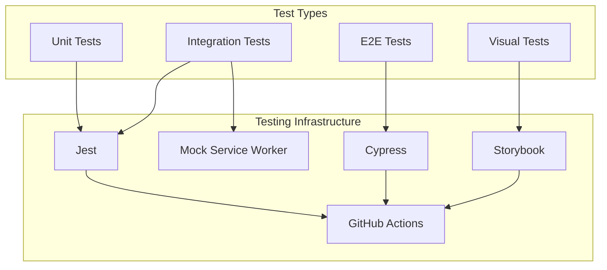

# Deployment & Monitoring

This document covers the testing, deployment, and maintenance approaches for the Idea Playground system.

## Testing Framework



### Unit Testing

Unit tests verify the functionality of individual components and services:

```typescript
// src/__tests__/services/idea-protection.service.test.ts
import { IdeaProtectionService } from '../../lib/services/idea-playground/idea-protection.service';
import { IdeaProtectionLevel } from '../../lib/types/idea-protection.types';
import { createClient } from '@supabase/supabase-js';

// Mock Supabase client
jest.mock('@supabase/supabase-js', () => ({
  createClient: jest.fn(() => ({
    from: jest.fn(() => ({
      select: jest.fn(() => ({
        eq: jest.fn(() => ({
          single: jest.fn(() => Promise.resolve({ data: null, error: null }))
        }))
      })),
      insert: jest.fn(() => Promise.resolve({ data: [{ id: 'test-id' }], error: null })),
      update: jest.fn(() => Promise.resolve({ data: null, error: null })),
    }))
  }))
}));

describe('IdeaProtectionService', () => {
  let protectionService: IdeaProtectionService;
  
  beforeEach(() => {
    // Reset mock calls
    jest.clearAllMocks();
    
    // Create service instance
    protectionService = new IdeaProtectionService();
  });
  
  describe('setProtectionLevel', () => {
    it('should set protection level and create settings', async () => {
      // Arrange
      const ideaId = 'test-idea-id';
      const userId = 'test-user-id';
      const protectionLevel = IdeaProtectionLevel.PRIVATE;
      
      // Act
      await protectionService.setProtectionLevel(ideaId, protectionLevel, userId);
      
      // Assert
      expect(createClient().from).toHaveBeenCalledWith('idea_protection_settings');
      expect(createClient().from().insert).toHaveBeenCalledWith([
        expect.objectContaining({
          ideaId,
          protectionLevel,
          ownerUserId: userId
        })
      ]);
      
      // Should also update ideas table
      expect(createClient().from).toHaveBeenCalledWith('ideas');
      expect(createClient().from().update).toHaveBeenCalledWith(
        expect.objectContaining({
          protection_level: protectionLevel,
          owner_user_id: userId
        })
      );
    });
    
    // More tests...
  });
});
```

### Integration Testing

Integration tests verify interactions between multiple services:

```typescript
// src/__tests__/integration/idea-generation-flow.test.ts
import { LLMOrchestrator } from '../../lib/services/idea-playground/llm/orchestrator';
import { IdeaGenerationService } from '../../lib/services/idea-playground/idea-generation.service';
import { IdeaProtectionService } from '../../lib/services/idea-playground/idea-protection.service';
import { InteractionTrackingService } from '../../lib/services/idea-playground/interaction-tracking.service';

// Use MSW to mock API calls
import { setupServer } from 'msw/node';
import { rest } from 'msw';

// Mock Supabase client
jest.mock('../../lib/supabase', () => ({
  supabase: {
    from: jest.fn(() => ({
      insert: jest.fn(() => Promise.resolve({ data: [{ id: 'new-idea-id' }], error: null })),
      update: jest.fn(() => Promise.resolve({ data: null, error: null })),
      select: jest.fn(() => ({
        eq: jest.fn(() => Promise.resolve({ data: [], error: null }))
      }))
    }))
  }
}));

// Mock OpenAI API
const server = setupServer(
  rest.post('https://api.openai.com/v1/chat/completions', (req, res, ctx) => {
    return res(
      ctx.json({
        choices: [
          {
            message: {
              content: JSON.stringify({
                title: 'Test Idea',
                description: 'A test idea',
                problem_statement: 'Testing problem',
                solution_concept: 'Testing solution',
                target_audience: ['Testers'],
                unique_value: 'Test value',
                business_model: 'Test model'
              })
            }
          }
        ]
      })
    );
  })
);

beforeAll(() => server.listen());
afterEach(() => server.resetHandlers());
afterAll(() => server.close());

describe('Idea Generation Flow', () => {
  let orchestrator: LLMOrchestrator;
  let generationService: IdeaGenerationService;
  let protectionService: IdeaProtectionService;
  let interactionService: InteractionTrackingService;
  
  beforeEach(() => {
    // Create dependencies
    orchestrator = new LLMOrchestrator();
    protectionService = new IdeaProtectionService();
    interactionService = new InteractionTrackingService();
    
    // Create service under test
    generationService = new IdeaGenerationService(
      orchestrator,
      protectionService,
      interactionService
    );
  });
  
  it('should generate and save an idea', async () => {
    // Arrange
    const prompt = 'Test prompt';
    const userId = 'test-user-id';
    
    // Act
    const result = await generationService.generateIdea(prompt, userId);
    
    // Assert
    expect(result).toBeDefined();
    expect(result.id).toBe('new-idea-id');
    expect(result.title).toBe('Test Idea');
    
    // Should have saved to database
    expect(supabase.from).toHaveBeenCalledWith('ideas');
    expect(supabase.from().insert).toHaveBeenCalled();
    
    // Default protection level
    expect(result.protection_level).toBe('public');
  });
});
```

### E2E Testing

Cypress is used for end-to-end testing:

```typescript
// cypress/e2e/idea-playground.cy.ts
describe('Idea Playground', () => {
  beforeEach(() => {
    // Mock auth
    cy.intercept('POST', '/auth/v1/token?grant_type=password', {
      statusCode: 200,
      body: {
        access_token: 'test-token',
        token_type: 'bearer',
        expires_in: 3600,
        refresh_token: 'test-refresh-token',
        user: {
          id: 'test-user-id',
          email: 'test@example.com'
        }
      }
    });
    
    // Mock API calls
    cy.intercept('POST', '/rest/v1/ideas', {
      statusCode: 201,
      body: {
        id: 'test-idea-id',
        title: 'Test Idea',
        description: 'A test idea',
        user_id: 'test-user-id',
        created_at: new Date().toISOString()
      }
    });
    
    cy.intercept('GET', '/rest/v1/ideas?*', {
      statusCode: 200,
      body: [
        {
          id: 'test-idea-id',
          title: 'Test Idea',
          description: 'A test idea',
          user_id: 'test-user-id',
          created_at: new Date().toISOString()
        }
      ]
    });
    
    // Log in and navigate to idea playground
    cy.visit('/login');
    cy.get('input[name=email]').type('test@example.com');
    cy.get('input[name=password]').type('password');
    cy.get('button[type=submit]').click();
    
    cy.visit('/idea-playground');
  });
  
  it('should generate a new idea', () => {
    // Type in prompt
    cy.get('textarea[id=prompt]').type('My idea for a new app');
    cy.get('button:contains("Generate Idea")').click();
    
    // Verify idea appears in list
    cy.get('.idea-list').should('contain', 'Test Idea');
  });
  
  it('should change protection level', () => {
    // Mock protection API
    cy.intercept('PATCH', '/rest/v1/ideas?id=eq.test-idea-id', {
      statusCode: 200
    });
    cy.intercept('POST', '/rest/v1/idea_protection_settings', {
      statusCode: 201
    });
    
    // Find idea in list
    cy.get('.idea-list').should('contain', 'Test Idea');
    
    // Change protection level
    cy.get('select[aria-label="Protection Level"]').select('private');
    
    // Verify API call
    cy.wait('@protectionPatch').its('request.body').should('deep.equal', {
      protection_level: 'private'
    });
  });
});
```

## Deployment Procedure

### Continuous Integration

The project uses GitHub Actions for CI/CD:

```yaml
# .github/workflows/main.yml
name: CI/CD Pipeline

on:
  push:
    branches: [ main ]
  pull_request:
    branches: [ main ]

jobs:
  test:
    runs-on: ubuntu-latest
    
    steps:
    - uses: actions/checkout@v3
    
    - name: Setup Node.js
      uses: actions/setup-node@v3
      with:
        node-version: '16'
        cache: 'npm'
    
    - name: Install dependencies
      run: npm ci
    
    - name: Lint
      run: npm run lint
    
    - name: Type check
      run: npm run typecheck
    
    - name: Unit tests
      run: npm test
    
    - name: Build
      run: npm run build
    
    - name: Upload build artifacts
      uses: actions/upload-artifact@v3
      with:
        name: build
        path: dist
  
  deploy:
    needs: test
    if: github.event_name == 'push' && github.ref == 'refs/heads/main'
    runs-on: ubuntu-latest
    
    steps:
    - uses: actions/checkout@v3
    
    - name: Download build artifacts
      uses: actions/download-artifact@v3
      with:
        name: build
        path: dist
    
    - name: Deploy to production
      run: |
        # Deploy to production environment
        npx netlify-cli deploy --prod --dir=dist
      env:
        NETLIFY_AUTH_TOKEN: ${{ secrets.NETLIFY_AUTH_TOKEN }}
        NETLIFY_SITE_ID: ${{ secrets.NETLIFY_SITE_ID }}
```

### Deployment Environments

The system has three deployment environments:

1. **Development**: For ongoing development work
   - URL: https://dev.wheel99.com
   - Supabase Project: wheel99-dev
   - Deployed from: `develop` branch
   
2. **Staging**: For pre-production testing
   - URL: https://staging.wheel99.com
   - Supabase Project: wheel99-staging
   - Deployed from: `release/*` branches
   
3. **Production**: Live environment
   - URL: https://wheel99.com
   - Supabase Project: wheel99-prod
   - Deployed from: `main` branch

### Environment Configuration

Environment-specific settings are configured in `.env` files:

```
# .env.development
VITE_SUPABASE_URL=https://xyz.supabase.co
VITE_SUPABASE_ANON_KEY=eyJhbGciOi...
VITE_USE_MOCK_API=true
VITE_OPENAI_API_URL=https://api.openai.com/v1
VITE_HUGGING_FACE_URL=https://api-inference.huggingface.co/models
```

```
# .env.production
VITE_SUPABASE_URL=https://abc.supabase.co
VITE_SUPABASE_ANON_KEY=eyJhbGciOi...
VITE_USE_MOCK_API=false
VITE_OPENAI_API_URL=https://api.openai.com/v1
VITE_HUGGING_FACE_URL=https://api-inference.huggingface.co/models
```

## Versioning Strategy

The system follows Semantic Versioning (SemVer):

- **Major version** (x.0.0): Breaking changes
- **Minor version** (0.x.0): New features with backward compatibility
- **Patch version** (0.0.x): Bug fixes and non-breaking changes

## Monitoring

### Error Tracking

The system uses Sentry for error tracking:

```typescript
// src/lib/sentry.ts
import * as Sentry from '@sentry/react';
import { BrowserTracing } from '@sentry/tracing';

export const initSentry = () => {
  if (import.meta.env.PROD) {
    Sentry.init({
      dsn: import.meta.env.VITE_SENTRY_DSN,
      integrations: [new BrowserTracing()],
      tracesSampleRate: 0.5,
      environment: import.meta.env.MODE
    });
  }
};

export const captureException = (error: unknown, context?: Record<string, any>) => {
  console.error(error);
  
  if (import.meta.env.PROD) {
    Sentry.captureException(error, {
      extra: context
    });
  }
};
```

### Usage Analytics

The system uses a custom analytics service to track feature usage:

```typescript
// src/lib/services/analytics.service.ts
import { supabase } from '../supabase';

export enum AnalyticsEventType {
  PAGE_VIEW = 'page_view',
  FEATURE_USED = 'feature_used',
  ERROR = 'error',
  IDEA_GENERATION = 'idea_generation',
  IDEA_REFINEMENT = 'idea_refinement',
  IDEA_MERGER = 'idea_merger',
  PROTECTION_CHANGE = 'protection_change'
}

export class AnalyticsService {
  private userId: string | null = null;
  
  setUserId(userId: string | null) {
    this.userId = userId;
  }
  
  async trackEvent(
    eventType: AnalyticsEventType,
    properties: Record<string, any> = {}
  ): Promise<void> {
    try {
      await supabase.from('analytics_events').insert([{
        user_id: this.userId,
        event_type: eventType,
        properties,
        timestamp: new Date().toISOString()
      }]);
    } catch (error) {
      console.error('Error tracking analytics event:', error);
    }
  }
  
  async trackPageView(page: string): Promise<void> {
    await this.trackEvent(AnalyticsEventType.PAGE_VIEW, { page });
  }
  
  async trackFeatureUsage(feature: string, details: Record<string, any> = {}): Promise<void> {
    await this.trackEvent(AnalyticsEventType.FEATURE_USED, {
      feature,
      ...details
    });
  }
}

// Create singleton instance
export const analytics = new AnalyticsService();
```

### Performance Monitoring

React's Profiler API is used for component performance monitoring:

```tsx
// src/components/PerformanceMonitor.tsx
import React, { Profiler, ProfilerOnRenderCallback, ReactNode } from 'react';
import { analytics } from '../lib/services/analytics.service';

interface PerformanceMonitorProps {
  id: string;
  children: ReactNode;
}

export const PerformanceMonitor: React.FC<PerformanceMonitorProps> = ({
  id,
  children
}) => {
  const handleRender: ProfilerOnRenderCallback = (
    id,
    phase,
    actualDuration,
    baseDuration,
    startTime,
    commitTime
  ) => {
    // Only log slow renders in production
    if (import.meta.env.PROD && actualDuration > 16) {
      analytics.trackEvent('slow_render', {
        component: id,
        actualDuration,
        baseDuration
      });
    }
  };
  
  return (
    <Profiler id={id} onRender={handleRender}>
      {children}
    </Profiler>
  );
};
```

## Maintenance

### Database Migrations

Database migrations are run using a custom script:

```typescript
// scripts/run-migration.js
const { createClient } = require('@supabase/supabase-js');
const fs = require('fs');
const path = require('path');
require('dotenv').config();

const supabase = createClient(
  process.env.SUPABASE_URL,
  process.env.SUPABASE_SERVICE_ROLE_KEY
);

async function runMigration(migrationFile) {
  try {
    console.log(`Running migration: ${migrationFile}`);
    
    const filePath = path.join(__dirname, '..', 'supabase', 'migrations', migrationFile);
    const sql = fs.readFileSync(filePath, 'utf8');
    
    // Execute the SQL statements
    const { error } = await supabase.rpc('run_sql_query', {
      query: sql
    });
    
    if (error) {
      console.error('Migration error:', error);
      process.exit(1);
    }
    
    console.log(`Migration ${migrationFile} completed successfully`);
  } catch (error) {
    console.error('Migration failed:', error);
    process.exit(1);
  }
}

// Get migration file from command line argument
const migrationFile = process.argv[2];
if (!migrationFile) {
  console.error('Please provide a migration file name');
  process.exit(1);
}

runMigration(migrationFile);
```

### Feature Flagging

A feature flag service is used to gradually roll out new features:

```typescript
// src/lib/services/feature-flags.service.ts
import { supabase } from '../supabase';

export enum FeatureFlag {
  IDEA_PLAYGROUND = 'idea_playground',
  IP_PROTECTION = 'ip_protection',
  AI_REFINEMENT = 'ai_refinement',
  HUGGING_FACE_INTEGRATION = 'hugging_face_integration',
  CONTINUOUS_LEARNING = 'continuous_learning'
}

export class FeatureFlagsService {
  private flags: Record<string, boolean> = {};
  private userId: string | null = null;
  private loaded = false;
  
  setUserId(userId: string | null) {
    this.userId = userId;
    this.loaded = false;
  }
  
  async loadFlags(): Promise<void> {
    try {
      // Get global flags
      const { data: globalFlags } = await supabase
        .from('feature_flags')
        .select('feature, enabled, user_percentage')
        .is('user_id', null);
      
      // Get user-specific flags
      const { data: userFlags } = await supabase
        .from('feature_flags')
        .select('feature, enabled')
        .eq('user_id', this.userId || '');
      
      // Set defaults
      this.flags = Object.values(FeatureFlag).reduce((acc, flag) => {
        acc[flag] = false;
        return acc;
      }, {} as Record<string, boolean>);
      
      // Apply global flags
      if (globalFlags) {
        for (const flag of globalFlags) {
          // If percentage rollout, check if user is in the percentage
          if (flag.user_percentage !== null && flag.user_percentage < 100) {
            // Generate a consistent hash for user+feature
            const hash = this.hashCode(`${this.userId}-${flag.feature}`);
            const normalized = (hash % 100 + 100) % 100; // Ensure 0-99 range
            
            this.flags[flag.feature] = flag.enabled && normalized < flag.user_percentage;
          } else {
            this.flags[flag.feature] = flag.enabled;
          }
        }
      }
      
      // Apply user-specific flags (override global)
      if (userFlags) {
        for (const flag of userFlags) {
          this.flags[flag.feature] = flag.enabled;
        }
      }
      
      this.loaded = true;
    } catch (error) {
      console.error('Error loading feature flags:', error);
      // Default to disabled for all flags on error
    }
  }
  
  isEnabled(feature: FeatureFlag): boolean {
    // Default to false if not loaded
    if (!this.loaded) {
      console.warn('Feature flags not loaded. Call loadFlags() first.');
      return false;
    }
    
    return this.flags[feature] || false;
  }
  
  private hashCode(str: string): number {
    let hash = 0;
    for (let i = 0; i < str.length; i++) {
      hash = ((hash << 5) - hash) + str.charCodeAt(i);
      hash |= 0; // Convert to 32bit integer
    }
    return hash;
  }
}

// Create a singleton instance
export const featureFlags = new FeatureFlagsService();
```

## Disaster Recovery

### Backup Strategy

The system uses multiple backup strategies:

1. **Supabase Backups**: Daily automated backups of all database tables
2. **Production Database Snapshots**: Weekly full database snapshots
3. **Transaction Logs**: Continuous backup of transaction logs for point-in-time recovery

### Recovery Procedures

In case of data corruption or system failure:

1. **Assessment**: Identify scope and severity of the issue
2. **Isolation**: Prevent further damage by isolating affected components
3. **Recovery**: Restore from appropriate backup
   - For minor issues: Use transaction logs for point-in-time recovery
   - For major corruption: Restore from most recent snapshot
4. **Validation**: Verify data integrity and system functionality
5. **Root Cause Analysis**: Identify and address the underlying cause

## Security Monitoring

### Supabase RLS Monitoring

A service monitors Row Level Security rule effectiveness:

```typescript
// src/lib/services/security-monitoring.service.ts
import { supabase } from '../supabase';

export class SecurityMonitoringService {
  async runSecurityAudit(): Promise<{
    issues: any[];
    totalChecks: number;
  }> {
    try {
      const { data, error } = await supabase.rpc('audit_rls_policies');
      
      if (error) {
        throw error;
      }
      
      return {
        issues: data.issues || [],
        totalChecks: data.total_checks
      };
    } catch (error) {
      console.error('Security audit failed:', error);
      throw error;
    }
  }
  
  async checkTablePermissions(table: string): Promise<{
    hasRLS: boolean;
    policies: any[];
  }> {
    try {
      const { data, error } = await supabase.rpc('check_table_permissions', {
        table_name: table
      });
      
      if (error) {
        throw error;
      }
      
      return {
        hasRLS: data.has_rls,
        policies: data.policies || []
      };
    } catch (error) {
      console.error(`Permission check failed for table ${table}:`, error);
      throw error;
    }
  }
}
