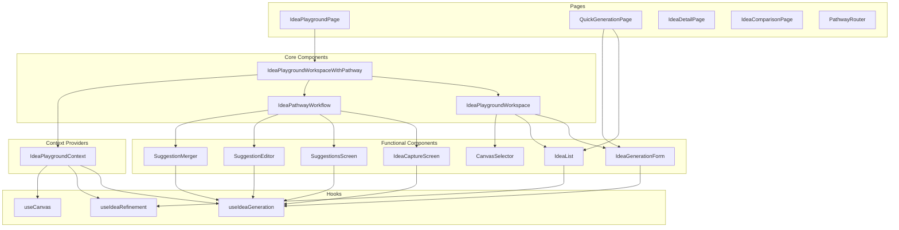

# Frontend Components Implementation

This document details the React component architecture for the Idea Playground system.

## Component Structure

The frontend components follow a hierarchical structure that promotes reusability, clear separation of concerns, and efficient state management.



## Key Component Implementations

### Idea Playground Context

The central context provider that manages the state and provides services to all components.

```tsx
// src/lib/contexts/IdeaPlaygroundContext.tsx
import React, { createContext, useContext, useState, useEffect, ReactNode } from 'react';
import { IdeaPlaygroundIdea } from '../types/idea-playground.types';
import { IdeaPlaygroundServiceFacade } from '../services/idea-playground.service.facade';
import { useAuth } from '../hooks/useAuth';
import { IdeaProtectionLevel } from '../types/idea-protection.types';

interface IdeaPlaygroundContextValue {
  // Ideas state
  ideas: IdeaPlaygroundIdea[];
  selectedIdea: IdeaPlaygroundIdea | null;
  loading: boolean;
  error: string | null;
  
  // Service methods
  generateIdea: (prompt: string) => Promise<IdeaPlaygroundIdea>;
  saveIdea: (idea: IdeaPlaygroundIdea) => Promise<void>;
  updateIdea: (idea: IdeaPlaygroundIdea) => Promise<void>;
  deleteIdea: (ideaId: string) => Promise<void>;
  selectIdea: (ideaId: string) => Promise<void>;
  
  // Canvas methods
  canvasTypes: string[];
  activeCanvas: string;
  setActiveCanvas: (canvasType: string) => void;
  
  // Protection methods
  setProtectionLevel: (ideaId: string, level: IdeaProtectionLevel) => Promise<void>;
  
  // Refinement methods
  refineIdea: (ideaId: string, feedback: string) => Promise<IdeaPlaygroundIdea>;
  
  // Pathway methods
  isPathwayActive: boolean;
  activatePathway: (ideaId?: string) => void;
  deactivatePathway: () => void;
}

const IdeaPlaygroundContext = createContext<IdeaPlaygroundContextValue | null>(null);

interface IdeaPlaygroundProviderProps {
  children: ReactNode;
  serviceFacade?: IdeaPlaygroundServiceFacade;
}

export const IdeaPlaygroundProvider: React.FC<IdeaPlaygroundProviderProps> = ({ 
  children,
  serviceFacade = new IdeaPlaygroundServiceFacade()
}) => {
  const [ideas, setIdeas] = useState<IdeaPlaygroundIdea[]>([]);
  const [selectedIdea, setSelectedIdea] = useState<IdeaPlaygroundIdea | null>(null);
  const [loading, setLoading] = useState<boolean>(false);
  const [error, setError] = useState<string | null>(null);
  const [activeCanvas, setActiveCanvas] = useState<string>('standard');
  const [isPathwayActive, setIsPathwayActive] = useState<boolean>(false);
  
  const { user } = useAuth();
  
  // Initialize: Fetch ideas
  useEffect(() => {
    if (user) {
      loadIdeas();
    }
  }, [user]);
  
  const loadIdeas = async () => {
    if (!user) return;
    
    setLoading(true);
    setError(null);
    
    try {
      const fetchedIdeas = await serviceFacade.getIdeas(user.id);
      setIdeas(fetchedIdeas);
    } catch (err) {
      setError('Failed to load ideas: ' + (err instanceof Error ? err.message : String(err)));
    } finally {
      setLoading(false);
    }
  };
  
  // Generate a new idea
  const generateIdea = async (prompt: string): Promise<IdeaPlaygroundIdea> => {
    if (!user) throw new Error('User not authenticated');
    
    setLoading(true);
    setError(null);
    
    try {
      const newIdea = await serviceFacade.generateIdea(prompt, user.id);
      setIdeas(prev => [newIdea, ...prev]);
      return newIdea;
    } catch (err) {
      const errorMsg = 'Failed to generate idea: ' + (err instanceof Error ? err.message : String(err));
      setError(errorMsg);
      throw new Error(errorMsg);
    } finally {
      setLoading(false);
    }
  };
  
  // Save an idea
  const saveIdea = async (idea: IdeaPlaygroundIdea): Promise<void> => {
    if (!user) throw new Error('User not authenticated');
    
    setLoading(true);
    setError(null);
    
    try {
      const savedIdea = await serviceFacade.saveIdea({
        ...idea,
        user_id: user.id
      });
      
      setIdeas(prev => [savedIdea, ...prev.filter(i => i.id !== savedIdea.id)]);
    } catch (err) {
      setError('Failed to save idea: ' + (err instanceof Error ? err.message : String(err)));
      throw err;
    } finally {
      setLoading(false);
    }
  };
  
  // Update an existing idea
  const updateIdea = async (idea: IdeaPlaygroundIdea): Promise<void> => {
    if (!user) throw new Error('User not authenticated');
    
    setLoading(true);
    setError(null);
    
    try {
      const updatedIdea = await serviceFacade.updateIdea(idea);
      
      setIdeas(prev => prev.map(i => i.id === updatedIdea.id ? updatedIdea : i));
      
      if (selectedIdea?.id === updatedIdea.id) {
        setSelectedIdea(updatedIdea);
      }
    } catch (err) {
      setError('Failed to update idea: ' + (err instanceof Error ? err.message : String(err)));
      throw err;
    } finally {
      setLoading(false);
    }
  };
  
  // Delete an idea
  const deleteIdea = async (ideaId: string): Promise<void> => {
    if (!user) throw new Error('User not authenticated');
    
    setLoading(true);
    setError(null);
    
    try {
      await serviceFacade.deleteIdea(ideaId);
      
      setIdeas(prev => prev.filter(i => i.id !== ideaId));
      
      if (selectedIdea?.id === ideaId) {
        setSelectedIdea(null);
      }
    } catch (err) {
      setError('Failed to delete idea: ' + (err instanceof Error ? err.message : String(err)));
      throw err;
    } finally {
      setLoading(false);
    }
  };
  
  // Select an idea
  const selectIdea = async (ideaId: string): Promise<void> => {
    setLoading(true);
    setError(null);
    
    try {
      // First check local ideas
      const localIdea = ideas.find(i => i.id === ideaId);
      
      if (localIdea) {
        setSelectedIdea(localIdea);
      } else {
        // If not found locally, fetch from service
        const fetchedIdea = await serviceFacade.getIdea(ideaId);
        setSelectedIdea(fetchedIdea);
      }
    } catch (err) {
      setError('Failed to select idea: ' + (err instanceof Error ? err.message : String(err)));
      throw err;
    } finally {
      setLoading(false);
    }
  };
  
  // Set protection level
  const setProtectionLevel = async (ideaId: string, level: IdeaProtectionLevel): Promise<void> => {
    if (!user) throw new Error('User not authenticated');
    
    setLoading(true);
    setError(null);
    
    try {
      await serviceFacade.setIdeaProtectionLevel(ideaId, level, user.id);
      
      // Update local idea
      setIdeas(prev => prev.map(i => {
        if (i.id === ideaId) {
          return {
            ...i,
            protection_level: level
          };
        }
        return i;
      }));
      
      // Update selected idea if needed
      if (selectedIdea?.id === ideaId) {
        setSelectedIdea(prev => prev ? {
          ...prev,
          protection_level: level
        } : null);
      }
    } catch (err) {
      setError('Failed to set protection level: ' + (err instanceof Error ? err.message : String(err)));
      throw err;
    } finally {
      setLoading(false);
    }
  };
  
  // Refine an idea
  const refineIdea = async (ideaId: string, feedback: string): Promise<IdeaPlaygroundIdea> => {
    if (!user) throw new Error('User not authenticated');
    
    setLoading(true);
    setError(null);
    
    try {
      // First get the idea
      const idea = ideas.find(i => i.id === ideaId);
      
      if (!idea) {
        throw new Error('Idea not found');
      }
      
      // Refine the idea
      const refinedIdea = await serviceFacade.refineIdea(idea, feedback, user.id);
      
      // Update ideas list
      setIdeas(prev => prev.map(i => i.id === refinedIdea.id ? refinedIdea : i));
      
      // Update selected idea if needed
      if (selectedIdea?.id === refinedIdea.id) {
        setSelectedIdea(refinedIdea);
      }
      
      return refinedIdea;
    } catch (err) {
      setError('Failed to refine idea: ' + (err instanceof Error ? err.message : String(err)));
      throw err;
    } finally {
      setLoading(false);
    }
  };
  
  // Pathway methods
  const activatePathway = (ideaId?: string) => {
    setIsPathwayActive(true);
    if (ideaId) {
      selectIdea(ideaId).catch(err => {
        console.error('Failed to select idea for pathway:', err);
      });
    }
  };
  
  const deactivatePathway = () => {
    setIsPathwayActive(false);
  };
  
  const value: IdeaPlaygroundContextValue = {
    // State
    ideas,
    selectedIdea,
    loading,
    error,
    
    // Methods
    generateIdea,
    saveIdea,
    updateIdea,
    deleteIdea,
    selectIdea,
    
    // Canvas
    canvasTypes: ['standard', 'business-model', 'problem-solution', 'customer-journey', 'value-proposition'],
    activeCanvas,
    setActiveCanvas,
    
    // Protection
    setProtectionLevel,
    
    // Refinement
    refineIdea,
    
    // Pathway
    isPathwayActive,
    activatePathway,
    deactivatePathway
  };
  
  return (
    <IdeaPlaygroundContext.Provider value={value}>
      {children}
    </IdeaPlaygroundContext.Provider>
  );
};

export const useIdeaPlayground = (): IdeaPlaygroundContextValue => {
  const context = useContext(IdeaPlaygroundContext);
  
  if (!context) {
    throw new Error('useIdeaPlayground must be used within an IdeaPlaygroundProvider');
  }
  
  return context;
};
```

### Idea Generation Form

The component used to generate new ideas based on user input.

```tsx
// src/components/idea-playground/IdeaGenerationForm.tsx
import React, { useState } from 'react';
import { useIdeaPlayground } from '../../lib/contexts/IdeaPlaygroundContext';

interface IdeaGenerationFormProps {
  onIdeaGenerated?: () => void;
}

export const IdeaGenerationForm: React.FC<IdeaGenerationFormProps> = ({ 
  onIdeaGenerated 
}) => {
  const { generateIdea, loading } = useIdeaPlayground();
  const [prompt, setPrompt] = useState('');
  const [error, setError] = useState<string | null>(null);
  
  const handleSubmit = async (e: React.FormEvent) => {
    e.preventDefault();
    
    if (!prompt.trim()) {
      setError('Please enter a prompt');
      return;
    }
    
    setError(null);
    
    try {
      await generateIdea(prompt);
      setPrompt('');
      
      if (onIdeaGenerated) {
        onIdeaGenerated();
      }
    } catch (err) {
      setError((err instanceof Error) ? err.message : String(err));
    }
  };
  
  return (
    <div className="bg-white shadow-md rounded p-6 mb-6">
      <h2 className="text-2xl font-bold mb-4">Generate New Idea</h2>
      
      <form onSubmit={handleSubmit}>
        <div className="mb-4">
          <label htmlFor="prompt" className="block text-gray-700 font-medium mb-2">
            Describe your idea or business concept:
          </label>
          <textarea
            id="prompt"
            className="w-full p-3 border border-gray-300 rounded focus:outline-none focus:ring-2 focus:ring-blue-500"
            rows={4}
            value={prompt}
            onChange={(e) => setPrompt(e.target.value)}
            placeholder="E.g., An app that helps pet owners find pet-friendly restaurants and accommodation when traveling..."
            disabled={loading}
          />
        </div>
        
        {error && (
          <div className="mb-4 p-3 bg-red-100 text-red-700 rounded">
            {error}
          </div>
        )}
        
        <button
          type="submit"
          className="bg-blue-600 text-white py-2 px-6 rounded hover:bg-blue-700 focus:outline-none focus:ring-2 focus:ring-blue-500 focus:ring-opacity-50 disabled:bg-blue-300"
          disabled={loading || !prompt.trim()}
        >
          {loading ? 'Generating...' : 'Generate Idea'}
        </button>
      </form>
    </div>
  );
};
```

### Idea List

The component that displays the list of generated ideas.

```tsx
// src/components/idea-playground/IdeaList.tsx
import React from 'react';
import { useIdeaPlayground } from '../../lib/contexts/IdeaPlaygroundContext';
import { IdeaPlaygroundIdea } from '../../lib/types/idea-playground.types';
import { IdeaProtectionLevel } from '../../lib/types/idea-protection.types';

interface IdeaListProps {
  onIdeaSelect?: (idea: IdeaPlaygroundIdea) => void;
  showControls?: boolean;
}

export const IdeaList: React.FC<IdeaListProps> = ({ 
  onIdeaSelect,
  showControls = true
}) => {
  const { 
    ideas, 
    loading, 
    error, 
    selectIdea, 
    deleteIdea,
    setProtectionLevel,
    activatePathway,
    selectedIdea
  } = useIdeaPlayground();
  
  if (loading && ideas.length === 0) {
    return <div className="p-4 text-center">Loading ideas...</div>;
  }
  
  if (error) {
    return (
      <div className="p-4 bg-red-100 text-red-700 rounded mb-4">
        Error: {error}
      </div>
    );
  }
  
  if (ideas.length === 0) {
    return (
      <div className="p-6 text-center border border-gray-200 rounded bg-gray-50">
        <p className="text-gray-500">No ideas yet. Generate your first idea!</p>
      </div>
    );
  }
  
  const handleIdeaSelect = async (idea: IdeaPlaygroundIdea) => {
    await selectIdea(idea.id);
    
    if (onIdeaSelect) {
      onIdeaSelect(idea);
    }
  };
  
  const handleDelete = async (ideaId: string, e: React.MouseEvent) => {
    e.stopPropagation();
    
    if (window.confirm('Are you sure you want to delete this idea?')) {
      await deleteIdea(ideaId);
    }
  };
  
  const handleProtectionChange = async (ideaId: string, level: IdeaProtectionLevel, e: React.ChangeEvent<HTMLSelectElement>) => {
    e.stopPropagation();
    await setProtectionLevel(ideaId, level);
  };
  
  const handlePathwayActivate = (ideaId: string, e: React.MouseEvent) => {
    e.stopPropagation();
    activatePathway(ideaId);
  };
  
  return (
    <div className="bg-white shadow-md rounded p-6 mb-6">
      <h2 className="text-2xl font-bold mb-4">Your Ideas</h2>
      
      <div className="space-y-4">
        {ideas.map((idea) => (
          <div 
            key={idea.id}
            className={`border rounded p-4 cursor-pointer hover:bg-gray-50 transition-colors ${
              selectedIdea?.id === idea.id ? 'border-blue-500 bg-blue-50' : 'border-gray-200'
            }`}
            onClick={() => handleIdeaSelect(idea)}
          >
            <div className="flex justify-between items-start">
              <h3 className="text-xl font-semibold mb-2">{idea.title}</h3>
              
              {showControls && (
                <div className="flex space-x-2">
                  <button
                    onClick={(e) => handlePathwayActivate(idea.id, e)}
                    className="text-sm py-1 px-2 bg-green-100 text-green-700 rounded hover:bg-green-200"
                    title="Use in Pathway"
                  >
                    Pathway
                  </button>
                  
                  <button
                    onClick={(e) => handleDelete(idea.id, e)}
                    className="text-sm py-1 px-2 bg-red-100 text-red-700 rounded hover:bg-red-200"
                    title="Delete idea"
                  >
                    Delete
                  </button>
                </div>
              )}
            </div>
            
            <p className="text-gray-700 mb-3 line-clamp-2">{idea.description}</p>
            
            <div className="flex justify-between items-center text-sm text-gray-500">
              <div>
                Created: {new Date(idea.created_at).toLocaleDateString()}
              </div>
              
              {showControls && (
                <div className="flex items-center">
                  <span className="mr-2">Protection:</span>
                  <select
                    value={idea.protection_level || 'public'}
                    onChange={(e) => handleProtectionChange(
                      idea.id, 
                      e.target.value as IdeaProtectionLevel,
                      e
                    )}
                    className="border border-gray-300 rounded p-1"
                    onClick={(e) => e.stopPropagation()}
                  >
                    <option value="public">Public</option>
                    <option value="private">Private</option>
                    <option value="protected">Protected</option>
                    <option value="proprietary">Proprietary</option>
                  </select>
                </div>
              )}
            </div>
          </div>
        ))}
      </div>
    </div>
  );
};
```

### Canvas Selector

Allows switching between different canvas visualization modes.

```tsx
// src/components/idea-playground/CanvasSelector.tsx
import React from 'react';
import { useIdeaPlayground } from '../../lib/contexts/IdeaPlaygroundContext';

export const CanvasSelector: React.FC = () => {
  const { canvasTypes, activeCanvas, setActiveCanvas } = useIdeaPlayground();
  
  return (
    <div className="bg-white shadow-md rounded p-4 mb-6">
      <h3 className="text-lg font-semibold mb-3">Canvas Type</h3>
      
      <div className="flex flex-wrap gap-2">
        {canvasTypes.map((canvasType) => (
          <button
            key={canvasType}
            className={`px-4 py-2 rounded text-sm ${
              activeCanvas === canvasType
                ? 'bg-blue-600 text-white'
                : 'bg-gray-200 text-gray-800 hover:bg-gray-300'
            }`}
            onClick={() => setActiveCanvas(canvasType)}
          >
            {canvasType.split('-').map(word => 
              word.charAt(0).toUpperCase() + word.slice(1)
            ).join(' ')}
          </button>
        ))}
      </div>
    </div>
  );
};
```

### Idea Playground Workspace

The main workspace component that integrates the generation form, idea list, and canvas.

```tsx
// src/components/idea-playground/IdeaPlaygroundWorkspace.tsx
import React, { useState } from 'react';
import { IdeaGenerationForm } from './IdeaGenerationForm';
import { IdeaList } from './IdeaList';
import { CanvasSelector } from './CanvasSelector';
import { IdeaPlaygroundProvider } from '../../lib/contexts/IdeaPlaygroundContext';
import { IdeaPlaygroundServiceFacade } from '../../lib/services/idea-playground.service.facade';
import { IdeaPlaygroundIdea } from '../../lib/types/idea-playground.types';

interface IdeaPlaygroundWorkspaceProps {
  serviceFacade?: IdeaPlaygroundServiceFacade;
}

export const IdeaPlaygroundWorkspace: React.FC<IdeaPlaygroundWorkspaceProps> = ({
  serviceFacade = new IdeaPlaygroundServiceFacade()
}) => {
  const [showCanvas, setShowCanvas] = useState(false);
  
  const handleIdeaSelect = (idea: IdeaPlaygroundIdea) => {
    setShowCanvas(true);
  };
  
  return (
    <IdeaPlaygroundProvider serviceFacade={serviceFacade}>
      <div className="container mx-auto p-4">
        <h1 className="text-3xl font-bold mb-6">Idea Playground</h1>
        
        <div className="grid grid-cols-1 lg:grid-cols-3 gap-6">
          <div className="lg:col-span-1">
            <IdeaGenerationForm />
            <IdeaList onIdeaSelect={handleIdeaSelect} />
          </div>
          
          <div className="lg:col-span-2">
            {showCanvas && (
              <>
                <CanvasSelector />
                <IdeaCanvasDisplay />
              </>
            )}
          </div>
        </div>
      </div>
    </IdeaPlaygroundProvider>
  );
};

// Canvas display component to show the selected idea in the active canvas format
const IdeaCanvasDisplay: React.FC = () => {
  const { selectedIdea, activeCanvas } = useIdeaPlayground();
  
  if (!selectedIdea) {
    return (
      <div className="bg-white shadow-md rounded p-6">
        <p className="text-gray-500">Select an idea to view in canvas</p>
      </div>
    );
  }
  
  // Different canvas renderers based on the active canvas type
  switch (activeCanvas) {
    case 'standard':
      return <StandardCanvas idea={selectedIdea} />;
    case 'business-model':
      return <BusinessModelCanvas idea={selectedIdea} />;
    case 'problem-solution':
      return <ProblemSolutionCanvas idea={selectedIdea} />;
    case 'customer-journey':
      return <CustomerJourneyCanvas idea={selectedIdea} />;
    case 'value-proposition':
      return <ValuePropositionCanvas idea={selectedIdea} />;
    default:
      return <StandardCanvas idea={selectedIdea} />;
  }
};

// Example of a standard canvas renderer
const StandardCanvas: React.FC<{ idea: IdeaPlaygroundIdea }> = ({ idea }) => {
  return (
    <div className="bg-white shadow-md rounded p-6">
      <h2 className="text-2xl font-bold mb-4">{idea.title}</h2>
      
      <div className="grid grid-cols-1 md:grid-cols-2 gap-6 mb-6">
        <div>
          <h3 className="text-lg font-semibold mb-2">Description</h3>
          <p className="text-gray-700">{idea.description}</p>
        </div>
        
        <div>
          <h3 className="text-lg font-semibold mb-2">Problem Statement</h3>
          <p className="text-gray-700">{idea.problem_statement}</p>
        </div>
      </div>
      
      <div className="grid grid-cols-1 md:grid-cols-2 gap-6 mb-6">
        <div>
          <h3 className="text-lg font-semibold mb-2">Solution Concept</h3>
          <p className="text-gray-700">{idea.solution_concept}</p>
        </div>
        
        <div>
          <h3 className="text-lg font-semibold mb-2">Target Audience</h3>
          <p className="text-gray-700">
            {typeof idea.target_audience === 'string' 
              ? idea.target_audience 
              : idea.target_audience?.join(', ')}
          </p>
        </div>
      </div>
      
      <div className="grid grid-cols-1 md:grid-cols-2 gap-6">
        <div>
          <h3 className="text-lg font-semibold mb-2">Unique Value</h3>
          <p className="text-gray-700">{idea.unique_value}</p>
        </div>
        
        <div>
          <h3 className="text-lg font-semibold mb-2">Business Model</h3>
          <p className="text-gray-700">{idea.business_model}</p>
        </div>
      </div>
    </div>
  );
};

// Other canvas components would be implemented similarly
const BusinessModelCanvas: React.FC<{ idea: IdeaPlaygroundIdea }> = ({ idea }) => {
  // Implementation details omitted for brevity
  return (
    <div className="bg-white shadow-md rounded p-6">
      <h2 className="text-2xl font-bold mb-4">Business Model Canvas: {idea.title}</h2>
      {/* Business model canvas implementation */}
    </div>
  );
};

const ProblemSolutionCanvas = ({ idea }: { idea: IdeaPlaygroundIdea }) => {
  // Implementation details omitted for brevity
  return (
    <div className="bg-white shadow-md rounded p-6">
      <h2 className="text-2xl font-bold mb-4">Problem-Solution Canvas: {idea.title}</h2>
      {/* Problem-solution canvas implementation */}
    </div>
  );
};

const CustomerJourneyCanvas = ({ idea }: { idea: IdeaPlaygroundIdea }) => {
  // Implementation details omitted for brevity
  return (
    <div className="bg-white shadow-md rounded p-6">
      <h2 className="text-2xl font-bold mb-4">Customer Journey Canvas: {idea.title}</h2>
      {/* Customer journey canvas implementation */}
    </div>
  );
};

const ValuePropositionCanvas = ({ idea }: { idea: IdeaPlaygroundIdea }) => {
  // Implementation details omitted for brevity
  return (
    <div className="bg-white shadow-md rounded p-6">
      <h2 className="text-2xl font-bold mb-4">Value Proposition Canvas: {idea.title}</h2>
      {/* Value proposition canvas implementation */}
    </div>
  );
};
```

## Custom Hooks

### useIdeaGeneration

A custom hook for idea generation functionality.

```tsx
// src/lib/hooks/useIdeaGeneration.ts
import { useState } from 'react';
import { useIdeaPlayground } from '../contexts/IdeaPlaygroundContext';
import { IdeaPlaygroundIdea } from '../types/idea-playground.types';

export const useIdeaGeneration = () => {
  const { generateIdea, loading: contextLoading } = useIdeaPlaygroun
