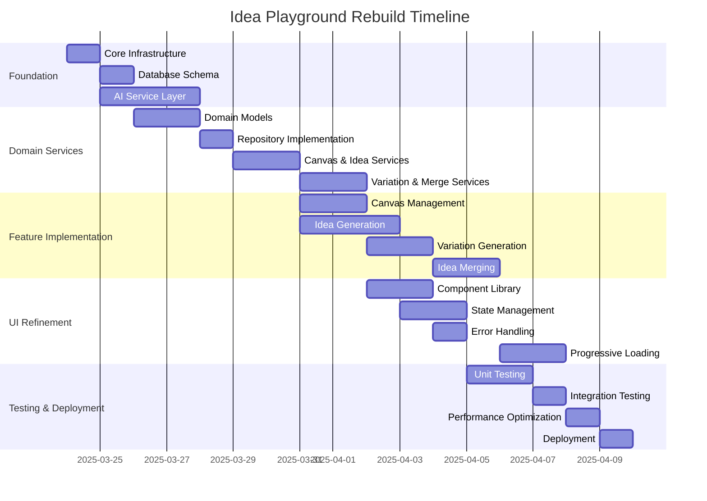

# Idea Playground Rebuild: Implementation Plan

This document outlines the phased approach for implementing the Idea Playground rebuild, breaking down the work into manageable increments with clear dependencies and deliverables.

## Implementation Timeline

The complete rebuild will span 5 weeks, with each phase building upon the previous:

## Phase 1: Foundation (Week 1)

### 1. Core Infrastructure Setup (1 day)

**Tasks:**
- Initialize project structure
- Configure TypeScript with strict settings
- Set up linting and formatting
- Configure build pipeline
- Implement dependency injection container

**Deliverables:**
- Project scaffold with proper configuration
- CI/CD pipeline setup
- Core utility libraries

**Dependencies:**
- None

### 2. Database Schema (1 day)

**Tasks:**
- Design normalized database schema
- Create migration scripts
- Set up indexes for performance
- Implement database triggers
- Create test data

**Deliverables:**
- Migration scripts
- Database schema documentation
- Data access layer utilities

**Dependencies:**
- Core infrastructure

### 3. AI Service Layer (3 days)

**Tasks:**
- Implement AI orchestration service
- Create prompt management system
- Develop schema validation with Zod
- Implement response parsing with fallbacks
- Add error handling and retries
- Set up streaming response handling

**Deliverables:**
- AI service with robust error handling
- Prompt template system
- Schema validation library
- Unit tests for AI service

**Dependencies:**
- Core infrastructure

## Phase 2: Domain Services (Week 2)

### 1. Domain Models (2 days)

**Tasks:**
- Implement aggregate roots with validation
- Create value objects
- Define domain events
- Implement domain services
- Add domain exception types

**Deliverables:**
- Canvas aggregate and entities
- Idea aggregate and entities
- Variation and merged idea models
- Domain event definitions

**Dependencies:**
- Database schema

### 2. Repository Implementation (1 day)

**Tasks:**
- Create repository interfaces
- Implement Supabase repositories
- Add transaction support
- Implement query optimization

**Deliverables:**
- Repository implementations for all aggregates
- Unit tests for repositories
- Repository factory

**Dependencies:**
- Domain models

### 3. Canvas & Idea Services (2 days)

**Tasks:**
- Implement canvas service
- Create idea service
- Add idea generation capabilities
- Implement collaboration logic

**Deliverables:**
- Canvas service implementation
- Idea service implementation
- Integration with AI service
- Unit tests for services

**Dependencies:**
- Repositories
- AI service

### 4. Variation & Merge Services (2 days)

**Tasks:**
- Implement variation service
- Create merge service
- Add SWOT analysis generation
- Implement selection logic

**Deliverables:**
- Variation service implementation
- Merge service implementation
- Integration with AI service
- Unit tests for services

**Dependencies:**
- Canvas & idea services

## Phase 3: Feature Implementation (Week 3)

### 1. Canvas Management (2 days)

**Tasks:**
- Implement canvas CRUD operations
- Add collaboration features
- Create canvas organization capabilities
- Implement canvas search and filtering

**Deliverables:**
- Canvas management API endpoints
- Canvas UI components
- Integration tests for canvas features

**Dependencies:**
- Canvas service

### 2. Idea Generation (3 days)

**Tasks:**
- Implement idea creation workflow
- Add AI-assisted idea generation
- Create idea editing capabilities
- Implement real-time updates

**Deliverables:**
- Idea generation API endpoints
- Idea UI components
- Progress indicators
- Integration tests for idea features

**Dependencies:**
- Idea service

### 3. Variation Generation (2 days)

**Tasks:**
- Implement variation generation workflow
- Create variation selection UI
- Add variation comparison features
- Implement SWOT visualization

**Deliverables:**
- Variation API endpoints
- Variation UI components
- Selection state management
- Integration tests for variation features

**Dependencies:**
- Variation service

### 4. Idea Merging (2 days)

**Tasks:**
- Implement idea merging workflow
- Create merged idea visualization
- Add relationship tracking
- Implement final selection UI

**Deliverables:**
- Merge API endpoints
- Merged idea UI components
- Source tracking visualization
- Integration tests for merge features

**Dependencies:**
- Variation generation

## Phase 4: UI Refinement (Week 4)

### 1. Component Library (2 days)

**Tasks:**
- Create reusable UI components
- Implement consistent styling
- Add accessibility features
- Create component documentation

**Deliverables:**
- Design system implementation
- Component showcase
- Accessibility compliance
- Component documentation

**Dependencies:**
- Feature implementation

### 2. State Management (2 days)

**Tasks:**
- Implement Zustand store
- Create custom hooks for state access
- Add optimistic updates
- Implement state persistence

**Deliverables:**
- Global state management
- State synchronization
- Optimistic UI updates
- Persistent state handling

**Dependencies:**
- Feature implementation

### 3. Error Handling (1 day)

**Tasks:**
- Implement error boundaries
- Create contextual error messages
- Add retry mechanisms
- Implement fallback UI

**Deliverables:**
- Error handling components
- Error recovery mechanisms
- User-friendly error messages
- Error reporting

**Dependencies:**
- Feature implementation

### 4. Progressive Loading (2 days)

**Tasks:**
- Implement loading indicators
- Add skeleton screens
- Create streaming updates UI
- Implement lazy loading

**Deliverables:**
- Contextual loading indicators
- Skeleton screen components
- Streaming response visualization
- Lazy loaded components

**Dependencies:**
- Feature implementation

## Phase 5: Testing & Deployment (Week 5)

### 1. Unit Testing (2 days)

**Tasks:**
- Create comprehensive test suite
- Implement mock services
- Add test data generators
- Set up CI test integration

**Deliverables:**
- Test coverage reports
- Automated test suite
- Mock service implementations
- CI/CD test integration

**Dependencies:**
- UI refinement

### 2. Integration Testing (1 day)

**Tasks:**
- Create end-to-end tests
- Implement API integration tests
- Add performance benchmarks
- Create test documentation

**Deliverables:**
- End-to-end test suite
- API integration tests
- Performance benchmark suite
- Test documentation

**Dependencies:**
- Unit testing

### 3. Performance Optimization (1 day)

**Tasks:**
- Implement query optimization
- Add caching strategy
- Optimize component rendering
- Reduce bundle size

**Deliverables:**
- Performance optimization report
- Caching implementation
- Bundle size analysis
- Rendering performance metrics

**Dependencies:**
- Integration testing

### 4. Deployment (1 day)

**Tasks:**
- Create deployment pipeline
- Set up staging environment
- Implement feature flags
- Create monitoring dashboard

**Deliverables:**
- Deployment scripts
- Staging environment
- Feature flag system
- Monitoring dashboard

**Dependencies:**
- Performance optimization

## Resource Allocation

| Role | Responsibility | Allocation |
|------|----------------|------------|
| Frontend Developer | UI components, state management, user experience | 100% |
| Backend Developer | Domain services, repositories, API endpoints | 100% |
| Full-stack Developer | AI service integration, testing, deployment | 100% |
| UX Designer | Design system, UI/UX guidelines, accessibility | 50% |
| QA Engineer | Testing strategy, test automation, quality assurance | 50% |

## Risk Management

| Risk | Impact | Probability | Mitigation |
|------|--------|------------|------------|
| AI service reliability issues | High | Medium | Implement robust fallbacks and caching |
| Performance with large datasets | Medium | Medium | Early performance testing and optimization |
| Complex state management | Medium | High | Clear architecture and state management patterns |
| Integration challenges | High | Medium | Comprehensive integration testing |
| Timeline constraints | High | Medium | Phased approach with clear priorities |

## Success Criteria

1. **Performance Metrics**
   - Page load time < 2 seconds
   - AI operations complete within 15 seconds
   - UI remains responsive during AI operations

2. **Quality Metrics**
   - 90%+ unit test coverage
   - Zero critical bugs in production
   - WCAG 2.1 AA accessibility compliance

3. **User Experience Metrics**
   - Successful completion of all user stories
   - Intuitive user flow with clear feedback
   - Graceful error handling and recovery

## Post-Implementation Review

After completion, a post-implementation review will evaluate:

1. **Technical Quality**
   - Code quality and maintainability
   - Architecture adherence
   - Performance benchmarks

2. **Process Effectiveness**
   - Development velocity
   - Bug discovery rate
   - Communication effectiveness

3. **User Satisfaction**
   - Feature completeness
   - User experience quality
   - Performance in real-world use
