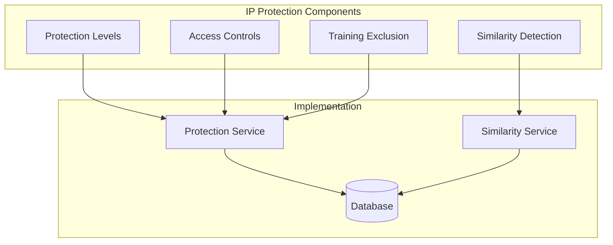

# IP Protection Layer

This document details the intellectual property protection mechanisms implemented in the Idea Playground system.

## Overview

The IP protection layer provides multiple levels of security to safeguard users' business ideas, with controls for:

- Privacy levels for ideas (public, private, protected, proprietary)
- Access control mechanisms for team collaboration
- Training exclusion to prevent IP leakage
- Similarity detection to identify potential IP infringement



## Protection Levels

The system offers four distinct protection levels for ideas:

### 1. PUBLIC
- Available to all users for viewing
- Used for training AI models
- No access restrictions
- Suitable for early-stage, general concepts

### 2. PRIVATE
- Only visible to the creator
- Can be used for training in anonymized form
- Basic protection for ideas under development
- No team sharing

### 3. PROTECTED
- Only visible to the creator and designated team members
- Excluded from all AI training datasets
- Strong protection for valuable business concepts
- Team collaboration enabled

### 4. PROPRIETARY
- Maximum protection for implemented business ideas
- Excluded from all training and similarity searches
- Full metadata tracking (company name, implementation date, legal status)
- Complete access control

## Database Schema

The protection settings are stored in dedicated database tables:

```sql
-- Protection settings table
CREATE TABLE IF NOT EXISTS idea_protection_settings (
  id UUID PRIMARY KEY DEFAULT uuid_generate_v4(),
  idea_id UUID REFERENCES ideas(id) ON DELETE CASCADE,
  protection_level TEXT NOT NULL DEFAULT 'public',
  updated_at TIMESTAMP WITH TIME ZONE DEFAULT NOW(),
  
  -- Proprietary metadata
  company_name TEXT,
  implementation_date TIMESTAMP WITH TIME ZONE,
  legal_status TEXT,
  
  -- Access controls
  owner_user_id UUID NOT NULL REFERENCES auth.users(id),
  team_access UUID[] DEFAULT '{}',
  viewer_access UUID[] DEFAULT '{}',
  
  -- Training controls
  exclude_from_training BOOLEAN DEFAULT FALSE,
  exclude_from_similarity_search BOOLEAN DEFAULT FALSE,
  obfuscation_level TEXT DEFAULT 'none',
  
  UNIQUE(idea_id)
);

-- Track implemented ideas
CREATE TABLE IF NOT EXISTS idea_implementations (
  id UUID PRIMARY KEY DEFAULT uuid_generate_v4(),
  idea_id UUID REFERENCES ideas(id) ON DELETE CASCADE,
  user_id UUID REFERENCES auth.users(id),
  company_name TEXT NOT NULL,
  implemented_at TIMESTAMP WITH TIME ZONE DEFAULT NOW(),
  legal_status TEXT DEFAULT 'pending',
  
  -- Additional details
  implementation_details JSONB,
  business_model TEXT,
  market_segment TEXT,
  funding_status TEXT
);
```

## Row-Level Security

Database-level security policies ensure proper access control:

```sql
-- Enable Row Level Security
ALTER TABLE idea_protection_settings ENABLE ROW LEVEL SECURITY;
ALTER TABLE idea_implementations ENABLE ROW LEVEL SECURITY;

-- Protection Settings - Access control
CREATE POLICY "Owners can view protection settings"
  ON idea_protection_settings
  FOR SELECT
  USING (auth.uid() = owner_user_id);
  
CREATE POLICY "Team members can view protection settings"
  ON idea_protection_settings
  FOR SELECT
  USING (auth.uid() = ANY(team_access));
  
CREATE POLICY "Owners can edit protection settings"
  ON idea_protection_settings
  FOR ALL
  USING (auth.uid() = owner_user_id);

-- Idea Implementations - IP protection
CREATE POLICY "Only owners can view implementations"
  ON idea_implementations
  FOR SELECT
  USING (auth.uid() = user_id);
  
CREATE POLICY "Only owners can create implementations"
  ON idea_implementations
  FOR INSERT
  WITH CHECK (auth.uid() = user_id);
```

## Implementation Details

### Protection Service

The `IdeaProtectionService` handles setting and enforcing protection levels:

```typescript
// src/lib/services/idea-playground/idea-protection.service.ts
export class IdeaProtectionService {
  /**
   * Set protection level for an idea
   */
  async setProtectionLevel(
    ideaId: string,
    protectionLevel: IdeaProtectionLevel,
    userId: string,
    options: Partial<IdeaProtectionSettings> = {}
  ): Promise<void> {
    try {
      // First check if protection settings already exist
      const { data: existingSettings } = await supabase
        .from('idea_protection_settings')
        .select('id')
        .eq('idea_id', ideaId)
        .single();
        
      const excludeFromTraining = 
        protectionLevel === IdeaProtectionLevel.PROTECTED || 
        protectionLevel === IdeaProtectionLevel.PROPRIETARY;
        
      const excludeFromSimilaritySearch = 
        protectionLevel === IdeaProtectionLevel.PROPRIETARY;
      
      // Default settings based on protection level
      const settings: Partial<IdeaProtectionSettings> = {
        ideaId,
        protectionLevel,
        ownerUserId: userId,
        excludeFromTraining,
        excludeFromSimilaritySearch,
        obfuscationLevel: protectionLevel === IdeaProtectionLevel.PROPRIETARY ? 'complete' : 'none',
        ...options
      };
      
      if (existingSettings) {
        // Update existing settings
        await supabase
          .from('idea_protection_settings')
          .update(settings)
          .eq('id', existingSettings.id);
      } else {
        // Create new settings
        await supabase
          .from('idea_protection_settings')
          .insert([settings]);
      }
      
      // Also update the idea table for quick access
      await supabase
        .from('ideas')
        .update({ 
          protection_level: protectionLevel,
          owner_user_id: userId
        })
        .eq('id', ideaId);
        
    } catch (error) {
      console.error('Error setting protection level:', error);
      throw error;
    }
  }
  
  /**
   * Check if current user has access to an idea
   */
  async hasAccessToIdea(
    ideaId: string,
    userId: string,
    requiredAccess: 'view' | 'edit' | 'admin' = 'view'
  ): Promise<boolean> {
    try {
      // First get the protection settings
      const { data: protection } = await supabase
        .from('idea_protection_settings')
        .select('*')
        .eq('idea_id', ideaId)
        .single();
        
      // If no protection settings or public, anyone can view
      if (!protection || protection.protection_level === IdeaProtectionLevel.PUBLIC) {
        return requiredAccess === 'view';
      }
      
      // Owner has all access
      if (protection.owner_user_id === userId) {
        return true;
      }
      
      // Team access gives view and edit
      if (protection.team_access && protection.team_access.includes(userId)) {
        return requiredAccess !== 'admin';
      }
      
      // Viewer access only gives view
      if (protection.viewer_access && protection.viewer_access.includes(userId)) {
        return requiredAccess === 'view';
      }
      
      // No access
      return false;
    } catch (error) {
      console.error('Error checking idea access:', error);
      return false;
    }
  }
  
  /**
   * Filter ideas for training exclusion
   */
  async filterIdeasForTraining(ideas: IdeaPlaygroundIdea[]): Promise<IdeaPlaygroundIdea[]> {
    try {
      if (!ideas || ideas.length === 0) return [];
      
      // Get IDs of all ideas to check
      const ideaIds = ideas.map(idea => idea.id);
      
      // Find settings for all ideas
      const { data: protectionSettings } = await supabase
        .from('idea_protection_settings')
        .select('idea_id, exclude_from_training')
        .in('idea_id', ideaIds)
        .eq('exclude_from_training', true);
        
      if (!protectionSettings || protectionSettings.length === 0) {
        return ideas; // No exclusions
      }
      
      // Build a set of excluded idea IDs for fast lookup
      const excludedIdeaIds = new Set(
        protectionSettings.map(setting => setting.idea_id)
      );
      
      // Filter out excluded ideas
      return ideas.filter(idea => !excludedIdeaIds.has(idea.id));
    } catch (error) {
      console.error('Error filtering ideas for training:', error);
      // In case of error, be conservative and exclude all
      return [];
    }
  }
}
```

## Similarity Detection

The system uses vector embeddings to detect when new ideas might be too similar to proprietary ideas:

```typescript
// src/lib/services/idea-playground/idea-similarity.service.ts
export class IdeaSimilarityService {
  /**
   * Check if a new idea is too similar to proprietary ideas
   */
  async checkForProprietarySimilarity(
    newIdea: IdeaPlaygroundIdea, 
    similarityThreshold: number = 0.85
  ): Promise<{ tooSimilar: boolean; similarityScore?: number; similarToIdeaId?: string }> {
    try {
      // Get embedding for the new idea
      const newIdeaEmbedding = await this.generateIdeaEmbedding(newIdea);
      
      // Get proprietary ideas
      const { data: proprietaryIdeas } = await supabase
        .from('ideas')
        .select('id, title, description, problem_statement, solution_concept, target_audience, unique_value, business_model, embedding')
        .eq('protection_level', 'proprietary')
        .not('embedding', 'is', null);
        
      if (!proprietaryIdeas || proprietaryIdeas.length === 0) {
        return { tooSimilar: false };
      }
      
      // Calculate similarity with each proprietary idea
      let highestSimilarity = 0;
      let mostSimilarIdeaId = '';
      
      for (const proprietaryIdea of proprietaryIdeas) {
        if (!proprietaryIdea.embedding) continue;
        
        // Calculate cosine similarity
        const similarity = this.calculateCosineSimilarity(
          newIdeaEmbedding,
          proprietaryIdea.embedding
        );
        
        if (similarity > highestSimilarity) {
          highestSimilarity = similarity;
          mostSimilarIdeaId = proprietaryIdea.id;
        }
      }
      
      // Check if similarity is above threshold
      if (highestSimilarity > similarityThreshold) {
        return {
          tooSimilar: true,
          similarityScore: highestSimilarity,
          similarToIdeaId: mostSimilarIdeaId
        };
      }
      
      return { tooSimilar: false };
    } catch (error) {
      console.error('Error checking proprietary similarity:', error);
      // In case of error, be conservative
      return { tooSimilar: true };
    }
  }
  
  /**
   * Calculate cosine similarity between two embedding vectors
   */
  private calculateCosineSimilarity(vecA: number[], vecB: number[]): number {
    if (vecA.length !== vecB.length) {
      throw new Error('Vectors must have the same length');
    }
    
    let dotProduct = 0;
    let normA = 0;
    let normB = 0;
    
    for (let i = 0; i < vecA.length; i++) {
      dotProduct += vecA[i] * vecB[i];
      normA += vecA[i] * vecA[i];
      normB += vecB[i] * vecB[i];
    }
    
    normA = Math.sqrt(normA);
    normB = Math.sqrt(normB);
    
    // Prevent division by zero
    if (normA === 0 || normB === 0) {
      return 0;
    }
    
    return dotProduct / (normA * normB);
  }
}
```

## Tracking Implementation Status

For ideas that have been implemented as actual businesses, the system provides additional metadata tracking:

```typescript
// Implementation recording
async markAsImplemented(
  ideaId: string, 
  userId: string,
  implementation: {
    companyName: string;
    implementationDate?: string;
    legalStatus?: 'pending' | 'patent-filed' | 'trademark-registered' | 'incorporated';
    teamAccess?: string[];
  }
): Promise<void> {
  try {
    await this.setProtectionLevel(
      ideaId,
      IdeaProtectionLevel.PROPRIETARY,
      userId,
      {
        companyName: implementation.companyName,
        implementationDate: implementation.implementationDate || new Date().toISOString(),
        legalStatus: implementation.legalStatus || 'pending',
        teamAccess: implementation.teamAccess || [],
        excludeFromTraining: true,
        excludeFromSimilaritySearch: true,
        obfuscationLevel: 'complete'
      }
    );
    
    // Log the implementation
    await supabase
      .from('idea_implementations')
      .insert([{
        idea_id: ideaId,
        user_id: userId,
        company_name: implementation.companyName,
        implemented_at: implementation.implementationDate || new Date().toISOString(),
        legal_status: implementation.legalStatus || 'pending'
      }]);
      
  } catch (error) {
    console.error('Error marking idea as implemented:', error);
    throw error;
  }
}
```

## User Interface Components

The system includes UI elements for managing protection levels:

```tsx
// Protection level selector in the IdeaList component
const handleProtectionChange = async (
  ideaId: string, 
  level: IdeaProtectionLevel, 
  e: React.ChangeEvent<HTMLSelectElement>
) => {
  e.stopPropagation();
  await setProtectionLevel(ideaId, level);
};

// In render function
<div className="flex items-center">
  <span className="mr-2">Protection:</span>
  <select
    value={idea.protection_level || 'public'}
    onChange={(e) => handleProtectionChange(
      idea.id, 
      e.target.value as IdeaProtectionLevel,
      e
    )}
    className="border border-gray-300 rounded p-1"
    onClick={(e) => e.stopPropagation()}
  >
    <option value="public">Public</option>
    <option value="private">Private</option>
    <option value="protected">Protected</option>
    <option value="proprietary">Proprietary</option>
  </select>
</div>
```

## Security Best Practices

### 1. Defense in Depth
The system implements multiple layers of protection:
- Database row-level security policies
- Application-level access control
- Client-side permission checks
- Server-side validation

### 2. Principle of Least Privilege
- Users only have access to the ideas they need
- Protection levels determine minimal necessary access
- Admin capabilities are strictly limited

### 3. Access Audit Trail
All protection level changes and access attempts are logged:
```typescript
// Log protection level changes
await supabase
  .from('idea_interactions')
  .insert([{
    idea_id: ideaId,
    user_id: userId,
    interaction_type: 'protection_level_change',
    previous_version: { protection_level: previousLevel },
    new_version: { protection_level: newLevel }
  }]);
```

### 4. Fail Secure
In case of errors or ambiguity, the system defaults to the most secure option:
```typescript
// If error occurs during similarity check, assume potential IP issue
catch (error) {
  console.error('Error checking proprietary similarity:', error);
  // In case of error, be conservative
  return { tooSimilar: true };
}
