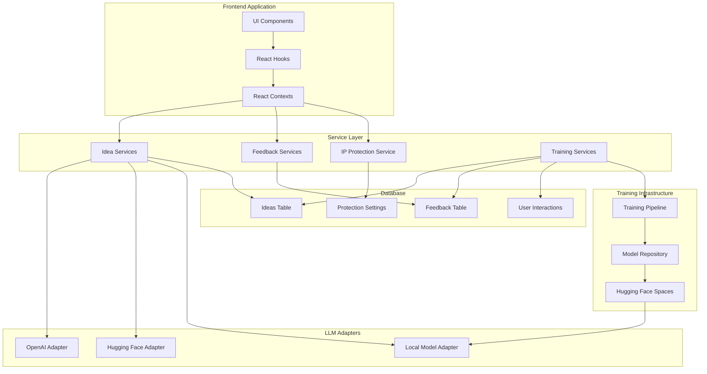

# AI-Powered Business Idea Generation System

This document provides a high-level overview of the modular Idea Playground system with continuous learning and IP protection features.

## Architecture Diagram

## Major System Components

### 1. Idea Generation System
- Core idea generation capabilities
- Modular architecture with swappable LLM adapters
- Abstraction layers for different AI models

### 2. Feedback Collection Framework
- Comprehensive tracking of all user interactions
- Classification of feedback into multiple categories
- Storage of metadata for training signal extraction

### 3. IP Protection Layer
- Protection levels for different idea stages
- Owner/team access controls
- Training exclusion mechanisms
- Similarity detection to prevent IP leakage

### 4. Training Pipeline
- Data collection and preparation
- Filtering and obfuscation of sensitive data
- Training supervision with continuous learning
- Model versioning and deployment

### 5. Hugging Face Integration
- Model hosting and serving
- Training infrastructure
- Model registry and versioning

## Documentation Structure

This documentation is divided into several focused documents:

1. [Overview](./OVERVIEW.md) - This document, providing a high-level system architecture
2. [Database Schema](./DATABASE_SCHEMA.md) - SQL schema and TypeScript type definitions
3. [Backend Services](./BACKEND_SERVICES.md) - Service implementations for the core functionality
4. [Frontend Components](./FRONTEND_COMPONENTS.md) - React component hierarchy and implementation
5. [Training Pipeline](./TRAINING_PIPELINE.md) - Continuous learning implementation
6. [IP Protection](./IP_PROTECTION.md) - Intellectual property protection mechanisms
7. [Deployment & Monitoring](./DEPLOYMENT_AND_MONITORING.md) - Testing, deployment, and maintenance guides
