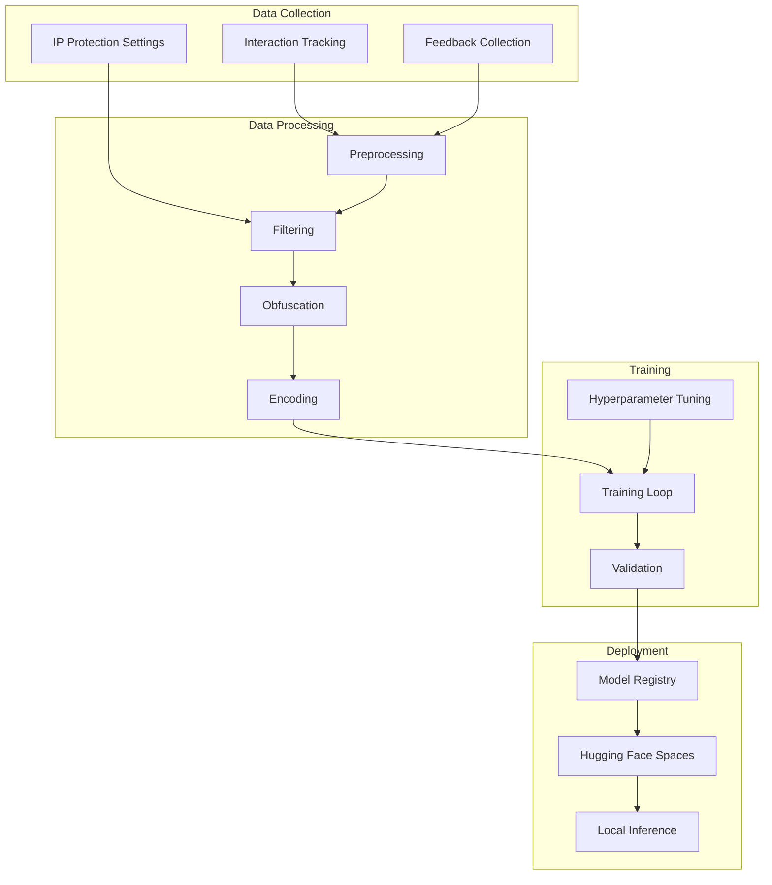

# Training Pipeline Implementation

This document details the continuous learning and Hugging Face integration in the Idea Playground system.

## Overview

The training pipeline enables the system to continuously improve by learning from user interactions with generated ideas. It includes:

- Data collection and preparation
- Filtering and obfuscation
- Hugging Face model hosting and training
- Versioning and deployment



## Training Data Collection

### Interaction Tracking

The system captures all user interactions with ideas:

```typescript
// src/lib/services/idea-playground/interaction-tracking.service.ts
export class IdeaInteractionTrackingService {
  /**
   * Track an interaction with an idea
   */
  async trackInteraction(interaction: Omit<IdeaInteraction, 'id' | 'timestamp'>): Promise<string> {
    try {
      const timestamp = new Date().toISOString();
      
      const { data, error } = await supabase
        .from('idea_interactions')
        .insert([{
          ...interaction,
          timestamp
        }])
        .select('id');
        
      if (error) throw error;
      
      // Update idea training status based on interaction
      await this.updateIdeaTrainingStatusFromInteraction(
        interaction.ideaId,
        interaction.interactionType
      );
      
      return data?.[0]?.id;
    } catch (error) {
      console.error('Error tracking idea interaction:', error);
      throw error;
    }
  }
  
  /**
   * Update idea training status based on interaction
   */
  private async updateIdeaTrainingStatusFromInteraction(
    ideaId: string,
    interactionType: IdeaInteractionType
  ): Promise<void> {
    try {
      let trainingStatus: string | null = null;
      
      // Map interaction types to training statuses
      switch (interactionType) {
        case IdeaInteractionType.POSITIVE_RATING:
        case IdeaInteractionType.SAVED:
        case IdeaInteractionType.IMPLEMENTED:
        case IdeaInteractionType.SHARED:
        case IdeaInteractionType.EXPORTED:
          trainingStatus = 'positive_example';
          break;
          
        case IdeaInteractionType.NEGATIVE_RATING:
        case IdeaInteractionType.DISMISSED:
        case IdeaInteractionType.LOW_ENGAGEMENT:
          trainingStatus = 'negative_example';
          break;
          
        case IdeaInteractionType.EDITED:
        case IdeaInteractionType.REFINED:
          trainingStatus = 'modified_example';
          break;
          
        case IdeaInteractionType.MERGED:
          trainingStatus = 'merged_example';
          break;
          
        // For neutral interactions, no change in training status
        default:
          return;
      }
      
      if (trainingStatus) {
        await supabase
          .from('ideas')
          .update({ training_status: trainingStatus })
          .eq('id', ideaId);
      }
    } catch (error) {
      console.error('Error updating idea training status:', error);
      // Non-critical error, just log it
    }
  }
}
```

### Training Session Management

```typescript
// src/lib/services/idea-playground/training-management.service.ts
export class TrainingManagementService {
  /**
   * Create a new training session
   */
  async createTrainingSession(): Promise<string> {
    try {
      const { data, error } = await supabase
        .from('training_sessions')
        .insert([{
          started_at: new Date().toISOString(),
          model_version: `v${Date.now()}`,
          status: 'pending'
        }])
        .select('id');
        
      if (error) throw error;
      
      return data[0].id;
    } catch (error) {
      console.error('Error creating training session:', error);
      throw error;
    }
  }
  
  /**
   * Update training session status
   */
  async updateSessionStatus(
    sessionId: string, 
    status: 'pending' | 'processing' | 'completed' | 'failed',
    metrics?: any
  ): Promise<void> {
    try {
      const updates: any = { status };
      
      if (status === 'completed') {
        updates.completed_at = new Date().toISOString();
      }
      
      if (metrics) {
        updates.metrics = metrics;
      }
      
      await supabase
        .from('training_sessions')
        .update(updates)
        .eq('id', sessionId);
    } catch (error) {
      console.error('Error updating training session:', error);
      throw error;
    }
  }
}
```

## Data Preprocessing

### Dataset Preparation Service

```typescript
// src/lib/services/idea-playground/training/dataset-preparation.service.ts
export class DatasetPreparationService {
  private protectionService: IdeaProtectionService;
  
  constructor(protectionService: IdeaProtectionService) {
    this.protectionService = protectionService;
  }
  
  /**
   * Prepare dataset for training
   */
  async prepareTrainingDataset(sessionId: string): Promise<{
    positiveExamples: IdeaPlaygroundIdea[];
    negativeExamples: IdeaPlaygroundIdea[];
    refinedExamples: { original: IdeaPlaygroundIdea; refined: IdeaPlaygroundIdea }[];
  }> {
    try {
      // Get ideas with training statuses
      const { data: ideas } = await supabase
        .from('ideas')
        .select('*')
        .not('training_status', 'is', null);
        
      if (!ideas || ideas.length === 0) {
        return {
          positiveExamples: [],
          negativeExamples: [],
          refinedExamples: []
        };
      }
      
      // Filter based on IP protection settings
      const filteredIdeas = await this.protectionService.filterIdeasForTraining(ideas);
      
      // Separate by training status
      const positiveExamples = filteredIdeas.filter(idea => 
        idea.training_status === 'positive_example'
      );
      
      const negativeExamples = filteredIdeas.filter(idea => 
        idea.training_status === 'negative_example'
      );
      
      // Get refined examples
      const refinedExamples = await this.getRefinedExamples(filteredIdeas);
      
      // Track ideas used in training
      await this.recordTrainingIdeas(sessionId, {
        positiveExamples,
        negativeExamples,
        refinedExamples
      });
      
      return {
        positiveExamples,
        negativeExamples,
        refinedExamples
      };
    } catch (error) {
      console.error('Error preparing training dataset:', error);
      throw error;
    }
  }
  
  /**
   * Get refined examples with original and refined versions
   */
  private async getRefinedExamples(ideas: IdeaPlaygroundIdea[]): Promise<{ 
    original: IdeaPlaygroundIdea; 
    refined: IdeaPlaygroundIdea 
  }[]> {
    const modifiedIdeas = ideas.filter(idea => 
      idea.training_status === 'modified_example'
    );
    
    const refinedExamples: { 
      original: IdeaPlaygroundIdea; 
      refined: IdeaPlaygroundIdea 
    }[] = [];
    
    // For each modified idea, find the original version from interactions
    for (const idea of modifiedIdeas) {
      const { data: interactions } = await supabase
        .from('idea_interactions')
        .select('previous_version, new_version')
        .eq('idea_id', idea.id)
        .eq('interaction_type', 'edited')
        .order('timestamp', { ascending: false })
        .limit(1);
        
      if (interactions && interactions.length > 0 && 
          interactions[0].previous_version && 
          interactions[0].new_version) {
        refinedExamples.push({
          original: interactions[0].previous_version,
          refined: interactions[0].new_version
        });
      }
    }
    
    return refinedExamples;
  }
  
  /**
   * Record which ideas were used in training
   */
  private async recordTrainingIdeas(
    sessionId: string,
    dataset: {
      positiveExamples: IdeaPlaygroundIdea[];
      negativeExamples: IdeaPlaygroundIdea[];
      refinedExamples: { original: IdeaPlaygroundIdea; refined: IdeaPlaygroundIdea }[];
    }
  ): Promise<void> {
    const trainingIdeasToInsert = [];
    
    // Add positive examples
    for (const idea of dataset.positiveExamples) {
      trainingIdeasToInsert.push({
        training_session_id: sessionId,
        idea_id: idea.id,
        included_as: 'positive',
        obfuscated: false
      });
    }
    
    // Add negative examples
    for (const idea of dataset.negativeExamples) {
      trainingIdeasToInsert.push({
        training_session_id: sessionId,
        idea_id: idea.id,
        included_as: 'negative',
        obfuscated: false
      });
    }
    
    // Add modified examples
    for (const { original, refined } of dataset.refinedExamples) {
      trainingIdeasToInsert.push({
        training_session_id: sessionId,
        idea_id: original.id,
        included_as: 'modified',
        obfuscated: false
      });
    }
    
    // Record all training ideas
    if (trainingIdeasToInsert.length > 0) {
      await supabase
        .from('training_ideas')
        .insert(trainingIdeasToInsert);
      
      // Update training data count
      await supabase
        .from('training_sessions')
        .update({ 
          training_data_count: trainingIdeasToInsert.length 
        })
        .eq('id', sessionId);
    }
  }
}
```

## Data Obfuscation

For privacy, we obfuscate sensitive idea data before training:

```typescript
// src/lib/services/idea-playground/training/data-obfuscation.service.ts
export class DataObfuscationService {
  /**
   * Obfuscate sensitive data in ideas
   */
  obfuscateIdeas(
    ideas: IdeaPlaygroundIdea[], 
    level: 'basic' | 'complete' = 'basic'
  ): IdeaPlaygroundIdea[] {
    return ideas.map(idea => this.obfuscateIdea(idea, level));
  }
  
  /**
   * Obfuscate a single idea
   */
  private obfuscateIdea(
    idea: IdeaPlaygroundIdea,
    level: 'basic' | 'complete'
  ): IdeaPlaygroundIdea {
    const obfuscated = { ...idea };
    
    // Basic obfuscation removes user-specific identifiers
    if (level === 'basic' || level === 'complete') {
      delete obfuscated.user_id;
      delete obfuscated.owner_user_id;
      delete obfuscated.created_by;
      
      // Remove implementation details
      delete obfuscated.company_name;
      delete obfuscated.legal_status;
    }
    
    // Complete obfuscation generalizes the idea content
    if (level === 'complete') {
      // Generalize industry-specific terms
      obfuscated.title = this.generalizeText(obfuscated.title);
      obfuscated.description = this.generalizeText(obfuscated.description);
      obfuscated.problem_statement = this.generalizeText(obfuscated.problem_statement);
      obfuscated.solution_concept = this.generalizeText(obfuscated.solution_concept);
      
      // Generalize target audience
      if (typeof obfuscated.target_audience === 'string') {
        obfuscated.target_audience = this.generalizeText(obfuscated.target_audience);
      } else if (Array.isArray(obfuscated.target_audience)) {
        obfuscated.target_audience = obfuscated.target_audience.map(
          audience => this.generalizeText(audience)
        );
      }
      
      // Generalize business specifics
      obfuscated.unique_value = this.generalizeText(obfuscated.unique_value);
      obfuscated.business_model = this.generalizeText(obfuscated.business_model);
    }
    
    return obfuscated;
  }
  
  /**
   * Replace specific terms with more general concepts
   */
  private generalizeText(text: string): string {
    if (!text) return text;
    
    // Replace company names with [COMPANY]
    text = text.replace(/\b([A-Z][a-z]+){2,}\b/g, '[COMPANY]');
    
    // Replace specific numbers with [NUMBER]
    text = text.replace(/\b\d+(\.\d+)?\b/g, '[NUMBER]');
    
    // Replace emails with [EMAIL]
    text = text.replace(/\b[A-Za-z0-9._%+-]+@[A-Za-z0-9.-]+\.[A-Z|a-z]{2,}\b/g, '[EMAIL]');
    
    // Replace URLs with [URL]
    text = text.replace(/https?:\/\/[^\s]+/g, '[URL]');
    
    return text;
  }
}
```

## Hugging Face Integration

### Model Configuration

```typescript
// src/lib/services/idea-playground/huggingface/model-config.ts
export interface HuggingFaceModelConfig {
  modelId: string;
  taskType: 'text-generation' | 'text-classification' | 'feature-extraction';
  apiKey: string;
  organizationId?: string;
  spaceId?: string;
}

export const defaultModelConfig: HuggingFaceModelConfig = {
  modelId: 'wheel99/idea-playground-generator',
  taskType: 'text-generation',
  apiKey: process.env.HUGGING_FACE_API_KEY || ''
};

export const embeddingModelConfig: HuggingFaceModelConfig = {
  modelId: 'wheel99/idea-playground-embeddings',
  taskType: 'feature-extraction',
  apiKey: process.env.HUGGING_FACE_API_KEY || ''
};
```

### Hugging Face Adapter

```typescript
// src/lib/services/idea-playground/llm/adapters/huggingface.adapter.ts
import { HfInference } from '@huggingface/inference';
import { LLMAdapter } from './interface';
import { defaultModelConfig, embeddingModelConfig } from '../huggingface/model-config';

export class HuggingFaceAdapter implements LLMAdapter {
  private hf: HfInference;
  private config = defaultModelConfig;
  private embeddingConfig = embeddingModelConfig;
  
  constructor(config?: Partial<typeof defaultModelConfig>) {
    if (config) {
      this.config = { ...this.config, ...config };
    }
    
    this.hf = new HfInference(this.config.apiKey);
  }
  
  async generateText(prompt: string, options: any = {}): Promise<string> {
    try {
      const response = await this.hf.textGeneration({
        model: options.model || this.config.modelId,
        inputs: prompt,
        parameters: {
          temperature: options.temperature ?? 0.7,
          max_new_tokens: options.maxTokens ?? 1000,
          do_sample: true
        }
      });
      
      return response.generated_text || '';
    } catch (error) {
      console.error('Hugging Face text generation error:', error);
      throw error;
    }
  }
  
  async generateEmbedding(text: string): Promise<number[]> {
    try {
      const response = await this.hf.featureExtraction({
        model: this.embeddingConfig.modelId,
        inputs: text
      });
      
      // Returned embeddings might be nested arrays
      if (Array.isArray(response) && Array.isArray(response[0])) {
        // Return mean pooling of token embeddings
        const embeddings = response as number[][];
        
        // Calculate mean for each dimension
        const dimensions = embeddings[0].length;
        const meanEmbedding = new Array(dimensions).fill(0);
        
        for (const embedding of embeddings) {
          for (let i = 0; i < dimensions; i++) {
            meanEmbedding[i] += embedding[i] / embeddings.length;
          }
        }
        
        return meanEmbedding;
      }
      
      return response as number[];
    } catch (error) {
      console.error('Hugging Face embedding generation error:', error);
      throw error;
    }
  }
  
  async generateIdeaVariations(originalIdea: any, count: number): Promise<any[]> {
    // Similar implementation to OpenAI adapter
    const prompt = `
      Generate ${count} variations of the following business idea:
      
      Title: ${originalIdea.title}
      Description: ${originalIdea.description}
      Problem Statement: ${originalIdea.problem_statement}
      
      Each variation should have a different angle, target market, or implementation approach.
      Provide the result as a JSON array of ideas, each with the following properties:
      title, description, problem_statement, solution_concept, target_audience, unique_value.
    `;
    
    try {
      const jsonResponse = await this.generateText(prompt, {
        temperature: 0.8
      });
      
      // Parse JSON response
      return JSON.parse(jsonResponse);
    } catch (error) {
      console.error('Error generating idea variations:', error);
      return [];
    }
  }
  
  async refineIdea(idea: any, feedback: string): Promise<any> {
    // Similar implementation to OpenAI adapter
    const prompt = `
      Refine the following business idea based on this feedback:
      
      ORIGINAL IDEA:
      Title: ${idea.title}
      Description: ${idea.description}
      Problem Statement: ${idea.problem_statement}
      Solution Concept: ${idea.solution_concept}
      Target Audience: ${typeof idea.target_audience === 'string' ? idea.target_audience : idea.target_audience.join(', ')}
      Unique Value: ${idea.unique_value}
      
      FEEDBACK:
      ${feedback}
      
      Provide the refined idea as a JSON object with the same properties as the original.
      Make sure to address all the feedback points.
    `;
    
    try {
      const jsonResponse = await this.generateText(prompt, {
        temperature: 0.5
      });
      
      // Parse JSON response
      return JSON.parse(jsonResponse);
    } catch (error) {
      console.error('Error refining idea:', error);
      return idea; // Return original idea on error
    }
  }
  
  async isAvailable(): Promise<boolean> {
    try {
      // Simple test call to check if API is available
      await this.hf.textGeneration({
        model: this.config.modelId,
        inputs: 'This is a test.'
      });
      return true;
    } catch (error) {
      console.error('Hugging Face API is not available:', error);
      return false;
    }
  }
}
```

## Training Automation

### Training Pipeline Service

```typescript
// src/lib/services/idea-playground/training/training-pipeline.service.ts
export class TrainingPipelineService {
  private datasetService: DatasetPreparationService;
  private obfuscationService: DataObfuscationService;
  private trainingService: TrainingManagementService;
  
  constructor(
    datasetService: DatasetPreparationService,
    obfuscationService: DataObfuscationService,
    trainingService: TrainingManagementService
  ) {
    this.datasetService = datasetService;
    this.obfuscationService = obfuscationService;
    this.trainingService = trainingService;
  }
  
  /**
   * Run the full training pipeline
   */
  async runTrainingPipeline(): Promise<string> {
    try {
      // Create a new training session
      const sessionId = await this.trainingService.createTrainingSession();
      
      // Update session status
      await this.trainingService.updateSessionStatus(sessionId, 'processing');
      
      // Prepare dataset
      const dataset = await this.datasetService.prepareTrainingDataset(sessionId);
      
      // Check if we have enough data
      const totalExamples = 
        dataset.positiveExamples.length + 
        dataset.negativeExamples.length + 
        dataset.refinedExamples.length;
        
      if (totalExamples < 10) {
        await this.trainingService.updateSessionStatus(
          sessionId, 
          'failed', 
          { error: 'Not enough training data' }
        );
        throw new Error('Not enough training data');
      }
      
      // Obfuscate data
      const obfuscatedPositives = this.obfuscationService.obfuscateIdeas(
        dataset.positiveExamples
      );
      
      const obfuscatedNegatives = this.obfuscationService.obfuscateIdeas(
        dataset.negativeExamples
      );
      
      const obfuscatedRefined = dataset.refinedExamples.map(example => ({
        original: this.obfuscationService.obfuscateIdeas([example.original])[0],
        refined: this.obfuscationService.obfuscateIdeas([example.refined])[0]
      }));
      
      // Format dataset for Hugging Face
      const formattedDataset = this.formatForHuggingFace({
        positiveExamples: obfuscatedPositives,
        negativeExamples: obfuscatedNegatives,
        refinedExamples: obfuscatedRefined
      });
      
      // Start training process
      const modelVersion = await this.trainModel(formattedDataset);
      
      // Update session with results
      await this.trainingService.updateSessionStatus(
        sessionId, 
        'completed', 
        { 
          model_version: modelVersion,
          examples_count: totalExamples
        }
      );
      
      return modelVersion;
    } catch (error) {
      console.error('Error running training pipeline:', error);
      throw error;
    }
  }
  
  /**
   * Format dataset for Hugging Face training
   */
  private formatForHuggingFace(dataset: any): any {
    // Implementation depends on Hugging Face dataset format requirements
    // This is a placeholder for the actual implementation
    return {
      positive_examples: dataset.positiveExamples,
      negative_examples: dataset.negativeExamples,
      refined_examples: dataset.refinedExamples
    };
  }
  
  /**
   * Train the model using Hugging Face
   */
  private async trainModel(formattedDataset: any): Promise<string> {
    // This would contain code to interact with Hugging Face's training API
    // or to upload the dataset to a Hugging Face training pipeline
    
    // For now, we'll simulate the training process
    return `model_${Date.now()}`;
  }
}
```

## Local Inference

### Local Model Integration

```typescript
// src/lib/services/idea-playground/llm/adapters/local-model.adapter.ts
import type { InferenceSession } from 'onnxruntime-web';
import { LLMAdapter } from './interface';

export class LocalModelAdapter implements LLMAdapter {
  private modelSession: InferenceSession | null = null;
  private tokenizer: any = null;
  private modelLoading: Promise<void> | null = null;
  private embeddingModelSession: InferenceSession | null = null;
  
  constructor() {
    // Lazy load model when first used
  }
  
  /**
   * Load ONNX model and tokenizer
   */
  private async loadModel(): Promise<void> {
    if (this.modelSession !== null) return;
    
    if (this.modelLoading !== null) {
      return this.modelLoading;
    }
    
    this.modelLoading = (async () => {
      try {
        // Import dynamically to prevent SSR issues
        const ort = await import('onnxruntime-web');
        const { AutoTokenizer } = await import('@xenova/transformers');
        
        // Initialize tokenizer
        this.tokenizer = await AutoTokenizer.from_pretrained('wheel99/idea-playground-generator');
        
        // Initialize model
        this.modelSession = await ort.InferenceSession.create(
          '/models/idea_generator_quantized.onnx'
        );
        
        // Load embedding model
        this.embeddingModelSession = await ort.InferenceSession.create(
          '/models/idea_embeddings_quantized.onnx'
        );
      } catch (error) {
        console.error('Error loading local model:', error);
        this.modelSession = null;
        this.tokenizer = null;
        this.embeddingModelSession = null;
        throw error;
      }
    })();
    
    return this.modelLoading;
  }
  
  async generateText(prompt: string, options: any = {}): Promise<string> {
    try {
      await this.loadModel();
      
      if (!this.modelSession || !this.tokenizer) {
        throw new Error('Model not loaded');
      }
      
      // Tokenize input
      const tokenized = await this.tokenizer(prompt);
      
      // Run inference
      const outputs = await this.modelSession.run({
        input_ids: tokenized.input_ids,
        attention_mask: tokenized.attention_mask
      });
      
      // Decode output tokens
      const outputText = await this.tokenizer.decode(
        outputs.logits, 
        { skip_special_tokens: true }
      );
      
      return outputText;
    } catch (error) {
      console.error('Local text generation error:', error);
      throw error;
    }
  }
  
  async generateEmbedding(text: string): Promise<number[]> {
    try {
      await this.loadModel();
      
      if (!this.embeddingModelSession || !this.tokenizer) {
        throw new Error('Embedding model not loaded');
      }
      
      // Tokenize input
      const tokenized = await this.tokenizer(text, { padding: true, truncation: true });
      
      // Run inference
      const outputs = await this.embeddingModelSession.run({
        input_ids: tokenized.input_ids,
        attention_mask: tokenized.attention_mask
      });
      
      // Return the [CLS] token embedding as the text embedding
      // or calculate mean pooling across all token embeddings
      return Array.from(outputs.embeddings.data);
    } catch (error) {
      console.error('Local embedding generation error:', error);
      throw error;
    }
  }
  
  // Other methods would be implemented similarly to the HuggingFace adapter
  async generateIdeaVariations(originalIdea: any, count: number): Promise<any[]> {
    // Implementation similar to other adapters
    return [];
  }
  
  async refineIdea(idea: any, feedback: string): Promise<any> {
    // Implementation similar to other adapters
    return idea;
  }
  
  async isAvailable(): Promise<boolean> {
    try {
      await this.loadModel();
      return this.modelSession !== null;
    } catch (error) {
      return false;
    }
  }
}
```

## Automated Training Schedule

```typescript
// src/lib/services/idea-playground/training/automated-training.service.ts
export class AutomatedTrainingService {
  private trainingPipeline: TrainingPipelineService;
  private lastTrainingTimestamp: number = 0;
  private static readonly MIN_TRAINING_INTERVAL = 7 * 24 * 60 * 60 * 1000; // 1 week
  
  constructor(trainingPipeline: TrainingPipelineService) {
    this.trainingPipeline = trainingPipeline;
  }
  
  /**
   * Check if training should be triggered and run if needed
   */
  async checkAndTriggerTraining(): Promise<void> {
    const now = Date.now();
    
    // Don't train more frequently than MIN_TRAINING_INTERVAL
    if (now - this.lastTrainingTimestamp < AutomatedTrainingService.MIN_TRAINING_INTERVAL) {
      return;
    }
    
    // Check if we have enough new data since last training
    const hasEnoughNewData = await this.checkForNewTrainingData();
    
    if (hasEnoughNewData) {
      try {
        // Run training pipeline
        await this.trainingPipeline.runTrainingPipeline();
        
        // Update timestamp
        this.lastTrainingTimestamp = now;
      } catch (error) {
        console.error('Automated training failed:', error);
      }
    }
  }
  
  /**
   * Check if there's enough new data to justify training
   */
  private async checkForNewTrainingData(): Promise<boolean> {
    try {
      // Get latest training session
      const { data: latestSessions } = await supabase
        .from('training_sessions')
        .select('completed_at, training_data_count')
        .eq('status', 'completed')
        .order('completed_at', { ascending: false })
        .limit(1);
        
      if (!latestSessions || latestSessions.length === 0) {
        return true; // No previous training, so run it
      }
      
      const latestSession = latestSessions[0];
      const lastTrainingDate = new Date(latestSession.completed_at);
      
      // Count new interactions since last training
      const { count } = await supabase
        .from('idea_interactions')
        .select('id', { count: 'exact' })
        .gt('timestamp', lastTrainingDate.toISO
