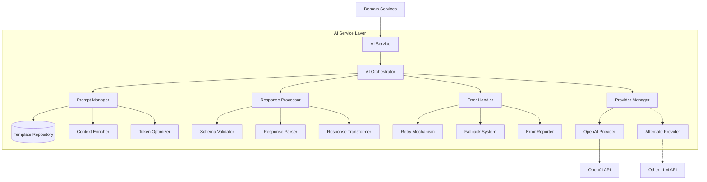

# AI Service Layer Architecture

The AI Service Layer is a critical component of the Idea Playground rebuild, providing robust integration with large language models for idea generation, variation creation, and idea refinement. This document details the architecture and implementation of this layer.

## Architecture Overview

The AI Service Layer follows a multi-tiered architecture designed for reliability, flexibility, and performance:



## Key Components

### 1. AI Service Interface

The AI Service provides a clean, domain-focused interface for the rest of the application:

```typescript
interface AIService {
  // Core methods for idea operations
  generateIdea(params: IdeaGenerationParams): Promise<IdeaGenerationResult>;
  generateVariations(params: VariationParams): Promise<VariationResult>;
  mergeIdeas(params: MergeParams): Promise<MergeResult>;
  refineIdea(params: RefinementParams): Promise<RefinementResult>;
  
  // Streaming variants for real-time updates
  generateIdeaStream(params: IdeaGenerationParams): Observable<IdeaGenerationPartialResult>;
  generateVariationsStream(params: VariationParams): Observable<VariationPartialResult>;
  
  // Utility methods
  getCostEstimate(operation: AIOperation): CostEstimate;
  getModelCapabilities(): ModelCapabilities;
}
```

### 2. AI Orchestrator

The Orchestrator is the core component that coordinates all AI operations:

```typescript
class AIOrchestrator {
  constructor(
    private readonly promptManager: PromptManager,
    private readonly responseProcessor: ResponseProcessor,
    private readonly errorHandler: ErrorHandler,
    private readonly providerManager: ProviderManager,
    private readonly logger: Logger
  ) {}
  
  async execute<T>(request: AIRequest, validator: SchemaValidator<T>): Promise<T> {
    try {
      // 1. Prepare the prompt
      const preparedPrompt = this.promptManager.preparePrompt(request);
      
      // 2. Select appropriate provider
      const provider = this.providerManager.selectProvider(request.requirements);
      
      // 3. Execute request
      const rawResponse = await provider.execute(preparedPrompt);
      
      // 4. Process and validate response
      const processedResponse = await this.responseProcessor.process(
        rawResponse, 
        validator
      );
      
      return processedResponse;
    } catch (error) {
      // Handle errors with proper recovery
      return this.errorHandler.handleError(error, request);
    }
  }
  
  // Streaming variant
  executeStream<T>(request: AIRequest, validator: SchemaValidator<T>): Observable<Partial<T>> {
    // Similar implementation but with streaming
  }
}
```

### 3. Prompt Management

The Prompt Manager handles all aspects of preparing effective prompts:

#### Template Repository

```typescript
interface PromptTemplate {
  id: string;
  version: string;
  template: string;
  parameters: string[];
  description: string;
  expectedResponseSchema: Record<string, unknown>;
}

class TemplateRepository {
  private templates: Map<string, PromptTemplate> = new Map();
  
  getTemplate(id: string, version?: string): PromptTemplate {
    // Implementation to get the appropriate template
  }
  
  registerTemplate(template: PromptTemplate): void {
    // Implementation to register a new template
  }
}
```

#### Context Enricher

```typescript
interface ContextProvider {
  getContext(params: Record<string, unknown>): Promise<Record<string, unknown>>;
}

class ContextEnricher {
  constructor(private readonly providers: Map<string, ContextProvider>) {}
  
  async enrichContext(
    baseContext: Record<string, unknown>,
    params: Record<string, unknown>,
    providerIds: string[]
  ): Promise<Record<string, unknown>> {
    // Implementation to enrich context from multiple providers
  }
}
```

#### Prompt Manager

```typescript
class PromptManager {
  constructor(
    private readonly templateRepository: TemplateRepository,
    private readonly contextEnricher: ContextEnricher,
    private readonly tokenOptimizer: TokenOptimizer
  ) {}
  
  async preparePrompt(request: AIRequest): Promise<PreparedPrompt> {
    // 1. Get the appropriate template
    const template = this.templateRepository.getTemplate(
      request.templateId,
      request.templateVersion
    );
    
    // 2. Enrich context with providers
    const enrichedContext = await this.contextEnricher.enrichContext(
      request.baseContext || {},
      request.parameters || {},
      request.contextProviders || []
    );
    
    // 3. Fill template with context
    let filledTemplate = template.template;
    for (const key of template.parameters) {
      const value = enrichedContext[key];
      if (value) {
        filledTemplate = filledTemplate.replace(`{{${key}}}`, String(value));
      }
    }
    
    // 4. Optimize for token usage
    const optimizedPrompt = this.tokenOptimizer.optimize(
      filledTemplate,
      request.constraints
    );
    
    return {
      content: optimizedPrompt,
      expectedSchema: template.expectedResponseSchema,
      parameters: enrichedContext
    };
  }
}
```

### 4. Response Processing

The Response Processor handles validation and parsing of AI responses:

#### Schema Validator

```typescript
interface SchemaValidator<T> {
  validate(data: unknown): Result<T, ValidationError>;
}

class ZodSchemaValidator<T> implements SchemaValidator<T> {
  constructor(private readonly schema: z.ZodSchema<T>) {}
  
  validate(data: unknown): Result<T, ValidationError> {
    try {
      const validated = this.schema.parse(data);
      return Result.ok(validated);
    } catch (error) {
      return Result.fail(new ValidationError(error.message, error));
    }
  }
}
```

#### Response Parser

```typescript
class ResponseParser {
  parse<T>(response: string, validator: SchemaValidator<T>): Result<T, ParsingError> {
    try {
      // First attempt: Direct parsing
      const parsed = JSON.parse(response);
      return validator.validate(parsed);
    } catch (jsonError) {
      try {
        // Second attempt: Repair malformed JSON
        const repaired = this.repairJson(response);
        const parsed = JSON.parse(repaired);
        return validator.validate(parsed);
      } catch (repairError) {
        try {
          // Third attempt: Extract structured data
          const extracted = this.extractStructured(response);
          return validator.validate(extracted);
        } catch (extractError) {
          return Result.fail(
            new ParsingError('Failed to parse response', {
              jsonError,
              repairError,
              extractError,
              response
            })
          );
        }
      }
    }
  }
  
  private repairJson(malformedJson: string): string {
    // Implementation of JSON repair techniques
  }
  
  private extractStructured(text: string): unknown {
    // Implementation to extract structured data using regex and heuristics
  }
}
```

### 5. Error Handling

The Error Handler provides robust error recovery:

```typescript
class ErrorHandler {
  constructor(
    private readonly retryMechanism: RetryMechanism,
    private readonly fallbackSystem: FallbackSystem,
    private readonly errorReporter: ErrorReporter
  ) {}
  
  async handleError<T>(error: Error, request: AIRequest): Promise<T> {
    // Log the error
    this.errorReporter.reportError(error, request);
    
    // Determine if retryable
    if (this.retryMechanism.isRetryable(error)) {
      return await this.retryMechanism.retry<T>(
        () => this.executeRequest<T>(request),
        error
      );
    }
    
    // Try fallback
    return await this.fallbackSystem.executeFallback<T>(request, error);
  }
  
  private async executeRequest<T>(request: AIRequest): Promise<T> {
    // Implementation to re-execute a request
  }
}
```

#### Retry Mechanism

```typescript
class RetryMechanism {
  constructor(
    private readonly maxRetries: number = 3,
    private readonly initialDelay: number = 1000,
    private readonly backoffFactor: number = 2
  ) {}
  
  isRetryable(error: Error): boolean {
    // Determine if an error is retryable
  }
  
  async retry<T>(operation: () => Promise<T>, originalError: Error): Promise<T> {
    let lastError = originalError;
    let delay = this.initialDelay;
    
    for (let attempt = 1; attempt <= this.maxRetries; attempt++) {
      try {
        // Wait exponentially longer between each retry
        await new Promise(resolve => setTimeout(resolve, delay));
        delay *= this.backoffFactor;
        
        // Attempt the operation again
        return await operation();
      } catch (error) {
        lastError = error;
        
        // If error is not retryable, stop retrying
        if (!this.isRetryable(error)) {
          break;
        }
      }
    }
    
    throw lastError;
  }
}
```

### 6. Provider Management

The Provider Manager handles selection and configuration of AI providers:

```typescript
interface LLMProvider {
  execute(prompt: PreparedPrompt): Promise<string>;
  executeStream(prompt: PreparedPrompt): Observable<string>;
  getCapabilities(): ProviderCapabilities;
}

class ProviderManager {
  constructor(
    private readonly providers: Map<string, LLMProvider>,
    private readonly defaultProvider: string
  ) {}
  
  selectProvider(requirements?: ProviderRequirements): LLMProvider {
    if (!requirements) {
      return this.providers.get(this.defaultProvider)!;
    }
    
    // Find the most suitable provider based on requirements
    const candidates = Array.from(this.providers.values()).filter(
      provider => this.meetsRequirements(provider, requirements)
    );
    
    if (candidates.length === 0) {
      return this.providers.get(this.defaultProvider)!;
    }
    
    // Select the best candidate based on requirements
    return candidates[0];
  }
  
  private meetsRequirements(
    provider: LLMProvider,
    requirements: ProviderRequirements
  ): boolean {
    // Check if provider meets the specified requirements
  }
}
```

## Solving JSON Parsing Issues

JSON parsing issues have been a major challenge in the existing system. Here's how we solve them:

### 1. Multi-Stage Parsing

Our approach uses a multi-stage parsing strategy:

1. **Direct Parsing**: Try standard JSON.parse
2. **JSON Repair**: If direct parsing fails, apply repair techniques
3. **Structured Extraction**: If repair fails, use regex and heuristics

### 2. Common Repair Techniques

```typescript
function repairJson(malformedJson: string): string {
  let repaired = malformedJson;
  
  // Fix unescaped quotes in JSON strings
  repaired = repaired.replace(/([^\\])"([^"]*?)([^\\])"/g, '$1\\"$2$3\\"');
  
  // Fix trailing commas in arrays and objects
  repaired = repaired.replace(/,\s*([\]}])/g, '$1');
  
  // Fix missing commas between objects in arrays
  repaired = repaired.replace(/}\s*{/g, '},{');
  
  // Balance brackets and braces
  repaired = balanceBrackets(repaired);
  
  return repaired;
}
```

### 3. Schema Validation

Every response is validated against a predefined schema:

```typescript
// Example schema for idea generation
const ideaSchema = z.object({
  title: z.string(),
  description: z.string(),
  problemStatement: z.string(),
  targetAudience: z.string(),
  uniqueValue: z.string(),
  strengths: z.array(z.string()),
  weaknesses: z.array(z.string()),
  opportunities: z.array(z.string()),
  threats: z.array(z.string())
});

type Idea = z.infer<typeof ideaSchema>;
```

### 4. Function Calling

We use OpenAI's function calling to enforce structured output:

```typescript
async function generateIdeaWithFunctionCalling(prompt: string): Promise<Idea> {
  const response = await openai.chat.completions.create({
    model: "gpt-4",
    messages: [{ role: "user", content: prompt }],
    functions: [
      {
        name: "generateBusinessIdea",
        description: "Generate a business idea",
        parameters: {
          type: "object",
          properties: {
            title: {
              type: "string",
              description: "The title of the business idea"
            },
            description: {
              type: "string",
              description: "Detailed description of the business idea"
            },
            // ... other fields
          },
          required: ["title", "description", "problemStatement", "targetAudience", "uniqueValue"]
        }
      }
    ],
    function_call: { name: "generateBusinessIdea" }
  });
  
  const functionCall = response.choices[0].message.function_call;
  if (!functionCall) {
    throw new Error("No function call in response");
  }
  
  try {
    const parsedArgs = JSON.parse(functionCall.arguments);
    return ideaSchema.parse(parsedArgs);
  } catch (error) {
    // Fall back to our robust parsing
    return responseParser.parse(functionCall.arguments, new ZodSchemaValidator(ideaSchema)).unwrap();
  }
}
```

## Integration with Domain Services

The AI Service is integrated with domain services through a clean dependency injection pattern:

```typescript
class IdeaGenerationService {
  constructor(private readonly aiService: AIService) {}
  
  async generateIdea(params: IdeaGenerationServiceParams): Promise<Idea> {
    // Transform service params to AI service params
    const aiParams: IdeaGenerationParams = {
      industry: params.industry,
      constraints: params.constraints,
      templateId: 'idea-generation',
      contextProviders: ['user-profile', 'company-data']
    };
    
    // Use AI service
    const result = await this.aiService.generateIdea(aiParams);
    
    // Transform result if needed and return
    return result.idea;
  }
}
```

## Streaming Responses for Real-time Feedback

The AI Service supports streaming responses to provide real-time feedback to users:

```typescript
class IdeaPlaygroundComponent {
  constructor(private readonly ideaService: IdeaGenerationService) {}
  
  generateIdeaWithFeedback() {
    const params = this.getParams();
    
    // Start with empty state
    this.setState({ isGenerating: true, partialIdea: null });
    
    // Use streaming API
    const subscription = this.ideaService.generateIdeaStream(params).subscribe({
      next: (partialResult) => {
        // Update UI with partial results as they arrive
        this.setState({
          partialIdea: {
            ...this.state.partialIdea,
            ...partialResult
          }
        });
      },
      error: (error) => {
        this.setState({ isGenerating: false, error });
      },
      complete: () => {
        this.setState({ isGenerating: false, isComplete: true });
      }
    });
    
    // Store subscription for cleanup
    this.activeSubscription = subscription;
  }
  
  componentWillUnmount() {
    // Clean up subscription if component is unmounted
    if (this.activeSubscription) {
      this.activeSubscription.unsubscribe();
    }
  }
}
```

## Performance Considerations

The AI Service incorporates several performance optimizations:

1. **Prompt Caching**: Similar prompts are cached to reduce API calls
2. **Response Caching**: Responses are cached with appropriate invalidation
3. **Token Optimization**: Prompts are optimized to minimize token usage
4. **Batched Requests**: Multiple operations are batched when possible
5. **Concurrent Operations**: Independent operations are processed concurrently

## Monitoring and Observability

The AI Service includes comprehensive monitoring:

1. **Operation Metrics**: Track success rates, latency, and token usage
2. **Error Tracking**: Categorize and track error types and frequency
3. **Cost Monitoring**: Track API costs by operation type
4. **Quality Assessment**: Monitor response quality metrics

## Implementation Strategy

The AI Service will be implemented in phases:

1. **Phase 1**: Core functionality with basic error handling
2. **Phase 2**: Enhanced parsing and validation
3. **Phase 3**: Streaming responses and progress indicators
4. **Phase 4**: Advanced error recovery and fallbacks
5. **Phase 5**: Performance optimization and monitoring

## Conclusion

The AI Service Layer is designed to provide robust, reliable AI capabilities to the Idea Playground. By addressing the key challenges of the current implementation—particularly JSON parsing issues and error handling—it will significantly improve the user experience and system reliability.
