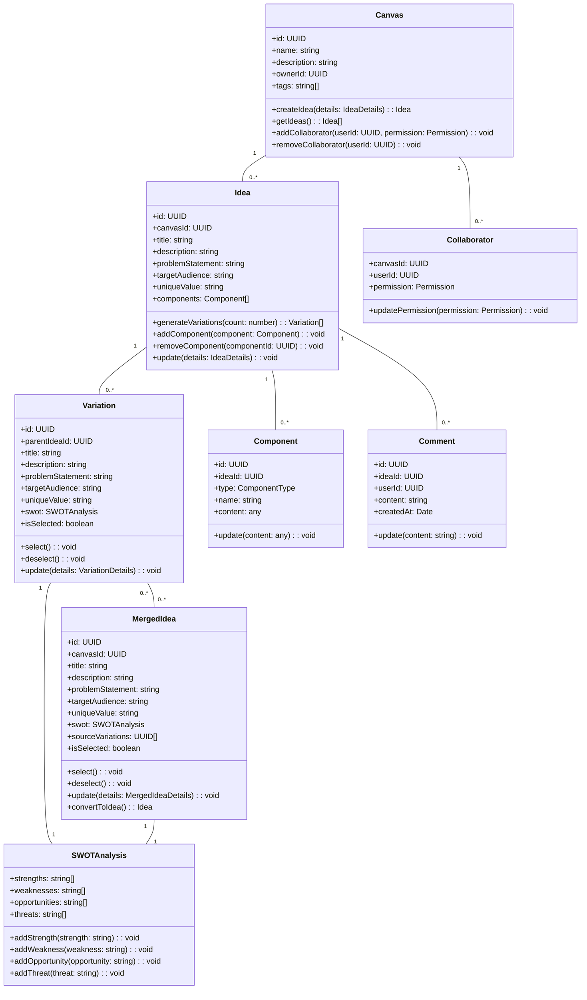

# Domain Services Architecture

This document describes the domain services layer of the Idea Playground, which contains the core business logic and domain rules of the application.

## Domain-Driven Design Approach

The Idea Playground adopts a domain-driven design (DDD) approach to ensure that the codebase directly reflects the business domain. This architecture provides several benefits:

1. **Business Alignment**: The code structure mirrors the business concepts
2. **Maintainability**: Business rules are centralized and explicitly modeled
3. **Flexibility**: The domain layer is isolated from infrastructure concerns
4. **Testability**: Business logic can be tested independently

## Domain Model



## Aggregate Roots

The domain model has the following aggregate roots:

### 1. Canvas Aggregate

The Canvas is the primary container for organizing ideas. It manages:
- Canvas metadata (name, description, tags)
- Canvas ownership and collaboration
- Access control for canvas contents

```typescript
class Canvas extends AggregateRoot {
  private _id: UUID;
  private _name: string;
  private _description: string;
  private _ownerId: UUID;
  private _tags: string[];
  private _collaborators: Map<UUID, Permission>;
  
  // Constructor sets initial state
  constructor(params: CanvasCreationParams, ownerId: UUID) {
    super();
    this._id = params.id || UUID.generate();
    this._name = params.name;
    this._description = params.description || '';
    this._ownerId = ownerId;
    this._tags = params.tags || [];
    this._collaborators = new Map();
    
    // Invariant checks
    this.validateCanvasName(this._name);
    
    // Register creation event
    this.registerDomainEvent(new CanvasCreatedEvent(this));
  }
  
  // Getters for immutable access to state
  get id(): UUID { return this._id; }
  get name(): string { return this._name; }
  get description(): string { return this._description; }
  get ownerId(): UUID { return this._ownerId; }
  get tags(): string[] { return [...this._tags]; }
  
  // Commands to modify state
  public rename(name: string): void {
    this.validateCanvasName(name);
    this._name = name;
    this.registerDomainEvent(new CanvasRenamedEvent(this));
  }
  
  public updateDescription(description: string): void {
    this._description = description;
    this.registerDomainEvent(new CanvasUpdatedEvent(this));
  }
  
  public addTag(tag: string): void {
    if (!this._tags.includes(tag)) {
      this._tags.push(tag);
      this.registerDomainEvent(new CanvasTagsUpdatedEvent(this));
    }
  }
  
  public removeTag(tag: string): void {
    this._tags = this._tags.filter(t => t !== tag);
    this.registerDomainEvent(new CanvasTagsUpdatedEvent(this));
  }
  
  public addCollaborator(userId: UUID, permission: Permission): void {
    if (userId === this._ownerId) {
      throw new DomainError('Cannot add owner as collaborator');
    }
    
    this._collaborators.set(userId, permission);
    this.registerDomainEvent(new CollaboratorAddedEvent(this, userId, permission));
  }
  
  public removeCollaborator(userId: UUID): void {
    if (!this._collaborators.has(userId)) {
      throw new DomainError('Collaborator not found');
    }
    
    this._collaborators.delete(userId);
    this.registerDomainEvent(new CollaboratorRemovedEvent(this, userId));
  }
  
  public canUserAccess(userId: UUID): boolean {
    return userId === this._ownerId || this._collaborators.has(userId);
  }
  
  public canUserEdit(userId: UUID): boolean {
    return userId === this._ownerId || 
           (this._collaborators.has(userId) && 
            this._collaborators.get(userId) === Permission.Edit);
  }
  
  // Invariant validations
  private validateCanvasName(name: string): void {
    if (!name || name.trim().length === 0) {
      throw new DomainError('Canvas name cannot be empty');
    }
    
    if (name.length > 100) {
      throw new DomainError('Canvas name cannot exceed 100 characters');
    }
  }
}
```

### 2. Idea Aggregate

The Idea represents a business concept with all its details. It manages:
- Idea metadata (title, description, etc.)
- Problem statement and target audience
- Idea components and variations

```typescript
class Idea extends AggregateRoot {
  private _id: UUID;
  private _canvasId: UUID;
  private _title: string;
  private _description: string;
  private _problemStatement: string;
  private _targetAudience: string;
  private _uniqueValue: string;
  private _components: Component[];
  
  constructor(params: IdeaCreationParams, canvasId: UUID) {
    super();
    this._id = params.id || UUID.generate();
    this._canvasId = canvasId;
    this._title = params.title;
    this._description = params.description;
    this._problemStatement = params.problemStatement;
    this._targetAudience = params.targetAudience;
    this._uniqueValue = params.uniqueValue;
    this._components = [];
    
    // Validate invariants
    this.validateTitle(this._title);
    
    // Register domain event
    this.registerDomainEvent(new IdeaCreatedEvent(this));
  }
  
  // Getters
  get id(): UUID { return this._id; }
  get canvasId(): UUID { return this._canvasId; }
  get title(): string { return this._title; }
  get description(): string { return this._description; }
  get problemStatement(): string { return this._problemStatement; }
  get targetAudience(): string { return this._targetAudience; }
  get uniqueValue(): string { return this._uniqueValue; }
  get components(): Component[] { return [...this._components]; }
  
  // Commands
  public update(details: IdeaUpdateParams): void {
    if (details.title) {
      this.validateTitle(details.title);
      this._title = details.title;
    }
    
    if (details.description) {
      this._description = details.description;
    }
    
    if (details.problemStatement) {
      this._problemStatement = details.problemStatement;
    }
    
    if (details.targetAudience) {
      this._targetAudience = details.targetAudience;
    }
    
    if (details.uniqueValue) {
      this._uniqueValue = details.uniqueValue;
    }
    
    this.registerDomainEvent(new IdeaUpdatedEvent(this));
  }
  
  public addComponent(componentParams: ComponentParams): Component {
    const component = new Component(
      componentParams,
      this._id
    );
    
    this._components.push(component);
    this.registerDomainEvent(new ComponentAddedEvent(this, component));
    
    return component;
  }
  
  public removeComponent(componentId: UUID): void {
    const index = this._components.findIndex(c => c.id === componentId);
    
    if (index === -1) {
      throw new DomainError('Component not found');
    }
    
    const component = this._components[index];
    this._components.splice(index, 1);
    
    this.registerDomainEvent(new ComponentRemovedEvent(this, component));
  }
  
  // Invariant validation
  private validateTitle(title: string): void {
    if (!title || title.trim().length === 0) {
      throw new DomainError('Idea title cannot be empty');
    }
    
    if (title.length > 100) {
      throw new DomainError('Idea title cannot exceed 100 characters');
    }
  }
}
```

### 3. Variation Aggregate

The Variation represents a derivative of an original idea. It manages:
- Variation details (title, description, etc.)
- SWOT analysis
- Selection state for merging

```typescript
class Variation extends AggregateRoot {
  private _id: UUID;
  private _parentIdeaId: UUID;
  private _title: string;
  private _description: string;
  private _problemStatement: string;
  private _targetAudience: string;
  private _uniqueValue: string;
  private _swot: SWOTAnalysis;
  private _isSelected: boolean;
  
  constructor(params: VariationCreationParams, parentIdeaId: UUID) {
    super();
    this._id = params.id || UUID.generate();
    this._parentIdeaId = parentIdeaId;
    this._title = params.title;
    this._description = params.description;
    this._problemStatement = params.problemStatement;
    this._targetAudience = params.targetAudience;
    this._uniqueValue = params.uniqueValue;
    this._swot = new SWOTAnalysis(params.swot);
    this._isSelected = false;
    
    // Register domain event
    this.registerDomainEvent(new VariationCreatedEvent(this));
  }
  
  // Getters
  get id(): UUID { return this._id; }
  get parentIdeaId(): UUID { return this._parentIdeaId; }
  get title(): string { return this._title; }
  get description(): string { return this._description; }
  get problemStatement(): string { return this._problemStatement; }
  get targetAudience(): string { return this._targetAudience; }
  get uniqueValue(): string { return this._uniqueValue; }
  get swot(): SWOTAnalysis { return this._swot; }
  get isSelected(): boolean { return this._isSelected; }
  
  // Commands
  public update(details: VariationUpdateParams): void {
    if (details.title) {
      this._title = details.title;
    }
    
    if (details.description) {
      this._description = details.description;
    }
    
    if (details.problemStatement) {
      this._problemStatement = details.problemStatement;
    }
    
    if (details.targetAudience) {
      this._targetAudience = details.targetAudience;
    }
    
    if (details.uniqueValue) {
      this._uniqueValue = details.uniqueValue;
    }
    
    if (details.swot) {
      this._swot.update(details.swot);
    }
    
    this.registerDomainEvent(new VariationUpdatedEvent(this));
  }
  
  public select(): void {
    if (!this._isSelected) {
      this._isSelected = true;
      this.registerDomainEvent(new VariationSelectedEvent(this));
    }
  }
  
  public deselect(): void {
    if (this._isSelected) {
      this._isSelected = false;
      this.registerDomainEvent(new VariationDeselectedEvent(this));
    }
  }
}
```

### 4. Merged Idea Aggregate

The Merged Idea represents a combination of multiple variations. It manages:
- Merged idea details
- Source variation relationships
- Final selection state

```typescript
class MergedIdea extends AggregateRoot {
  private _id: UUID;
  private _canvasId: UUID;
  private _title: string;
  private _description: string;
  private _problemStatement: string;
  private _targetAudience: string;
  private _uniqueValue: string;
  private _swot: SWOTAnalysis;
  private _sourceVariations: UUID[];
  private _isSelected: boolean;
  
  constructor(params: MergedIdeaCreationParams, canvasId: UUID, sourceVariations: UUID[]) {
    super();
    this._id = params.id || UUID.generate();
    this._canvasId = canvasId;
    this._title = params.title;
    this._description = params.description;
    this._problemStatement = params.problemStatement;
    this._targetAudience = params.targetAudience;
    this._uniqueValue = params.uniqueValue;
    this._swot = new SWOTAnalysis(params.swot);
    this._sourceVariations = [...sourceVariations];
    this._isSelected = false;
    
    // Register domain event
    this.registerDomainEvent(new MergedIdeaCreatedEvent(this));
  }
  
  // Getters
  get id(): UUID { return this._id; }
  get canvasId(): UUID { return this._canvasId; }
  get title(): string { return this._title; }
  get description(): string { return this._description; }
  get problemStatement(): string { return this._problemStatement; }
  get targetAudience(): string { return this._targetAudience; }
  get uniqueValue(): string { return this._uniqueValue; }
  get swot(): SWOTAnalysis { return this._swot; }
  get sourceVariations(): UUID[] { return [...this._sourceVariations]; }
  get isSelected(): boolean { return this._isSelected; }
  
  // Commands
  public update(details: MergedIdeaUpdateParams): void {
    if (details.title) {
      this._title = details.title;
    }
    
    if (details.description) {
      this._description = details.description;
    }
    
    if (details.problemStatement) {
      this._problemStatement = details.problemStatement;
    }
    
    if (details.targetAudience) {
      this._targetAudience = details.targetAudience;
    }
    
    if (details.uniqueValue) {
      this._uniqueValue = details.uniqueValue;
    }
    
    if (details.swot) {
      this._swot.update(details.swot);
    }
    
    this.registerDomainEvent(new MergedIdeaUpdatedEvent(this));
  }
  
  public select(): void {
    if (!this._isSelected) {
      this._isSelected = true;
      this.registerDomainEvent(new MergedIdeaSelectedEvent(this));
    }
  }
  
  public deselect(): void {
    if (this._isSelected) {
      this._isSelected = false;
      this.registerDomainEvent(new MergedIdeaDeselectedEvent(this));
    }
  }
  
  public convertToIdea(): IdeaCreationParams {
    return {
      title: this._title,
      description: this._description,
      problemStatement: this._problemStatement,
      targetAudience: this._targetAudience,
      uniqueValue: this._uniqueValue
    };
  }
}
```

## Value Objects

Value objects are immutable objects that represent concepts in the domain that don't have an identity:

### 1. SWOT Analysis

```typescript
class SWOTAnalysis {
  private readonly _strengths: string[];
  private readonly _weaknesses: string[];
  private readonly _opportunities: string[];
  private readonly _threats: string[];
  
  constructor(params: SWOTParams) {
    this._strengths = params.strengths || [];
    this._weaknesses = params.weaknesses || [];
    this._opportunities = params.opportunities || [];
    this._threats = params.threats || [];
  }
  
  get strengths(): string[] { return [...this._strengths]; }
  get weaknesses(): string[] { return [...this._weaknesses]; }
  get opportunities(): string[] { return [...this._opportunities]; }
  get threats(): string[] { return [...this._threats]; }
  
  // Since value objects are immutable, we return a new instance on update
  public update(params: SWOTParams): SWOTAnalysis {
    return new SWOTAnalysis({
      strengths: params.strengths || this._strengths,
      weaknesses: params.weaknesses || this._weaknesses,
      opportunities: params.opportunities || this._opportunities,
      threats: params.threats || this._threats
    });
  }
}
```

### 2. Component

```typescript
class Component {
  private readonly _id: UUID;
  private readonly _ideaId: UUID;
  private readonly _type: ComponentType;
  private readonly _name: string;
  private readonly _content: any;
  
  constructor(params: ComponentParams, ideaId: UUID) {
    this._id = params.id || UUID.generate();
    this._ideaId = ideaId;
    this._type = params.type;
    this._name = params.name;
    this._content = params.content;
  }
  
  get id(): UUID { return this._id; }
  get ideaId(): UUID { return this._ideaId; }
  get type(): ComponentType { return this._type; }
  get name(): string { return this._name; }
  get content(): any { return this._content; }
  
  // Return a new instance on update
  public update(content: any): Component {
    return new Component({
      id: this._id,
      type: this._type,
      name: this._name,
      content
    }, this._ideaId);
  }
}
```

## Domain Services

Domain services implement business logic that doesn't naturally fit into entities:

### 1. Canvas Service

```typescript
interface CanvasService {
  createCanvas(params: CanvasCreationParams, userId: UUID): Promise<Canvas>;
  getCanvas(canvasId: UUID, userId: UUID): Promise<Canvas>;
  updateCanvas(canvasId: UUID, params: CanvasUpdateParams, userId: UUID): Promise<Canvas>;
  deleteCanvas(canvasId: UUID, userId: UUID): Promise<void>;
  listCanvases(userId: UUID): Promise<Canvas[]>;
  addCollaborator(canvasId: UUID, collaboratorId: UUID, permission: Permission, userId: UUID): Promise<void>;
  removeCollaborator(canvasId: UUID, collaboratorId: UUID, userId: UUID): Promise<void>;
}
```

### 2. Idea Service

```typescript
interface IdeaService {
  createIdea(params: IdeaCreationParams, canvasId: UUID, userId: UUID): Promise<Idea>;
  getIdea(ideaId: UUID, userId: UUID): Promise<Idea>;
  updateIdea(ideaId: UUID, params: IdeaUpdateParams, userId: UUID): Promise<Idea>;
  deleteIdea(ideaId: UUID, userId: UUID): Promise<void>;
  listIdeas(canvasId: UUID, userId: UUID): Promise<Idea[]>;
  
  generateIdea(params: IdeaGenerationParams, canvasId: UUID, userId: UUID): Promise<Idea>;
  refineIdea(ideaId: UUID, params: IdeaRefinementParams, userId: UUID): Promise<Idea>;
}
```

### 3. Variation Service

```typescript
interface VariationService {
  generateVariations(ideaId: UUID, count: number, userId: UUID): Promise<Variation[]>;
  getVariation(variationId: UUID, userId: UUID): Promise<Variation>;
  updateVariation(variationId: UUID, params: VariationUpdateParams, userId: UUID): Promise<Variation>;
  listVariations(ideaId: UUID, userId: UUID): Promise<Variation[]>;
  selectVariation(variationId: UUID, userId: UUID): Promise<void>;
  deselectVariation(variationId: UUID, userId: UUID): Promise<void>;
}
```

### 4. Merge Service

```typescript
interface MergeService {
  mergeVariations(variationIds: UUID[], userId: UUID): Promise<MergedIdea[]>;
  getMergedIdea(mergedIdeaId: UUID, userId: UUID): Promise<MergedIdea>;
  updateMergedIdea(mergedIdeaId: UUID, params: MergedIdeaUpdateParams, userId: UUID): Promise<MergedIdea>;
  listMergedIdeas(canvasId: UUID, userId: UUID): Promise<MergedIdea[]>;
  selectMergedIdea(mergedIdeaId: UUID, userId: UUID): Promise<void>;
  deselectMergedIdea(mergedIdeaId: UUID, userId: UUID): Promise<void>;
  convertToIdea(mergedIdeaId: UUID, userId: UUID): Promise<Idea>;
}
```

## Domain Events

Domain events represent important changes in the domain:

```typescript
// Base domain event class
abstract class DomainEvent {
  readonly type: string;
  readonly timestamp: Date;
  
  constructor(type: string) {
    this.type = type;
    this.timestamp = new Date();
  }
}

// Canvas events
class CanvasCreatedEvent extends DomainEvent {
  readonly canvas: Canvas;
  
  constructor(canvas: Canvas) {
    super('canvas.created');
    this.canvas = canvas;
  }
}

class CanvasUpdatedEvent extends DomainEvent {
  readonly canvas: Canvas;
  
  constructor(canvas: Canvas) {
    super('canvas.updated');
    this.canvas = canvas;
  }
}

// Idea events
class IdeaCreatedEvent extends DomainEvent {
  readonly idea: Idea;
  
  constructor(idea: Idea) {
    super('idea.created');
    this.idea = idea;
  }
}

class IdeaUpdatedEvent extends DomainEvent {
  readonly idea: Idea;
  
  constructor(idea: Idea) {
    super('idea.updated');
    this.idea = idea;
  }
}

// Variation events
class VariationCreatedEvent extends DomainEvent {
  readonly variation: Variation;
  
  constructor(variation: Variation) {
    super('variation.created');
    this.variation = variation;
  }
}

class VariationSelectedEvent extends DomainEvent {
  readonly variation: Variation;
  
  constructor(variation: Variation) {
    super('variation.selected');
    this.variation = variation;
  }
}
```

## Domain Event Handling

Domain events are processed by event handlers:

```typescript
interface DomainEventHandler<T extends DomainEvent> {
  handle(event: T): Promise<void>;
}

class CanvasCreatedEventHandler implements DomainEventHandler<CanvasCreatedEvent> {
  constructor(private readonly accessLogService: AccessLogService) {}
  
  async handle(event: CanvasCreatedEvent): Promise<void> {
    // Log the canvas creation
    await this.accessLogService.logCanvasCreation(
      event.canvas.id,
      event.canvas.ownerId,
      event.timestamp
    );
  }
}
```

## Domain Repositories

Repositories abstract data access for domain objects:

```typescript
interface CanvasRepository {
  save(canvas: Canvas): Promise<void>;
  findById(id: UUID): Promise<Canvas | null>;
  findByOwner(ownerId: UUID): Promise<Canvas[]>;
  findShared(userId: UUID): Promise<Canvas[]>;
  delete(id: UUID): Promise<void>;
}

interface IdeaRepository {
  save(idea: Idea): Promise<void>;
  findById(id: UUID): Promise<Idea | null>;
  findByCanvas(canvasId: UUID): Promise<Idea[]>;
  delete(id: UUID): Promise<void>;
}

interface VariationRepository {
  save(variation: Variation): Promise<void>;
  findById(id: UUID): Promise<Variation | null>;
  findByParentIdea(ideaId: UUID): Promise<Variation[]>;
  findSelected(ideaId: UUID): Promise<Variation[]>;
  delete(id: UUID): Promise<void>;
}

interface MergedIdeaRepository {
  save(mergedIdea: MergedIdea): Promise<void>;
  findById(id: UUID): Promise<MergedIdea | null>;
  findByCanvas(canvasId: UUID): Promise<MergedIdea[]>;
  findBySourceVariation(variationId: UUID): Promise<MergedIdea[]>;
  delete(id: UUID): Promise<void>;
}
```

## Service Implementation Example

Here's an example of a domain service implementation:

```typescript
class IdeaServiceImpl implements IdeaService {
  constructor(
    private readonly ideaRepository: IdeaRepository,
    private readonly canvasRepository: CanvasRepository,
    private readonly aiService: AIService,
    private readonly eventPublisher: DomainEventPublisher
  ) {}
  
  async createIdea(params: IdeaCreationParams, canvasId: UUID, userId: UUID): Promise<Idea> {
    // 1. Check if canvas exists and user has access
    const canvas = await this.canvasRepository.findById(canvasId);
    if (!canvas) {
      throw new DomainError('Canvas not found');
    }
    
    if (!canvas.canUserEdit(userId)) {
      throw new DomainError('User does not have edit permission');
    }
    
    // 2. Create the idea
    const idea = new Idea(params, canvasId);
    
    // 3. Save the idea
    await this.ideaRepository.save(idea);
    
    // 4. Publish domain events
    idea.domainEvents.forEach(event => {
      this.eventPublisher.publish(event);
    });
    
    return idea;
  }
  
  async generateIdea(params: IdeaGenerationParams, canvasId: UUID, userId: UUID): Promise<Idea> {
    // 1. Check if canvas exists and user has access
    const canvas = await this.canvasRepository.findById(canvasId);
    if (!canvas) {
      throw new DomainError('Canvas not found');
    }
    
    if (!canvas.canUserEdit(userId)) {
      throw new DomainError('User does not have edit permission');
    }
    
    // 2. Generate the idea using AI service
    const generatedIdeaParams = await this.aiService.generateIdea({
      industry: params.industry,
      constraints: params.constraints,
      targetAudience: params.targetAudience
    });
    
    // 3. Create and save the idea
    const idea = new Idea(generatedIdeaParams, canvasId);
    await this.ideaRepository.save(idea);
    
    // 4. Publish domain events
    idea.domainEvents.forEach(event => {
      this.eventPublisher.publish(event);
    });
    
    return idea;
  }
  
  // Other methods implementation...
}
```

## Transaction Management

To ensure consistency, operations that span multiple aggregates use transactions:

```typescript
class TransactionalVariationService implements VariationService {
  constructor(
    private readonly variationRepository: VariationRepository,
    private readonly ideaRepository: IdeaRepository,
    private readonly transactionManager: TransactionManager,
    private readonly aiService: AIService,
    private readonly eventPublisher: DomainEventPublisher
  ) {}
  
  async generateVariations(ideaId: UUID, count: number, userId: UUID): Promise<Variation[]> {
    // 1. Check if idea exists and user has access
    const idea = await this.ideaRepository.findById(ideaId);
    if (!idea) {
      throw new DomainError('Idea not found');
    }
    
    // 2. Use transaction to ensure all variations are saved or none
    return this.transactionManager.runInTransaction(async () => {
      // 3. Generate variations using AI service
      const variationParamsList = await this.aiService.generateVariations({
        ideaId,
        count,
        title: idea.title,
        description: idea.description,
        problemStatement: idea.problemStatement,
        targetAudience: idea.targetAudience,
        uniqueValue: idea.uniqueValue
      });
      
      // 4. Create variation entities
      const variations: Variation[] = [];
      
      for (
