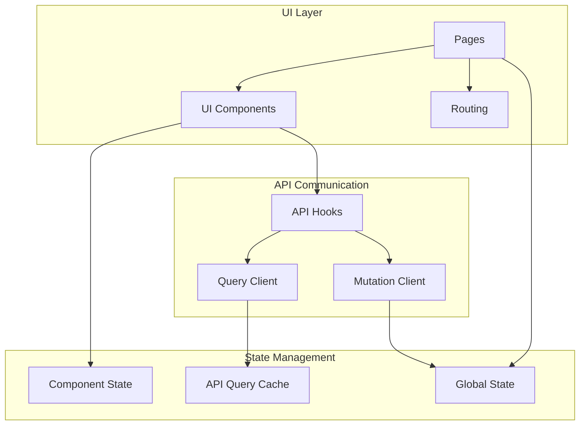

# UI Integration Architecture

This document details the UI component architecture and integration approach for the Idea Playground rebuild, focusing on creating a responsive, maintainable, and user-friendly interface.

## Architecture Overview

The UI architecture follows a component-based approach with clear separation of concerns:



## Design System

### 1. Component Library

The component library is structured as a hierarchy of increasingly specialized components:

- **Atomic Components**: Low-level UI primitives (buttons, inputs, etc.)
- **Molecular Components**: Combinations of atomic components (form fields, cards, etc.)
- **Organism Components**: Complex UI elements that form coherent sections of the interface
- **Template Components**: Page-level layouts and containers

### 2. Component Architecture

Each component follows a consistent architecture:

```typescript
// Component definition
export interface ButtonProps {
  variant: 'primary' | 'secondary' | 'danger';
  size: 'small' | 'medium' | 'large';
  label: string;
  onClick: () => void;
  disabled?: boolean;
  isLoading?: boolean;
}

export const Button: React.FC<ButtonProps> = ({
  variant,
  size,
  label,
  onClick,
  disabled = false,
  isLoading = false
}) => {
  // Event handlers
  const handleClick = () => {
    if (!disabled && !isLoading) {
      onClick();
    }
  };
  
  // CSS class composition
  const classes = cn(
    'button',
    `button--${variant}`,
    `button--${size}`,
    {
      'button--disabled': disabled,
      'button--loading': isLoading
    }
  );
  
  // Render
  return (
    <button className={classes} onClick={handleClick} disabled={disabled}>
      {isLoading ? <Spinner size="small" /> : label}
    </button>
  );
};
```

### 3. Responsive Design

The UI is built with mobile-first responsive design principles:

- Fluid layouts that adapt to different screen sizes
- Breakpoint-based styling for different device categories
- Touch-friendly interaction patterns

```typescript
// Responsive container example
export const ResponsiveContainer: React.FC<PropsWithChildren> = ({ children }) => {
  return (
    <div className="container">
      <div className="container__inner">{children}</div>
    </div>
  );
};

// CSS (using CSS modules or styled-components)
/*
.container {
  width: 100%;
  margin: 0 auto;
  padding: 0 1rem;
  
  @media (min-width: 640px) {
    max-width: 640px;
  }
  
  @media (min-width: 768px) {
    max-width: 768px;
  }
  
  @media (min-width: 1024px) {
    max-width: 1024px;
  }
}

.container__inner {
  width: 100%;
}
*/
```

## State Management

The state management architecture uses Zustand for global state with a slice pattern:

### 1. Store Structure

```typescript
// Store definition
interface AppState {
  // User slice
  user: User | null;
  isAuthenticated: boolean;
  setUser: (user: User | null) => void;
  
  // Canvas slice
  canvases: Canvas[];
  currentCanvas: Canvas | null;
  isLoadingCanvases: boolean;
  fetchCanvases: () => Promise<void>;
  setCurrentCanvas: (canvasId: string) => Promise<void>;
  
  // Idea slice
  ideas: Idea[];
  currentIdea: Idea | null;
  isLoadingIdeas: boolean;
  fetchIdeas: (canvasId: string) => Promise<void>;
  setCurrentIdea: (ideaId: string) => Promise<void>;
  
  // Variation slice
  variations: Variation[];
  selectedVariations: string[];
  isLoadingVariations: boolean;
  fetchVariations: (ideaId: string) => Promise<void>;
  toggleVariationSelection: (variationId: string) => void;
  
  // UI slice
  sidebarOpen: boolean;
  activeView: 'canvas' | 'idea' | 'variation' | 'merge';
  toggleSidebar: () => void;
  setActiveView: (view: 'canvas' | 'idea' | 'variation' | 'merge') => void;
}

// Store implementation
export const useStore = create<AppState>((set, get) => ({
  // User slice implementation
  user: null,
  isAuthenticated: false,
  setUser: (user) => set({ user, isAuthenticated: !!user }),
  
  // Canvas slice implementation
  canvases: [],
  currentCanvas: null,
  isLoadingCanvases: false,
  fetchCanvases: async () => {
    set({ isLoadingCanvases: true });
    try {
      const canvases = await canvasService.getCanvases();
      set({ canvases, isLoadingCanvases: false });
    } catch (error) {
      set({ isLoadingCanvases: false });
      throw error;
    }
  },
  setCurrentCanvas: async (canvasId) => {
    set({ isLoadingCanvases: true });
    try {
      const canvas = await canvasService.getCanvas(canvasId);
      set({ currentCanvas: canvas, isLoadingCanvases: false });
      await get().fetchIdeas(canvasId);
    } catch (error) {
      set({ isLoadingCanvases: false });
      throw error;
    }
  },
  
  // Additional slices implementation...
}));
```

### 2. Store Selectors

```typescript
// Component usage with selectors
const CanvasList: React.FC = () => {
  // Select only what the component needs
  const canvases = useStore((state) => state.canvases);
  const isLoading = useStore((state) => state.isLoadingCanvases);
  const fetchCanvases = useStore((state) => state.fetchCanvases);
  const setCurrentCanvas = useStore((state) => state.setCurrentCanvas);
  
  useEffect(() => {
    fetchCanvases();
  }, [fetchCanvases]);
  
  if (isLoading) {
    return <Loading />;
  }
  
  return (
    <div className="canvas-list">
      {canvases.map(canvas => (
        <CanvasCard
          key={canvas.id}
          canvas={canvas}
          onClick={() => setCurrentCanvas(canvas.id)}
        />
      ))}
    </div>
  );
};
```

### 3. Component-Level State

For component-specific state, React hooks are used:

```typescript
const IdeaForm: React.FC<IdeaFormProps> = ({ onSubmit, initialValues }) => {
  // Form state
  const [formState, setFormState] = useState<IdeaFormState>({
    title: initialValues?.title || '',
    description: initialValues?.description || '',
    problemStatement: initialValues?.problemStatement || '',
    targetAudience: initialValues?.targetAudience || '',
    uniqueValue: initialValues?.uniqueValue || ''
  });
  
  // Validation state
  const [errors, setErrors] = useState<IdeaFormErrors>({});
  
  // Change handler
  const handleChange = (e: React.ChangeEvent<HTMLInputElement | HTMLTextAreaElement>) => {
    const { name, value } = e.target;
    setFormState(prev => ({
      ...prev,
      [name]: value
    }));
    
    // Clear error when field is edited
    if (errors[name as keyof IdeaFormErrors]) {
      setErrors(prev => ({
        ...prev,
        [name]: undefined
      }));
    }
  };
  
  // Submit handler
  const handleSubmit = (e: React.FormEvent) => {
    e.preventDefault();
    
    // Validate
    const validationErrors = validateIdeaForm(formState);
    if (Object.keys(validationErrors).length > 0) {
      setErrors(validationErrors);
      return;
    }
    
    // Submit
    onSubmit(formState);
  };
  
  // ... render form
};
```

## API Communication

API communication is handled through React Query, providing automatic caching, refetching, and error handling:

### 1. Query Hooks

```typescript
// Query hook for fetching canvases
export const useCanvases = () => {
  return useQuery<Canvas[], Error>(
    ['canvases'],
    () => canvasService.getCanvases(),
    {
      staleTime: 5 * 60 * 1000, // 5 minutes
      cacheTime: 30 * 60 * 1000, // 30 minutes
      refetchOnWindowFocus: true,
      retry: 3
    }
  );
};

// Query hook for fetching a specific canvas
export const useCanvas = (id: string) => {
  return useQuery<Canvas, Error>(
    ['canvas', id],
    () => canvasService.getCanvas(id),
    {
      enabled: !!id,
      staleTime: 5 * 60 * 1000,
      cacheTime: 30 * 60 * 1000,
      refetchOnWindowFocus: true,
      retry: 3
    }
  );
};

// Query hook for fetching ideas for a canvas
export const useIdeas = (canvasId: string) => {
  return useQuery<Idea[], Error>(
    ['ideas', canvasId],
    () => ideaService.getIdeas(canvasId),
    {
      enabled: !!canvasId,
      staleTime: 5 * 60 * 1000,
      cacheTime: 30 * 60 * 1000,
      refetchOnWindowFocus: true,
      retry: 3
    }
  );
};
```

### 2. Mutation Hooks

```typescript
// Mutation hook for creating a canvas
export const useCreateCanvas = () => {
  const queryClient = useQueryClient();
  
  return useMutation<Canvas, Error, CanvasCreationParams>(
    (params) => canvasService.createCanvas(params),
    {
      onSuccess: (newCanvas) => {
        // Update canvases query
        queryClient.setQueryData<Canvas[]>(['canvases'], (old) => {
          return old ? [...old, newCanvas] : [newCanvas];
        });
      }
    }
  );
};

// Mutation hook for updating an idea
export const useUpdateIdea = () => {
  const queryClient = useQueryClient();
  
  return useMutation<Idea, Error, { id: string; params: IdeaUpdateParams }>(
    ({ id, params }) => ideaService.updateIdea(id, params),
    {
      onSuccess: (updatedIdea) => {
        // Update single idea query
        queryClient.setQueryData(['idea', updatedIdea.id], updatedIdea);
        
        // Update ideas list query
        queryClient.setQueryData<Idea[]>(
          ['ideas', updatedIdea.canvasId],
          (old) => {
            return old
              ? old.map(idea => idea.id === updatedIdea.id ? updatedIdea : idea)
              : [updatedIdea];
          }
        );
      }
    }
  );
};
```

### 3. Custom Hooks

Custom hooks combine queries, mutations, and state to provide feature-specific functionality:

```typescript
// Custom hook for idea generation workflow
export const useIdeaGeneration = (canvasId: string) => {
  const [generationParams, setGenerationParams] = useState<IdeaGenerationParams>({
    industry: '',
    constraints: []
  });
  
  const generateIdeaMutation = useMutation<Idea, Error, IdeaGenerationParams>(
    (params) => ideaService.generateIdea(params, canvasId),
    {
      onSuccess: (newIdea) => {
        queryClient.setQueryData<Idea[]>(['ideas', canvasId], (old) => {
          return old ? [...old, newIdea] : [newIdea];
        });
      }
    }
  );
  
  const regenerateIdeaMutation = useMutation<Idea, Error, string>(
    (ideaId) => ideaService.regenerateIdea(ideaId),
    {
      onSuccess: (updatedIdea) => {
        queryClient.setQueryData(['idea', updatedIdea.id], updatedIdea);
        queryClient.setQueryData<Idea[]>(
          ['ideas', updatedIdea.canvasId],
          (old) => {
            return old
              ? old.map(idea => idea.id === updatedIdea.id ? updatedIdea : idea)
              : [updatedIdea];
          }
        );
      }
    }
  );
  
  const updateGenerationParams = (params: Partial<IdeaGenerationParams>) => {
    setGenerationParams(prev => ({
      ...prev,
      ...params
    }));
  };
  
  const generateIdea = () => {
    return generateIdeaMutation.mutate(generationParams);
  };
  
  const regenerateIdea = (ideaId: string) => {
    return regenerateIdeaMutation.mutate(ideaId);
  };
  
  return {
    generationParams,
    updateGenerationParams,
    generateIdea,
    regenerateIdea,
    isGenerating: generateIdeaMutation.isLoading,
    isRegenerating: regenerateIdeaMutation.isLoading,
    error: generateIdeaMutation.error || regenerateIdeaMutation.error
  };
};
```

## Error Handling

The UI implements a robust error handling system:

### 1. Error Boundaries

```typescript
class ErrorBoundary extends React.Component<
  { fallback: React.ReactNode; children: React.ReactNode },
  { hasError: boolean, error: Error | null }
> {
  constructor(props: { fallback: React.ReactNode; children: React.ReactNode }) {
    super(props);
    this.state = { hasError: false, error: null };
  }
  
  static getDerivedStateFromError(error: Error) {
    return { hasError: true, error };
  }
  
  componentDidCatch(error: Error, errorInfo: React.ErrorInfo) {
    // Log error to monitoring service
    errorLoggingService.logError(error, errorInfo);
  }
  
  render() {
    if (this.state.hasError) {
      // Render fallback UI
      return this.props.fallback;
    }
    
    return this.props.children;
  }
}
```

### 2. API Error Handling

```typescript
// Error handling middleware
export const apiErrorMiddleware = async <T>(
  request: () => Promise<T>
): Promise<Result<T, ApiError>> => {
  try {
    const response = await request();
    return Result.ok(response);
  } catch (error) {
    // Convert to typed error
    const apiError = new ApiError(
      error.status || 500,
      error.message || 'Unknown error',
      error.data
    );
    
    // Log error
    errorLoggingService.logApiError(apiError);
    
    return Result.fail(apiError);
  }
};

// Usage in component
const IdeaDetailPage: React.FC<IdeaDetailPageProps> = ({ ideaId }) => {
  const { data, error, isLoading, refetch } = useIdea(ideaId);
  
  if (isLoading) {
    return <Loading />;
  }
  
  if (error) {
    return (
      <ErrorDisplay
        error={error}
        onRetry={refetch}
        message="Failed to load idea details"
      />
    );
  }
  
  // Render idea details
  return <IdeaDetailView idea={data} />;
};
```

### 3. Form Validation

```typescript
// Form validation
const validateIdeaForm = (values: IdeaFormState): IdeaFormErrors => {
  const errors: IdeaFormErrors = {};
  
  if (!values.title.trim()) {
    errors.title = 'Title is required';
  } else if (values.title.length > 100) {
    errors.title = 'Title cannot exceed 100 characters';
  }
  
  if (!values.description.trim()) {
    errors.description = 'Description is required';
  }
  
  if (!values.problemStatement.trim()) {
    errors.problemStatement = 'Problem statement is required';
  }
  
  if (!values.targetAudience.trim()) {
    errors.targetAudience = 'Target audience is required';
  }
  
  if (!values.uniqueValue.trim()) {
    errors.uniqueValue = 'Unique value proposition is required';
  }
  
  return errors;
};

// Form component with validation
const IdeaForm: React.FC<IdeaFormProps> = ({ onSubmit, initialValues }) => {
  // ... form state and handlers
  
  return (
    <form onSubmit={handleSubmit}>
      <FormField
        label="Title"
        name="title"
        value={formState.title}
        onChange={handleChange}
        error={errors.title}
        required
      />
      
      <FormField
        label="Description"
        name="description"
        value={formState.description}
        onChange={handleChange}
        error={errors.description}
        multiline
        required
      />
      
      {/* ... other fields */}
      
      <Button type="submit" label="Save" variant="primary" />
    </form>
  );
};
```

## Progressive Loading

The UI implements progressive loading patterns to provide feedback during long-running operations:

### 1. Skeleton Screens

```typescript
const IdeaCardSkeleton: React.FC = () => {
  return (
    <div className="idea-card idea-card--skeleton">
      <div className="idea-card__title skeleton" />
      <div className="idea-card__description skeleton" />
      <div className="idea-card__meta">
        <div className="idea-card__author skeleton" />
        <div className="idea-card__date skeleton" />
      </div>
    </div>
  );
};

const IdeaList: React.FC<IdeaListProps> = ({ canvasId }) => {
  const { data: ideas, isLoading } = useIdeas(canvasId);
  
  if (isLoading) {
    return (
      <div className="idea-list">
        {Array.from({ length: 6 }).map((_, index) => (
          <IdeaCardSkeleton key={index} />
        ))}
      </div>
    );
  }
  
  return (
    <div className="idea-list">
      {ideas.map(idea => (
        <IdeaCard key={idea.id} idea={idea} />
      ))}
    </div>
  );
};
```

### 2. Progress Indicators

```typescript
const IdeaGenerationButton: React.FC<IdeaGenerationButtonProps> = ({
  onClick,
  isGenerating
}) => {
  return (
    <Button
      variant="primary"
      label={isGenerating ? 'Generating...' : 'Generate Idea'}
      onClick={onClick}
      disabled={isGenerating}
      isLoading={isGenerating}
      loadingLabel="AI is working on your idea"
    />
  );
};
```

### 3. Streaming Updates

```typescript
const IdeaGenerationStream: React.FC<IdeaGenerationStreamProps> = ({
  params,
  canvasId
}) => {
  const [partialIdea, setPartialIdea] = useState<Partial<Idea> | null>(null);
  const [isComplete, setIsComplete] = useState(false);
  const [error, setError] = useState<Error | null>(null);
  
  useEffect(() => {
    const subscription = ideaService
      .generateIdeaStream(params, canvasId)
      .subscribe({
        next: (partialResult) => {
          setPartialIdea(prev => ({
            ...prev,
            ...partialResult
          }));
        },
        error: (err) => {
          setError(err);
        },
        complete: () => {
          setIsComplete(true);
        }
      });
    
    return () => subscription.unsubscribe();
  }, [params, canvasId]);
  
  if (error) {
    return (
      <ErrorDisplay
        error={error}
        message="Error generating idea"
        retry={() => {
          setError(null);
          setPartialIdea(null);
          setIsComplete(false);
        }}
      />
    );
  }
  
  return (
    <div className="idea-generation-stream">
      <StreamingIdeaCard
        partialIdea={partialIdea}
        isComplete={isComplete}
      />
      
      {!isComplete && (
        <ProgressIndicator
          message="AI is generating your idea"
          subtext="This may take a few seconds..."
        />
      )}
      
      {isComplete && (
        <Button
          variant="primary"
          label="Save Idea"
          onClick={() => saveIdea(partialIdea!)}
        />
      )}
    </div>
  );
};
```

## Component Integration Examples

### 1. Canvas Management

```typescript
// Canvas selection component
const CanvasSelector: React.FC = () => {
  const { data: canvases, isLoading } = useCanvases();
  const setCurrentCanvas = useStore(state => state.setCurrentCanvas);
  const currentCanvasId = useStore(state => state.currentCanvas?.id);
  
  if (isLoading) {
    return <SkeletonLoader count={3} height={40} />;
  }
  
  return (
    <DropdownSelect
      value={currentCanvasId}
      onChange={canvasId => setCurrentCanvas(canvasId)}
      options={canvases.map(canvas => ({
        value: canvas.id,
        label: canvas.name
      }))}
      placeholder="Select a canvas"
    />
  );
};

// Canvas dashboard page
const CanvasDashboardPage: React.FC = () => {
  const { data: canvases, isLoading, error, refetch } = useCanvases();
  const navigate = useNavigate();
  
  if (isLoading) {
    return <PageLoader />;
  }
  
  if (error) {
    return (
      <ErrorPageState
        title="Failed to load canvases"
        message="We couldn't load your canvases. Please try again."
        action={{ label: 'Retry', onClick: refetch }}
      />
    );
  }
  
  return (
    <PageLayout title="Your Canvases">
      <CanvasGrid>
        {canvases.map(canvas => (
          <CanvasCard
            key={canvas.id}
            canvas={canvas}
            onClick={() => navigate(`/canvas/${canvas.id}`)}
          />
        ))}
        <NewCanvasCard onClick={() => navigate('/canvas/new')} />
      </CanvasGrid>
    </PageLayout>
  );
};
```

### 2. Idea Generation

```typescript
// Idea generation form
const IdeaGenerationForm: React.FC<IdeaGenerationFormProps> = ({ canvasId }) => {
  const {
    generationParams,
    updateGenerationParams,
    generateIdea,
    isGenerating,
    error
  } = useIdeaGeneration(canvasId);
  
  return (
    <Card>
      <CardHeader title="Generate New Idea" />
