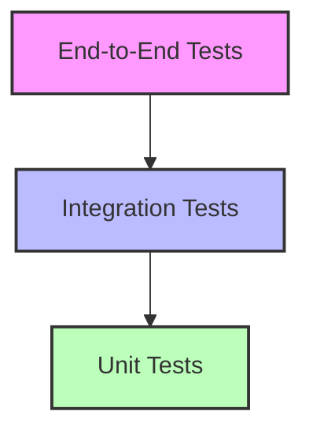
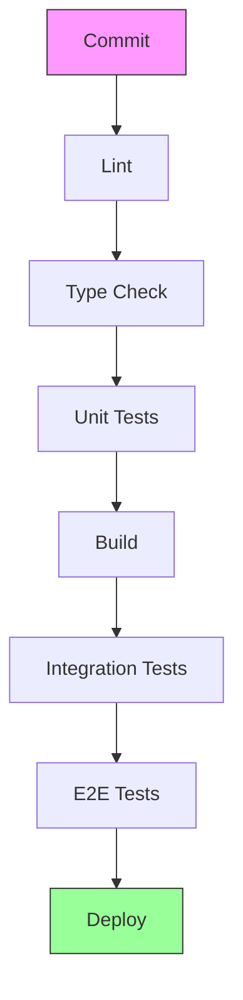

# Testing Strategy

This document outlines the comprehensive testing approach for the Idea Playground rebuild, ensuring quality, reliability, and performance of the system.

## Testing Philosophy

Our testing strategy follows these key principles:

1. **Shift Left**: Find defects as early as possible in the development lifecycle
2. **Automation First**: Automate tests wherever possible for consistency and efficiency
3. **Pyramid Approach**: Focus on a solid foundation of unit tests, supported by integration and E2E tests
4. **Risk-Based**: Prioritize testing of critical paths and high-risk components
5. **Continuous Testing**: Run tests automatically as part of the CI/CD pipeline

## Testing Pyramid



Our testing pyramid consists of:
- **Many Unit Tests**: Fast, focused tests that verify individual components and functions
- **Some Integration Tests**: Tests that verify interactions between components
- **Few End-to-End Tests**: Tests that verify complete user flows

## Unit Testing

### Approach

Unit tests focus on testing individual components, functions, and classes in isolation:

```typescript
// Example unit test for a domain entity
describe('Canvas', () => {
  it('should create a canvas with valid parameters', () => {
    // Arrange
    const params: CanvasCreationParams = {
      name: 'Test Canvas',
      description: 'A test canvas',
      tags: ['test', 'canvas']
    };
    const ownerId = '123';
    
    // Act
    const canvas = new Canvas(params, ownerId);
    
    // Assert
    expect(canvas.name).toBe('Test Canvas');
    expect(canvas.description).toBe('A test canvas');
    expect(canvas.tags).toEqual(['test', 'canvas']);
    expect(canvas.ownerId).toBe('123');
  });
  
  it('should throw an error if name is empty', () => {
    // Arrange
    const params: CanvasCreationParams = {
      name: '',
      description: 'A test canvas',
      tags: ['test', 'canvas']
    };
    const ownerId = '123';
    
    // Act & Assert
    expect(() => new Canvas(params, ownerId)).toThrow('Canvas name cannot be empty');
  });
  
  it('should publish CanvasCreatedEvent when created', () => {
    // Arrange
    const params: CanvasCreationParams = {
      name: 'Test Canvas',
      description: 'A test canvas',
      tags: ['test', 'canvas']
    };
    const ownerId = '123';
    
    // Act
    const canvas = new Canvas(params, ownerId);
    
    // Assert
    expect(canvas.domainEvents).toHaveLength(1);
    expect(canvas.domainEvents[0]).toBeInstanceOf(CanvasCreatedEvent);
    expect((canvas.domainEvents[0] as CanvasCreatedEvent).canvas).toBe(canvas);
  });
});
```

### Unit Testing Targets

1. **Domain Entities**: Test business rules, invariants, and behavior
2. **Value Objects**: Test immutability and valid state
3. **Domain Services**: Test business logic and domain rules
4. **Application Services**: Test orchestration of domain services
5. **UI Components**: Test rendering and user interactions
6. **Hooks**: Test custom hook behavior and state changes
7. **Utilities**: Test helper functions and utilities

### Mocking Strategy

We use Jest's mocking capabilities to isolate units under test:

```typescript
// Example of mocking dependencies
jest.mock('../repositories/canvasRepository');
jest.mock('../services/aiService');

const mockCanvasRepository = canvasRepository as jest.Mocked<CanvasRepository>;
const mockAIService = aiService as jest.Mocked<AIService>;

describe('IdeaService', () => {
  let ideaService: IdeaService;
  
  beforeEach(() => {
    // Setup mocks
    mockCanvasRepository.findById.mockResolvedValue(mockCanvas);
    mockAIService.generateIdea.mockResolvedValue(mockIdeaResult);
    
    // Create service with mocked dependencies
    ideaService = new IdeaServiceImpl(
      mockIdeaRepository,
      mockCanvasRepository,
      mockAIService,
      mockEventPublisher
    );
  });
  
  afterEach(() => {
    jest.clearAllMocks();
  });
  
  it('should call AI service to generate an idea', async () => {
    // Arrange
    const params: IdeaGenerationParams = {
      industry: 'Technology',
      constraints: ['B2B', 'SaaS']
    };
    const canvasId = '123';
    const userId = '456';
    
    // Act
    await ideaService.generateIdea(params, canvasId, userId);
    
    // Assert
    expect(mockAIService.generateIdea).toHaveBeenCalledWith({
      industry: 'Technology',
      constraints: ['B2B', 'SaaS'],
      targetAudience: undefined
    });
  });
});
```

## Integration Testing

### Approach

Integration tests verify the correct interaction between components:

```typescript
// Example integration test for a service with its repository
describe('IdeaService Integration', () => {
  let ideaService: IdeaService;
  let canvasRepository: CanvasRepository;
  let ideaRepository: IdeaRepository;
  let aiService: AIService;
  let eventPublisher: DomainEventPublisher;
  
  beforeEach(async () => {
    // Setup test database
    await setupTestDatabase();
    
    // Create real repositories connected to test database
    canvasRepository = new SupabaseCanvasRepository(supabaseClient);
    ideaRepository = new SupabaseIdeaRepository(supabaseClient);
    
    // Mock AI service and event publisher
    aiService = mock<AIService>();
    eventPublisher = mock<DomainEventPublisher>();
    
    // Create service with real repositories and mocked services
    ideaService = new IdeaServiceImpl(
      ideaRepository,
      canvasRepository,
      aiService,
      eventPublisher
    );
    
    // Seed test data
    await seedTestCanvas(canvasRepository);
  });
  
  afterEach(async () => {
    await cleanupTestDatabase();
  });
  
  it('should save generated idea to repository', async () => {
    // Arrange
    const params: IdeaGenerationParams = {
      industry: 'Technology',
      constraints: ['B2B', 'SaaS']
    };
    const canvasId = 'test-canvas-id';
    const userId = 'test-user-id';
    
    // Setup mock AI service
    when(aiService.generateIdea).calledWith(anything()).mockResolvedValue({
      title: 'Test Idea',
      description: 'A test idea',
      problemStatement: 'A test problem',
      targetAudience: 'Test audience',
      uniqueValue: 'Test value'
    });
    
    // Act
    const idea = await ideaService.generateIdea(params, canvasId, userId);
    
    // Assert
    const savedIdea = await ideaRepository.findById(idea.id);
    expect(savedIdea).not.toBeNull();
    expect(savedIdea?.title).toBe('Test Idea');
    expect(savedIdea?.canvasId).toBe(canvasId);
  });
});
```

### Integration Testing Targets

1. **Services + Repositories**: Test services with real repositories
2. **Services + External APIs**: Test integration with external systems
3. **UI Components + State Management**: Test components with state management
4. **API Endpoints + Services**: Test API endpoints with services

### Component Integration Testing

For React components, we use React Testing Library to test component integration:

```typescript
// Example component integration test
describe('IdeaList', () => {
  it('should render ideas from API', async () => {
    // Arrange
    const mockIdeas = [
      {
        id: '1',
        canvasId: 'canvas-1',
        title: 'Idea 1',
        description: 'Description 1'
      },
      {
        id: '2',
        canvasId: 'canvas-1',
        title: 'Idea 2',
        description: 'Description 2'
      }
    ];
    
    // Mock hooks
    jest.mock('../../hooks/useIdeas', () => ({
      useIdeas: () => ({
        data: mockIdeas,
        isLoading: false,
        error: null
      })
    }));
    
    // Act
    const { findByText } = render(<IdeaList canvasId="canvas-1" />);
    
    // Assert
    expect(await findByText('Idea 1')).toBeInTheDocument();
    expect(await findByText('Idea 2')).toBeInTheDocument();
  });
  
  it('should show loading state', () => {
    // Arrange
    jest.mock('../../hooks/useIdeas', () => ({
      useIdeas: () => ({
        data: null,
        isLoading: true,
        error: null
      })
    }));
    
    // Act
    const { container } = render(<IdeaList canvasId="canvas-1" />);
    
    // Assert
    expect(container.querySelectorAll('.skeleton')).toHaveLength(6);
  });
});
```

## End-to-End Testing

### Approach

End-to-end tests verify complete user flows:

```typescript
// Example E2E test using Cypress
describe('Idea Generation Flow', () => {
  beforeEach(() => {
    // Login and navigate to the canvas page
    cy.login('test-user@example.com', 'password');
    cy.visit('/canvas/test-canvas-id');
    cy.contains('h1', 'Test Canvas').should('be.visible');
  });
  
  it('should generate a new idea', () => {
    // Click the generate idea button
    cy.contains('button', 'Generate Idea').click();
    
    // Fill in the generation form
    cy.get('input[name="industry"]').type('Technology');
    cy.get('div[role="combobox"]').click();
    cy.contains('li', 'B2B').click();
    cy.contains('li', 'SaaS').click();
    
    // Submit the form
    cy.contains('button', 'Generate').click();
    
    // Wait for the idea to be generated
    cy.contains('AI is generating your idea').should('be.visible');
    cy.contains('AI is generating your idea', { timeout: 20000 }).should('not.exist');
    
    // Verify the idea was created
    cy.contains('h2', /New Idea|Generated Idea/).should('be.visible');
    cy.contains('button', 'Save Idea').click();
    
    // Verify the idea appears in the list
    cy.contains('a', /New Idea|Generated Idea/).should('be.visible');
  });
});
```

### Critical User Flows

We prioritize E2E tests for these critical flows:

1. **Canvas Creation and Management**
2. **Idea Generation (Manual and AI-assisted)**
3. **Variation Generation and Selection**
4. **Idea Merging and Refinement**
5. **Collaboration and Sharing**

### E2E Testing Tools

- **Cypress**: For browser-based E2E testing
- **Playwright**: For cross-browser testing
- **Storybook**: For visual regression testing

## API Testing

### Approach

We test API endpoints with Supertest:

```typescript
// Example API test
describe('Canvas API', () => {
  let app: Express;
  let token: string;
  
  beforeAll(async () => {
    app = createTestApp();
    token = await getTestToken();
  });
  
  it('should create a canvas', async () => {
    // Arrange
    const canvasData = {
      name: 'Test Canvas',
      description: 'A test canvas',
      tags: ['test', 'canvas']
    };
    
    // Act
    const response = await request(app)
      .post('/api/canvas')
      .set('Authorization', `Bearer ${token}`)
      .send(canvasData);
    
    // Assert
    expect(response.status).toBe(201);
    expect(response.body.name).toBe('Test Canvas');
    expect(response.body.id).toBeDefined();
  });
  
  it('should return 400 for invalid canvas data', async () => {
    // Arrange
    const canvasData = {
      // Missing name
      description: 'A test canvas',
      tags: ['test', 'canvas']
    };
    
    // Act
    const response = await request(app)
      .post('/api/canvas')
      .set('Authorization', `Bearer ${token}`)
      .send(canvasData);
    
    // Assert
    expect(response.status).toBe(400);
    expect(response.body.error).toContain('name');
  });
});
```

### API Testing Coverage

1. **Input Validation**: Test validation of request bodies
2. **Authentication**: Test authentication and authorization
3. **Error Handling**: Test error responses
4. **Success Paths**: Test successful operations
5. **Edge Cases**: Test boundary conditions and special cases

## Performance Testing

### Approach

Performance tests verify system performance under various conditions:

```typescript
// Example performance test using K6
export default function() {
  // Load test configuration
  const BASE_URL = __ENV.BASE_URL || 'http://localhost:3000';
  const USERS = parseInt(__ENV.USERS || '10');
  const DURATION = __ENV.DURATION || '30s';
  
  // Test options
  export let options = {
    vus: USERS,
    duration: DURATION,
    thresholds: {
      'http_req_duration': ['p(95)<500'], // 95% of requests must complete below 500ms
      'http_req_failed': ['rate<0.01'],    // Less than 1% of requests should fail
    },
  };
  
  // Test scenario
  group('Canvas API', function() {
    // Get canvases
    let getCanvasesRes = http.get(`${BASE_URL}/api/canvas`, {
      headers: { Authorization: `Bearer ${getToken()}` },
    });
    check(getCanvasesRes, {
      'status is 200': (r) => r.status === 200,
      'response time < 200ms': (r) => r.timings.duration < 200,
    });
    sleep(1);
    
    // Create canvas
    let createCanvasRes = http.post(`${BASE_URL}/api/canvas`, {
      headers: { 
        'Content-Type': 'application/json',
        'Authorization': `Bearer ${getToken()}`
      },
      body: JSON.stringify({
        name: `Test Canvas ${__VU}`,
        description: 'Performance test canvas',
        tags: ['test', 'performance']
      }),
    });
    check(createCanvasRes, {
      'status is 201': (r) => r.status === 201,
      'response time < 300ms': (r) => r.timings.duration < 300,
    });
    sleep(1);
  });
}
```

### Performance Test Types

1. **Load Testing**: Verify system behavior under expected load
2. **Stress Testing**: Verify system behavior under extreme load
3. **Endurance Testing**: Verify system behavior over time
4. **Spike Testing**: Verify system behavior with sudden load increases

### Performance Metrics

We track these key performance metrics:

1. **Response Time**: Time to complete a request
2. **Throughput**: Number of requests per second
3. **Error Rate**: Percentage of failed requests
4. **Resource Utilization**: CPU, memory, network usage
5. **Time to First Byte (TTFB)**: Time to start receiving response

## AI Behavior Testing

### Approach

AI behavior tests verify the correctness and quality of AI-generated content:

```typescript
// Example AI behavior test
describe('AI Idea Generation', () => {
  let aiService: AIService;
  
  beforeEach(() => {
    aiService = new AIServiceImpl(openaiClient, promptManager);
  });
  
  it('should generate an idea with required fields', async () => {
    // Arrange
    const params: IdeaGenerationParams = {
      industry: 'Technology',
      constraints: ['B2B', 'SaaS']
    };
    
    // Act
    const result = await aiService.generateIdea(params);
    
    // Assert
    expect(result.title).toBeDefined();
    expect(result.title.length).toBeGreaterThan(0);
    expect(result.description).toBeDefined();
    expect(result.description.length).toBeGreaterThan(0);
    expect(result.problemStatement).toBeDefined();
    expect(result.targetAudience).toBeDefined();
    expect(result.uniqueValue).toBeDefined();
  });
  
  it('should generate an idea relevant to specified industry', async () => {
    // Arrange
    const params: IdeaGenerationParams = {
      industry: 'Healthcare',
      constraints: []
    };
    
    // Act
    const result = await aiService.generateIdea(params);
    
    // Assert
    expect(result.title.toLowerCase()).toMatch(/health|care|medical|patient|doctor|clinic|hospital|wellness/);
    expect(result.description.toLowerCase()).toMatch(/health|care|medical|patient|doctor|clinic|hospital|wellness/);
  });
  
  it('should handle API errors gracefully', async () => {
    // Arrange
    jest.spyOn(openaiClient, 'createCompletion').mockRejectedValue(new Error('API error'));
    
    // Act & Assert
    await expect(aiService.generateIdea({
      industry: 'Technology',
      constraints: []
    })).rejects.toThrow('Failed to generate idea');
  });
});
```

### AI Quality Metrics

We evaluate AI-generated content based on:

1. **Completeness**: All required fields are present
2. **Relevance**: Content is relevant to the input parameters
3. **Coherence**: Content is logical and well-structured
4. **Creativity**: Content demonstrates originality and creativity
5. **Diversity**: Generated variations are sufficiently different from each other

## Test Data Management

### Test Data Strategy

1. **Isolated Test Data**: Each test should use its own data to avoid test interdependence
2. **Data Factories**: Use factory functions to generate test data
3. **Seeded Randomness**: Use seeded random generators for deterministic but varied data
4. **Clean Up**: Tests should clean up after themselves

### Test Data Factories

```typescript
// Example test data factory
export const createTestCanvas = (overrides: Partial<CanvasCreationParams> = {}): Canvas => {
  return new Canvas({
    name: overrides.name || `Test Canvas ${faker.random.alphaNumeric(8)}`,
    description: overrides.description || faker.lorem.paragraph(),
    tags: overrides.tags || [faker.random.word(), faker.random.word()],
    ...overrides
  }, overrides.ownerId || 'test-user-id');
};

export const createTestIdea = (overrides: Partial<IdeaCreationParams> = {}): Idea => {
  return new Idea({
    title: overrides.title || `Test Idea ${faker.random.alphaNumeric(8)}`,
    description: overrides.description || faker.lorem.paragraph(),
    problemStatement: overrides.problemStatement || faker.lorem.sentence(),
    targetAudience: overrides.targetAudience || faker.commerce.department(),
    uniqueValue: overrides.uniqueValue || faker.company.catchPhrase(),
    ...overrides
  }, overrides.canvasId || 'test-canvas-id');
};
```

## Test Automation

### Continuous Integration

Our CI pipeline runs tests at different stages:



### Testing Tools

1. **Jest**: Unit and integration testing
2. **React Testing Library**: Component testing
3. **Cypress**: End-to-end testing
4. **K6**: Performance testing
5. **Storybook**: Component development and visual testing

## Test Coverage

We aim for the following test coverage targets:

| Test Type | Coverage Target |
|-----------|----------------|
| Unit Tests | 80% |
| Integration Tests | 60% |
| E2E Tests | Critical paths |

## Testing Guidelines

1. **Write Tests First**: Follow test-driven development (TDD) where appropriate
2. **Keep Tests Simple**: Each test should verify one thing
3. **Organize Tests**: Group tests logically by feature or component
4. **Mock Judiciously**: Mock external dependencies, not internal ones
5. **Test Edge Cases**: Include tests for boundary conditions and error cases
6. **Keep Tests Fast**: Optimize tests for speed to enable rapid feedback

## Conclusion

This testing strategy ensures comprehensive test coverage for the Idea Playground rebuild, focusing on quality, reliability, and performance. By following this approach, we can deliver a robust system that meets user needs and maintains high standards of quality.
