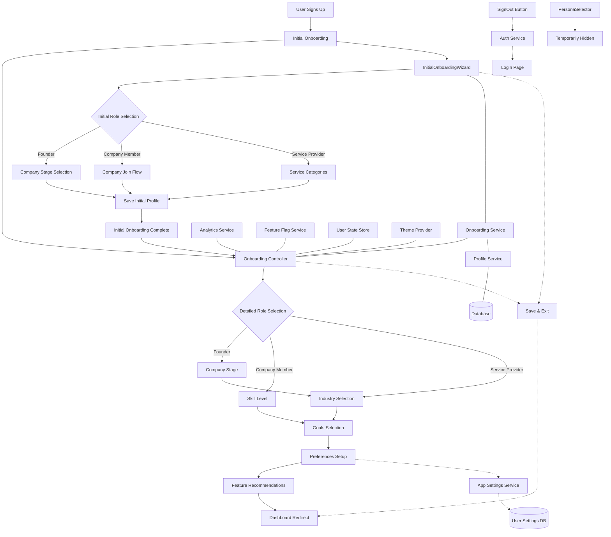

# Onboarding Wizard Technical Architecture

## Overview

The Onboarding Wizard is a critical component of the user experience, designed to collect user information, personalize the platform, and guide users to relevant features. This document outlines the technical architecture for implementing this feature.

## Architecture Diagram



## System Components

### 1. Frontend Components

#### 1.1 Initial Onboarding Components

##### 1.1.1 InitialOnboardingWizard (`src/components/onboarding/InitialOnboardingWizard.tsx`)
- **Purpose**: Streamlined initial onboarding experience for new users
- **Key Functions**:
  - Capture basic user role (founder, company member, service provider)
  - Collect minimal necessary information based on role
  - Guide users to appropriate features based on selections
  - Store initial profile data
  - Set up for detailed onboarding stage

##### 1.1.2 InitialOnboardingPage (`src/pages/InitialOnboardingPage.tsx`) 
- **Purpose**: Container page for the initial onboarding wizard
- **Key Features**:
  - Handle non-authenticated users by showing login
  - Support authenticated users with the wizard
  - Manage onboarding completion state
  - Redirect logic after completion

##### 1.1.3 Role-Specific Initial Steps
- `InitialRoleStep.tsx`: Simple role selection (founder, company member, service provider)
- `FounderCompanyStageStep.tsx`: Captures company stage for founders
- `ServiceProviderCategoriesStep.tsx`: Collects service categories for providers
- `JoinCompanyStep.tsx`: Handles company membership for company members

#### 1.2 Detailed Onboarding Controller (`src/components/onboarding/OnboardingController.tsx`)
- **Purpose**: Core component that manages the onboarding flow, state transitions, and user progress
- **Key Functions**:
  - Fetch initial user profile data
  - Manage step transitions based on user input
  - Track analytics events
  - Save user selections between steps
  - Handle completion and redirection
  - **Save & Exit Functionality**: Allows users to pause onboarding and return later
    - Automatically preserves progress at current step
    - Dedicated button to exit to dashboard while saving state
    - Seamlessly resumes from last completed step on return

#### 1.2 Step Components
These modular components render individual onboarding steps:
- `RoleSelectionStep.tsx`: Capture user role (founder, company member, service provider)
- `CompanyStageStep.tsx`: For founders to specify company stage
- `IndustrySelectionStep.tsx`: Capture industry category
- `SkillLevelStep.tsx`: User expertise level
- `GoalsSelectionStep.tsx`: User objectives
- `ThemePreferencesStep.tsx`: Visual preferences
- `NotificationPreferencesStep.tsx`: Communication preferences
- `FeatureRecommendations.tsx`: Present personalized features
- Placeholder components for future expansion

#### 1.3 Progress Indicator (`src/components/onboarding/OnboardingProgress.tsx`)
- **Purpose**: Visual indicator showing onboarding completion progress
- **Key Features**:
  - Step completion visualization
  - Progress percentage calculation
  - Mobile-responsive design

#### 1.4 Onboarding Page (`src/pages/OnboardingPage.tsx`)
- **Purpose**: Container page for the onboarding wizard
- **Key Features**:
  - Layout structure
  - Error boundary
  - Loading states

#### 1.5 SignOutButton Component (`src/components/ui/SignOutButton.tsx`)
- **Purpose**: Provides consistent logout functionality throughout the application
- **Key Features**:
  - Integrates with auth service to handle session termination
  - Supports different visual styles (primary, secondary, text)
  - Clears user state from local storage
  - Redirects to login page after successful logout
  - Enables easy testing with new users

### 2. Backend Services

#### 2.1 Onboarding Service (`src/lib/services/onboarding.service.ts`)
- **Purpose**: Business logic for the onboarding process
- **Key Functions**:
  - Save user selections to profile
  - Determine next steps in the flow
  - Calculate recommended features
  - Track onboarding analytics
  - Generate personalized welcome messages
  - Manage onboarding completion state
  - **Progress Persistence**: 
    - Automatically saves each step's data
    - Stores current step for resuming later
    - Maintains history of completed steps
    - Timestamp tracking for analytics

#### 2.2 Profile Service (`src/lib/services/profile.service.ts`)
- **Purpose**: Handle profile data operations
- **Key Functions**:
  - Fetch existing profile data
  - Update profile with onboarding selections
  - Store onboarding completion status
  - **Auto-Profile Creation**:
    - Creates new profiles for first-time users
    - Initializes with default values
    - Sets up onboarding progress tracking

#### 2.3 App Settings Service (`src/lib/services/app-settings.service.ts`)
- **Purpose**: Manage user application settings separate from profile data
- **Key Functions**:
  - Store user preferences like theme and notification settings
  - Provide default settings for new users
  - Deep merge settings objects to preserve structure
  - Separate concerns from core profile data

#### 2.4 Analytics Service (Placeholder)
- **Purpose**: Track user behavior during onboarding
- **Key Functions**:
  - Record step views and completions
  - Measure time spent on each step
  - Track feature selection patterns
  - Support A/B testing

### 3. Data Models

#### 3.1 Onboarding State
```typescript
interface OnboardingState {
  current_step: string;
  completed_steps: string[];
  form_data: Record<string, any>;
  last_updated: string; // ISO timestamp for tracking when user last interacted
  initialOnboardingComplete?: boolean; // Flag to track initial onboarding completion
  onboarding_metrics?: {
    step_completion_times: Record<string, string>;
    total_time_spent?: number;
    completion_date?: string;
    initial_completion_date?: string; // When initial onboarding was completed
  };
}
```

#### 3.2 User Profile Extensions
```typescript
// Extended from existing ExtendedUserProfile
interface OnboardingUserProfile extends ExtendedUserProfile {
  setup_progress?: OnboardingState;
  user_role?: UserRole;
  company_stage?: CompanyStage;
  industry_category?: IndustryCategory;
  skill_level?: UserSkillLevel;
  goals?: string[];
}
```

#### 3.3 Application Settings (Separated from Profile)
```typescript
interface AppSettings {
  theme: 'light' | 'dark' | 'system';
  notifications: {
    email: boolean;
    push: boolean;
    inApp: boolean;
    digest: boolean;
  };
  display: {
    compactView: boolean;
    showTips: boolean;
    cardSize: 'small' | 'medium' | 'large';
  };
  features: {
    [key: string]: boolean;
  };
}
```

#### 3.4 Enumerations
```typescript
enum UserRole {
  FOUNDER = 'FOUNDER',
  COMPANY_MEMBER = 'COMPANY_MEMBER',
  SERVICE_PROVIDER = 'SERVICE_PROVIDER',
  INVESTOR = 'INVESTOR',
  ADVISOR = 'ADVISOR',
  COMMUNITY_MEMBER = 'COMMUNITY_MEMBER'
}

enum CompanyStage {
  IDEA_STAGE = 'IDEA_STAGE',
  SOLID_IDEA = 'SOLID_IDEA',
  FORMED_COMPANY = 'FORMED_COMPANY',
  EARLY_REVENUE = 'EARLY_REVENUE',
  SCALING = 'SCALING',
  ESTABLISHED = 'ESTABLISHED'
}

enum IndustryCategory {
  TECHNOLOGY = 'TECHNOLOGY',
  HEALTHCARE = 'HEALTHCARE',
  FINANCE = 'FINANCE',
  EDUCATION = 'EDUCATION',
  RETAIL = 'RETAIL',
  MANUFACTURING = 'MANUFACTURING', 
  ENTERTAINMENT = 'ENTERTAINMENT',
  OTHER = 'OTHER'
}

enum UserSkillLevel {
  BEGINNER = 'BEGINNER',
  INTERMEDIATE = 'INTERMEDIATE',
  EXPERT = 'EXPERT'
}
```

### 4. Database Schema Considerations

The onboarding data will be stored primarily in the `profiles` table, within the `setup_progress` JSON field, which is already part of the existing schema.

Application settings have been moved to a separate `user_settings` table with the following structure:
- `user_id`: Foreign key to users table
- `settings`: JSON object containing all user settings
- `created_at`: Timestamp of settings creation
- `updated_at`: Timestamp of last update

Example profile data:
```json
{
  "setup_progress": {
    "current_step": "recommendations",
    "completed_steps": ["role_selection", "company_stage", "industry_selection", "goals_selection"],
    "form_data": {
      "userRole": "FOUNDER",
      "companyStage": "IDEA_STAGE",
      "industryCategory": "TECHNOLOGY",
      "goals": ["networking", "fundraising"]
    },
    "last_updated": "2025-03-16T16:38:45Z",
    "onboarding_metrics": {
      "step_completion_times": {
        "role_selection": "2025-03-16T16:24:30Z",
        "company_stage": "2025-03-16T16:25:15Z",
        "industry_selection": "2025-03-16T16:26:00Z",
        "goals_selection": "2025-03-16T16:26:45Z"
      }
    }
  }
}
```

Example settings data:
```json
{
  "user_id": "user123",
  "settings": {
    "theme": "dark",
    "notifications": {
      "email": true,
      "push": false,
      "inApp": true,
      "digest": true
    },
    "display": {
      "compactView": true,
      "showTips": false,
      "cardSize": "small"
    },
    "features": {
      "betaFeatures": true,
      "experimentalTools": false
    }
  },
  "created_at": "2025-03-16T15:30:00Z",
  "updated_at": "2025-03-16T16:45:00Z"
}
```

## Implementation Strategy

### Phase 1: Initial Onboarding (Completed)
1. Implement simplified InitialOnboardingWizard for immediate role capture
2. Create role-specific initial steps (founder, company member, service provider)
3. Integrate with existing features (idea playground, company setup)
4. Store initial selections in user profile
5. Add testing script for onboarding state reset
6. Temporarily disable PersonaSelector during onboarding

### Phase 2: Core Detailed Onboarding Flow
1. Implement the complete detailed flow with role selection and personalization
2. Focus on founders, company members, and service providers
3. Store preferences in user profiles
4. Implement feature recommendations
5. **Add save & exit functionality** for seamless progress preservation
6. **Implement sign out capability** for testing with multiple users
7. **Separate app settings from profile data** for cleaner architecture

### Phase 2: Enhanced Personalization
1. Add industry and skill level selection
2. Implement goal-based recommendations
3. Create theme and notification preferences
4. Build personalized welcome messages

### Phase 3: Analytics & Optimization
1. Implement onboarding analytics tracking
2. Create admin dashboard for onboarding metrics
3. Set up A/B testing infrastructure
4. Implement optimization based on data

### Phase 4: Future Expansion
1. Add team onboarding capabilities
2. Implement integration onboarding for third-party tools
3. Support for international users and localization

## Integration Points

### 1. Authentication System
- **Integration**: Capture user information after successful authentication
- **Flow**: Auth system redirects to onboarding for new users
- **Sign Out Flow**: Clear auth state, user context, and redirect to login page

### 2. Feature Flag System
- **Integration**: Use feature flags to control which onboarding features are active
- **Flow**: Onboarding controller checks feature flags before displaying options

### 3. Analytics System
- **Integration**: Send onboarding events to analytics service
- **Flow**: Track step views, completions, and user selections
- **Exit Tracking**: Monitor save & exit usage patterns to identify potential UX improvements

### 4. User Preference System
- **Integration**: Save preferences like theme and notifications
- **Flow**: Apply preferences immediately after selection
- **Now uses dedicated App Settings Service**: Cleaner separation of concerns

## User Testing Workflow

1. **Test Initial Onboarding**:
   - Reset onboarding state using the test script:
     ```bash
     node scripts/test-initial-onboarding.js
     ```
   - Navigate to http://localhost:5173/initial-onboarding
   - Select different user roles to test each path
   - Verify correct redirections based on role

2. **Test with New Users**:
   - Use SignOutButton to log out current user
   - Sign in with a new test account
   - Complete onboarding steps
   - Verify personalization based on selections

2. **Test Save & Exit Functionality**:
   - Begin onboarding process
   - Complete several steps
   - Use "Save & Exit" button
   - Sign out and back in with same account
   - Verify onboarding resumes at the correct step
   - Verify previously entered data is preserved

3. **Test Different User Paths**:
   - Test founder flow with different company stages
   - Test company member flow
   - Test service provider flow
   - Verify appropriate recommendations for each

## Security Considerations

1. **Data Privacy**:
   - Store only necessary information
   - Clearly communicate data usage to users
   - Implement proper access controls for profile data

2. **Input Validation**:
   - Validate all form inputs on client and server
   - Prevent manipulation of onboarding steps
   - Sanitize user inputs before storage

3. **Session Management**:
   - Ensure onboarding state is tied to authenticated sessions
   - Prevent unauthorized access to onboarding data
   - **Secure Sign Out Process**:
     - Clear all sensitive data from memory
     - Invalidate session tokens
     - Remove cached credentials

## Performance Considerations

1. **Lazy Loading**:
   - Load step components dynamically to reduce initial bundle size
   - Prefetch next likely step based on user selection

2. **Caching Strategy**:
   - Cache user selections in local storage to prevent data loss
   - Batch save operations to reduce API calls
   - Implement efficient saving mechanism for "Save & Exit" functionality

3. **Responsiveness**:
   - Optimize for various screen sizes and devices
   - Ensure smooth transitions between steps

## Testing Strategy

1. **Unit Testing**:
   - Test individual step components in isolation
   - Test onboarding service functions
   - Test sign out functionality

2. **Integration Testing**:
   - Test complete onboarding flows
   - Test integration with profile service
   - Test save & exit with resume functionality

3. **User Acceptance Testing**:
   - Test with representatives from each user category
   - Gather feedback on clarity and usefulness
   - Test multiple sign out and sign in sequences

4. **A/B Testing**:
   - Test different onboarding flows for conversion optimization
   - Measure completion rates and time spent
