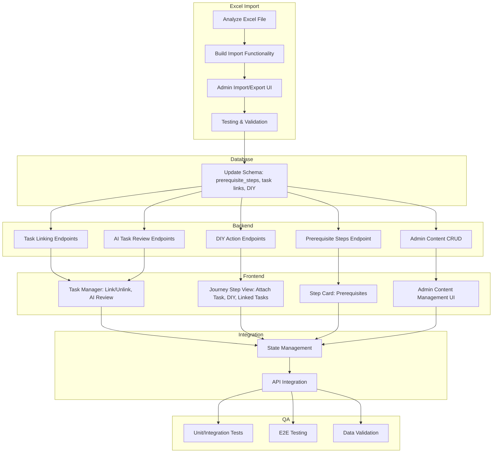

# Journey Map & Task Integration: Detailed Implementation Plan

---

## 0. Excel File Analysis & Import

**0.1. Analyze the Excel File**
- Review `tools and steps (1).xlsx` to understand its structure: sheets, columns, data types, and relationships (phases, steps, options, tools, resources, tips, checklists).
- Map Excel columns to the database schema, identifying any schema gaps or mismatches.

### 0.1.a. Excel-to-Database Mapping

#### Sheet: PhasesandSteps
| Excel Column                  | Target Table      | Target Field                | Notes                                                      |
|-------------------------------|-------------------|-----------------------------|------------------------------------------------------------|
| Phase                         | phases            | id / order                  | Integer, phase order or ID                                 |
| Phase Name                    | phases            | name                        | Name of the phase                                          |
| Step                          | steps             | id / order                  | Integer, step order or ID                                  |
| Task                          | steps             | name / description          | Name or description of the step                            |
| Need to Do? (Yes/No)          | steps             | required                    | Boolean or enum                                            |
| Explanation for Need          | steps             | need_explanation            | Text                                                       |
| Dedicated Tool? (Yes/No)      | steps             | has_tool                    | Boolean or enum                                            |
| Explanation for Tool Need     | steps             | tool_explanation            | Text                                                       |
| Steps w/o Tool                | steps             | steps_without_tool          | Text or array                                              |
| Effort/Difficulty             | steps             | effort_difficulty           | Enum or text                                               |
| Staff/Freelancers (Optional)  | steps             | staff_freelancers           | Text                                                       |
| Key Considerations            | steps             | key_considerations          | Text                                                       |
| Bootstrap Mindset             | steps             | bootstrap_mindset           | Text                                                       |
| Founder Skills Needed         | steps             | founder_skills_needed       | Text                                                       |

#### Sheet: toolsbystep
| Excel Column                  | Target Table      | Target Field                | Notes                                                      |
|-------------------------------|-------------------|-----------------------------|------------------------------------------------------------|
| Step                          | step_tools        | step_id                     | Foreign key to steps                                       |
| Tool (Name)                   | tools             | name                        | Name of the tool                                           |
| Category                      | tools             | category                    | Tool category                                              |
| Subcategory                   | tools             | subcategory                 | Tool subcategory                                           |
| Website                       | tools             | website                     | Tool website URL                                           |
| Summary                       | tools             | summary                     | Short description                                          |
| Pros                          | tools             | pros                        | Text                                                       |
| Cons                          | tools             | cons                        | Text                                                       |
| Usual Customer Stage          | tools             | customer_stage              | Text                                                       |
| Founded                       | tools             | founded                     | Year or text                                               |
| Last Funding Round            | tools             | last_funding_round          | Text                                                       |
| Comp. Svc. Pkg. (1-3)         | tools             | comp_svc_pkg                | Integer rating                                             |
| Ease of Use (1-3)             | tools             | ease_of_use                 | Integer rating                                             |
| Affordability (1-3)           | tools             | affordability               | Integer rating                                             |
| Customer Support (1-3)        | tools             | customer_support            | Integer rating                                             |
| Speed of Setup (1-3)          | tools             | speed_of_setup              | Integer rating                                             |
| Customization (1-3)           | tools             | customization               | Integer rating                                             |
| Range of Services (1-3)       | tools             | range_of_services           | Integer rating                                             |
| Integration (1-3)             | tools             | integration                 | Integer rating                                             |
| Pro. Assistance (1-3)         | tools             | pro_assistance              | Integer rating                                             |
| Reputation (1-3)              | tools             | reputation                  | Integer rating                                             |
| Reasoning: ...                | tools             | reasoning_*                 | Reasoning for each rating, text fields                     |

- Relationships:
  - Each phase has multiple steps.
  - Each step may have multiple tools (many-to-many via step_tools).
  - Additional fields may be needed for options, resources, tips, checklists (not shown in sample rows).

- **Schema Gaps:** Review for missing fields in the current DB schema, especially for reasoning fields, staff/freelancers, and any checklist/resource/tip columns not shown in the sample.

**0.2. Build Import Functionality**
- Implement a backend service or script to parse the Excel file and import its data into the database.
  - Use a library such as `xlsx` (Node.js) or equivalent.
  - Validate data during import (required fields, referential integrity, duplicates).
  - Support both initial import and updates (idempotency/versioning as needed).

**0.3. Admin UI for Import/Export**
- In the admin content management tool, provide:
  - "Import from Excel/CSV" feature for uploading and importing journey content.
  - "Export to Excel/CSV" feature for backup and offline editing.

**0.4. Testing & Validation**
- After import, verify that all data from the Excel file is present and correctly mapped in the admin UI.
- Ensure imported data is editable and relationships (e.g., prerequisites, tool associations) are preserved.

---

### Progress Log

- [x] Implementation plan documented and saved.
- [x] Excel file structure analyzed and mapped to schema.
- [x] Schema migration SQL written for missing fields (supabase/migrations/20250427_add_journey_excel_fields.sql).
- [x] Import script scaffolded (scripts/import-journey-excel.cjs).
- [x] Admin content management UI: Scaffold CRUD, import/export, and inline editing for journey content.
- [ ] Backend endpoints for CRUD, import/export, and linking logic.
- [ ] Frontend integration and state management.
- [ ] Testing and QA.

---

## 1. Schema & Backend Preparation

- Add `prerequisite_steps` column to `journey_steps`.
- Ensure `company_progress` (or equivalent) can record "DIY" actions.
- Update task and journey step tables to support linking.
- Ensure all necessary fields for admin content management are present.
- Write and apply SQL migrations for all schema changes.

---

## 2. Backend Services

- Add/extend endpoints for task linking/unlinking, listing, and filtering.
- Endpoints for AI task review and marking as reviewed/linked.
- Endpoints for recording "DIY" actions and logging.
- Endpoint to fetch prerequisite/related steps.
- CRUD endpoints for all journey content, import/export, inline editing, and (optionally) versioning.

---

## 3. Frontend Components

- Task Manager: Link/unlink tasks, AI task review prompt, context indicators, "Review AI Tasks" filter.
- Journey Step View: "Attach Existing Task" button, linked tasks list, DIY action button.
- Step Card: Display prerequisites/related steps.
- Admin Content Management: Full CRUD UI, import/export, inline editing, (optional) versioning.

---

## 4. Integration & State Management

- Update global state/store for task-step associations, AI task review, DIY actions, prerequisites.
- Connect frontend components to backend endpoints with optimistic UI and error handling.

---

## 5. Testing & QA

- Unit/integration tests for backend endpoints and frontend flows.
- End-to-end testing of user flows, import/export, and data validation.
- Ensure all journey content from Excel is present and editable via the admin tool.

---

## 6. Launch & Iteration

- Prioritize admin tool for launch or immediate post-launch.
- Monitor usage and collect feedback for improvements.

---

### Visual Overview

---

**Summary:**  
This plan covers all steps for journey map and task integration, including Excel import, schema, backend, frontend, integration, testing, and launch.
