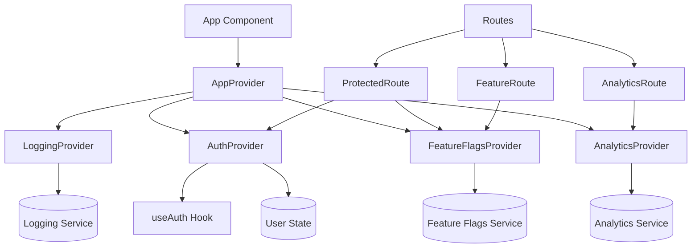

# Context System Documentation

## Overview

The Context System provides a comprehensive, type-safe way to access services and state throughout the application. It establishes a standardized pattern for accessing authentication, feature flags, analytics tracking, and error logging while providing automatic safeguards like protected routes and error boundaries.

## Architecture



## Key Components

### Provider Components

#### AppProvider

The root provider that combines all other providers. Typically wraps the entire application.

```tsx
<AppProvider captureErrors={true} displayErrors={true}>
  <Router>
    <YourApp />
  </Router>
</AppProvider>
```

#### AuthProvider

Provides authentication state and methods. Automatically shows loading state while checking auth.

```tsx
<AuthProvider>
  <YourAuthenticatedApp />
</AuthProvider>
```

#### FeatureFlagsProvider

Provides access to feature flags throughout the application.

```tsx
<FeatureFlagsProvider>
  <YourApp />
</FeatureFlagsProvider>
```

#### AnalyticsProvider

Provides analytics tracking methods and automatically tracks page views.

```tsx
<AnalyticsProvider>
  <YourApp />
</AnalyticsProvider>
```

#### LoggingProvider

Provides logging methods and optionally captures global errors.

```tsx
<LoggingProvider captureGlobalErrors={true} displayErrors={true}>
  <YourApp />
</LoggingProvider>
```

### Route Components

#### ProtectedRoute

Requires authentication and optionally checks for specific feature flags.

```tsx
<ProtectedRoute requiredFeatureFlags={['adminPanel']}>
  <AdminPage />
</ProtectedRoute>
```

#### FeatureRoute

Conditionally renders based on a feature flag, with optional fallback content.

```tsx
<FeatureRoute 
  featureFlag="enhancedIdeaPlayground" 
  fallback={<Navigate to="/basic-playground" />}
>
  <EnhancedPlayground />
</FeatureRoute>
```

#### AnalyticsRoute

Automatically tracks page views and time spent on a page.

```tsx
<AnalyticsRoute pageName="dashboard" additionalMetadata={{ section: 'company' }}>
  <DashboardPage />
</AnalyticsRoute>
```

### Error Handling

#### LoggingErrorBoundary

Captures component errors and logs them using the logging service.

```tsx
<LoggingErrorBoundary>
  <YourComponent />
</LoggingErrorBoundary>
```

## Usage Examples

### Accessing Authentication

```tsx
function ProfileButton() {
  const { user, isAuthenticated, signOut } = useAuthContext();
  
  if (!isAuthenticated) {
    return <Link to="/login">Log In</Link>;
  }
  
  return (
    <div>
      <span>Welcome, {user?.full_name}</span>
      <button onClick={signOut}>Log Out</button>
    </div>
  );
}
```

### Using Feature Flags

```tsx
function NavigationMenu() {
  const { isEnabled, isVisible } = useFeatureFlagsContext();
  
  return (
    <nav>
      <Link to="/dashboard">Dashboard</Link>
      {isVisible('ideaHub') && (
        <Link to="/idea-hub" className={!isEnabled('ideaHub') ? 'disabled' : ''}>
          Idea Hub
        </Link>
      )}
      {isEnabled('adminPanel') && (
        <Link to="/admin">Admin Panel</Link>
      )}
    </nav>
  );
}
```

### Tracking Analytics

```tsx
function DownloadButton({ documentId, documentName }) {
  const { trackEvent } = useAnalyticsContext();
  
  const handleDownload = () => {
    // Download logic...
    
    // Track the event
    trackEvent('document_downloaded', {
      documentId,
      documentName,
      fileType: 'pdf'
    });
  };
  
  return <Button onClick={handleDownload}>Download</Button>;
}
```

### Logging

```tsx
function ApiService() {
  const { logError, logInfo } = useLogging();
  
  const fetchData = async () => {
    try {
      logInfo('Fetching data from API', { endpoint: '/api/data' });
      
      const response = await fetch('/api/data');
      if (!response.ok) {
        throw new Error(`API error: ${response.status}`);
      }
      
      return await response.json();
    } catch (error) {
      logError(error, { context: 'ApiService.fetchData' });
      throw error;
    }
  };
  
  return { fetchData };
}
```

## Full App Structure

Here's an example of how the entire app structure looks with the Context System:

```tsx
const App: React.FC = () => {
  return (
    <AppProvider captureErrors={true} displayErrors={true}>
      <Router>
        <LoggingErrorBoundary>
          <Routes>
            {/* Public routes */}
            <Route path="/login" element={<Login />} />
            <Route path="/register" element={<Register />} />
            
            {/* Protected routes */}
            <Route element={<ProtectedRoute><Layout /></ProtectedRoute>}>
              <Route 
                index 
                element={
                  <AnalyticsRoute pageName="dashboard">
                    <Dashboard />
                  </AnalyticsRoute>
                } 
              />
              
              <Route 
                path="admin" 
                element={
                  <ProtectedRoute requiredFeatureFlags={['adminPanel']}>
                    <Admin />
                  </ProtectedRoute>
                } 
              />
              
              <Route 
                path="enhanced-feature" 
                element={
                  <FeatureRoute 
                    featureFlag="enhancedFeature" 
                    fallback={<BasicFeature />}
                  >
                    <EnhancedFeature />
                  </FeatureRoute>
                } 
              />
            </Route>
          </Routes>
        </LoggingErrorBoundary>
      </Router>
    </AppProvider>
  );
};
```

## Benefits

### Type Safety

All contexts and hooks are fully typed, providing autocomplete and type checking for:

- Authentication state and methods
- Feature flag checks
- Analytics tracking
- Logging methods

### Automatic Safeguards

- Protected routes prevent access to authenticated sections
- Feature routes ensure features are only shown when enabled
- Analytics routes automatically track page views
- Error boundaries capture and log component errors

### Consistent Access Pattern

- All services accessed through hooks with consistent naming
- Clear separation of concerns between different service types
- Predictable component structure for providers and consumers

### Testing Benefits

- Easy to mock contexts for testing
- Clear boundaries between components and services
- Ability to test auth-related logic without actual authentication

## Migration Guide

To migrate existing components to use the Context System:

1. Wrap your app with the `AppProvider` component
2. Replace direct imports of services with context hooks
3. Replace manual auth checks with `ProtectedRoute` components
4. Add `AnalyticsRoute` components for automatic page tracking
5. Wrap error-prone components with `LoggingErrorBoundary`
6. Use `FeatureRoute` for feature-flagged sections